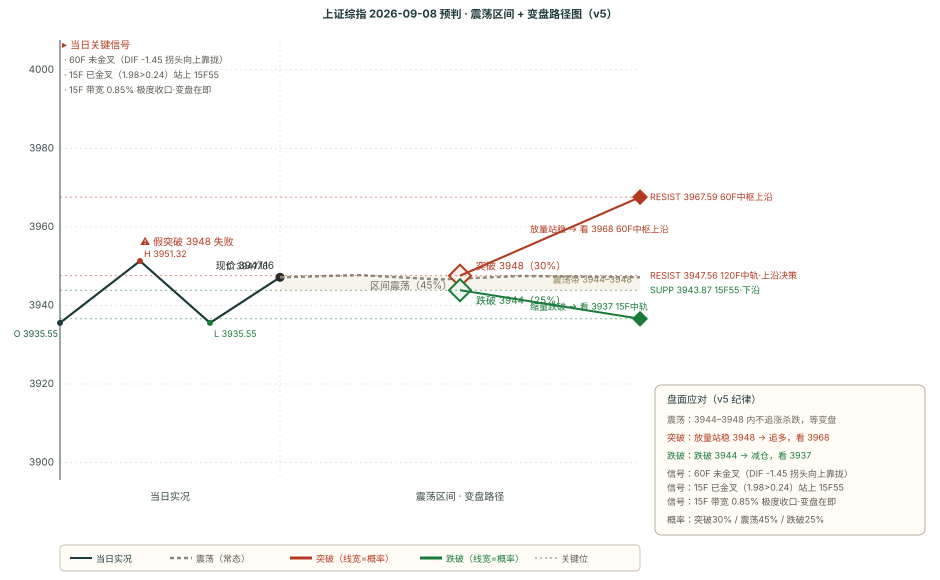

# 作战报告 · 午间 · 2026-09-08（周二）

> 抓取窗口：2026-09-08 08:00 ~ 14:00 ｜ 星球 37 条 / 图片 8 张 / 附件 73 个 / T&J 1 条（午间定调）

## 核心主线速览（三行）

- **今日主线延续**：AI 算力/光模块/CPO 仍是绝对主线，午间进一步加码——HBM 2027 短缺比 2026 更严、高盛给中际旭创 225% 上行空间、CIOE 9/11 前瞻（200G/400G 芯片·硅光·NPO/CPO）
- **关键反转**：T&J 12:45 午间定调「上午站上 15F55 但未明显离开，需 60F 金叉下的 3F 主涨段」→ 方向仍「方向不明」，偏多修复待确认
- **操作基调**：市场整体没量、超短性价比一般（大鹏鸟），60F 金叉前不追多、磨叽观望为主（T&J 游击战）

---

## 第一块 星球信息（午间窗口 37 条）

### 一、核心主线（按强度排序，逐条为唯一素材落地点）

#### 1. AI 算力/光模块/CPO 主线延续（绝对主线，多源共振加码）

- **基业长青+**（08:12~12:34，多条）：2027 年 HBM 短缺比 2026 更严（单一客户 2028 需求超 400 亿 Gb，超 2026 全球出货量）；DRAM 均价 2026Q3 环比 +15.8%、Q4 +7.2%、2027 同比 +23.9%；ASIC 占比 2026/27/28 达 50%/52%/55%；3.2T 光模块 2027E 出货 2300 万个→2028E 6800 万个
- **AI 产业链地图**（10:31）：高盛重启覆盖中际旭创，目标价对应 **225% 上行空间**；但其 TAM 表里 1.6T 收入顶点在 2027、次年掉 38%（每一代规格窗口仅 2 年）
- **野村**（12:33）：CIOE 2026 前瞻——200G/400G 芯片、硅光、NPO/CPO、特种光纤引领光通信下一轮升级（供应链瓶颈：InP 衬底、2×FR4）
- **基业长青+**（09:01）：电子纱涨价超预期（e225 多涨 4000 元/吨、d450 多涨 15000 元/吨）、台虹投资 PTFE 20 亿台币扩产
- **大摩**（12:33）：GPT-6 Astra 强化「AI 瓶颈」叙事，建议杠铃策略（AI 计算+存储+网络三垂直）
- **伯恩斯坦**（12:34）：澜起科技 MRDIMM——AI 智能体时代内存带宽破局者，维持跑赢大盘

#### 2. 市场没量 + 超短性价比一般（游资视角，盘面核心）

- **大鹏鸟午间总结**（12:33）：今天在早盘预期内，昨天科技先手的前排都有肉、溢价不错；但市场整体没量，小盘科技打二板性价比一般，超短明天不到一个板空间，游资逻辑今天不适合追高
- **180K Research**（08:37）：ARR 脱敏、叙事边际转向、开源闭源差距重新拉开、OAI 新模型「可见度」提升大于能力提升

#### 3. 其他重要信息（与主线无关，不展开）

- **基业长青+**：宁德时代（排产下修属正常库存控制，份额稳定）；华峰测控（减持+订单传言均误读，坚定推荐）；今世缘（100-300 元价位段逆势扩张）；英特尔 10 月 PC CPU 涨价 10%；高盛农产品（霍尔木兹/黑海/超级厄尔尼诺上行尾部风险增厚）
- **卫斯李**：本周日本出差请假、下周恢复；印度小盘股跑赢大盘股观察（经济越差流动性充裕小盘越强）

### 二、Truth and Justice 午间定调（12:45，唯一完整落地点）

> 上午市场上涨至 15F55 线以上，还未明显离开，因为出现了 3F 顶背离 + 回踩 3F 中轨，继续往上拉开距离需要 60F 金叉下的 3F 主涨段，意味着下午需要快速上涨，否则墨迹的走势很难判断是否有效突破。如果有效突破，意味着 60F 进入 3850 以来第三段上涨，那么后续回踩 15F 中轨容易出现主涨段，从而突破 4012 附近压力区间，对后面的判断会容易一些。主观不要太 YY，向上向下都会有明确的信号，磨磨唧唧的走势还是先看为妙。

**对今日下午预判的影响**：核心变量 = 60F 金叉。当前 15F 已金叉（站上 15F55），但 60F 未金叉（零轴下方死叉、DIF 拐头向上靠拢中），故「站上 15F55 但未确认有效突破」→ 方向仍「方向不明」，下午需 60F 金叉 + 快速上涨才确认突破。

---

## 第二块 信息判断（跨星球观点对比 + 共识复盘）

### 一、跨星球观点对比

#### 共同观点（结论式，细节见第一块）

1. **AI 算力/光模块/CPO 主线延续且景气上修**（5 源共振：HBM 短缺更严 + DRAM 涨价 + ASIC 占比上移 + 旭创 225% + CIOE 前瞻）→ 方向不变（见第一块·一·1）
2. **市场整体没量、短线追高性价比低**（2 源：大鹏鸟 + T&J）→ 不追高、赚日内钱（见第一块·一·2 + 二）

#### 相反观点（方向互斥，按三步自检）

1. **9/8 下午方向：有效突破（60F 金叉）vs 磨叽回落**
   - A 有效突破：15F 已金叉站上 15F55 + 日线 DIF 拐头向上 + 60F 趋势转向上；下午快速上涨触发 60F 金叉 → 突破 3947.56 → 3967.59 → 4012
   - B 磨叽回落：60F 未金叉（零轴下方死叉）+ 15F 带宽 0.85% 极度收口 + 3F 顶背离 + 市场没量；失守 3943.87 → 3936/3931
   - 判定：**方向不明（中性偏多待确认）**，剧本 A 30% / B 45% / C 25%（见第四块）；T&J 磨叽观望为操作纪律

#### 隐含共识

- **对「突破」的谨慎共识**（T&J + 大鹏鸟共振）：站上 15F55 不等于有效突破，需 60F 金叉 + 量能双重确认，量能是当前最大制约

### 二、上期共识复盘（9/8-morning 共识链 → 上午走势验证）

| 共识/相反观点 | 类型 | 上午验证判定 | 说明 |
|---|---|---|---|
| AI 算力/光模块/CPO 是绝对主线 | event | ⏸ 不参与复盘 | 事件事实类，午间继续共振（见第一块·一·1） |
| 科技强旧经济弱分化延续 | short | ✅ 兑现 | 上午科技继续吃肉（大鹏鸟「科技先手有肉」），上证窄幅震荡偏多 |
| 粮食/厄尔尼诺/糖供给收紧 | short | ⏳ 跟踪中 | 午间高盛农产品继续催化，盘中未见粮食板块领涨，待发酵 |
| 9/16 大事件集中爆发 | event | ⏸ 不参与复盘 | 预热行情，未到兑现日 |
| 9/8 方向：技术偏空 vs 政策/AI 修复 | opposite | 修复侧占优 | 站上日线 55 + 15F55，但未有效突破 60F 中轨，符合「方向不明、B 震荡」判断 |
| 科技主线：AI 持续 vs 高位震荡 | opposite | 持续侧占优 | 光模块继续强，但没量 + 磨叽确认短线高位震荡风险 |

### 三、本期新共识（已追加 consensus_chain，避免重复不展开）

> 共同观点 1~2 → 追加为共识 1~2；相反观点 1 → 追加为相反共识 1（均已入 `consensus_chain`，status=pending）。内容即上文「共同观点 / 相反观点」，此处不重复铺开。

---

## 第三块 技术分析（缠论买卖点 + BOLL×缠论变盘）

### 引擎 B：chan-signal 缠论买卖点（五周期 · 现价 3947.16）

| 周期 | 最新价 | 涨跌 | 趋势 | 中枢位置 | 买点信号 | 卖点信号 |
|------|--------|------|------|---------|---------|---------|
| 日线 | 3947.16 | +0.37% | 向下 | 中枢下方（上沿 4175.35 / 下沿 4061.15） | — | 一卖@3847.09、三卖@3847.09 |
| 周线 | 3947.16 | +0.37% | 向下 | 中枢内部（上沿 4034.08 / 下沿 3927.85） | 一买@3927.85 | — |
| 60 分钟 | 3947.16 | +0.03% | **向上** | 中枢内部（上沿 3967.59 / 下沿 3927.55） | — | 三卖@3911.08（conf 0.75 强） |
| 15 分钟 | 3947.16 | +0.06% | 向上 | 无中枢参考 | — | — |
| 5 分钟 | 3947.16 | +0.06% | 向下 | 无中枢参考 | — | — |

> 关键变化：**60F 趋势由晨报「向下」转「向上」**（现价回到中枢内部），但 60F 三卖@3911.08 conf0.75 仍压中枢下方。日线/周线仍向下（一卖@3847 远下方），大级别偏空结构未变。

### BOLL×缠论变盘概率（多因子方向打分）

| 级别 | 上涨概率 | 下跌概率 | 方向 | 带宽状态 | 关键依据 |
|------|---------|---------|------|---------|---------|
| 15 分钟 | **82%** | 18% | 看多 | 极度收口（变盘） | 中轨上方+1，中轨上行+2，收口偏多+2，趋势向上+2 |
| 60 分钟 | 46% | 54% | 中性 | 收口 | 中轨下方-1，中轨下行-2，趋势向上+2 |
| 120 分钟 | 58% | 42% | 偏多 | 常态 | 中轨下方-1，中轨上行+2 |
| 日线 | **64%** | 36% | 偏多 | 开口（趋势启动） | 中轨上方+1，中轨上行+2，开口向上+2，趋势向下-2 |

### 关键均线与 MACD（T&J 55 线体系 + 金叉确认）

| 级别 | MA55 | MA20（BOLL 中轨） | MACD 状态 |
|------|------|------------------|-----------|
| 日线 | 3935.74 | 3936.45 | DIF 7.11 > DEA 6.05（多头区），DIF 拐头向上 |
| 60 分钟 | 3931.32 | 3945.70 | DIF -1.45 < DEA -0.50（**未金叉**，零轴下方），DIF 拐头向上靠拢 |
| 15 分钟 | 3943.87 | 3936.59 | DIF 1.98 > DEA 0.24（**已金叉**，零轴上方多头） |

> **级别联动解读**：15F 已金叉 + 站上 15F55（3943.87）= 短端转强；60F 未金叉但 DIF 拐头向上 = 中端动能边际改善、向金叉靠拢；日线 DIF 拐头向上但 HIST 仍收窄 = 大级别空头区修复未确认。三层结构精准对应 T&J「站上 15F55 未确认、需 60F 金叉」的午间定调。

---

## 第四块 预判（技术预判与复盘）

### 一、上期复盘（9/8-morning → 上午实际走势）

| 维度 | 判定 | 说明 |
|---|---|---|
| 方向 | ✅ 命中 | 预判「方向不明」，实际窄幅震荡偏多 +0.37%，站上日线 55/15F55 但未有效突破 60F 中轨，未现单边——剧本 B 震荡 50% 最可能兑现 |
| 区间 | ⚠️ 部分 | 预判 3915-3945，实际 3935.55-3951.32 整体上移：下沿 3915 未触及、上沿 3945 盘中短暂突破 6 点收回 |
| 支撑 | ✅ 守住 | 支撑 3915 全天未触及（最低 3935.55 在支撑上方 20 点） |
| 压力 | ❌ 突破 | 压力 3938.64（日线 55）被站上（现价 3947.16），盘中站上待收盘放量+站稳确认 |

**核心结论**：方向「方向不明」兑现，技术面偏多修复（站上日线 55 + 15F 金叉），但 60F 未金叉 = 修复未确认；区间上移、压力位突破（待收盘确认）。完整复盘推迟到收盘档。

### 二、偏差观察统计表（v5 配对计数 · 41 期 · 截止 2026-09-08 14:00）

| 维度 | 命中 | 部分 | 失效 | 未判定 | 纯命中率 | 备注 |
|------|------|------|------|--------|---------|------|
| 方向 | 22 | 16 | 3 | 0 | **53.7%** | n=41 |
| 区间 | 17 | 22 | 2 | 0 | **41.5%** | n=41 |
| 支撑 | 27 | 5 | 8 | 1 | **67.5%** | n=40 |
| 压力 | 23 | 11 | 6 | 1 | **57.5%** | n=40 |

**趋势观察（vs 40 期晨报档）**：方向 52.5%→53.7%（+1.2pct）；区间 42.5%→41.5%（-1.0pct）；支撑 66.7%→67.5%（+0.8pct）；压力 59.0%→57.5%（-1.5pct，压力失效 5→6 次）。

**实装规则延续追踪**：压力位突破确认（已 6 次失效）——9/8-morning 压力 3938.64 被站上，待收盘放量+站稳确认；支撑位保守设定（8 次）——9/8-morning 支撑 3915 未触及（守住）。

### 三、本期预判（9/8 下午）

#### 一句话预判

> **方向不明（中性偏多待确认），核心带 3943-3953，多空分水岭 3947.56（120F 中轨）**；T&J 午间「站上 15F55 未确认、需 60F 金叉」+ 15F 带宽 0.85% 极度收口 = 变盘在即；剧本 A 30% / B 45% / C 25%。

#### 完整预判字段

| 字段 | 内容 |
|---|---|
| **方向** | 方向不明（v5 总分 +1：买卖点 0 + T&J 中性观望 0 + BOLL 变盘 0 + MACD DIF 拐头向上 +1；15F BOLL 带宽 0.85%<1% 触发「方向不明」） |
| **区间** | 3943-3953（核心 10 点，15F55~15F 上轨）/ 3936-3968（扩展） |
| **支撑** | 3943.87（15F55·T&J 核心，-0.08%）/ 3936.59（15F 中轨）/ 3935.74（日线 55）/ 3931.32（60F 55）/ 3919.70（15F 下轨）/ 3915（前低双底） |
| **压力** | 3947.56（120F 中轨·分水岭，+0.01%）/ 3953.16（15F 上轨）/ 3967.59（60F 中枢上沿）/ 3972.93（60F 上轨）/ 4012（T&J 压力区） |
| **置信度** | 中低（关键看 60F 金叉确认 + 量能） |

#### v5 打分明细（三因子共振）

- 买卖点因子：60F/15F 近期无新买卖点（60F 三卖@3911 为旧信号、价格已涨破脱离）= **0**
- 时效信号因子：T&J 中性观望（站上 15F55 未确认，需 60F 金叉）= **0** + BOLL 变盘概率（60F 46/54、日线 64/36，偏离均 <15pct 不触发）= **0** + MACD DIF 拐头向上（日线 7.08→7.11）= **+1**
- **总分：0 + 0 + 0 + 1 = +1 ≤ 1 → 方向不明**，且 15F BOLL 带宽 0.85%<1% 双重触发「方向不明」

#### 剧本概率与触发条件

| 剧本 | 概率 | 触发条件 | 目标位 |
|------|------|---------|--------|
| **A 有效突破** | 30% | 下午快速上涨触发 60F 金叉，放量突破 3947.56（120F 中轨） | 看 3953 / 3967.59 / 4012 |
| **B 磨叽震荡**（最可能） | 45% | 3943-3953 窄幅磨到收盘，等 60F 金叉/死叉表态（T&J 磨叽观望 + 大鹏鸟没量） | 区间内不追涨杀跌 |
| **C 回落** | 25% | 3F 顶背离发酵，失守 3943.87（15F55）→ 3936.59 → 3931.32 | 看 3936 / 3931 |

#### 关键操作纪律（T&J 游击战思路）

1. **不追多**：60F 金叉前不追高，站稳 3947.56 放量才看更高
2. **磨叽观望**：向上向下都有明确信号，磨磨唧唧先看为妙（T&J）
3. **不追游资**：市场没量、超短性价比一般（大鹏鸟），赚日内钱即可
4. **关键位纪律**：失守 3943.87（15F55）转防守、看 3936/3931；放量站稳 3947.56 + 60F 金叉才看 3967.59/4012

#### 关键位相对现价百分比（现价 3947.16）

| 关键位 | 价格 | 相对现价 | 方向 |
|---|---|---|---|
| 60F 中枢上沿 | 3967.59 | +0.52% | 压力 |
| 15F 上轨 | 3953.16 | +0.15% | 压力 |
| **120F 中轨·分水岭** | **3947.56** | **+0.01%** | 压力 |
| **现价** | **3947.16** | **0.00%** | — |
| **15F55** | **3943.87** | **-0.08%** | 支撑 |
| 日线 55 | 3935.74 | -0.29% | 支撑 |
| 60F 55 | 3931.32 | -0.40% | 支撑 |
| 前低双底 | 3915 | -0.82% | 支撑 |

---

## 附录 A 抓取通道信息

| 通道 | 工具 | 星球 | 午间抓取条数 | 备注 |
|---|---|---|---|---|
| 通道 A（Skill/zsxq-cli） | `zsxq-cli` | 卫斯李的投研笔记 | 30/2 | 日本出差请假 |
| 通道 A | zsxq-cli | ⭕ 基业长青+ | 59/30 | 窗口内 30 条（最大来源） |
| 通道 A | zsxq-cli | Truth and Justice | 30/1 | 午间定调 12:45 |
| 通道 B（Cookie 直连） | api.zsxq.com | 大鹏鸟笔记 | 20/1 | 午间总结 12:33 |
| 通道 B | api.zsxq.com | ⭕ 短评&信息 | 20/1 | 蘑菇 AI 助手 |
| 通道 B | api.zsxq.com | 180K Research | 20/1 | 叙事边际转向 |
| 通道 B | api.zsxq.com | AI 产业链地图·Serenity速报 | 20/1 | 高盛旭创 225% |
| **合计** | | | **219/37** | **图片 8 张 / 附件 73 个** |

**数据完整性说明**：Cookie 路径 `.workbuddy/zsxq_cookie.txt`（不入 git，**严禁同步家里**）；午间窗口附件以 PDF 文件为主（73 个，多为基业长青研报），未逐一下载，仅记录元数据。

---

## 附录 B 星球代号对照表

> 正文直接表达观点，不出现星球代号；本附录仅供回溯

| 代号 | 星球 | 内容侧重 | 抓取通道 |
|---|---|---|---|
| 星球 ① | 卫斯李的投研笔记 | 美银/汇丰/瑞银/高盛海外研报、SAA 账户周报 | A (zsxq-cli) |
| 星球 ② | ⭕ 基业长青+ | 高盛/中信里昂/大摩/摩根大通卖方研报、产业链专家 | A (zsxq-cli) |
| 星球 ③ | Truth and Justice | 缠论复盘、60F 极弱/极强判定、游击战思路 | A (zsxq-cli) |
| 星球 ④ | 大鹏鸟笔记 | 盘前热榜、游资观点、午间总结、晚盘总结 | B (Cookie) |
| 星球 ⑤ | ⭕ 短评&信息 | 短评、突发信息 | B (Cookie) |
| 星球 ⑥ | 180K Research | 外资研报、科技周报、算力专题 | B (Cookie) |
| 星球 ⑦ | AI 产业链地图·Serenity 速报 | 白毛日报、CW-WDM 联盟、海外算力链 | B (Cookie) |
| 星球 ⑧ | 信息平权 | 资讯平权 | B (Cookie) |
| 星球 ⑨ | 投行圈子 | 投行视角 | B (Cookie) |
| 星球 ⑩ | 口罩哥 | 口罩哥专享 | B (Cookie) |
| IMA-① | 【基业长青】浑水投研🥈 | 浑水调研 | IMA 知识库 |
| IMA-② | 【浑水调研】叫我第一名🥇 | 浑水调研 | IMA 知识库 |
| IMA-③ | xxpq | 调研笔记 | IMA 知识库 |

---

## 产物清单

| 路径 | 类型 | 说明 |
|---|---|---|
| `outputs/作战报告_午间_2026-09-08.md` | Markdown 报告 | 本文件（四块齐全 + 附录 A/B + 产物清单） |
| `outputs/作战报告_午间_2026-09-08.html` | HTML 报告 | 浏览器预览版 |
| `outputs/000001_forecast_2026-09-08.svg` | SVG 走势图 | 9/8 下午预判条件触发决策路径图（上午实况 + 下午三态） |
| `.workbuddy/zsxq_fetch_raw.json` | 原始数据 | 37 条午间窗口星球内容 |
| `.workbuddy/forecast_chain.json` | 预判链 | 42 条（41 verified + 1 pending 9/8-noon） |
| `.workbuddy/consensus_chain.json` | 共识链 | 11 条（10 verified + 1 pending 9/8-noon） |
