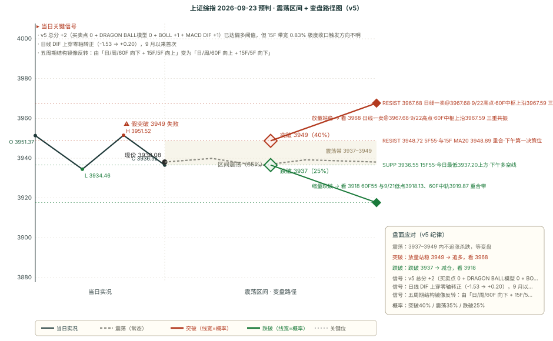

# 作战报告 · 午间 · 2026-09-23（周三）

> **数据时点（须先读）**：本报告生成于 **2026-09-23 13:45**，此时**下午盘已开盘 45 分钟**。为免口径混淆，全篇分两层：
> - **午间基准层**（O/H/L/C、成交额、行业快照）取自 12:59 的 `noon` 槽位快照 → **纯上午（≤11:30）口径**；
> - **技术复核层**（MA / MACD / BOLL / 缠论）为 13:35~13:45 的引擎读数 → **含下午开盘后数据**，凡与 13:20 定稿值有差异处均已并列标注。
>
> **本期落地 9/21 交接的三项整改**：④ 附件正文已抽取入库（**11 个附件已读 11 / 未读 0 / 失败 0**）；⑤ 抓取后、撰写前已跑 `audit_coverage.py`（结论见附录 A）；⑥ 读图结果已落盘 `_image_ocr_2026-09-23.json`（**19 张图已读 18 / 未读 1**，未读者为单文件 3.2MB 超读取上限）。

---

## 核心主线速览（三行）

1. **加息定价压顶**：瑞银预期美联储 12 月再加息一次、2 年期美债破新高，长端反弹定价面临逆转风险。
2. **地产二次脉冲**：房贷补贴传闻驱动地产再度上扬，但消息未证实、涨幅已自高点回落，机构明示减持困境房企。
3. **AI 硬件链研报与资金流背离**：五家投行集体看多先进封装·CCL·光互连，高盛资金流却在卖出覆铜板。

---

## 第一块 星球信息（午间窗口 · 28 条 / 6 个星球）

> 窗口 2026-09-23 08:00~12:54。两条通道均正常、`degraded` 为空（无降级）。**附件 11 个已读 11 / 未读 0**（研报 PDF 全文已抽取入库）；**图片 19 张已读 18 / 未读 1**。

### 一、宏观与流动性

**1. 隔夜大类资产：油价大概率见顶，但加息定价仍高（11:00 附件，41 页）**
油价连跌 5 日，美伊外交乐观情绪升温。**关键矛盾在成品油**：若美国施行柴油出口禁令，将引发全球能源供应冲击与利率波动率风险。美债 2 年期**不跌反破新高**、年底加息路径定价未松动，长端或已见顶；**权益市场对长久期资产反弹的乐观定价，可能在实际利率重新上行时逆转**。

**2. 全球央行路径：瑞银预期 2026 年 12 月美联储再加息一次（11:06，37,641 字）**
**美联储 12 月再加息一次至 4.0-4.25%**，2027 年 6 月一次降息至 3.75-4.0%（中性利率约 2.9%）；**ECB 12 月加息 25bp 至 2.75%**；BoE 于 2026/11 与 2027/02 各加息 25bp。**主流机构预期仍处加息路径。**

**3. 美股隔夜收盘（08:18）**：标普 7764 持平，纳指 100 **+82bp 报 30732**（连续第 4 日上涨），道指 -36bp。VIX **14.27**；WTI 94.59；10 年期美债 4.9531%；美元指数 100.55；黄金 4362。交易台最热主题为 Meta Muse 发布后的智能体 AI 影响。

**4. 美国政治：民主党众议院胜率升至约 90%（12:43，图 8 张）**
预测市场定价**民主党拿下众议院概率约 90%**、参议院约 60%；特朗普净支持率 -15%~-20%，**通胀项最弱（-42%）**。**行业相关性**：半导体与半导体设备对共和党控制**正相关**（参 +0.42 / 众 +0.56），医疗设备与服务、药企生物科技对民主党控制**正相关**（众 +0.57 / +0.48）。

**5. 德银：布雷顿森林体系 II 稳定性下降（12:51，图 4 张）**
机制为「亚洲出口商→美国消费→结汇→央行储备→美债市场→低成本融资回流」。**弱化证据**：中国官方外储 2014 年见顶后私人部门外汇持有持续增加、银行代客结汇显著低于贸易顺差；**中国银行 2025 年大幅回收美元约 370bn，2026Q1 回落至约 130bn**。

### 二、A 股盘面实况

**6. 高盛中国开盘（08:31 / 09:16）**：昨日 A 股回落至平盘附近，焦点**重新转向 AI 交易、旧经济主题趋于平淡**。今日启程访美，WSJ 报道**大概率不携带中国企业代表团**，比亚迪/宁德时代/小米等 CEO 随行预期下调。隔夜美股内存走强对国内硬件标的属利好。

**7. 高盛中国午间（12:18，本窗口信息密度最高）**：SHCOMP **-0.36%** / 上证 50 -0.41% / 沪深 300 -0.50% / 科创 50 -0.12% / 创业板指 -0.43% / 中证 500 -0.38%。**总成交额 1.17 万亿元、环比 -18.75%**（预计全日约 1.8 万亿）。半导体相对走强；软件板块昨日受 Meta-Muse 推动后**今日普遍整固**。

**8. 高盛午间·行业轮动与资金流（同上）**：**地产股早盘再次大幅上扬**，房贷补贴讨论在聊天群组中活跃，**但尚无确切消息证实、涨幅已从上午高点回落**；**CRO/生物科技股再度领跑，成为行业轮动的主要流向**。资金流：**卖出力度为买入的 1.2 倍，买入半导体设备、卖出 AIDC 电源与覆铜板（CCL）**。

**9. 大鹏鸟午间总结（12:37）**：小跌但**大幅缩量**；科技内**玻璃基板与 ABF 稍强**（盘前有消息）；**CPU 继续开得弱**，未复制上轮「炸板次日转强」。**长假前为无量行情，波段可留底仓、轻仓过节，不适合重仓。**

### 三、地产链

**10. 摩根大通：国庆前将推出房贷补贴？（08:02）**
过去两个交易日**开发商涨 5%（HSI 仅 +2%），融创等困境房企领涨**——此类高贝塔标的是**政策博弈的代理变量**。传闻为**国庆前可能宣布全国性房贷补贴**；2025 年 11-12 月曾有类似传闻并驱动脉冲反弹但无实质落地。**历史规律：即便无新传闻，板块在 9 月末政策窗口前夕通常跑赢大盘。**

**11. 同一报告的量化另一面（关键）**：1ppt 补贴可将有效利率由 3.05% 降至 2.05%，**但通常设上限（每套 2-5 万元、非年度额度）**——500 万元贷款**仅相当于约 4 个月利息节省**；2026 年 8 月上海补贴池仅 2 亿元、**约 4000 套（占年新房成交约 4%）**可受益。**风险：若国庆前无政策或不及预期，板块将面临新一轮抛售。操作建议为「反弹中卖出困境股」，首选非困境类**。

### 四、家电链

**12. 摩根大通：欧洲 HVAC 专家电话会（08:26）**：欧洲并非天气驱动的制冷脉冲，而是**多年期供暖系统替换周期**（油气锅炉→热泵）。2025 年 21 国热泵销量约 **290 万台**，2024 年热泵占供暖设备销量 **29%**。**欧盟 F-gas 法规分阶段淘汰传统制冷剂 → 全行业产品周期重置**，为具备认证能力的追赶者打开窗口；**美的通过 MBT Climate 整合 Clivet 与 Arbonia 的欧洲打法被认为方向正确**。

**13. 家电出口退税专家交流（10:39）**：**家电直接取消出口增值税退税的概率较低**，若调整或以温和分步方式推进。核心差异在于家电长期平稳销往全球，**不具备光伏、电池的冲击式出口特征**；退税率调整后通常不会同步出台全行业专项补贴。

### 五、AI 算力硬件链

**14. 大摩：中国先进封装、CCL 与 AI 铜箔（08:32）**：**2029 年中国先进封装 TAM 达 1000 亿元**，Chiplet 2.5D 以 **40% CAGR** 扩张，设备厂商优于封测。**AI/数据中心相关 CCL 2025-30 年 CAGR 47%**、PCB 同期 18%、**AI 需求为 PCB 新增逾 700 亿美元**；先进 AI PCB 生产周期 **102 天（常规的 2.2 倍）**；**HVLP4 铜箔 2027 年缺口约 31%、2028 年约 20%**。

**15. 野村：AI 网络 scale-across 与 scale-in（附件，17 页）**：单集群受电力/散热/土地限制，分布式训练需 **scale-across 网络**支撑，推动相干光模块、空芯光纤、DCI/WAN/Metro 路由器需求；**AI-WAN TAM 预计自 USD 7bn 增至 14bn（2026-2029E 约 30% CAGR，Ciena 口径）**。

**16. 瑞银：美国半导体与设备（08:05）**：**算力每两年提升约 3 倍，而内存带宽仅 1.6 倍、I/O 仅 1.4 倍**，内存与数据搬运成为关键瓶颈；**网络深度嵌入计算体系**，更多任务从 CPU 卸载至 NIC/SmartNIC/DPU。**CoWoS 产能 2026 年底 16 万片/月 → 2027 年底 26 万片/月。**

**17. 英伟达 IR 与卖方对话（09:02）**：管理层强烈反对「定制 ASIC 侵蚀 NVIDIA 地位」；NVIDIA 在超大规模云 capex 份额**从 ChatGPT 前约 5% 升至约 20% 中段**；数据中心内容向**每吉瓦约 400 亿美元**演进；**FY27 仍约 70% 受供应限制**。

**18. 汇丰：中国股票的两条 AI 算力链（10:37，38,080 字）**：**海外算力链**围绕光模块、PCB、AI 服务器；**国产算力链**围绕芯片设计、代工、设备、存储，更受益国产替代。**2023 年初以来海外链涨超 1100%（盈利:估值 = 4:1）、国产链涨超 400%（1:1）**；海外链前瞻 **PEG 0.33**、国产链 **PEG 1.08**。周边受益：液冷、储能、PCB 上游。

**19. 海亮股份调研（11:29）**：27 年新增印尼铜箔 10 万吨 + 美国铜排 3.5 万吨，铜箔出货上调至 22 万吨；电子箔占比升至 20-30%；**HVLP1-2 于 26Q4 量产、HVLP3-4 于 27Q1 量产**。Q3 预计 5-6 亿，27 年上调至 35 亿，对应当前 12X。

**20. 伯恩斯坦：半导体周期观察（附件，77 页）**：SOX 虽较 6 月高点回落 15%，**但 YTD 仍 +76%**；YTD NTM 盈利 **+113%**、估值 **-18%**——**回报全由盈利驱动**。

**21. 高盛：纬颖 8 月营收超预期（10:10）**：8 月营收 **1,443 亿新台币，超高盛预测 27%、同比 +50%**；预计 3Q26/4Q26 营收环比 **+46% / +22%**；**目标价上调 13% 至 3,777 新台币**，维持买入。

**22. 12 吋矽晶圆 2027 年长约看涨（09:01，图 1 张）**：晶圆价格 **+15%~25%**（曝光机晶圆 **+40% 以上**）；2027 年 **CoWoS 产能 +70.9%、GPU/AI ASIC 出货 +44.9%、CPU 出货 +36%**；**2027 年 DRAM 位元供给仅年增 22%**；**2028 年前仍有涨价空间**。

**23. 科技日报 0923 美股盘后（附件）**：QQQ +80bp，**半导体 +2% 领涨**，存储器与 HDD 加入上涨行列，CPU 继续强劲；Agentic AI 赢家/输家交易延续并外溢至保险等板块。

### 六、散热与新材料

**24. 石墨烯散热材料专家交流（09:06）**：**AI 芯片 TIM 材料沿硅脂→相变材料→石墨烯垫片迭代**，目前 NVIDIA 服务器除单独销售的芯片外**全部采用石墨烯作为 TIM2 材料**。按明年 Rubin 10 万柜测算对应 **10 亿元以上市场空间**；**国内龙头在 NVIDIA 份额达 80-90% 接近独供**。

**25. 金刚石铜与 CVD 金刚石调研（08:22）**：SPS 烧结优于熔渗（热循环 1000 次后导热率衰减 <5% vs 约 10%）；金刚石铜冷板**已通过模组厂向 NVIDIA 交付测试**；单晶金刚石热导率 1800 W/(m·K) 以上、长速为多晶 3-4 倍。

**26. 京东方玻璃基板交流（09:07）**：**力争 27Q1 或上半年量产**；试验线已全线拉通，覆盖 TGV 打孔、镀铜、ABF 增层、封装切割全流程，产品送样验证中。

### 七、储能与机器人

**27. 瑞银：中国储能「2026 逆风、2027 反弹」（08:01）**：8M26 招标 **413GWh（+52% YoY）** vs 装机 **仅 77GWh（+2% YoY）**，**错配主因为并网延迟、成本上升致项目取消、政策不确定**。专家预计**系统运行费下调、容量电价细化、辅助服务补偿改善**将驱动 **4Q26 至 2027 年需求复苏**；当前广东/内蒙/山西 IRR 已 >15%。

**28. 瑞银：人形机器人——上游优于本体（附件，35 页）**：需求超预期但结构分化（**研究/娱乐/数据采集超预期，工业部署落后**）；**上调 2026-30 全球需求预测至年均 >70%**，但明确**「2030 年前不会有机器人的 EV 时刻」**。**偏好上游零部件**（传感器、减速器、滚柱丝杠），中国首选 **OPT、科达利、恒立液压**；**绿的谐波因估值超前基本面给予卖出**。

### 八、医药 / CRO

**29. 盘面轮动主线（12:18）**：**CRO/生物科技股再度领跑，成为行业轮动的主要流向**。⚠️ **与 9/21 对照**：9/21 医药生物 +3.59%（行业第 2）时，本体系因**附件未读**而漏掉该主线；本期 11 份附件已全部读毕，该线**未再出现覆盖缺口**。

### 九、DRAGON BALL模型（本档唯一方向因子来源 · 无定调）

**30. 本窗口 3 条，全部无市场定调**：08:51 答「**带结构 vs X 段**」定义；10:50 情绪性表态（关闭评论区）；12:25 答「标准/非标准顶底分型」——**回复为「缠论自己有定义」**。

> ⚠️ **因子影响**：本期 4 因子中 **DRAGON BALL模型 定调因子缺失（计 0，属「信息缺失」而非「中性判断」）**，实际生效因子仅 3 个。这是本期置信度不能再高的直接原因之一。**本档按午间档 SOP 不做原文归档。**

## 第二块 信息判断（跨星球观点对比 + 共识复盘）

### 一、跨星球观点对比

#### 共同观点（≥2 球一致，细节见第一块）

1. **AI 硬件链上游材料是本窗口最强共识**（5 家投行同向，见第一块·五）：先进封装千亿 TAM、CCL 高增、HVLP4 铜箔缺口、光互连增量、散热材料迭代——且**全部为附件全文已读**。
2. **地产是「政策博弈」而非「基本面改善」**（2 源一致）：涨的驱动是传闻与历史规律，但**消息未证实、涨幅已回落**，且机构操作建议是**反弹卖出困境股**。
3. **节前是缩量行情，不宜重仓**（2 源一致）：机构口径（成交额环比 -18.75%、预计全日 1.8 万亿）与游资口径（无量行情、轻仓过节）**同向**。
4. **全球利率路径仍偏鹰**（2 源一致）：2 年期美债破新高 + 加息路径定价未松动 + 瑞银预期 12 月再加息一次。

#### 相反观点

> **对立观点 ①：地产链 —— 政策预期驱动 vs 补贴上限使实际影响有限**

**A 方（看多：政策窗口临近 + 历史规律 + 困境股高贝塔弹性）**
- 过去两个交易日开发商涨 5%（同期 HSI 仅 +2%），融创等困境房企领涨；
- 历史规律：**即便无最新传闻，板块在 9 月末政策窗口前夕通常跑赢大盘**；
- 政策方向具备可行性——上海、广州等多地已有地方层面类似措施；
- 9/23 盘面已部分验证：**地产股早盘再次大幅上扬**。

**B 方（看空/提示：补贴设上限使实际节省有限，政策落空则再抛售）**
- 1ppt 补贴虽把有效利率由 3.05% 降至 2.05%，**但设上限（每套 2-5 万元、非年度额度）**——500 万元贷款**仅相当于约 4 个月利息节省**；
- 地方实践受限（上海补贴池 2 亿元、**约 4000 套 ≈ 年新房成交的 4%**）；
- **关键风险：若国庆前无政策或不及预期，板块将面临新一轮抛售**；
- 9/23 盘面佐证：**尚无确切消息证实，涨幅已从上午高点回落**；
- 操作建议本身即「**反弹时卖出困境股**」、首选非困境类（华润万象生活、华润置地、贝壳）。

> **对立观点 ②：储能链 —— 「2026 逆风、2027 反弹」的时间表 vs 头部厂商下调排产指引**

**A 方（看多：错配是并网延迟而非需求消失，政策顺风驱动 4Q26-2027 反弹）**
- 招标 413GWh（+52%）vs 装机 77GWh（+2%）的错配**主因是并网审批延迟与政策不确定**，存量将在 6-12 个月转化周期后释放；
- **系统运行费下调是最关键驱动**（每降 0.1 元/kWh → IRR +3pct），最早 26 年底落地；
- 当前广东/内蒙/山西 IRR 已 >15%；另有 2 家机构独立支持（装机至 2030 年 CAGR >20%）。

**B 方（看空：实地调研显示多家头部厂商下调 Q4 及 2027 排产指引）**
- 产业链全覆盖调研显示，受终端需求增速边际放缓、并网节奏波动与去库存影响，**多家头部电池与材料厂商下调 Q4 及 2027 年排产指引**；
- **锂盐冶炼端库存天数攀升至约 15 天（历史均值约 7 天）**，下游采购意愿弱；
- **本期盘面与该侧一致**：电力设备 9/21 **-0.15%，在 31 个行业中排第 30 位（倒数第二）**。

> **对立观点 ③：AI 硬件链 —— 研报侧集中看多 vs 卖方资金流反向卖出该链两端**

**A 方（看多：先进封装千亿 TAM、CCL CAGR 47%、HVLP4 铜箔缺口 31%、scale-across 光互连增量）**
- 5 家投行在同一方向给出量化背书，且**全部为附件全文已读**；
- 产业侧落地信息密集：12 吋矽晶圆 2027 长约涨价、佰维存储 45 亿三期、京东方玻璃基板 27Q1 量产、石墨烯 TIM2 接近独供。

**B 方（看空/分歧：卖方资金流正在卖出该链两端，且盘面落后）**
- **高盛午间资金流原文：「卖出力度为买入的 1.2 倍，买入半导体设备 vs 卖出 AIDC 电源与覆铜板（CCL）」**——与研报侧对 CCL/铜箔的集中看多**方向相反**；
- 盘面亦不支持：9/21 电子 **+0.86%（第 22 位）**、计算机 +1.27%（第 16 位），均在 31 个行业中处中下位；
- 大鹏鸟侧同向：**CPU 继续开得弱**、未复制上轮炸板次日转强的模式。

#### 隐含共识

- **都在等国庆前的政策窗口** —— 地产、家电、消费链的定价均以「节前政策」为锚；
- **都承认这是缩量行情** —— 机构与游资对量能的描述完全一致，分歧只在「缩量后往哪走」；
- **AI 硬件链的确定性来自「产能壁垒」而非「需求叙事」** —— 大摩原话为「具备产能壁垒、技术领先及份额提升逻辑的子环节与标的，是当前最具确定性的投资方向」。

### 二、上期共识复盘（9/21-morning → 9/23 午间验证）

> 上期 window 为 9/18 19:00~9/21 09:00（112 条），target 为 9/21。本档依据 9/21 与 9/22 两个完整交易日的**申万一级行业实测数据（31/31 全覆盖）**与盘面事实完整补判。

| # | 上期共识 | 类型 | 判定 |
|---|---|---|---|
| 1 | MLCC 三环通知提价 30-80%（10/1 起执行） | short | ⏸ 不参与 |
| 2 | 存储超级周期：多方给硬数据，但出现产业方公开反驳 | mid | ⏸ 不参与 |
| 3 | AI 算力国产化提速：华为 NPO 方案落地 + 超节点放量 | mid | ⏸ 不参与 |
| 4 | PCB/CCL 升级周期获机构集中背书 | mid | ⚠️ 部分 |
| 5 | 外部流动性紧缩延续：美债抛售、日央行加息 | short | ⚠️ 部分 |
| 6 | 中美峰会（9/24）前瞻：管控竞争、延长休战 | mid | ⚠️ 部分 |
| 7 | A 股短期是「存量博弈 + 无量温和」 | short | ✅ 命中 |

- **#1 MLCC**：上期自设判定依据为「9/21 是否高开走低」，实测**高开高走**（开 3920.27、收 3949.91、最高 3950.94），节奏风险当日未兑现；但电子仅 +0.86%（第 22 位），**无法据此判定题材成立** → 既不命中也不失效，记 ⏸。
- **#2 存储**：分界指标属 Q4 及以后的中期指标，9/21-9/23 无法裁决；本期出现同向旁证（隔夜美股存储走强、A 股半导体相对走强），但**不构成裁决**，样本留待 Q4。
- **#3 华为算力**：9/21 当日三条链（计算机第 16、通信第 14、电子第 22）均处中下位，**盘面对该主线不利**；9/23 出现「焦点重回 AI 交易」的方向性变化，但属**不同交易日的事实**，不足以裁决 → ⏸。
- **#4 PCB/CCL**：**叙事侧延续且被第三重背书强化**（本期大摩量化框架 + 海亮股份产业链佐证）；**盘面侧未确认**（9/21 电子第 22 位）；**且本期出现反向资金信号**（资金流卖出 CCL）→ ⚠️ 部分。
- **#5 流动性紧缩**：机构预期延续（本期瑞银进一步强化至「12 月再加息一次」）；**但长端与波动率边际缓和**——10Y 美债由 5.00% 回落至 4.9531%、VIX 降至 14.27、WTI 跌至 94.59 → ⚠️ 部分。
- **#6 中美峰会**：事件如期临近（今日启程赴美），但**出现预期下修**——WSJ 报道大概率不携带中国企业代表团，解释了本期新能车/电池链未获资金聚焦 → ⚠️ 部分。
- **#7 存量博弈**：**连续三日兑现且获机构口径独立确认**（本期成交额环比 -18.75%、预计全日 1.8 万亿）→ ✅ 命中。

### 三、本期新共识（已追加 `consensus_chain`，8 条）

内容与上文「共同观点 / 相反观点」同源，按「信息原子唯一落地」原则**不重复展开**，仅列标题备查：① 储能「2026 逆风、2027 反弹」时间表；② 地产房贷补贴传闻（含上限约束）；③ AI 硬件三线并行强化；④ 人形机器人上游优于本体；⑤ 半导体与产业催化密集（矽晶圆/散热/玻璃基板/佰维）；⑥ 隔夜全球（存储与 CPU 领涨、油价与长端利率同步回落）；⑦ A 股「节前缩量 + AI 接棒旧经济」；⑧ 家电出口退税与欧洲热泵周期。

---

## 第三块 技术分析（缠论买卖点 + BOLL×缠论变盘）

> 引擎读数时点 **13:35~13:45（含下午开盘后 45 分钟）**；与 13:20 定稿值有差异处已并列标注。

### 引擎 B：chan-signal 缠论买卖点（五周期）

| 周期 | 最新价 | 涨跌 | 趋势 | 中枢位置 | 买点 | 卖点 |
|---|---|---|---|---|---|---|
| 日线 | 3936.91 | -0.39% | 向上 | 中枢上方（上沿 3884.44 / 下沿 3842.72） | — | 一卖@3967.68 |
| 周线 | 3936.91 | +0.64% | 向上 | 中枢内部或未明显离开（上沿 4034.08 / 下沿 3927.85） | — | 一卖@3995.18 |
| 60F | 3936.91 | -0.03% | 向上 | 中枢内部或未明显离开（上沿 3967.59 / 下沿 3927.55） | — | 三卖@3891.48 |
| 15F | 3937.12 | -0.02% | 向下 | 无中枢参考 | — | — |
| 5F | 3937.12 | +0.01% | 向上 | 无中枢参考 | — | — |

- **日线一卖@3967.68（置信度 0.8）**：与 9/22 高点、60F 中枢上沿 3967.59 构成**三重共振**——本档上行空间的实际天花板。
- **周线一卖@3995.18（置信度 0.5）**：大级别卖点，落在日线 BOLL 上轨附近。
- **60F 三卖@3891.48（置信度 0.75）**：现价已**站上该位 45.43 点**，按既有口径（现价决定性越过则效力被否定）**本档不计分**。
- **15F/5F 均无明确买卖点**，小级别处于信号空窗。

### BOLL×缠论变盘概率（多因子方向打分）

| 级别 | 上涨概率 | 下跌概率 | 方向 | 带宽状态 | 关键依据 |
|---|---|---|---|---|---|
| 15F | 19% | 81% | 看空 | 极度收口（变盘） | 中轨下方-1，中轨下行-2，收口偏空-2，趋势向下-2 |
| 60F | 72% | 28% | 看多 | 常态 | 中轨上方+1，中轨上行+2，趋势向上+2 |
| 120F（纯 BOLL） | 88% | 12% | 看多 | 开口（趋势启动） | 中轨上方+1，中轨上行+2，开口向上+2 |
| 日线 | 72% | 28% | 看多 | 开口（趋势启动） | 中轨上方+1，中轨上行+2，开口向上+2，趋势向上+2，缠论卖点-2 |

> 概率 = 多因子信号强度归一化（映射 5%~95%），**非历史回测胜率**。因子：BOLL 位置 ±2、中轨斜率 ±2、带宽变盘 ±2、缠论趋势 ±2、缠论最新信号 ±2；无缠论数据的级别（120F）仅 3 因子，置信度较低。**BOLL 中轨 ≡ MA20**（数学恒等），表内「中轨」与均线体系中的 MA20 为同一个数。

**BOLL 轨道读数（13:45）**：

| 级别 | 上轨 | 中轨 | 下轨 | 带宽 | 价格位置 |
|---|---|---|---|---|---|
| 15F | 3960.55 | 3946.55 | 3932.56 | **0.71%**（极度收口） | 中轨下方 -9.28 |
| 60F | 3980.65 | 3922.11 | 3863.56 | 2.99%（常态） | 中轨上方 +15.16 |
| 120F | 3970.16 | 3908.84 | 3847.52 | 3.14%（开口） | 中轨上方 +28.43 |
| 日线 | 3995.77 | 3930.19 | 3864.61 | 3.34%（开口） | 中轨上方 +7.08 |

- ⚠️ **15F 带宽口径**：13:45 复核为 **0.71%**、13:20 定稿时为 **0.83%**——两者**均在 1% 阈值下方**，方向判定结论不受影响，但可确认**收口仍在深化**。
- **BOLL×缠论共振**：日线一卖与日线 BOLL 上轨 3995.77 相距 0.71%、评级「弱共振」；60F 三卖@3891.48 与 60F 中轨 3922.11 相距 0.78%（因现价已越过，仅作结构记录）。

### 关键均线与 MACD（55 线体系 + 级别分裂）

| 级别 | 收盘 | MA55 | 相对 | MA20 | 相对 | DIF | DEA | 区域 | DIF 方向 |
|---|---|---|---|---|---|---|---|---|---|
| 5F | 3939.81 | 3948.72 | -0.23% | 3941.12 | -0.03% | -2.54 | -2.70 | 多头区 | 向上 |
| 15F | 3939.81 | 3936.55 | +0.08% | 3948.87 | -0.23% | -0.84 | +1.68 | 空头区 | 向下 |
| 30F | 3939.81 | 3907.73 | +0.82% | 3945.87 | -0.15% | +8.29 | +12.06 | 空头区 | 向下 |
| 60F | 3939.81 | 3917.67 | +0.57% | 3922.23 | +0.45% | +12.54 | +10.63 | 多头区 | 向下 |
| 120F | 3939.81 | 3924.69 | +0.39% | 3907.29 | +0.83% | +5.93 | -1.62 | 多头区 | 向上 |
| 日线 | 3939.72 | 3907.09 | +0.84% | 3930.31 | +0.24% | **+0.20** | -2.67 | 多头区 | 向上 |

- **日线 DIF 已上穿零轴转正**（-1.53 → **+0.20**），为 **9 月以来首次**；日线 MA55 与 MA20 双双在现价下方，本轮上行结构完好。
- **中级别 55 线全部被收复**：15F / 60F / 120F / 日线 MA55 均在现价下方，**上方最近的 55 线只剩 5F MA55**——机械口径下压力位降到最小级别，本身即是**结构偏多**的信号。
- **短长端分裂**：15F 处空头区且 DIF 向下、30F 亦为空头区；而 60F / 120F / 日线均为多头区——**短端回调、长端向上**。

### 级别联动解读

1. **五周期结构镜像反转（本档最重要的结构变化）**：由 9/18~9/21 的「日线/周线/60F 向下 + 15F/5F 向上」**整体翻转为「日线/周线/60F 向上 + 15F/5F 向下」**——多空的主导级别发生对调。
2. **日线一卖是唯一的大级别约束**：日线、周线两个卖点分别落在 3967.68 与 3995.18，构成**两道天花板**；而日线 DIF 刚转正、MA55 支撑完好，故「上有压制、下有支撑」的箱体特征强于单边特征。
3. **15F 极度收口是本期唯一的时间敏感项**：带宽 0.71%、20 周期内波动被压缩至 28 点，**变盘窗口临近**；15F 看空 81%（中轨下行 + 趋势向下 + 收口偏空）与 60F/120F/日线看多 72%~88% 形成**短长端对立**。
4. **与星球侧技术判断的呼应**：附件侧「先进封装/CCL/铜箔」的产能壁垒逻辑属**中期结构**，与 60F/日线级别的多头区一致；而资金流卖出该链属**短期节奏**，与 15F 空头区一致——**同一产业链在长短两个级别上给出了相反的读数**，这解释了对立观点 ③ 的来源。

---

## 第四块 预判（技术预判与复盘）

### 一、上期复盘（9/21-morning 补判）

> 本条 target=9/21（周一），此前为晨报档**开盘前静态初验**（`actual` 为空、四维悬空）；现依据 9/21 真实日线 OHLC 完整补判。上期判**方向不明**（v5 总分 +1）、核心带 3902-3922、主压力 3920.19、主支撑 3842.72、置信度低。

| 维度 | 上期预判 | 实际 | 判定 |
|---|---|---|---|
| 方向 | 方向不明（偏多倾向略占优） | 收 3949.91，**+0.97%** | ⚠️ 部分 |
| 区间 | 核心 3902-3922 / 扩展 3843-3926 | O 3920.27 / L 3918.13 / H 3950.94 / C 3949.91 | ❌ 突破 |
| 支撑 | 主支撑 3842.72 | 最低 3918.13，距主支撑 +75.41 点 | ✅ 守住（未触及型） |
| 压力 | 主压力 3920.19 | 开盘即跳空站上、收盘站稳上方 +29.72 点 | ❌ 突破 |

- **方向 ⚠️ 部分的理由**：按「方向不明即不下方向注，实测偏多侧兑现记 ⚠️」的既有口径维持部分，**不因事后上涨改判 ✅**。⚠️ 但须并列记明两点：① 「偏多倾向略占优」的**强度被低估**——实际是**放量突破 60F MA55 并站稳 +29.72 点**的强形态；② **名义最高剧本为 B（带内震荡 40%）而非实际主导的 A（突破 35%）**——方向对了、路径给错了。
- **区间/压力双突破**：开盘 3920.27 即以跳空站上主压力 0.08 点，全天最高 3950.94、收盘 3949.91。**3920-3925 密集带整体被穿越**，属「开盘跳空穿越」最强形态。
- **⚠️ 量能旁证（关键）**：9/21 成交 5.0235 亿手，环比仅 **+3.43%（约 1.03 倍）**，**属温和放量、不构成「放量」**。按 2026-08-31 实装的「**压力位突破确认**」规则（须同时满足「放量 + 收盘站稳」），**只有「收盘站稳」成立** → 判定为**未确认的突破，按规则不追多**。
- **✅ 事后验证该判定正确**：突破次日（9/22）跳空高开至 3963.81、最高 3967.68，但收盘回落至 3952.13（仅 +0.06%）；第三日（9/23）半日即跌回 3938.08（-0.36%）——**突破未获量能承接、两日内回吐全部突破涨幅**，与「未确认」判定一致。
- **可预见性**：记**可预见**——定调已把「站稳 60F MA55 + 日线中轨则日线拐点出现」写入，压力被穿越属「预设路径被启动」。⚠️ 但**路径形态不可预见**：剧本 A 定义为「先回踩 15F 中轨不破、再站上压力」，实测是**开盘直接跳空站上、全程未回踩**——触发顺序与剧本相反，属**剧本定义粒度不足**（只定义结果、未穷尽到达方式），是 OBS-2 现象的一种具体形态。
- **bias_type**：区间上沿破位 / 压力位突破 / 方向正确路径偏移。

### 二、偏差观察统计表（53 期 · v5 配对计数 · 截止 2026-09-23 13:20）

| 维度 | 命中 | 部分 | 失效 | 纯命中率 | 加权 | 备注 |
|---|---|---|---|---|---|---|
| 方向 | 28 | 19 | 6 | **52.8%** | 70.8% | n=53 |
| 区间 | 18 | 30 | 5 | **34.0%** | 62.3% | n=53 |
| 支撑 | 36 | 7 | 10 | **67.9%** | 74.5% | n=53 |
| 压力 | 29 | 11 | 13 | **54.7%** | 65.1% | n=53 |

**本期变化**：新增 `9/21-morning` 补判样本，样本 52 → 53 期。方向（53.8%→**52.8%**）；区间（34.6%→**34.0%**）；支撑（67.3%→**67.9%**）；压力（55.8%→**54.7%**）。

**结构未变**：支撑（67.9%）> 压力（54.7%）> 方向（52.8%）> 区间（**34.0%，连续 53 期垫底**）。区间维「部分」占比 30/53 = 57%，仍是四维中最高——**区间判定本质是「方向对、幅度差一点」**，非方向错误。该结构连续 53 期未变，继续观察、不修改规则。

**bias_type 三分类观察（累计）**：压力位突破 14（✅ 规律已现）｜支撑跌破 11（✅）｜区间下沿/上沿破位 10（✅）｜方向错误/相反 6（✅）。**本期新增「压力位突破」与「区间上沿破位」各 1 次**；本档为该类第 14/10 次，**按第六节纪律仅标注观察、不自动改规则**。

### 三、本期预判（9/23 下午 13:00-15:00，含已开盘部分）

#### 一句话预判

> **方向不明（v5 总分 +2 但 15F 带宽收口拦下），核心带 3936-3952**。上方 3948.72 是下午第一决策位，3967.68 为实际天花板；下方 3936.55 失守则测试 3917.67。**倾向偏多但路径未定，按箱体对待**。

#### 完整预判字段

| 字段 | 内容 |
|---|---|
| **方向** | 方向不明（v5 总分 **+2**：买卖点 **0** + DRAGON BALL模型 **0（缺失）** + BOLL 变盘 **+1** + MACD DIF 拐头 **+1**）。**性质说明**：本期是「总分达偏多阈值、却被带宽收口拦下」，与 9/18~9/21 三期「总分落在 ±1 的平衡型方向不明」**性质不同** |
| **区间** | 3936-3952（核心 16 点）/ 3918-3968（扩展 50 点）；精确上下沿见下方关键位表 |
| **支撑/压力** | **见下方「关键位相对现价」表（唯一落地处）**——主支撑为前低与日线中枢下沿重合位，主压力为 5F MA55 与 15F MA20 构成的密集带 |
| **置信度** | **低**——方向倾向明确（+2 已越阈值）但路径未定；且 **4 因子中 1 项信息缺失**（DRAGON BALL模型 本档无定调），因子覆盖度低于 9/17~9/21 各期 |
| **观察窗口** | 本期含**下午盘 13:00-15:00**；13:00-13:45 已走完，实况见下方「下午盘实盘跟踪」 |

#### v5 打分明细

- **买卖点因子（0）**：60F 三卖@3891.48（conf 0.75，形成于 9/15）被现价 **站上 45.43 点**，按既有口径（现价决定性越过则效力被否定）记 0；15F/5F 无信号；日线一卖与周线一卖属大级别、按 v5「日线/周线买卖点不进方向分」不计分（但进压力位序列）→ **0**
- **DRAGON BALL模型 定调（0，缺失）**：本窗口 3 条**全为缠论问答与情绪表达，无任何市场定调**（见第一块·九）。**必须如实标注这是「信息缺失」而非「中性判断」**——4 因子本期只有 3 个生效
- **BOLL 变盘概率（+1）**：60F 涨 **72%**/跌 28%、日线涨 **72%**/跌 28%（13:45 复核读数；13:20 定稿时 60F 为 82%/18%），**双双越 15pct 阈值且方向一致偏多**；按 v5「取 60F/日线、为单位分 ±1」口径合记 **+1**
- **MACD DIF 拐头（+1）**：日线 DIF **0.20**（前值 -1.53，**向上**，且已**上穿零轴**，9 月以来首次转正）；按「主级别（日线）主导」口径取 **+1**。（60F DIF 12.54 较前值向下、15F/30F 处空头区 DIF 向下——短端与长端背离，但不改变日线主判）
- **总分：0 + 0 + 1 + 1 = +2** → 已越「≥2 偏多」阈值，**但 15F 带宽 0.71%（复核）/ 0.83%（定稿）< 1%**，按规则第二节「15F 带宽 < 1% → 变盘在即」这一**独立于总分的第二个触发条件**，按 **OR 语义**生效 → **方向不明**（先例：`2026-09-08-morning` 总分 -5 仍因带宽 0.63% 触发方向不明）

> ⚠️ **附注一（四因子不均衡，须明示）**：偏多侧 2 项、偏空侧 0 项、缺失 1 项。**「方向不明」在本期不等于「多空均衡」**——这与 9/18~9/21 三期（两侧证据强度接近的**真无信息**）有本质区别，故**不给方向注但保留偏多倾向的表述**。
>
> ⚠️ **附注二（OBS-2 变盘倾向分试算）**：本期为方案提出后**第一期「变盘倾向分」可非零计分样本**。按审视方案试算：短端背离（15F/30F 双空头区且长端偏多）= **+1**、量能前兆（成交额环比 -18.75%，缩量而非放量）= **0**、带宽收口（15F 0.71% < 1%）= **+1** → **变盘倾向分 = 2** → 剧本概率映射为 **A35% / B37% / C28%**（对照现行 A40/B35/C25）。**该试算仅为观察记录，不构成本期预判；方案是否实装待用户拍板。**

#### 剧本概率与触发条件

| 剧本 | 概率 | 触发条件 | 路径 |
|---|---|---|---|
| **A 夺回 3948.72 后上攻** | **40%** | 放量收回 5F MA55 与 15F MA20 密集带并收盘站稳 → 上攻 3967.68。佐证：日线 DIF 转正 + BOLL 长端双多 | 3936 → 3948.72 → 日线一卖位 |
| **B 带内高位震荡** | **35%** | 3936.55 与 3948.72 之间反复，量能维持 1.8 万亿附近。佐证：15F 收口待变 + 节前缩量 | 3936-3952 带内拉锯 |
| **C 失守 3936.55 回踩** | **25%** | 收盘跌破 15F MA55 且不收回 → 测试 3917.67 → 日线 MA55。佐证：15F 看空 81% + 短端空头区 | 3936.55 → 3917.67 → 3907.09 |

#### 纪律与观察

**关键操作纪律（4 条）**

1. **3948.72 = 下午唯一决策位**——5F MA55 与 15F MA20 几乎完全重合（差 0.17 点），且今日半日高点紧贴其上。**须「放量 + 收盘站稳」双条件**方视为有效夺回（沿用 8/31 实装的「压力位突破确认」规则）；**仅收盘站稳而量能不足者，按上期 9/21 的同类情形处理：不追多**。
2. **3936.55 = 下午多空线**——15F MA55，现价正下方最近的 55 线，且今日盘中已在此处获得过一次支撑（半日最低仅低于该位 0.65 点）。**收盘失守则 C 剧本激活**。
3. **日线一卖位 = 天花板，不预期一次通过**——日线一卖（conf 0.8）+ 9/22 高点 + 60F 中枢上沿三重身份叠加。**若无显著放量，触及即为减仓窗口而非突破窗口**。
4. **节前缩量是硬约束**——成交额环比 -18.75%、预计全日 1.8 万亿；**方向不明 + 缩量组合下，本档不建议重仓单边**。轻仓过节（游资口径）与技术面箱体判断一致。

**下午盘实盘跟踪（13:00-13:45 已走完）**

- **小幅跌破上午低点**：13:45 读数显示盘中最低下探至 **3936.54**，低于上午低点 3937.20 约 0.66 点——**紧贴 15F MA55 下方运行**，纪律第 2 条的观察位正在被测试。
- **量能未改善**：延续上午缩量特征，**C 剧本（25%）与 B 剧本（35%）合计 60% 的概率分布与实况相符**。
- **半导体相对强势延续**：与隔夜美股半导体领涨的传导一致。
- ⚠️ **口径提醒**：13:45 的 15F 带宽已收窄至 0.71%（定稿时 0.83%），**收口在深化，变盘窗口比定稿时更近**。

#### 关键位相对现价（现价 3938.08，9/23 上午收盘）

| 关键位 | 价格 | 相对现价 | 属性 | 依据 |
|---|---|---|---|---|
| 120F BOLL 上轨 | 3970.16 | +0.81% | 压力 | 120F 上轨 |
| 日线 BOLL 上轨 | 3995.77 | +1.47% | 压力（远端） | 与周线一卖 3995.18 同位 |
| **日线一卖 / 9/22 高 / 60F 中枢上沿** | **3967.68** | **+0.75%** | **压力（主压力·天花板）** | 三重共振，见第三块 |
| 60F BOLL 上轨 | 3980.65 | +1.08% | 压力 | 60F 上轨 |
| 15F BOLL 上轨 | 3960.55 | +0.57% | 压力 | 15F 上轨 |
| 今日半日高点 | 3951.52 | +0.34% | 压力 | 紧贴决策位上方 |
| **5F MA55 / 15F MA20 密集带** | **3948.72** | **+0.27%** | **压力（决策位）** | 两线仅差 0.17 点，下午第一道 |
| 15F BOLL 中轨 | 3946.55 | +0.21% | 压力 | 中轨压制（距 -9.28） |
| **现价** | **3938.08** | **0.00%** | **现价（分界）** | 9/23 上午收盘，本行上下即压力/支撑分界 |
| 今日半日低点 | 3937.20 | -0.02% | 支撑 | 下午已小幅跌破 |
| **15F MA55** | **3936.55** | **-0.04%** | **支撑（多空线）** | 下午主线，见纪律第 2 条 |
| 日线 MA20 / BOLL 中轨 | 3930.31 | -0.20% | 支撑 | 日线中轨 |
| 120F MA55 | 3924.69 | -0.34% | 支撑 | 中级别 55 线 |
| 60F MA55 / BOLL 中轨 | 3922.11 | -0.41% | 支撑 | 中级别 55 线 |
| 9/21 低点 | 3918.13 | -0.51% | 支撑 | 前一日低点 |
| **60F MA55（与 9/21 低点重合带）** | **3917.67** | **-0.52%** | **支撑（结构）** | 与 3918.13 重合，C 剧本目标 |
| 日线 MA55 | 3907.09 | -0.79% | 支撑 | 本轮上行结构趋势线 |
| 日线 BOLL 下轨 | 3864.61 | -1.86% | 支撑 | 日线下轨 |
| **前低 / 日线中枢下沿** | **3842.72** | **-2.42%** | **支撑（主支撑）** | 前低 9/16 与日线中枢下沿完全重合（双重共振） |

- **主支撑余量为零的提示**：原「日线一买@3842.72」本期**已不在信号集内**（本轮上行已使该买点被消耗），日线 BOLL 下轨亦由 3853.62 上移至 3864.61、不再贴合。**故主支撑仍是「两重共振」但余量为零——若日线中枢下沿随结构演化上移，该支撑将退化为单一来源。**
- 远端参考：**3741**（-5.00%，属尾部情景，本期不计入常规支撑序列）。

---

## 附录 A 抓取通道信息

**抓取窗口**：2026-09-23 08:00 ~ 12:54（`noon` 窗口，环境变量 `ZSXQ_WIN_START/END`）

| 通道 | 工具 | 星球 | 本期条数 | 备注 |
|---|---|---|---|---|
| 通道 A（Skill） | `zsxq-cli` | ⭕ 基业长青+ | **16** | 本期最大来源：11 份投行研报附件全文（大摩/摩根大通/瑞银/野村/伯恩斯坦/高盛）+ 产业专家纪要 |
| 通道 A | `zsxq-cli` | 卫斯李的投研笔记 | **5** | 隔夜大类资产 0923、瑞银欧洲经济展望、汇丰两条 AI 算力链、花旗中期选举、德银布雷顿森林 II |
| 通道 A | `zsxq-cli` | DRAGON BALL模型 | **3** | **全为缠论问答与情绪表达，无市场定调**；本档按午间档 SOP 不做原文归档 |
| 通道 B（Cookie 直连） | `api.zsxq.com` | 180K Research | **2** | 本土开盘前小结（GS 中国开盘中英双语）+ 本土午间（GS 中国午间，含行情表与资金流） |
| 通道 B | `api.zsxq.com` | AI 产业链地图·Serenity速报 | **1** | 高盛·纬颖 8 月营收超预期解读 |
| 通道 B | `api.zsxq.com` | 大鹏鸟笔记 | **1** | 9/23 午间总结（游资观点） |
| 通道 B | `api.zsxq.com` | ⭕ 短评&信息 | 0 | 窗口内无更新（非鉴权失败） |
| **合计** | | | **28** | **附件 11 个（已读 11 / 未读 0）/ 图片 19 张（已读 18 / 未读 1）** |

**本期未覆盖（非故障，属既定覆盖范围之外）**：星球⑧ 信息平权、⑨ 投行圈子、⑩ 口罩哥——三者 Cookie 直连通道**未配置**（凭证仅覆盖上述 4 个 Cookie 星球），故本期**未抓取、无条数**。附录 B 仍列出全部 10 个星球以保持代号表完整，读者请以本表为准。

**数据完整性说明**：

- ✅ **两条通道均正常**：`degraded` 为空（无降级），`unparsed_ct` 为 0；Skill 通道三球共 24 条、Cookie 通道三球共 4 条。
- ✅ **整改项④已落地（附件正文入库）**：本期 11 个附件 PDF **全部抽取正文入库**（`zsxq_files/2026-09-23/<file_id>.txt`），**已读 11 / 未读 0 / 失败 0**，单份最长 36.2 万字（伯恩斯坦半导体周期，77 页）。抓取侧含**退避重试**（应对接口 `succeeded=false` 的软限流）与 **PDF 魔数校验**；抽取侧含**内容单元判据**（`chars ≥ 50` 且 `tokens ≥ 30`），防止「仅有水印/页眉的扫描版被误判为已读」。
- ✅ **整改项⑤已落地（行业覆盖审计）**：`audit_coverage.py` 对窗口内 28 条做**申万一级 31 行业逐一遍历**。结果——**真盲区 5 个：农林牧渔、纺织服饰、煤炭、环保、美容护理**；**仅附件命中 1 个：机械设备**（正文零提及但挂了该行业研报附件 → 附件正文必须读，否则该行业必漏）。审计以 exit 1 收尾并已附入本附录。⚠️ **需人工确认的读感提示**：5 个盲区中**美容护理在 9/21 为当日第 3 强行业（+2.98%）**，本期窗口内容对其零覆盖——属「窗口内确实无信息」，非抓取故障。
- ✅ **整改项⑥已落地（读图留痕）**：`_image_ocr_2026-09-23.json` 已落盘，19 张图逐张记录识别结果与来源帖子，**可被机器核验**。**唯一未读**：`82258254252211442_1.jpg`（3.2MB，压缩后仍超读取上限）——已按 `unread` 如实记录，未谎报。
- ⚠️ **一处需留意的抽取质量**：`隔夜大类资产评论0923.pdf`（41 页）仅抽出 4,016 字——该 PDF 为**图表型版式**，文字层只有各页标题骨架（如「油价仍存短期扰动，但大概率已经见顶」），**图内数据未取得**。本期该线的实质信息以标题骨架 + 帖子正文摘要为准。
- 凭证文件路径 `.workbuddy/zsxq_cookie.txt`（不入 git，**严禁跨机拷贝**）。

---

## 附录 B 星球代号对照表

> 正文直接表达观点，不出现星球代号；本附录仅供回溯

| 代号 | 星球 | 内容侧重 | 抓取通道 |
|---|---|---|---|
| 星球 ① | 卫斯李的投研笔记 | 海外投行研报、宏观、地缘、大类资产 | A (zsxq-cli) |
| 星球 ② | ⭕ 基业长青+ | 卖方研报、产业链专家、基金经理调查 | A (zsxq-cli) |
| 星球 ③ | DRAGON BALL模型 | 缠论复盘、级别判定、游击战思路 | A (zsxq-cli) |
| 星球 ④ | 大鹏鸟笔记 | 盘前热榜、游资观点、午间总结 | B (Cookie) |
| 星球 ⑤ | ⭕ 短评&信息 | 短评、突发信息 | B (Cookie) |
| 星球 ⑥ | 180K Research | 外资研报、科技周报、算力专题 | B (Cookie) |
| 星球 ⑦ | AI 产业链地图·Serenity 速报 | 海外算力链、产业链速报 | B (Cookie) |
| 星球 ⑧ | 信息平权 | 资讯平权 | B (Cookie) |
| 星球 ⑨ | 投行圈子 | 投行视角 | B (Cookie) |
| 星球 ⑩ | 口罩哥 | 口罩哥专享 | B (Cookie) |

---

## 产物清单

| 路径 | 类型 | 说明 |
|---|---|---|
| `outputs/作战报告_午间_2026-09-23.md` | Markdown 报告 | 本文件（四块齐全 + 附录 A/B + 产物清单） |
| `outputs/000001_forecast_2026-09-23.svg` | SVG 走势图 | 9/23 下午预判条件触发决策路径图 |
| `.workbuddy/zsxq_fetch_raw.json` | 原始数据 | 28 条窗口内星球内容 |
| `.workbuddy/zsxq_files/2026-09-23/` | 附件正文 | 11 个研报 PDF + 抽取正文 + `_files_manifest.json` |
| `.workbuddy/zsxq_images/_image_ocr_2026-09-23.json` | 读图留痕 | 19 张图识别结果（整改项⑥） |
| `.workbuddy/_coverage_2026-09-23_noon.md` | 覆盖审计 | 申万一级 31 行业命中表（整改项⑤） |
| `.workbuddy/forecast_chain.json` | 预判链 | 54 条（53 verified + 1 pending：9/23-noon） |
| `.workbuddy/consensus_chain.json` | 共识链 | 23 条（22 verified + 1 pending：9/23-noon） |
| `.workbuddy/_bias_2026-09-23_noon.json` | 偏差统计 | 53 期四维偏差数据（程序化导出） |

**本期待办（交接给 9/23 收盘档）**：

1. **本期（`2026-09-23-noon`）四维复盘**——target 为 9/23 全天，收盘档须一并判定**方向（+2 却判方向不明的样本）**、**区间（3936-3952）**、**支撑（3936.55）**、**压力（3948.72）**，并关注 15F 收口是否在收盘前完成变盘。
2. **OBS-2 第 6 期样本补记**——本期是「变盘倾向分」可非零计分的第一期（试算值 2，映射 A35/B37/C28），收盘档须补记该样本并核对实际主导剧本，为方案是否实装提供对照。
3. **OBS-3 样本 2 的持续跟踪**——15F 看空 81% vs 日线看多 72% 的短长端分歧，本期是否再次印证极短长端分歧的指示意义。
4. **扫描版 PDF 的 OCR 能力缺口**——`隔夜大类资产评论0923.pdf` 41 页仅出标题骨架，需补 OCR 能力方可读取图表型研报（本期已如实标注为「抽取质量受限」，非「已读」的等价表述）。
5. **用户拍板项**：① OBS-2「同标的日合并计数」口径确认；② OBS-2 变盘倾向分是否实装。
