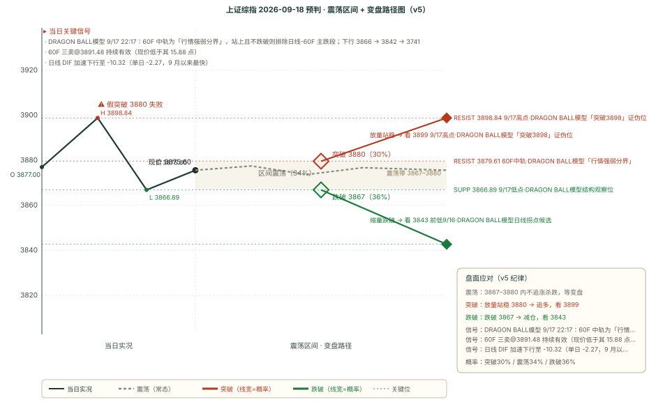

# 作战报告 · 收盘 · 2026-09-17（周四）

> 档位：收盘（close）｜星球窗口：2026-09-17 12:30 ~ 16:45（22 条）｜数据时点：09-17 16:47
> 本档手动触发（17:05 落链）；本期先复盘 9/17-morning 四维并完成 OBS 三问自检，再追加 9/18 预判

---

## 核心主线速览（三行）

1. **上证低开冲高回落收 3876（-0.41%）**：H 3899 未及 30F55、L 3867；成交 1.82 万亿环比 -1.6%，八大指数全线收跌、上证50 领跌。
2. **T&J 午后转空定调**：60F 中轨与 30F55 双重压制、「30F 主跌段」无法排除，下行走 3866 → 3842 → 3741。
3. **上期「偏空」兑现（四维 2 命中 1 部分 1 失效）**；本期更趋偏空（v5 **-4**，四因子全中），核心带 **3866-3896**。

---

## 第一块 星球信息（知识星球收盘快报 · 22 条窗口内）

> 四球有效（卫斯李 12 条 + 基业长青 6 条 + 180K 3 条 + Truth and Justice 1 条）；另三球本窗口内无更新，说明见附录 A
> 本块只做「事实落地」，结论层推导统一放第二块与第四块

### 一、核心主线（按强度排序）

#### 1. 美联储路径重定价：机构判定沃什反应函数「比历任更鹰」，降息时点后移至 2027 年中

- **瑞银**：沃什多次强调当前金融环境**并不具限制性**、25bp 仅「撤除了一部分宽松」；明确否认中性利率具「实际操作意义」；对劳动力市场相对漠视；对能源价格冲击**比历任主席更敏感**（主张对供给侧冲击采取紧缩），并提及「第二轮效应」（更接近欧洲央行措辞）。据此预计**下一次加息为 12 月 FOMC 25bp**（跳过 10 月，避免中期选举前六天加息），2027 年维持利率不变、**2027 年 6 月启动降息**，且该路径风险**明显偏向上行**。
- **杰富瑞**复盘 1983 年以来加息周期：平均不足 2 年、累计 320bp；首次加息后 3/6/12 个月标普 500 回报 **-4.2% / +0.4% / +3.0%**，均低于均值；价值股 6 个月后 +1.8% 而成长股 -2.1%；行业上金融/非必需消费/医疗保健最弱、能源/公用事业最强。
- **摩根大通**全球宏观会议（9/10，约 110 份回复）：**83% 预计 2026 年底前加息**（三分之二仅一次、19% 两次以上），60% 认为 10 年期美债年底高于 4.75%，地缘政治与通胀并列年底首要风险（各约 35%）。
- **高盛**：利率上升的影响**取决于速度而非水平**——除非升速超 2 个标准差，股票通常能在利率上行期实现正回报；当前 10 年期美债一个月波动约 50bp 即相当于 2 个标准差，恰与近日调整幅度相似，这解释了股价回调。
- **野村**（日本央行）：9/17-18 会议或加息 25bp 至 1.25%；实际政策利率仍约 -1%，25bp 对经济负面影响有限，**长端利率（10 年期一度 3%）比政策利率更可能拖累经济**；加速节奏或延续至年底。

#### 2. 油价供给冲击再升温：现货布伦特冲至 130 美元，但霍尔木兹流量经测算仍稳定

- **瑞银**：美国能源部长称受损管道「数日内恢复」，但**9 月装船货物已被取消**、沙特阿美转向从阿曼（霍尔木兹侧）供应更多原油；买家争抢替代品推动**现货布伦特大幅上涨至每桶 130 美元**；**袭击可能仍在继续**——胡塞当日声称袭击沙特阿美延布设施。
- 但实际供给未断：经霍尔木兹的原油及成品油总量加改道运输量仍**日均 1000 万桶以上**（周度 >1200 万桶，冲突前 >2000 万桶）；海湾（除伊朗）装货量稳定在**日均 690 万桶**（高于 8 月 550 万桶）；伊朗原油**已连续 3 周无装货**；延布港遇袭后**再无装货记录**。
- **判定**：这是「**供给量稳定 + 风险溢价重燃**」的组合——价格由对「下一次袭击」的定价驱动，而非实际流量缺口。

#### 3. AI 硬件叙事出现首条反向变量：CPO 替代担忧引发 PCB 板块整体回调

- 9/17 PCB 板块整体回调，诱因为市场对 **CPO（共封装光学）** 将替代交换类 PCB 高速带宽承载功能的悲观预期。机构三点反向解读：① CPO 技术迭代**产业周期仍长、短期影响有限**；② CPO 高度定制化重构会打破现有 PCB 设计思路，但**大概率与 CoWoP 等封装异构产品融合**；③ 只盯高速通信演化路径**片面**——自 8 卡服务器转向 GB 类 Rack 架构起，终端期望已扩展为在 PCB 上完成**更多功能融合集成**（CoWoP、陶瓷基板、玻璃基板、内埋式基板），PCB 产业链重要性**进一步加重**，这是其更高估值的支撑。
- 产业侧正面线索：招商机械调研液冷两家——**达瑞电子**以 7000 万估值并购东莞运宏（冷板微通道、光模块 cage 冷板、光模块金属外壳），子公司维斯德导入 H 客户磁电存储，股权激励目标 2026-2028 净利润 4.5/5.6/7.0 亿元；**金洲管道**子公司东莞骅兴 2 个月从零到量产，已签 3000 万元合同并陆续交货（换算单月产值 4500 万元），9/16 公告 6.8 亿增资金洲智慧液冷，目标液冷全栈式解决方案公司。
- **高盛中国午间综述（交易台）**：CRO 因 **Anthropic 与礼来合作**领涨；**潍柴动力**因 Generac 与亚马逊长期备用发电机协议走高；AI 硬件整体横盘、表现分化；宁德时代连续两日抛售后温和高开、公司将发公告回应传言；优利德放量飙升 7%、市值重回 2000 亿。资金流向**卖盘/买盘 1.2 倍**，买入汽车零部件与 CRO、卖出煤炭与医疗器械、电池板块双向操作。

#### 4. 全球久期与资本成本上行成为跨资产主线

- **高盛**：当前两大主导主题为 **AI 与利率上升**，二者相互关联——私营部门 AI 资本支出侵蚀自由现金流、迫使企业在债股两市融资（美国投资级全年发行量预测上调 2000 亿至 **2.3 万亿美元**，**AI 相关发行人占今年美元投资级总供应量的四分之一**，可转债中 AI 相关借款人占 44%）；公共部门因基础设施/能源安全/国防升级增加借贷。2022 年德日 30 年期国债收益率还近乎为零，如今显著上行。
- 同一报告另指：过去 18 个月**盈利增长是各地区股票回报的主要驱动力**；标普 500 远期市盈率已从年初 22 倍降至 19 倍，科技股市盈率低于其 20 年中位数，**科技股并未经历典型估值泡沫**，风险在于是否存在「盈利泡沫」。
- **高盛「债券之名」**报告给出更激进框架：基于 1950 年以来有效前沿，**新冠后最优组合一度转向 100% 股票**（债券分散化收益近乎为零），当前债券相对股票的估值吸引力在回升。
- **德银 / 杰富瑞**：非稳定币的代币化资产从 2025 年 1 月约 100 亿美元增至 2026 年 9 月约 390 亿美元，代币化美债达 150 亿美元；美国《数字资产市场清晰法案》9/15 未获参议院 60 票推进，杰富瑞判定其「**仅推迟而非阻断**」数字化进程。
- **摩根大通 / 巴克莱**：IBIT 做空比例仍近年初至今高点而 GLD 处于历史均值以下——比特币持仓情绪比黄金更具怀疑色彩，若对冲需求减弱，IBIT 相对 GLD 有望为比特币提供更强底部支撑；巴克莱将 2026 财年标普 500 EPS 预期由 337 上调至 **365 美元**（同比 +31%）、2027 财年由 389 上调至 414 美元，预计 2027 年科技板块 EPS 同比增长 **25%**，算力需求直至 2027 年仍超供给。

#### 5. 消费端分化信号：山东白酒渠道动销两极分化

- **长江食品饮料**：行业整体动销较 2025 年同期**有所下滑、明显两极分化**——头部稳定甚至增长、非头部显著下滑；商务场景（企业用酒、礼赠）减少最明显，烟酒店订货频率**平均下降约 40%**。茅台全年任务完成率 78%、库存接近零、动销增长约 20%；五粮液打款进度 100%、动销增长 15-20%（八代批价 770 元）；国窖低度完成率 65%、库存占全年近 40%、动销下滑 15-20%，高度完成率 45%、一批价 845 元；汾酒完成率 75%、动销略有下滑；剑南春财年 100% 完成、动销下滑不到 10%。
- **判定**：「消费降级 + 集中度提升」在渠道端的直接体现——总量承压但头部份额扩张，可选消费板块承压。

### 二、Truth and Justice 午后定调（9/17 13:15 · 窗口内 1 条）

> 原文已一字不差归档至 `outputs/TRUTH_AND_JUSTICE_原始记录_2026-09-17.md`（第 [2] 条）

- **指数层面「显然不是强势的路数」**：**60F 中轨和 30F55 线都有压制力**；昨晚提到的「谨防 30F 主跌段」**目前看显然无法排除**。
- **结构未完善**：「15F 级别也画不出结构，如果要是一个完善的结构，早盘低点 3866 应该是要被新低」；并自陈困惑——「明明昨天已经 60F 金叉突破 15F55 线，这样反向跌破又变成走钢丝了」。
- **下行路线图**：「后面的下跌都有可能会扩大级别，比如新低 3866 就冲着昨天的 3842 去了，如果迟迟不突破 60F 中轨，那就又冲着 **3741** 这种最坏的可能性去了，因为多级别主跌套娃事前很难排除」。
- **上行逃生口**：「如果再站上 15F55 线且**新高 3898** 会好一些」。
- **取向**：「整体来看还是**博弈超跌背离胜率高一些**，追高一旦跌了，不确定性太多，很看运气」。

---

## 第二块 信息判断（跨星球观点对比 + 共识复盘）

### 一、跨星球观点对比

#### 共同观点（结论式，细节见第一块）

1. **外部流动性收紧已由预期转为事实，且机构一致判定「更鹰更久」**——瑞银判定沃什反应函数比历任更敏感于金融条件、更漠视劳动力市场，降息后移至 2027 年 6 月且风险偏上行；摩根大通调查 83% 预计 2026 年底前加息；杰富瑞复盘首次加息后 3 个月标普 500 平均 -4.2%。三家口径一致：**宽松周期不会很快回来**。
2. **全球资本成本上行是跨资产主线**——高盛指 AI 资本支出与政府借贷需求叠加推升资本成本（美国投资级发行量上调至 2.3 万亿美元、AI 相关占四分之一）；德银的资产代币化、摩根大通的波动率框架均以「实际利率高位」为前提。
3. **AI 产业中长期逻辑未破坏，但估值端出现扰动**——巴克莱上调标普 EPS 预期并预计 2027 年科技 EPS +25%；高盛明确「科技股并未经历典型估值泡沫」；但 A 股侧 PCB 板块因 CPO 替代担忧回调，是景气叙事出现的第一条反向变量。
4. **A 股盘面结构为「权重弱、题材散」**——高盛交易台卖盘/买盘 1.2 倍、买入汽车零部件与 CRO、卖出煤炭与医疗器械，属防御性轮动；上证50 领跌 -0.74% 与 AI 硬件横盘分化互相印证。

#### 相反观点：次日（9/18）方向是「续跌破位」还是「带内消化」？

**方向一 · A 续跌破位（偏空）**

- T&J 13:15 明确定性「指数层面显然不是强势的路数」，60F 中轨与 30F55 双重压制，30F 主跌段「无法排除」，并给出 3866 → 3842 → 3741 的下行路线。
- 长端全线未修复：日线 DIF 加速下行至 -10.32（单日 -2.27，9 月以来最快）、120F 仍在空头区、日线/周线趋势向下；60F 三卖 3891.48 收盘重新失守而效力恢复。
- BOLL 变盘概率 60F 19%/81%、日线 28%/72%，双双越过 15pct 偏离阈值；现价正压在 15F55 3877.26 / 60F 中轨 3879.61 / 5F55 3879.92 三线密集带之下。

**方向二 · B 带内消化（中性）**

- 短端未同步转空：60F/30F/5F 三周期仍处多头区且 DIF 向上（60F -12.36 → -11.96、30F -3.87 → -2.98）。
- **15F 带宽收口至 0.65%**、60F 1.24%——按 v5 口径收口意味着「变盘在即、方向未定」，单边押注的确定性被压低。
- 量能 1.82 万亿仅微降 1.6%（非恐慌抛售），跌幅最大的上证50 也仅 -0.74%；下方 3842 一带与日线一买、日线 BOLL 下轨 3853.02 三重共振，并非空档。

**隐含共识**

- 两家以上机构都把**「速度」而非「水平」当作关键变量**：高盛明确「除非升速超 2 个标准差，股票通常能在利率上升期实现正回报」，而当前 10 年期美债一个月波动约 50bp 恰相当于 2 个标准差。这与 T&J「博弈超跌背离胜率高一些、追高不确定性太多」在**操作层面同向**——都指向「不做方向性追高、等超跌」。
- 对**能源的定价分歧被显式承认**：瑞银同时给出「现货布伦特 130 美元」与「霍尔木兹流量日均 >1000 万桶」，即价格由风险溢价而非流量缺口驱动。共识不是「油价会涨」，而是**油价方向由地缘事件概率决定，产业链传导在 A 股层面尚无结构性机会**。

#### 独立视角

T&J 是本轮唯一同时给出**可执行价位链条 + 明确否决条件**的框架：下行有三级目标（3866 → 3842 → 3741），上行需一次条件性突破（站上 15F55 且新高 3898）。机构侧（瑞银/高盛/摩根大通）提供的都是**中周期宏观定性**，无一条能落到次日具体价位。两者叠加才构成完整决策输入：**用机构定性判断偏空方向的持续性，用 T&J 价位链判断日内的检验点**。

### 二、上期共识复盘（9/17-morning 共识链 → 9/17 全天验证）

| 共识 | 类型 | 判定 | 说明 |
|------|------|------|------|
| 美联储加息周期重启 | short | ✅ 兑现 | 宏观压制**连续第 3 期兑现**；当日机构解读进一步鹰化（瑞银预计 12 月再加 25bp、2027 年 6 月才降息，风险偏上行）。传导形式稳定为「整体风险偏好收缩 + 权重承压」——八大指数全线收跌、上证50 领跌 |
| 油价从「供给中断恐慌」回落 | short | ❌ 未兑现 | 被反向证伪：现货布伦特因沙特 9 月装船取消**大涨至 130 美元**；胡塞当日声称袭击延布设施。仅「整体流量稳定」（日均 >1000 万桶）分项成立 |
| AI 硬件景气连续性 | short | ⚠️ 部分兑现 | 产业线索延续（液冷两家调研 + 金洲 6.8 亿增资），但**价格未延续**——AI 硬件横盘分化、科创50 与创业板指双双跑输；并出现**首条反向变量**（CPO 替代担忧致 PCB 回调） |
| A 股量能确认回升 + 科技轮动回归 | short | ❌ 未兑现 | 量能 **1.82 万亿环比 -1.6%**，「确认回升」仅维持一日；轮动中断，领跌的恰是 9/16 领涨的科创50/创业板指，强势方向转向 CRO 与汽车零部件，属**防御性轮动** |

**对立观点复盘**：判定 **B 主导**（名义 35%，次高）——B 的两条规定被精确命中（收盘落在 3873-3905 带内：实际收 3876；量能较 9/16 回落：-1.6%）。A（40%，名义最高）第一步「失守 15F55」兑现但预设升级路径未走完（最低 3866.89 距 3852.03 尚有 14.86 点）；C 未兑现。**本期属「A/B 边界模糊」型，样本强度弱于 9/16**（当时唯一最低概率剧本被逐条命中）。

### 三、本期新共识（已追加 consensus_chain，避免重复不展开）

本期新增 5 条（3 条 mid + 2 条 short）：美联储路径重定价（沃什反应函数更鹰）／油价供给冲击再升温（布伦特 130 美元 vs 流量稳定）／AI 硬件首条反向变量（CPO 替代担忧）／全球久期与资本成本上行为跨资产主线／消费端两极分化（山东白酒渠道）。细节见第一块，此处不重复。

---

## 第三块 技术分析（缠论买卖点 + BOLL×缠论变盘）

### 引擎 B：chan-signal 缠论买卖点（五周期）

> 五周期最新价同为 3875.60

| 周期 | 涨跌 | 趋势 | 中枢位置 | 买点 | 卖点 |
|------|------|------|---------|------|------|
| 日线 | -0.41% | 向下 | 中枢下方（4061.15-4175.35） | 一买@3842.72（conf 0.5，9/16） | — |
| 周线 | -0.32% | 向下 | 中枢下方（3927.85-4034.08） | — | 一卖@3995.18（conf 0.5，9/4） |
| 60分钟 | +0.04% | 向下 | 中枢下方（3927.55-3967.59） | — | **三卖@3891.48（conf 0.75，9/15）** |
| 15分钟 | -0.01% | 向上 | 无中枢参考 | — | — |
| 5分钟 | -0.01% | 向上 | 无中枢参考 | — | — |

**关键变化**：60F 三卖@3891.48（conf 0.75）在 9/16 曾因收盘站上 0.12 点而效力被否定，**9/17 收盘重新跌回其下方 15.88 点 → 该卖点效力恢复**，是本期方向因子由 0 转 -1 的直接原因。

### BOLL×缠论变盘概率（多因子方向打分）

| 级别 | 上涨概率 | 下跌概率 | 方向 | 带宽状态 | 因子数 |
|------|---------|---------|------|---------|--------|
| 15分钟 | 36% | 64% | 偏空 | **极度收口（变盘）** 0.65% | 5 |
| 60分钟 | 19% | 81% | 看空 | 收口（1.24%） | 5 |
| 120分钟 | 12% | 88% | 看空 | 开口（趋势启动，3.21%） | 3 |
| 日线 | 28% | 72% | 看空 | 开口（趋势启动，3.52%） | 5 |

**关键轨道**：15F 中轨 3880.40（上方 +0.12%）／60F 中轨 3879.61（上方 +0.10%）／120F 中轨 3910.39（上方 +0.90%）／日线中轨 3922.09（上方 +1.20%）。
**强共振**：日线一买@3842.72 与**日线 BOLL 下轨 3853.02 相距仅 0.26%**，60F 下轨 3855.61 与之构成 **3853-3856 下轨密集带**——下方并非空档，这是「偏空但幅度不宜押太深」的量化依据。

### 关键均线与 MACD（T&J 55 线体系 + 级别分裂）

> 六周期收盘同为 3875.60

| 周期 | MA20 | MA55 | DIF | 前值 | DIF 方向 | 区域 |
|------|------|------|-----|------|---------|------|
| 日线 | 3922.09 | 3912.41 | **-10.32** | -8.05 | **向下** | 空头区 |
| 120F（合成） | 3910.39 | 3926.21 | -15.69 | -15.26 | 向下 | 空头区 |
| 60F | 3879.61 | 3924.55 | -11.96 | -12.36 | 向上 | 多头区 |
| 30F | 3874.69 | 3895.75 | -2.98 | -3.87 | 向上 | 多头区 |
| 15F | 3880.40 | 3877.26 | -0.59 | -0.45 | **向下** | 空头区 |
| 5F | 3877.12 | 3879.92 | -0.94 | -0.94 | 向上 | 多头区 |

**级别分裂（本期核心结构）**：**长端全线偏空、短端仍在多头区**——日线 DIF 单日 -2.27 至 -10.32（9 月以来最快），120F 空头区；而 60F/30F/5F 虽均在零轴下方，但处「多头区且 DIF 向上」，属**负值区修复**而非趋势转多。15F 是唯一由多转空的短端周期（DIF -0.45 → -0.59），与「反向跌破 15F55」互为印证。
**T&J 55 线体系**：现价位于 15F55、5F55、30F55 三条线之下——即 T&J 所定义的三道压制全部压在头上；60F55 3924.55 距日线 MA55 3912.41 仍高 12 点，**「60F55 下穿 55 日线」这一逐级突破的前置条件尚未发生**。

### 四周期联动 + 区间套

| 周期 | 价 3876 位置 | MA55 | 信号 |
|------|-------------|------|------|
| 日线 | 中枢下方（4061.15-4175.35） | 3912.41（下方，向下，-0.94%） | 一买（9/16 创） |
| 120分钟 | 中枢下方（3915.22-3970.31） | 3926.21（下方，向下，-1.29%） | 一买@3915.22 |
| 60分钟 | 中枢下方（3927.55-3967.59） | 3924.55（下方，向下，-1.25%） | 三卖@3891.48 |
| 15分钟 | 无中枢参考 | 3877.26（下方，向下，-0.04%） | 无 |

**区间套**：日线→120F 弱卖／120F→60F 弱买／60F→15F 无信号——**三条全部为「弱」，级别间无共振**。四个周期的价格**全部位于各自中枢下方**（15F 无中枢参考），即大周期结构性偏空未变，且**没有任何一个周期给出可交易的背驰共振**。

---

## 第四块 预判（技术预判与复盘）

### 一、上期复盘（9/17-morning → 9/17 全天走势）

| 维度 | 判定 | 说明 |
|---|---|---|
| 方向 | ✅ **命中** | 预判「偏空」（v5 -2）兑现，实际收跌 -0.41%；**晨报自设的两条触发信号双双命中**——「上攻无量（低于 1.85 万亿）」实际 1.82 万亿 ✅、「15F DIF 重新转下」实际 -0.45 → -0.59 ✅。本期方向是四维中唯一无争议的一维 |
| 区间 | ⚠️ **部分** | 预判核心 3873-3905 / 扩展 3852-3930，实际 3866.89-3898.84：**核心带下沿被盘中跌破 6.11 点**（最低 3866.89 < 3873.09），但**收盘 3875.60 收回带内**，且 O/H/C 三点均在核心带内；扩展带被**完整包裹**（下沿余量 +14.86 点）。振幅 0.82%，小于 9/16 的 1.34% |
| 支撑 | ❌ **跌破（真破位）** | 预判支撑 3879.98（15F55·T&J 传导检验位），实际最低深破 **13.09 点**至 3866.89，且**收盘 3875.60 收在该位下方 4.38 点**——按「收盘价 < 支撑 = 真破位」惯例判定，不可记入「下跌衰竭」。T&J 当晚原文自我确认传导中断：「明明昨天已经 60F 金叉突破 15F55 线，这样反向跌破又变成走钢丝了」 |
| 压力 | ✅ **守住** | 预判压力 3905.44（30F55·T&J 止盈位），实际最高 3898.84 **未触及**，差 6.60 点——按「未触及 → 守住」惯例判 ✅。附注：次级共振位 60F 中轨 3891.61 / 60F 三卖 3891.48 盘中破 7.23 点但收盘收回其下方 16.01 点，属假突破 |

**核心结论**：四维 **2 命中（方向、压力）+ 1 部分（区间）+ 1 失效（支撑）**，较上期（0 命中 / 2 部分 / 2 失效）显著改善，**方向维度首次在连续多期后完整兑现**。判定为**可预见**，理由三条（晨报时点均已到手）：① T&J 9/16 22:49 已明确警示风险路径并把 30F55 定义为减仓位；② 长端未修复（日线 DIF 创 9 月以来最快下行、120F 空头区）；③ 晨报自设的偏空触发条件「上攻无量」在开盘即被 1.82 万亿证实。**唯一未预见的是幅度之小**——收盘口径仅破 4.38 点，未按 A 剧本升级至 3852.03 / 3842.72。

**机制问题登记（不自动改规则，§八 OBS 表）**：本期按三问逐条作答，登记 ≠ 实装。

| 自检三问 | 本期作答 | 样本变动 |
|---|---|---|
| ① 是否有「触发条件当日可即时验证」的路径被打 0 分？ | **否**——晨报 T&J 因子按「互斥双向 → 0 分」处理，虽剧本 A（40%）的触发条件「失守 15F55」当日兑现，但 v5 总分 -2 仍正确给出偏空，未产生系统性低估 | OBS-1 维持 |
| ② 实际主导剧本是否非名义概率最高者？ | **是**（第 4 期）——名义最高 A（40%）第一步兑现但升级路径未走完，B（35%，次高）的两条规定被精确命中 | OBS-2 = 4 期（门槛 5 期） |
| ③ 是否有量能极值/带宽收口等前兆信号未入方向权重？ | **否**——15F 带宽 0.65% 已在晨报显式识别并写入，且当日确实发生变盘；**但变盘方向判错**（晨报读作「9/16 已向上变盘」，实际向下反向跌破 15F55），属「已计入但方向判错」，不同于「未计入」 | OBS-3 维持 |

### 二、偏差观察统计表（49 期 · v5 配对计数 · 截止 2026-09-17 17:05）

| 维度 | 命中 | 部分 | 失效 | 纯命中率 | 含部分 |
|------|------|------|------|---------|--------|
| 方向 | 28 | 17 | 4 | **57.1%** | 74.5% |
| 区间 | 18 | 28 | 3 | **36.7%** | 65.3% |
| 支撑 | 32 | 7 | 10 | **65.3%** | 72.4% |
| 压力 | 29 | 11 | 9 | **59.2%** | 70.4% |

**本期变化**：9/17-morning 完成验证并计入，样本 48→49 期。方向 ✅ 新增 1 次（56.2% → **57.1%**）；区间 ⚠️ 新增 1 次（37.5% → **36.7%**）；支撑 ❌ 新增 1 次（66.0% → **65.3%**）；压力 ✅ 新增 1 次（59.6% → **59.2%**，因分母扩大而微降）。

**结构未变**：支撑（65.3%）> 压力（59.2%）> 方向（57.1%）> 区间（36.7%）。**区间维连续 49 期垫底**，其「部分」占比 28/49 = 57%——区间判定本质是「方向对、幅度差一点」，而非方向错误。该结构继续观察、不修改规则。

**bias_type 三分类观察（截至 49 期，本期已计入）**：

| 真偏差类 | 累计 | 规律化 |
|---------|------|--------|
| 压力位突破（含短暂突破后收回） | 11 | ✅ 规律已现（≥3） |
| 支撑跌破 | 11 | ✅ 规律已现（≥3） |
| 区间下沿破位 / 向下偏移 | 7 | ✅ 规律已现（≥3） |
| 方向错误/相反 | 4 | ✅ 规律已现（≥3） |

> 本期新增 `['支撑跌破', '区间下沿破位']`。另注：支撑类偏差中「假破位后收回」已单列为**正面偏差**（累计 3 次），不与「真跌破」混计；本期因收盘价低于支撑，明确归入「真跌破」而非「下跌衰竭」。

### 三、本期预判（9/18 周五）

#### 一句话预判

> **偏空（v5 -4，四因子全中），核心带 3866-3896**。长端未修复、60F 三卖重新生效、T&J 定调偏空；但短端 60F/30F/5F 仍处多头区、15F 带宽 0.65% 极度收口、下方 3842 有日线一买与下轨护航，**方向确定度高、流畅度不确定**。剧本 A 42%／B 34%／C 24%。

#### 完整预判字段

| 字段 | 内容 |
|---|---|
| **方向** | 偏空（v5 总分 **-4**：买卖点 **-1** + T&J **-1** + BOLL 变盘 **-1** + MACD DIF 拐头 **-1**） |
| **区间** | 3866-3896（核心 30 点，今日低点·T&J 结构观察位 ~ 30F55·T&J 点名压制位）/ 3842-3912（扩展 70 点，前低·T&J 下探目标 ~ 日线 MA55） |
| **支撑/压力** | **见下方「关键位相对现价」表（唯一落地处）**——主支撑 = 前低（T&J 下探目标，与日线一买、日线下轨三重共振），主压力 = 15F55（T&J 转好前提） |
| **置信度** | **中**——偏空侧四因子全中且长端无任何修复迹象（不给「低」）；但 15F 带宽 0.65% 极度收口意味着下行未必一次到位、短端仍在多头区（不给「高」） |

#### v5 打分明细

- **买卖点因子（-1）**：60F 三卖@3891.48（conf 0.75）——9/16 曾因收盘站上 0.12 点而效力被否定，**9/17 收盘重新跌回其下方 15.88 点，效力恢复** → **-1**（日线一买与周线一卖按规则**不进方向分**，仅作点位锚）
- **T&J 定调（-1）**：9/17 13:15 给出**单向明确偏空**，并附价位路线图（3866 → 3842 → 3741）与上行否决条件（站上 15F55 且新高 3898），非「互斥双向」，按 v5 口径 → **-1**
- **BOLL 变盘概率（-1）**：60F 涨 19% / 跌 81%（偏离 31pct）、日线涨 28% / 跌 72%（偏离 22pct），**双双越过 15pct 阈值**；15F 36%/64% 亦偏空，四级一致 → **-1**
- **MACD DIF 拐头（-1）**：日线 -8.05 → **-10.32**（单日 -2.27，9 月以来最快），死叉延续并加速；虽 60F/30F/5F DIF 向上，但均在零轴下方属「负值区修复」→ 取主级别 → **-1**
- **总分：-1 -1 -1 -1 = -4 ≤ -2 → 偏空**（较 9/17 晨报的 -2 进一步加深，为 v5 实施以来最极端读数）

> ⚠️ 附注一：本期是**四因子全部触发**的首次出现，方向判定的表面可靠度高于 9/17 晨报（当时两个因子打 0 分）。但需同步记录两点压低确定度的结构事实：① **15F 带宽 0.65%** 极度收口——按 v5 第二节 <1% 本应触发「方向不明」，本期据大级别主判仍给偏空，即**方向分与带宽状态存在口径张力**；② 短端三周期仍处多头区，若 60F DIF 上行延续，-4 的组合可能快速收敛。故置信度取「中」而非「高」。
> ⚠️ 附注二：本报告全篇执行「信息原子唯一落地」——关键价位统一在下方表中完整落地一次，其余处用整数或指针引用。

#### 剧本概率与触发条件

| 剧本 | 概率 | 触发条件 | 路径 |
|------|------|---------|------|
| **A 反抽密集带受压续跌** | **42%** | 上攻至 3877-3880 三线密集带遇阻回落；或直接跌破今日低点。佐证：日线 DIF 加速 + 60F 三卖生效 | 3879.61 遇阻 → 3866.89 → 3855.61 → 3842.72 →（失守则看 3741） |
| **B 带内反复消化** | **34%** | 15F 极度收口未选方向，量能续缩至 1.7 万亿以下，日内多次穿越密集带但无一侧收盘站稳。佐证：短端多头区 + 下方三重共振 | 3866.89-3895.75 带内拉锯，收盘落在带内 |
| **C 站上 15F55 且新高后反抽** | **24%** | 放量（重回 1.9 万亿以上）收盘站上 15F55 并有效突破 60F 中轨；日线 DIF 拒绝继续加速。佐证：T&J 上行逃生口 + 短端 DIF 向上 | 3877.26 → 3879.61 → 3895.75 → 3898.84 → 3912.41 |

#### 关键操作纪律与开盘观察

**纪律（6 条）**

1. **3877-3880 密集带 = 第一道检验**——15F55 / 60F 中轨 / 5F55 三线聚合，反弹到此**优先减仓，不在带内追多**。
2. **3866.89 = 结构观察位**——T&J 明确「早盘低点 3866 应该是要被新低」结构才完善，**收盘有效跌破则扩大级别**。
3. **3842.72 = 主支撑·三重共振**——前低 + 日线一买 + 日线 BOLL 下轨（3853.02），本周期最硬的一道；**收盘失守则按 T&J 口径看 3741**。
4. **3895.75-3898.84 = 上行分水岭**——T&J「再站上 15F55 且新高 3898 会好一些」，**有效站上才谈反抽升级**。
5. **低位纪律（T&J 取向）**——「博弈超跌背离胜率高一些，追高一旦跌了不确定性太多」，故成本思维买点应放在前低附近（见关键位表）的超跌背离，而非 3895 上方追高。
6. **极度收口提示 + 不主张抄底反转**——15F 0.65%、60F 1.24% 收口，变盘在即但**方向未定**，单边重仓应在收盘确认后再加；日线 DIF 仍在加速下行、120F 空头区未修复，T&J 亦未排除多级别主跌套娃。

**开盘后重点观察（4 项）**

1. **3877-3880 密集带能否被收盘站上**——站上则 C 剧本概率上升；触及即回落则 A 剧本确认。
2. **量能能否守住 1.8 万亿量级**——1.82 万亿仅微降 1.6%，若快速缩至 1.7 万亿下方，B 剧本权重上升。
3. **今日低点是否被新低**——T&J 的结构完成条件；被新低且不收回，则主支撑的检验提前到来。
4. **短端多头区能否敌过长端加速**——60F DIF（-11.96，向上）能否继续修复，是 -4 打分是否收敛的唯一观察点。

#### 关键位相对现价（现价 3875.60）

| 关键位 | 价格 | 相对现价 | 属性 | 依据 |
|---|---|---|---|---|
| 120F55（合成） | 3926.21 | +1.31% | 压力（远期） | 与 60F55 近乎重合，构成同一压力簇 |
| 60F55 | 3924.55 | +1.26% | 压力（远期） | 需下穿日线 MA55 才谈逐级突破 |
| 日线中轨 / MA20 | 3922.09 | +1.20% | 压力 | 日线 BOLL 中轨，带宽开口向下 |
| 日线 MA55（T&J 55 线体系） | 3912.41 | +0.95% | 压力 | 60F55 高于此线 12 点 |
| **今日高点（T&J 上行门槛）** | **3898.84** | **+0.60%** | **压力（决策）** | T&J「新高 3898 会好一些」 |
| **30F55（T&J 点名压制位）** | **3895.75** | **+0.52%** | **压力（决策）** | T&J「60F 中轨和 30F55 线都有压制力」 |
| 60F 三卖（引擎B 点位锚） | 3891.48 | +0.41% | 压力 | 收盘重新失守，效力恢复 |
| 15F 中轨 | 3880.40 | +0.12% | 压力 | 15F BOLL 中轨（收口） |
| **5F55（T&J 底线）** | **3879.92** | **+0.11%** | **压力（贴身）** | 与 60F 中轨构成三线密集带 |
| **60F 中轨（T&J 点名压制位）** | **3879.61** | **+0.10%** | **压力（贴身）** | 三线密集带中枢 |
| **15F55（T&J 转好前提）** | **3877.26** | **+0.04%** | **压力（主压力）** | T&J 明确「再站上 15F55 线」为转好前提 |
| **现价** | **3875.60** | **0.00%** | — | 9/17 收盘 |
| 30F MA20 | 3874.69 | -0.02% | 支撑 | 现价正下方最近的一条均线 |
| **今日低点（T&J 结构观察位）** | **3866.89** | **-0.23%** | **支撑（结构）** | T&J「若新低 3866 则扩大级别」 |
| 60F 下轨 / 日线下轨 | 3855.61 / 3853.02 | -0.52% / -0.58% | 支撑 | 构成 3853-3856 下轨密集带 |
| **前低（9/16）** | **3842.72** | **-0.85%** | **支撑（主支撑）** | T&J 下探目标 + 日线一买 + 日线下轨三重共振 |
| T&J 最坏情形 | 3741 | -3.47% | 支撑（尾部） | T&J「最坏的可能性」，不计入常规序列 |

---

## 附录 A 抓取通道信息

**抓取窗口**：2026-09-17 12:30 ~ 16:45（`--window afternoon`）

| 通道 | 工具 | 星球 | 本期条数 | 备注 |
|---|---|---|---|---|
| 通道 A（Skill/zsxq-cli） | `zsxq-cli` | 卫斯李的投研笔记 | 12 | 瑞银沃什反应函数、杰富瑞加息周期、摩根大通宏观会议、高盛债市与 AI 资本支出、野村日本央行、德银代币化、摩根大通跨资产波动率、巴克莱 EPS（含多份 PDF 附件） |
| 通道 A | `zsxq-cli` | ⭕ 基业长青+ | 6 | 招商机械液冷调研（达瑞/金洲）、高盛中国午间综述、山东白酒渠道、PCB 与 CPO 解读（含 2 个文件附件） |
| 通道 A | `zsxq-cli` | Truth and Justice | 1 | 13:15 午后定调原文已一字不差归档（无附件） |
| 通道 B（Cookie 直连） | api.zsxq.com | 180K Research | 3 | 亚洲午间 / 韩国小结 / 本土小结（均为图表编号帖） |
| 通道 B | api.zsxq.com | 大鹏鸟笔记 | 0 | 本窗口内无更新 |
| 通道 B | api.zsxq.com | ⭕ 短评&信息 | 0 | 本窗口内无更新 |
| 通道 B | api.zsxq.com | AI 产业链地图·Serenity速报 | 0 | 本窗口内无更新 |
| **合计** | | | **22** | **图片 37 张 / 附件 2 个** |

**数据完整性说明**：
- ✅ **通道 B 本期已恢复**——4 个星球全部可抓（180K 有 3 条可证），期间一次「HTTP 200 但 `succeeded=false`」的限流抖动经退避重试成功，属限流而非鉴权失败（`COOKIE_FLAKY`，非 `COOKIE_AUTH_FAILED`）。晨报期「连续 5 期失效」的状态至此解除。
- 大鹏鸟/短评&信息/AI 产业链三球本窗口内零帖子，与其历史午后活跃度一致（9/7 午后同为 0 条），**非抓取故障**。
- 凭证文件路径 `.workbuddy/zsxq_cookie.txt`（不入 git，**严禁跨机拷贝**）。

---

## 附录 B 星球代号对照表

> 正文直接表达观点，不出现星球代号；本附录仅供回溯

| 代号 | 星球 | 内容侧重 | 抓取通道 |
|---|---|---|---|
| 星球 ① | 卫斯李的投研笔记 | 美银/瑞银/大摩/德银/巴克莱/花旗海外研报、宏观、地缘 | A (zsxq-cli) |
| 星球 ② | ⭕ 基业长青+ | 高盛/大摩/摩根大通卖方研报、产业链专家、基金经理调查 | A (zsxq-cli) |
| 星球 ③ | Truth and Justice | 缠论复盘、60F 极弱/极强判定、级差传导、游击战思路 | A (zsxq-cli) |
| 星球 ④ | 大鹏鸟笔记 | 盘前热榜、游资观点、午间总结、晚盘总结 | B (Cookie) |
| 星球 ⑤ | ⭕ 短评&信息 | 短评、突发信息 | B (Cookie) |
| 星球 ⑥ | 180K Research | 外资研报、科技周报、算力专题 | B (Cookie) |
| 星球 ⑦ | AI 产业链地图·Serenity 速报 | 白毛日报、CW-WDM 联盟、海外算力链 | B (Cookie) |
| 星球 ⑧ | 信息平权 | 资讯平权 | B (Cookie) |
| 星球 ⑨ | 投行圈子 | 投行视角 | B (Cookie) |
| 星球 ⑩ | 口罩哥 | 口罩哥专享 | B (Cookie) |

---

## 产物清单

| 路径 | 类型 | 说明 |
|---|---|---|
| `outputs/作战报告_收盘_2026-09-17.md` | Markdown 报告 | 本文件（四块齐全 + 附录 A/B + 产物清单） |
| `outputs/作战报告_收盘_2026-09-17.html` | HTML 报告 | 浏览器预览版（内嵌走势图） |
| `outputs/000001_forecast_2026-09-18.svg` | SVG 走势图 | 9/18 全天预判条件触发决策路径图 |
| `outputs/000001_四周期联动_2026-09-17.json` | 引擎产物 | 四周期联动 + 区间套判定 |
| `outputs/TRUTH_AND_JUSTICE_原始记录_2026-09-17.md` | 原文归档 | T&J 2 条一字不差归档（晨报 1 条 + 收盘 1 条） |
| `.workbuddy/zsxq_fetch_raw.json` | 原始数据 | 22 条窗口内星球内容 |
| `.workbuddy/forecast_chain.json` | 预判链 | 50 条（49 verified + 1 pending 9/18 预判） |
| `.workbuddy/consensus_chain.json` | 共识链 | 19 条（18 verified + 1 pending 9/17-close） |
| `.workbuddy/_bias_2026-09-17_close.json` | 偏差统计 | 49 期四维偏差数据（程序化导出） |
