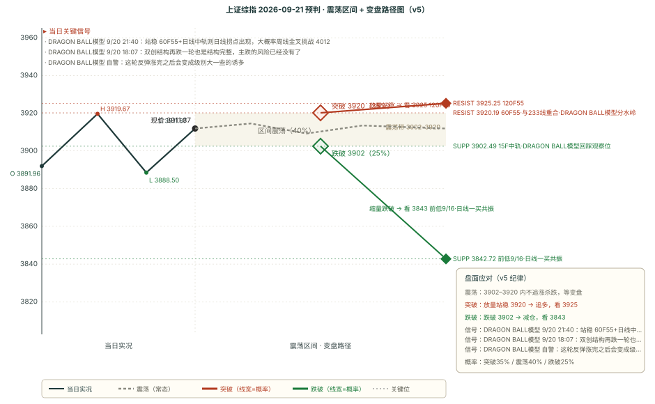

# 作战报告 · 收盘 · 2026-09-18（周五）

> 档位：收盘（close）｜星球窗口：2026-09-18 12:30 ~ 20:00（21 条）｜数据时点：09-18 20:10
> 本档手动触发（20:10 落链）；本期先复盘 9/18-morning 四维并完成 OBS 三问自检，再补判 9/17-close 支撑/压力两维，最后追加 9/21 预判

---

## 核心主线速览（三行）

1. **上证高开单边放量收 3912（+0.94%）**：成交 2.09 万亿环比 +13.96%，成长领涨（科创50 +2.89% / 创业板 +2.25%），仅玻璃玻纤、国有大行等极少数收跌。
2. **DRAGON BALL模型 午后转「中性偏强」**：站上 60F 中轨「排除了最坏的假设」，回踩 15F 中轨重置后突破 60F55，新低 3741 可能性很小。
3. **上期「偏空」被证伪（四维 1 命中 1 部分 2 失效）**；本期转「方向不明」（v5 **+1**），核心带 **3890-3922**。

---

## 第一块 星球信息（知识星球收盘快报 · 21 条窗口内）

> 卫斯李 4 条 + 基业长青 9 条 + 180K 6 条 + DRAGON BALL模型 2 条 + 大鹏鸟 1 条；短评&信息本窗口内无更新，说明见附录 A
> 本块只做「事实落地」，结论层推导统一放第二块与第四块

### 一、核心主线（按强度排序）

#### 1. DRAGON BALL模型 午后转「中性偏强」：站上 60F 中轨排除最坏假设

- **DRAGON BALL模型 12:46**：上午站上 60F 中轨「显然排除了最坏的假设」，3F/5F 中轨支撑、来到 60F55 附近；「正常预期会回踩 15F 中轨，这是中性偏强的走势，15F 中轨重置后再去突破 60F55」；若 15F 中轨跌破则回 3995 以来的 60F 第五段调整（可衰竭），**「新低 3741 的可能性很小了」**。
- **游资情绪（DRAGON BALL模型 14:13）**：沈鼓周末不监管，「其他那些 100%、200% 的监管都扯淡」，前面盟固利、合合信息、无线传媒没有这个监管环境——提示监管环境变化对高标股炒作的影响。

#### 2. 上证放量反弹、成长风格切换：科创50 +2.89% 领涨

- **高盛中国收盘综述**：上证 +0.94%、科创50 +2.89%、创业板指 +2.25%、沪深300 +1.06%、上证50 +0.58%、中证500 +1.89%；**两市成交额 2.09 万亿（环比 +13.96%）显著放量**。
- **高盛香港午盘**：恒生 +0.7%、恒生科技 +1.7%，「一轮由科技股引领、宏观因素驱动的纾困反弹，并非全面风险偏好抬升」。

#### 3. 亚洲科技+AI 领涨：英伟达半导体 + 华为供应链 + 富时再平衡

- 亚洲市场普遍走高，科技与 AI 领涨亚太，得益于英伟达带动的半导体走强 + 华为供应链最新进展；富时指数再平衡资金流额外提振。韩国、中国台湾、日本、中国、香港均显著上涨，资金轮动至半导体、AI 基础设施及科技龙头。

#### 4. 人形机器人供应链分歧：伯恩斯坦挑战谐波减速器必要性

- **伯恩斯坦**：随着机器人智能对机械精度补偿作用增强，谐波减速器必要性可能被严重高估——给予双环传动（002472）跑赢大盘评级（目标价 60 元），绿的谐波（688017）跑输大盘评级。这是机器人供应链的首条反向变量。

#### 5. 房地产中期供给缺口：2027 年 3 月起 12-18 个月显著缺口

- **高盛房地产电话会**：短期供给暂稳、中期（2027 年 3 月起）12-18 个月显著供给缺口、长期（2030 年）量价有望企稳；房产税推出需等市场完全修复。行业格局加速分化，中端国企及强区域性本土房企成最大受益者。9/18 房地产开发 +3.44% 领涨，与该叙事同向。

### 二、DRAGON BALL模型 午后定调（12:46 + 14:13）

> 原文已一字不差归档至 `outputs/DRAGON_BALL_原始记录_2026-09-18.md`（第 [1][2] 条）

- **转向中性偏强**：站上 60F 中轨「排除了最坏的假设」，主路径是「回踩 15F 中轨重置后突破 60F55」，防守路径是「跌破 15F 中轨 → 回 60F 第五段调整（可衰竭）」。
- **关键背书**：「新低 3741 的可能性很小了，因为多级别主跌套娃在今天站上 60F 中轨后的概率已经很低了」——这是 DRAGON BALL模型 自 9/17 偏空定调后的明确转多。

---

## 第二块 信息判断（跨星球观点对比 + 共识复盘）

### 一、跨星球观点对比

#### 共同观点（结论式，细节见第一块）

1. **外部流动性压力边际缓解**——隔夜美股齐涨（纳指 +1.7%）、10Y 美债 -7bp 结束八连升，花旗解读日本央行加息、高盛解读美联储加息「放缓而非阻止黄金升势」；跨资产层面「定价过头派」短期占优。
2. **科技+AI 是全球反弹的领涨主线**——英伟达带动半导体 + 华为供应链驱动，亚洲市场（韩/台/日/中/港）资金一致轮动至半导体、AI 基础设施、科技龙头。
3. **A 股风格切换至成长**——科创50 +2.89%、创业板 +2.25% 领涨，上证50 +0.58% 最弱；高盛明确「纾困反弹、非全面风险偏好抬升」。

#### 相反观点：次日（9/21）方向是「突破 60F55」还是「高位震荡」还是「回踩调整」？

**方向一 · 突破 60F55（偏多）**

- DRAGON BALL模型 12:46 主路径「回踩 15F 中轨重置后突破 60F55」，站上 60F 中轨已排除最坏假设。
- 技术面修复：日线 DIF 首次拐头向上、收盘站上日线 MA55 3910.01、60F 三卖被突破失效、120F 金叉、放量 2.09 万亿。

**方向二 · 高位震荡（中性）**

- 15F 高位死叉（短端超买）+ 日线 MA20 3922.42 压制 + 日线 BOLL 仍 72% 看空——大涨后多空信号首次平衡（v5 总分 +1 方向不明），需在 3920-3925 密集带拉锯消化。

**方向三 · 回踩调整（偏空）**

- DRAGON BALL模型 防守路径「跌破 15F 中轨 → 回 60F 第五段调整」；日线 DIF<DEA 空头区未修复，反抽遇阻（v5 第五节纪律）可能触发回踩 3890/3888。但「新低 3741 可能性很小」，回踩幅度有限。

**隐含共识**

- 三家以上机构都把**「速度」而非「水平」当关键**（延续 9/17 的高盛框架），DRAGON BALL模型 的「回踩 15F 中轨」与「逢高不追」在操作层同向——都指向「不做方向性追高、等回踩企稳」。

#### 独立视角

- DRAGON BALL模型 是本轮唯一给出**可执行价位链 + 明确否决条件**的框架：上行突破 60F55（见关键位表）需 15F 中轨（见关键位表）持续支撑，防守位是 15F 中轨，且明确「新低 3741 可能性很小」封了回踩的下限。机构侧（高盛/伯恩斯坦）提供的是中周期定性与行业分歧，无一条落到次日价位。

### 二、上期共识复盘（9/18-morning 共识链 → 9/18 全天验证）

| 共识 | 类型 | 判定 | 说明 |
|------|------|------|------|
| CPO 短期不冲击高端 CCL/PCB 需求 | short | ✅ 兑现 | 半导体 +3.95% 领涨、元件 +0.91%、电子化学品 +2.36%、消费电子 +2.21%——PCB/CCL 从 9/17 杀跌中明显修复，「情绪杀跌是布局窗口」价格兑现 |
| AI 价值来源从训练转向推理 | mid | ✅ 兑现 | AI 产业链全面上涨（半导体/通信设备/IT 服务/软件开发），受益面从硬件扩展到软件/服务，与大摩框架一致 |
| 供给端出清与涨价主线 | mid | ⚠️ 部分 | 安井食品 +6.78% 印证鱼糜提价，但养殖业 +0.35%、食品加工 +1.50% 仅温和上涨，主线未成当日主导 |
| 地缘供给中断累积但价格降温 | short | ⚠️ 部分 | 油服 +0.32%、炼化 -0.12%、煤炭 -0.65% 无地缘异动，「降温」侧延续，但升级侧待跟踪 |
| 美联储路径分歧（低估 vs 定价过头） | short | ⚠️ 部分 | 9/18 大涨 + 隔夜美债回落，「定价过头派」短期占优；德银中期结构论据未决 |

**对立观点复盘**：判定 **✅ 剧本 C 兑现**（站上 60F 中轨并突破 3898.84，名义 30%，非最高）——开盘 3891.96 高开站上 60F 中轨 3879.61，全天最高 3919.67、收盘 3911.87 双双突破 3898.84，DRAGON BALL模型 证伪条件完全兑现。名义最高 A 36%（反抽受压续跌）未兑现（最低 3888.50 未破 3866.89）。**→ OBS-2 第 5 期样本，达「≥5 期」门槛**。

### 三、本期新共识（已追加 consensus_chain，避免重复不展开）

本期新增 5 条（3 条 mid + 2 条 short）：上证放量反弹成长切换／DRAGON BALL模型 午后转中性偏强／亚洲科技+AI 领涨／人形机器人供应链分歧／房地产中期供给缺口。细节见第一块，此处不重复。

---

## 第三块 技术分析（缠论买卖点 + BOLL×缠论变盘）

### 引擎 B：chan-signal 缠论买卖点（五周期）

> 五周期最新价同见现价（见关键位表）

| 周期 | 涨跌 | 趋势 | 中枢位置 | 买点 | 卖点 |
|------|------|------|---------|------|------|
| 日线 | +0.94% | 向下 | 中枢下方（4061.15-4175.35） | 一买@3842.72（conf 0.5，9/16） | — |
| 周线 | +0.61% | 向下 | 中枢下方（3927.85-4034.08） | — | 一卖@3995.18（conf 0.5，9/4） |
| 60分钟 | +0.09% | 向下 | 中枢下方（3927.55-3967.59） | — | 三卖@3891.48（conf 0.75，9/15） |
| 15分钟 | -0.01% | 向上 | 无中枢参考 | — | — |
| 5分钟 | -0.04% | 向上 | 无中枢参考 | — | — |

**关键变化**：60F 三卖@3891.48（conf 0.75）在 9/18 收盘 3911.87 处被**站上其上方 +20.39 点**，**该卖点效力再次被否定**（9/16 曾首次被否定、9/17 恢复、9/18 再否定）——这是本期方向因子由 -1 转 0 的直接原因。

### BOLL×缠论变盘概率（多因子方向打分）

| 级别 | 上涨概率 | 下跌概率 | 方向 | 带宽状态 | 因子数 |
|------|---------|---------|------|---------|--------|
| 15分钟 | 72% | 28% | 看多 | 收口（1.46%） | 5 |
| 60分钟 | 54% | 46% | 中性 | 常态（1.60%） | 5 |
| 120分钟 | 42% | 58% | 偏空 | 常态（3.00%） | 3 |
| 日线 | 28% | 72% | 看空 | 开口（趋势启动，3.51%） | 5 |

**关键轨道**：15F 中轨 3902.49（下方 -0.24%）／60F 中轨 3886.59（下方 -0.65%）／120F 中轨 3907.49（下方 -0.11%）／日线中轨 3922.42（上方 +0.27%）。
**关键变化**：15F 由 9/17 的「36%/64% 看空」**翻转为 72%/28% 看多**、60F 由「19%/81% 看空」翻转为「54%/46% 中性」——短端全面转多；日线仍 72% 看空（中轨 3922.42 压制），为多空分歧的核心。
**强共振**：日线一买@3842.72 与日线 BOLL 下轨 3853.62 强共振（距下轨 0.28%）；60F 三卖 3891.48 与 60F 中轨 3886.59 的共振已因现价站上而解除。

### 关键均线与 MACD（DRAGON BALL模型 55 线体系 + 级别分裂）

> 六周期收盘同见现价（见关键位表）

| 周期 | MA20 | MA55 | DIF | 前值 | DIF 方向 | 区域 |
|------|------|------|-----|------|---------|------|
| 日线 | 3922.42 | 3910.01 | **-9.08** | -10.32 | **向上（首次拐头）** | 空头区 |
| 120F（合成） | 3907.49 | 3925.25 | -10.40 | -15.69 | 向上 | 多头区（金叉成立） |
| 60F | 3886.59 | 3920.19 | -2.19 | -4.05 | 向上 | 多头区 |
| 30F | 3892.34 | 3890.09 | 7.62 | — | 向上 | 多头区 |
| 15F | 3902.49 | 3884.98 | 7.83 | 8.12 | **向下（死叉成立）** | 空头区 |
| 5F | 3910.89 | 3904.45 | 1.40 | — | 向下 | 空头区 |

**级别结构反转（本期核心）**：9/18 大涨后，**长端修复、短端超买**——日线 DIF 首次拐头向上（-10.32 → -9.08，单日 +1.24），收盘站上日线 MA55 3910.01；120F 金叉成立、60F 多头区；但 15F 高位「死叉成立」（DIF 7.83 向下）、5F 向下——短端超买分歧。这与 9/17 的「长端偏空、短端多头」正好**对调**。
**DRAGON BALL模型 55 线体系**：现价已站上 15F55、5F55、日线 MA55 三条，仅 60F55 3920.19、120F55 3925.25 仍在头上——即 DRAGON BALL模型「突破 60F55」是下一个逐级突破的关键。

### 四周期联动 + 区间套

| 周期 | 价 3912 位置 | MA55 | 信号 |
|------|-------------|------|------|
| 日线 | 中枢下方（4061.15-4175.35） | 3910.01（上方，向下，+0.05%） | 一买（9/16 创） |
| 120分钟 | 中枢内部（3915.22-3970.31） | 3925.25（下方，向下，-0.34%） | 一买@3915.22 |
| 60分钟 | 中枢下方（3927.55-3967.59） | 3920.19（下方，向下，-0.21%） | 三卖@3891.48 |
| 15分钟 | 无中枢参考 | 3884.98（上方，向上，+0.69%） | 无 |

**区间套**：日线→120F 弱买／120F→60F 弱卖／60F→15F 无信号——**三条仍全部为「弱」**，级别间无共振。但日线价已**站上 MA55**（+0.05%），是 9 月以来首次；15F 站上 MA55 +0.69%。大周期结构性偏空未变，短端修复进行中。

---

## 第四块 预判（技术预判与复盘）

### 一、上期复盘（9/18-morning → 9/18 全天走势）

| 维度 | 判定 | 说明 |
|---|---|---|
| 方向 | ❌ **相反** | 预判「偏空」（v5 -3），实际收涨 **+0.94%** 且为高开单边上行——开盘 3891.96 高开 +0.42% 直接站上 15F55 与 60F 中轨，全天最低 3888.50 未破 9/17 低点 3866.89。晨报自设偏空触发条件（跌破 3866.89 / 上攻无量）**两条均未触发**，反而放量站上关键位。实际走**剧本 C**（名义 30%，非最高 A 36%） |
| 区间 | ⚠️ **偏移** | 预判核心 3866-3896 / 扩展 3842-3912，实际 3888.50-3919.67：**核心带被向上突破**（收盘破核心上沿 3896 达 +15.87 点），**扩展带上沿 3912.41 被盘中最高 3919.67 突破 +7.26 点但收盘收回其下方 0.54 点**（假突破）。振幅 0.80% |
| 支撑 | ✅ **守住** | 预判主支撑 3842.72，实际最低 3888.50 **未触及**，差 45.78 点（+1.19%）。支撑完全未被测试，下方三级目标（3866.89 → 3842.72 → 3741）一级未启动，属「未触及型守住」 |
| 压力 | ❌ **突破** | 预判主压力 3877.26（15F55），实际开盘 3891.96 即**高开站上 +14.70 点**，收盘站稳上方 +34.61 点——「开盘跳空穿越」的最强突破形态。DRAGON BALL模型 证伪条件「站上 60F 中轨且不跌破」「突破 3898」双双兑现 |

**核心结论**：四维 **1 命中（支撑）+ 1 部分（区间）+ 2 失效（方向、压力）**，为「偏空预判被高开放量上行证伪」的典型样本，与 9/16-morning 高度同构。判定为**可预见**，理由三条（晨报时点均已到手）：① 隔夜外部转暖（纳指 +1.7%、10Y 美债 -7bp、油价两连跌）；② DRAGON BALL模型 9/17 22:17 已给出可验证证伪路径（站上 60F 中轨 / 突破 3898）；③ 15F 带宽 0.65% 极度收口（变盘在即、方向未定）。**根源是 v5 方向打分对「隔夜外部变量」与「短端多头区」的权重为零**。

**机制问题登记（不自动改规则，§八 OBS 表）**：本期按三问逐条作答，登记 ≠ 实装。

| 自检三问 | 本期作答 | 样本变动 |
|---|---|---|
| ① 是否有「触发条件当日可即时验证」的路径被打 0 分？ | **是**（第 2 次）——DRAGON BALL模型 本期「条件性双向」被打 0 分，但其「站上 60F 中轨」「突破 3898」当日开盘即验证，实际走剧本 C | OBS-1 = 2 次 |
| ② 实际主导剧本是否非名义概率最高者？ | **是**（第 5 期）——名义最高 A 36%，实际主导 C（30%），完全兑现 | OBS-2 = 5 期（**达门槛**） |
| ③ 是否有量能极值/带宽收口等前兆信号未入方向权重？ | **否**——15F 带宽 0.65% 已在晨报显式识别，属「收口已计入、但方向判错」，不同于「未计入」 | OBS-3 维持 1 次 |

### 二、9/17-close 补判（静态初验 → 收盘验证）

> 9/17-close 的 review 原为「开盘前静态初验」（仅方向 ⚠️ / 区间 ✅，支撑/压力 ⏳ 待判、actual 缺 OHLC），本档收盘后补判：

| 维度 | 静态初验 | 收盘验证（本档补判） |
|---|---|---|
| 方向 | ⚠️ 部分（偏空结构成立） | ❌ **相反**（预判偏空 v5 -4，实际 +0.94%，偏空四因子在收盘后被证伪） |
| 区间 | ✅ 守住（基准价落带内） | ⚠️ **偏移**（核心带被向上突破 +15.87 点，扩展带上沿盘中破但收盘收回） |
| 支撑 | ⏳ 待判 | ✅ **守住**（3842.72 未触及，差 45.78 点，DRAGON BALL模型 下行路线图全程未激活） |
| 压力 | ⏳ 待判 | ❌ **突破**（3877.26 被高开穿越 +14.70 点，上行分水岭与证伪位双双兑现） |

**actual 已回填**：9/18 O 3891.96 / H 3919.67 / L 3888.50 / C 3911.87（+0.94%）。**bias_type**：`["方向标签失真", "区间上沿破位", "压力位突破"]`；**foreseeable**：可预见。

### 三、偏差观察统计表（51 期 · v5 配对计数 · 截止 2026-09-18 20:10）

| 维度 | 命中 | 部分 | 失效 | 纯命中率 | 含部分 |
|------|------|------|------|---------|--------|
| 方向 | 28 | 17 | 6 | **54.9%** | 71.6% |
| 区间 | 18 | 30 | 3 | **35.3%** | 64.7% |
| 支撑 | 34 | 7 | 10 | **66.7%** | 73.5% |
| 压力 | 29 | 11 | 11 | **56.9%** | 67.6% |

**本期变化**：9/18-morning 复盘（方向❌/区间⚠️/支撑✅/压力❌）+ 9/17-close 补判（同构四维）计入，样本 49→51 期。方向失效 +2（57.1% → **54.9%**）、区间部分 +2、支撑命中 +2、压力失效 +2（59.2% → **56.9%**）。

**结构未变**：支撑（66.7%）> 压力（56.9%）> 方向（54.9%）> 区间（35.3%）。**区间维连续 51 期垫底**。方向维连续两期（9/17-close、9/18-morning）在「偏空」上反向，方向失效累计至 6 次——**方向维「失效」类已连续 ≥3 次（规律已现），但按第六节纪律仅标注观察、不自动改规则**。

**bias_type 三分类观察（截至 51 期，本期已计入）**：

| 真偏差类 | 累计 | 规律化 |
|---------|------|--------|
| 压力位突破（含短暂突破后收回） | 13 | ✅ 规律已现（≥3） |
| 支撑跌破 | 11 | ✅ 规律已现（≥3） |
| 区间下沿/上沿破位 | 9 | ✅ 规律已现（≥3） |
| 方向错误/相反 | 6 | ✅ 规律已现（≥3） |

> 本期新增 `['方向标签失真', '区间上沿破位', '压力位突破']`（9/18-morning 与 9/17-close 各一份）。注意：本期「压力位突破」是「开盘跳空穿越 + 全天站稳」的真突破（收盘 +34.61 点），与「压力位短暂突破」的假突破形态不同，但同归「压力位突破」真偏差类。

### 四、本期预判（9/21 周一）

#### 一句话预判

> **方向不明（v5 +1，偏多倾向略占优），核心带 3890-3922**。日线 DIF 首次拐头、站上 MA55、60F 三卖失效、DRAGON BALL模型 转中性偏强；但日线 BOLL 仍 72% 看空、MA20 压制、15F 高位死叉。剧本 A 35%／B 40%／C 25%。

#### 完整预判字段

| 字段 | 内容 |
|---|---|
| **方向** | 方向不明（v5 总分 **+1**：买卖点 0 + DRAGON BALL模型 +1 + BOLL 变盘 -1 + MACD DIF 拐头 +1） |
| **区间** | 3890-3922（核心 32 点，30F55 ~ 日线 MA20/中轨）/ 3843-3926（扩展 83 点，前低 ~ 120F55） |
| **支撑/压力** | **见下方「关键位相对现价」表**——主支撑 = 前低 3842.72（日线一买+日线下轨共振），主压力 = 60F55 3920.19（DRAGON BALL模型 分水岭） |
| **置信度** | **低**——多空信号首次平衡（方向不明），偏多信号在累积但日线空头区未修复、15F 高位死叉 |

#### v5 打分明细

- **买卖点因子（0）**：60F 三卖@3891.48（conf 0.75）——9/18 收盘 3911.87 站上其上方 +20.39 点，**效力再次被否定** → 该卖点不计分；15F 无信号；日线一买不进方向分 → **0**
- **DRAGON BALL模型 定调（+1）**：9/18 12:46「中性偏强」——站上 60F 中轨「排除了最坏的假设」，回踩 15F 中轨后突破 60F55，新低 3741 可能性很小 → **+1**
- **BOLL 变盘概率（-1）**：日线涨 28% / 跌 72%（偏离 22pct，越 15pct 阈值 → -1）；60F 54%/46%（偏离 4pct，不计）→ **-1**
- **MACD DIF 拐头（+1）**：日线 -10.32 → **-9.08**（单日 +1.24，首次拐头向上）→ **+1**
- **总分：0 +1 -1 +1 = +1 → |1|≤1 → 方向不明**（偏多倾向略占优，不硬猜方向）

> ⚠️ 附注一：本期是 9 月首次「方向不明」——9/18 大涨后多空信号首次平衡（DRAGON BALL模型 转多 + MACD 拐头 vs 日线 BOLL 看空 + 空头区未修复），按 v5 第二节诚实判「方向不明」而非硬猜。
> ⚠️ 附注二：本报告全篇执行「信息原子唯一落地」——关键价位统一在下方表中完整落地一次，其余处用整数或指针引用。

#### 剧本概率与触发条件

| 剧本 | 概率 | 触发条件 |
|------|------|---------|
| **A 回踩 15F 中轨后突破 60F55** | **35%** | 回踩 3902.49（15F 中轨）不破 → 突破 3920.19（60F55）。佐证：DRAGON BALL模型 主路径 + 日线 DIF 拐头延续 |
| **B 带内高位震荡** | **40%** | 15F 高位死叉 + 日线 MA20 3922.42 压制，多空在 3902-3922 拉锯。佐证：方向不明 + 日线 BOLL 看空 |
| **C 跌破 15F 中轨回踩调整** | **25%** | 跌破 3902.49（15F 中轨）→ 回 60F 第五段调整。佐证：DRAGON BALL模型 防守路径 + 日线空头区反抽纪律 |

#### 关键操作纪律与开盘观察

**纪律（6 条）**

1. **3902（15F 中轨）= 回踩观察位**——DRAGON BALL模型「正常预期会回踩 15F 中轨，重置后再突破 60F55」，回踩不破是偏多延续前提。
2. **3920（60F55）= 分水岭**——DRAGON BALL模型「突破 60F55 应当 15F 中轨持续支撑」，有效突破才谈上行升级。
3. **跌破 3902（15F 中轨）→ 回 60F 第五段调整**——但该调整「可以衰竭」、新低 3741 可能性很小，不恐慌追空。
4. **日线空头区反抽纪律（v5 第五节）**——空头区里 60F 站上 MA55 属「反抽遇阻」，只有「有效站稳 + 日线 DIF 继续拐头」才确认翻多，否则逢 3920-3925 减仓。
5. **低位纪律（DRAGON BALL模型 一贯取向）**——「博弈超跌背离胜率高」，成本思维买点放在回踩 3890-3902 企稳处，不在 3920 上方追高。
6. **不主张单边重仓**——方向不明 + 15F 高位死叉，单边押注应在收盘确认后再加。

**开盘后重点观察（4 项）**

1. **3920-3925 密集带能否被收盘站上**——站上则日线 DIF 拐头延续、A 剧本升级；受压则 B 剧本确认。
2. **回踩 3902（15F 中轨）是否跌破**——不破则 DRAGON BALL模型 主路径成立；跌破则 C 剧本激活。
3. **量能能否守住 2 万亿量级**——2.09 万亿放量后若快速萎缩，B 剧本权重上升。
4. **日线 DIF 拐头能否延续**——是「翻多确认」的唯一观察点，拒绝继续拐头则反抽遇阻。

#### 关键位相对现价（现价 3911.87）

| 关键位 | 价格 | 相对现价 | 属性 | 依据 |
|---|---|---|---|---|
| 日线 BOLL 上轨 | 3991.23 | +2.03% | 压力（远期） | 日线 BOLL 上轨，开口向下 |
| 120F BOLL 上轨 | 3966.03 | +1.38% | 压力 | 120F BOLL 上轨 |
| **120F55（合成）** | **3925.25** | **+0.34%** | **压力** | 密集压力带上沿 |
| **日线 MA20 / BOLL 中轨** | **3922.42** | **+0.27%** | **压力（决策）** | 日线 BOLL 中轨，72% 看空来源 |
| **60F55（DRAGON BALL模型 分水岭）** | **3920.19** | **+0.21%** | **压力（主压力）** | DRAGON BALL模型「突破 60F55」逐级突破关键 |
| 9/18 高点 | 3919.67 | +0.20% | 压力 | 9/18 最高 |
| **现价** | **3911.87** | **0.00%** | — | 9/18 收盘 |
| 日线 MA55 | 3910.01 | -0.05% | 支撑（贴身） | 刚站上，首个回踩检验 |
| 5F55 | 3904.45 | -0.19% | 支撑 | 短端均线 |
| **15F 中轨（DRAGON BALL模型 回踩观察位）** | **3902.49** | **-0.24%** | **支撑（结构）** | DRAGON BALL模型「回踩 15F 中轨重置」 |
| 30F55 | 3890.09 | -0.56% | 支撑 | 短端均线 |
| 9/18 低点 | 3888.50 | -0.60% | 支撑 | 9/18 最低 |
| 15F55 | 3884.98 | -0.69% | 支撑 | 短端均线 |
| 日线 BOLL 下轨 | 3853.62 | -1.49% | 支撑 | 日线 BOLL 下轨 |
| **前低（9/16）** | **3842.72** | **-1.77%** | **支撑（主支撑）** | 前低 + 日线一买 + 日线下轨三重共振 |

---

## 附录 A 抓取通道信息

**抓取窗口**：2026-09-18 12:30 ~ 20:00（`--window afternoon`）

| 通道 | 工具 | 星球 | 本期条数 | 备注 |
|---|---|---|---|---|
| 通道 A（Skill/zsxq-cli） | `zsxq-cli` | 卫斯李的投研笔记 | 4 | 花旗日本央行、高盛美联储加息与黄金、高盛美股盈利非泡沫、周六直播预告 |
| 通道 A | `zsxq-cli` | ⭕ 基业长青+ | 9 | 高盛中国收盘综述、高盛香港午盘、高盛房地产电话会、伯恩斯坦人形机器人、宏昌电子、富信科技、禾元生物、亚洲市场交易台 |
| 通道 A | `zsxq-cli` | DRAGON BALL模型 | 2 | 12:46 午后定调 + 14:13 游资情绪（原文一字不差归档） |
| 通道 B（Cookie 直连） | api.zsxq.com | 180K Research | 6 | flow show / 本土小结 / 韩国小结 / 亚洲小结 / 本土设备+ASML+Agentic AI |
| 通道 B | api.zsxq.com | 大鹏鸟笔记 | 1 | 午间总结 |
| 通道 B | api.zsxq.com | ⭕ 短评&信息 | 0 | 本窗口内无更新 |
| 通道 B | api.zsxq.com | AI 产业链地图·Serenity速报 | 0 | 本窗口内无更新 |
| **合计** | | | **21** | **图片 20 张 / 附件 6 个** |

**数据完整性说明**：
- ✅ **通道 B 正常**——180K 6 条、大鹏鸟 1 条均可抓，短评&信息与 AI 产业链地图本窗口零帖子，与其历史活跃度一致，**非抓取故障**。
- 凭证文件路径 `.workbuddy/zsxq_cookie.txt`（不入 git，**严禁跨机拷贝**）。

---

## 附录 B 星球代号对照表

> 正文直接表达观点，不出现星球代号；本附录仅供回溯

| 代号 | 星球 | 内容侧重 | 抓取通道 |
|---|---|---|---|
| 星球 ① | 卫斯李的投研笔记 | 美银/瑞银/大摩/德银/巴克莱/花旗海外研报、宏观、地缘 | A (zsxq-cli) |
| 星球 ② | ⭕ 基业长青+ | 高盛/大摩/摩根大通卖方研报、产业链专家、基金经理调查 | A (zsxq-cli) |
| 星球 ③ | DRAGON BALL模型 | 缠论复盘、60F 极弱/极强判定、级差传导、游击战思路 | A (zsxq-cli) |
| 星球 ④ | 大鹏鸟笔记 | 盘前热榜、游资观点、午间总结、晚盘总结 | B (Cookie) |
| 星球 ⑤ | ⭕ 短评&信息 | 短评、突发信息 | B (Cookie) |
| 星球 ⑥ | 180K Research | 外资研报、科技周报、算力专题 | B (Cookie) |
| 星球 ⑦ | AI 产业链地图·Serenity 速报 | 白毛日报、CW-WDM 联盟、海外算力链 | B (Cookie) |
| 星球 ⑧ | 信息平权 | 资讯平权 | B (Cookie) |
| 星球 ⑨ | 投行圈子 | 投行视角 | B (Cookie) |
| 星球 ⑩ | 口罩哥 | 口罩哥专享 | B (Cookie) |

---

## 产物清单

| 路径 | 类型 | 说明 |
|---|---|---|
| `outputs/作战报告_收盘_2026-09-18.md` | Markdown 报告 | 本文件（四块齐全 + 附录 A/B + 产物清单） |
| `outputs/作战报告_收盘_2026-09-18.html` | HTML 报告 | 浏览器预览版 |
| `outputs/DRAGON_BALL_原始记录_2026-09-18.md` | 原文归档 | DRAGON BALL模型 3 条一字不差归档（晨报 1 + 收盘 2） |
| `outputs/000001_四周期联动_2026-09-18.json` | 引擎产物 | 四周期联动 + 区间套判定 |
| `.workbuddy/zsxq_fetch_raw.json` | 原始数据 | 21 条窗口内星球内容 |
| `.workbuddy/forecast_chain.json` | 预判链 | 52 条（51 verified + 1 pending 9/18-close） |
| `.workbuddy/consensus_chain.json` | 共识链 | 21 条（20 verified + 1 pending 9/18-close） |
| `.workbuddy/_bias_2026-09-18_close.json` | 偏差统计 | 51 期四维偏差数据（程序化导出） |
