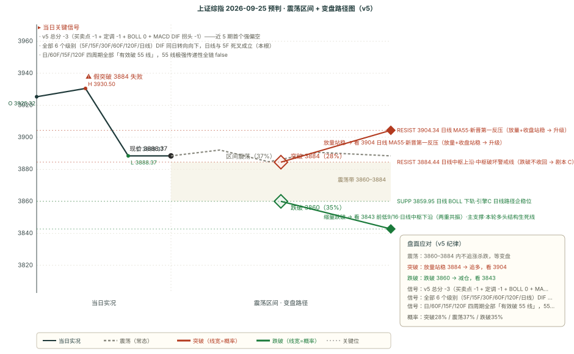

# 作战报告 · 收盘 · 2026-09-24（周四）

> 档位：收盘（close）｜星球窗口：2026-09-24 12:30 ~ 17:27（26 条）｜数据时点：09-24 17:30
> 本档手动触发（17:30 落链）；本期先复盘 9/24-morning 四维并完成 OBS 三问自检，再追加 9/25（节前最后一个交易日）预判

---

## 核心主线速览（三行）

1. **上证低开单边收 3888（-1.22%），收盘即全天最低**：成交创近 5 日新低，跌破全部短期均线与日线 MA55，跌入日线中枢内部；成长全线领跌，仅银行/电力收涨（防御性配置）。
2. **晨报「剧本 C」当日完整兑现**：晨报指定的考验位被大幅击穿 36 点，「调整延续到节后」条件分支成立；全部 6 个级别 DIF 同日向下，日线死叉成立。
3. **本期转「偏空」（v5 -3，近 5 期首个强偏空）**，核心带 3860-3912，主支撑前低 3842.72（-1.17%）；**OBS-3 累计 3 次达门槛，本期正式提请拍板**。

---

## 第一块 星球信息（知识星球收盘快报 · 26 条窗口内）

> 卫斯李 15 条 + AI 产业链地图 4 条 + 基业长青+ 3 条 + DRAGON BALL 2 条 + 大鹏鸟 1 条 + 180K 1 条；短评&信息本窗口内无更新，说明见附录 A
> 本块只做「事实落地」，结论层推导统一放第二块与第四块

### 一、核心主线（按强度排序）

#### 1. GS China Midday：跌破全部短期均线、节前获利了结、防御性配置

- **盘面（11:59 午间时点）**：上证 -0.93%、创业板指 -1.84%、中证500 -1.63%、科创50 -1.53%、沪深300 -1.29%、上证50 -1.14%；总成交 1.08 万亿（环比 -7.69%），预计全天略高于 1.6 万亿。
- **三个定性**：① **上证已跌破 10 日、20 日和 60 日均线**（技术面推波助澜）；② **本地投资者长假前获利了结**；③ **银行和电力设备是唯一收涨板块——防御性配置特征**。
- **资金流**：1.2x better to Sell（卖出力度为买入 1.2 倍）；**买公用事业与医疗保健，卖 PCB 与 CPO**。
- **中美**：两个月贸易延期使短期预期偏向悲观。
- ⚠️ 该内容在基业长青+（14:07 文字版）与 180K（17:10 图片版）跨星球重复挂载，本档按唯一信息原子落地。

#### 2. DRAGON BALL 盘后短讯：一句发问指向「下跌衰竭」

- **15:54**「1」＋ **15:55「还创业板日线底背离吗」**——收盘后无新定调，唯一发问指向创业板日线底背离（价格新低而 MACD 动能不新低的下跌衰竭结构）。创业板指今日 -1.84% 领跌主要指数，该发问是全市场破位声中唯一可能的对冲性技术视角。

#### 3. AI 硬件链研报侧继续量化紧缺（与盘面资金撤离背离）

- **德福专家调研更新（0924，基业长青+ 13:03）**：锂电铜箔加工费普涨 1000-2000 元/吨（约 10%）**已在 C 处完成涨价落地**；三季度无新增有效产能 + 新产能切往 HVLP → 锂电铜箔大概率维持紧平衡、或继续涨价；月均 HVLP 出货看向 1000 吨（明年 Q1 大概率突破），HVLP4 占比提升——**重申「锂电铜箔价升 + PCB 铜箔量升」的戴维斯双击**。
- **AI 产业链地图（4 条）**：
  - **伯恩斯坦·长鑫存储首覆**：跑赢行业、目标价 70 元（现价 55.54 元，上行约 26%）；预计晶圆产能从约 30 万片/月增至 2028Q4 的 53 万片/月（+75%，**超过美光**、占全球 DRAM 晶圆产能约 19%，全球第三）；中国 DRAM 自给率 42% → 58%。
  - **瑞银·三星电子**：3Q26 营业利润 117 万亿韩元，**超市场预期 6%**；DRAM 混合 ASP 环比 **+27%**（此前预测 +23%）；客户存储需求无下调迹象；现价对应 1.82x NTM PB 未反映 33.8% 长期 ROE。
  - **伯恩斯坦·阿里巴巴**：**首次以 GW 为单位给出 2032 年 20GW AI 数据中心容量指引**；假设 25-30% 自用，对应 2032 年收入目标 1700-1800 亿美元（此前 2030 年目标 1000 亿）；云栖大会重心从前沿模型转向算力基础设施。
  - **纳真科技深度**：光模块老兵转型——数通收入占比从 1/4 升至近七成，靠产品升级单价上涨而非放量；全球专业光模块厂第五、中国市场第三。

#### 4. AI 代理叙事从消费者推进到商业端（卫斯李 4 条接力）

- **高盛「步入商业领域的智能体 AI 时代」**：对话式智能体画布已被全球超 10 亿消费者采用，端到端智能体购物将**稳步、审慎推进（3-5 年以上）**，类比电商自身发展而非一夜颠覆。
- **大摩「Muse 和 Instinct 爆火，谁最受益」**：消费者端 AI 代理降低互动门槛 + 企业端降低响应成本 → 扩大通信量，通信软件（客服互动/网络展示服务商）是早期受益者。
- **美银「消费者 AI 代理已至，如何重塑互联网行业」**：AI 代理代表用户自主执行任务，「AI 交易」主题有望重燃。
- **大摩第六次 AI 主题映射（约 3600 只股票）**：领涨格局正进入新阶段——**从集中于「赋能者」拓展为「赋能者 + 新兴应用者」的哑铃型组合**；科技周期「先半导体、后基础设施、最后软件和服务」的轮动规律正在 AI 行情中重演。

#### 5. 海外宏观与商品（卫斯李其余条目，速览）

- **巴克莱「保持选择性风险偏好」**：债券收益率攀升、央行紧缩、油价 >100 美元——头条利于防守，但**三大回报驱动力（美企盈利 +30%、AI 投资周期、美国消费者）完好甚至更强**，奖励保持投资而非躲进现金。
- **大摩「美国柴油出口禁令……假如成真会怎样」**：昨日的 90 天出口禁令报道进入推演阶段（白宫筹备中、能源部长公开反对）。
- **高盛铜/白银/铂族金属**：精炼铜关税决策未定，关税不确定性或将持续。
- **巴克莱法国大选**：OAT 与欧元的政治风险（Le Pen 10 月公布经济计划为首个催化剂）。
- **摩根大通**：中期选举十大主题（油价冲击、更高利率维持更久）；美国储蓄率加速下滑、消费「韧性」持续性存疑。
- **花旗**：日债收益率曲线趋平驱动增长回归（日央行 9/18 加息 25bp 至 1.25% 的再解读）。
- **高盛美股盘前（补发）**：半导体走强、台积电蓄势突破、「智能体革命已然到来」。

#### 6. 其他

- **大鹏鸟午间总结（12:33）**：「跟随老美跳水。整体不强，投机线华字辈最强……容量模式今天没机会，领头的先导位置太高，且今天氛围也不太行。**轻仓国节吧**。」——连续第四个时点维持「轻仓过节」。
- **玖龙纸业（基业长青+ 17:17）**：FY26 经营利润大幅增长（FY26H2 归母 16.15 亿元处盈喜上限）、包装纸资本开支尾声、FY27 恢复正常派息、南美林地有望注入——行业个股信息，非指数级证据。
- **180K 中港交易台（17:10）**：本土午间 3 图（GS China Midday 图文版，与主线 1 同源，已去重）。

---

## 第二块 信息判断（跨星球观点对比 + 共识复盘）

### 一、跨星球观点对比

#### 共同观点（结论式，细节见第一块）

1. **节前抛压当日兑现为单边下跌**——GS「获利了结」+ 大鹏鸟「轻仓过节」（连续第四时点）+ 实测成交 4.385 亿手创 5 日新低，三方证据在当日闭环；银行/电力设备唯一收涨的防御性结构与之互证。
2. **AI 硬件链「研报看多、资金卖出」的背离连续第三期**——研报侧德福涨价落地/长鑫 70 元/三星 ASP +27%/阿里 20GW 继续量化紧缺；盘面侧 GS 1.2x sell、**卖 PCB 与 CPO**、半导体领跌——资金流是比研报密度更即时的定价信号。
3. **AI 代理叙事一日内从「消费者拐点」推进到「商业端与基础设施」**——高盛/大摩/美银/大摩四家接力，大摩哑铃型框架给出「赋能者 + 应用者」的轮动地图；但 A 股计算机/传媒继续领跌，全球叙事与 A 股 AI 应用股价仍「研报先行、股价未动」。

#### 相反观点：明日（9/25 节前最后一日）是「缩量磨底」还是「破位下探」还是「超跌反弹」？

**方向一 · 缩量磨底（B 侧，名义 37%）**

- 量能已创 5 日新低，想卖的昨今两日已卖，抛压边际衰减；大鹏鸟「轻仓过节」意味着仓位已降；节前最后一日通常无新信息驱动。
- 单日超卖（15F DIF -12.04 本轮最深）后技术性企稳需求客观存在。

**方向二 · 破位下探（延续偏空）**

- 结构刚破位：日线中枢上沿 3884.44 距现价仅 3.93 点，「中枢内弱势」与「中枢下破」一纸之隔；全部 6 个级别 DIF 同向向下 + 四周期全部有效破 55 线，全级别共振下「磨底」缺乏结构支撑。
- DRAGON BALL 条件分支「大幅击穿 60F 中轨 → 调整延续到节后」刚兑现，趋势惯性未走完；外围 10Y 美债维持 5.1% 上方，压制未解除。

**方向三 · 超跌反弹（反向）**

- 15F 深度超卖 + DRAGON BALL 创业板日线底背离发问——若创业板率先形成底背离/金叉，超跌反弹的原料在累积；大摩哑铃型的「应用者接棒」若成立，超跌的应用侧先获弹性。
- 但反弹在趋势结构里的定位是「反抽」（v5 第五节：日线空头区里反抽至 55 线 = 遇阻信号），须「放量 + 收盘站稳 3904 + 日线 DIF 拒绝死叉」三证齐全才升级。

**隐含共识**

- 三条方向在操作层收敛于同一套**触发条件决策**（3884.44 得失 / 3904 收复与否 / 量能配合度），而非概率排序——这与 OBS-2 七期「实际主导非名义最高」的偏离史一致。

#### 独立视角

- **DRAGON BALL 的「创业板日线底背离」发问**是本档唯一不与「偏空」同向的独立视角：它不否认下跌，而是在寻找「下跌衰竭」的证据（底背离 = 动能背离）。该视角可被客观验证（创业板 MACD 是否金叉），构成明日盘面的一个确定性观察点。
- **巴克莱的「保持投资状态」**与跨星球一致的「轻仓过节」构成时间尺度对立（中期三驱动 vs 短期避险），与晨报对立第 3 组同构，延续未决。

### 二、上期共识复盘（9/24-morning 共识链 → 9/24 全天验证）

| 共识 | 类型 | 判定 | 说明 |
|------|------|------|------|
| AI 硬件链实物紧缺密集量化（InP/1.6T DSP/HVLP/T 布/光纤） | mid | ⏳ 跟踪中 | 产业口径继续加码（德福涨价落地/长鑫/三星/纳真），但盘面逆向（GS 卖 PCB/CPO、半导体领跌）——研报与盘面背离连续第三期，不因单日证伪 |
| 存储链三重印证（海力士/长鑫 G5/供给约束） | mid | ⏳ 跟踪中 | 新增瑞银三星（ASP +27% 超预期）与伯恩斯坦长鑫 70 元两条独立印证——产业侧扩展为五源；盘面存储跟随半导体领跌，景气与股价时滞拉长 |
| 全球长端利率重新定价（10Y 5.11%、加息概率 69%） | mid | ✅ **兑现** | 「折现率抬升压制高估值成长」当日完整兑现：-1.22%、创业板 -1.84% 最大跌幅、成长全线跑输、银行/电力唯一收涨（防御切换）、GS 1.2x sell |
| 柴油出口禁令（白宫拟 90 天） | mid | ⏳ 跟踪中 | 大摩发布「假如成真」推演（16:56），事件未落地（能源部长反对、白宫称假新闻）；事件事实类无当日可裁决指标 |
| 消费级 AI 代理拐点（Muse 登顶） | mid | ⏳ 跟踪中 | 四家投行一日接力加码（高盛商业智能体/大摩 Muse/美银代理/大摩哑铃型）——叙事发酵中；A 股应用股继续领跌，叙事与股价两层 |
| 超大规模云厂商 Q2 分化（谷歌逼近微软/甲骨文 RPO） | short | ⏳ 跟踪中 | 新增伯恩斯坦阿里 2032 年 20GW 指引（对应 2032 收入 1700-1800 亿美元）——与晨报综述同源延续，无当日裁决指标 |
| 国内机构节前定调：轻仓过节 + 结构性机会 | short | ✅ **兑现** | 「轻仓过节 + 节前缩量」当日完整验证：大鹏鸟第四时点同向 + GS「获利了结、成交萎缩」+ 实测 5 日新低量能；晨报对立第 3 组预告的「A 侧与 C 侧不互斥——缩量下跌完全可能」正是今日形态 |

**对立观点复盘**：判定 **✅ 剧本 C 兑现**（跌破 60F 中轨 3924.46 与周线中枢下沿 3927.85 双重身份带，名义 28%，**三剧本最低**）——晨报剧本 C 的全部触发条件（15F 带宽向下开口、放量/获利了结盘面、10Y 维持 5.10% 上方）逐条吻合，且为「大幅击穿」（-36.09 点）。名义最高 B 37%（3924-3942 震荡）未兑现。**→ OBS-2 样本按标的日去重累计 7 期**（9/24 计 1 期）。

### 三、本期新共识（已追加 consensus_chain，避免重复不展开）

本期新增 4 条（1 条 short + 2 条 mid + 1 条 short）：节前抛压单边兑现闭环／AI 硬件「研报-资金」背离第三期／AI 代理叙事推进到商业端／DRAGON BALL 创业板底背离发问（唯一对冲性视角）。对立 3 组：研报侧 vs 资金侧／超跌反抽 vs 趋势延续／磨底 vs 下探。细节见第一块与 consensus_chain，此处不重复。

---

## 第三块 技术分析（缠论买卖点 + BOLL×缠论变盘 + 四周期联动）

### 引擎 B：chan-signal 缠论买卖点（五周期）

> 现价 3888.37（9/24 收盘，-1.22%）

| 周期 | 涨跌 | 趋势 | 中枢位置 | 买点 | 卖点 |
|------|------|------|---------|------|------|
| 日线 | -1.22% | 向上 | **中枢内部**（3842.72-3884.44） | — | 一卖@3967.68（conf 0.8，9/22） |
| 周线 | -0.60% | 向下 | **中枢下方**（3927.85-4034.08） | — | 一卖@3995.18（conf 0.5，9/4） |
| 60分钟 | -0.16% | 向下 | 中枢下方（3927.55-3967.59） | — | 三卖@3891.48（conf 0.75，9/15） |
| 15分钟 | -0.14% | 向下 | 无中枢参考 | — | — |
| 5分钟 | -0.07% | 向下 | 无中枢参考 | — | — |

**关键变化（本期核心）**：① **现价跌入日线中枢内部**——晨报时在中枢上方 +53.80 点，收盘 3888.37 距中枢上沿 3884.44 仅 +3.93 点；② **跌入周线中枢下方 39.48 点**（晨报距下沿仅 +8.67 点）；③ **60F 三卖@3891.48 效力恢复**——晨报被现价站上 +45.04 点否定计 0，今日收盘跌回其下方 3.11 点，三卖重新成立且当日兑现；④ 五周期定性由晨报「日/周/60F 向上 + 15F/5F 向下」的镜像结构**当日瓦解**为「日线（中枢内）+ 周/60F/15F/5F 向下」。

### BOLL×缠论变盘概率（多因子方向打分）

| 级别 | 上涨概率 | 下跌概率 | 方向 | 带宽状态 | 关键依据 |
|------|---------|---------|------|---------|---------|
| 15分钟 | 28% | 72% | 看空 | **常态（1.67%，已开口）** | 中轨下方 -1，中轨下行 -2，趋势向下 -2 |
| 60分钟 | 46% | 54% | 中性 | 常态（2.23%） | 中轨下方 -1，中轨上行 +2，趋势向下 -2 |
| 120分钟 | 12% | 88% | **看空** | **开口（趋势启动，3.02%）** | 中轨下方 -1，中轨下行 -2，开口向下 -2 |
| 日线 | 46% | 54% | 中性 | 开口（趋势启动，3.40%） | 中轨下方 -1，中轨上行 +2，开口向下 -2，趋势向上 +2，缠论卖点 -2 |

**关键轨道**：15F 中轨 3911.52（下方 -0.59%）／60F 中轨 3929.19（下方 -1.04%）／120F 中轨 3904.61（下方 -0.42%）／日线中轨 3926.74（下方 -0.98%）。
**关键变化**：**晨报的 0.51% 极端收口以「向下开口」兑现变盘**——15F 带宽 0.51% → 1.67%，方向选择为下；**全部四个级别现价均在中轨下方，为近 5 期首次**（晨报时长端 60F/日线 72% 看多、现价在中轨上方）；120F 由晨报「88% 看多」**翻转至 88% 看空**，级别冲突以「长端补跌」方式解决。
**共振读数**：日线一卖@3967.68 与日线 BOLL 上轨 3993.54 距 0.66%，评级「弱共振 ✅」（连续第三期）；60F 三卖 3891.48 与 60F 中轨 3929.19 距 0.96%「无共振」。
**路径推演（引擎原文）**：15F「趋势向下，反弹 3911.52 中轨是卖点」；60F「趋势向下，反弹 3929.19 中轨是卖点」；120F「中轨下行，反弹 3904.61 遇阻回落；开口趋势延续」；日线「先回调（卖点 3967.68 兑现）→ 回踩 3859.95 下轨企稳后，趋势向上再拉升」。**⚠️ 三个短中级别路径全部给「反弹到中轨 = 卖点」，与下方关键位表的 3904-3914 第一反压带几乎重合。**

### 关键均线与 MACD（DRAGON BALL 55 线体系 + 全级别共振向下）

> 六周期收盘同见现价（见关键位表）。**BOLL 中轨 ≡ MA20（数学恒等），下文「中轨」与「MA20」同物，统一在此注记。**

| 周期 | MA20 | MA55 | DIF | 前值 | DIF 方向 | 区域 |
|------|------|------|-----|------|---------|------|
| 日线 | 3926.74 | 3904.34 | **-2.74** | -0.06 | **向下（死叉成立·本根）** | **空头区** |
| 120F（合成） | 3904.61 | 3922.79 | -0.19 | +5.37 | **向下（由上转下）** | 多头区（gap 仅 +0.17） |
| 60F | 3929.19 | 3914.31 | **-0.54** | +2.48 | **向下（跌入空头区）** | **空头区**（极弱） |
| 30F | 3927.79 | 3915.20 | -9.58 | — | 向下 | 空头区 |
| 15F | 3911.52 | 3934.96 | **-12.04** | -11.69 | 向下 | 空头区（本轮最深） |
| 5F | 3896.68 | 3909.99 | -4.56 | — | 向下（死叉成立·本根） | 空头区 |

**级别结构（本期核心）**：**全部 6 个级别 DIF 同日转向向下**（晨报尚有 120F 与日线两个向上）——本轮首次全级别共振向下；晨报预警的「60F gap 仅 0.68 逼近空头区边界」当日兑现且一步到位（+2.48 → -0.54）；日线 DIF 从零轴边缘（-0.06）单日跌至 -2.74 并死叉，动能恶化速度为 9 月以来最快；**120F 是最后一个多头区级别（gap +0.17），濒临失守**。
**55 线体系**：日/60F/15F/120F 四周期全部「**有效破 55 线**」（calc_tech 判定），55 线极强传递性 transmission 全链 false——晨报的「现价站上日线 MA55 与 MA20 双线」多头结构当日失效。日线 MA55 3904.34 按 v5「55 线只用于压力」口径**转为第一反压**。

### 四周期联动 + 区间套 + DRAGONBALL 融合

| 周期 | 价 3888.37 位置 | MA55 | 信号 |
|------|----------------|------|------|
| 日线 | 中枢内部（3842.72-3884.44） | 3904.34（下方，向下，-0.41%） | 一卖@3967.68（9/22） |
| 120分钟 | 中枢下方（3915.22-3970.31） | 3922.79（下方，向下，-0.88%） | 一卖@3967.68（9/22） |
| 60分钟 | 中枢下方（3927.55-3967.59） | 3914.31（下方，向下，-0.66%） | 三卖@3891.48（9/15） |
| 15分钟 | 无中枢参考 | 3934.96（下方，向下，-1.18%） | 无 |

**区间套**：日线→120F「卖点但大周期已突破中枢（一卖）(弱)」／120F→60F「卖点但大周期在支撑下方（三卖）(弱)」／60F→15F 无信号——三条全部为「弱」，级别间无共振。
**DRAGONBALL 融合判定**：主涨段四周期全部「**非主涨段**」（15F MA55 距离 -1.18% 过深，晨报的短端主涨段状态消失）；X 段两项判定均非主涨段——篇5 严格公式下的上行结构判定全部关闭。

---

## 第四块 预判（技术预判与复盘）

### 一、上期复盘（9/24-morning → 9/24 全天走势）

| 维度 | 判定 | 说明 |
|---|---|---|
| 方向 | ⚠️ **部分** | 预判「方向不明」（v5 +1），实际 -1.22% 单边大跌，偏多倾向被证伪；按口径「方向不明走出单侧→⚠️」。剧本 C（名义 28%，最低）完整主导兑现，且为「大幅击穿」（考验位 -36.09 点/-0.90%） |
| 区间 | ❌ **破位** | 核心 3932-3952 **全天未进入**（最高 3930.50 距核心下沿差 1.50 点）；扩展 3917-3968 下沿被跌破，收盘 3888.37 低于下沿 28.63 点（-0.73%），全天收在扩展区间外 |
| 支撑 | ✅ **守住** | 主支撑 3842.72 未测试（最低 3888.37 高出 45.65 点）。⚠️ 中上层支撑全军覆没：3930-3932 开盘即破、考验位大幅击穿、3917/3910/3907 全跌穿——「最后防线」条款当日触发 |
| 压力 | ✅ **守住** | 主压力 3941.69 全天未触及（最高 3930.50 距其 11.19 点）。⚠️「压力位未触及」记真偏差类——单边大跌使 +0.13% 贴身压力位失去测试机会 |

> **上期复盘补充说明（细节下沉，避免表格竖条）**：
> - **方向**：预判档 direction 明文为「方向不明」（OR 语义两条件同时成立），未下方向注；实际收 -1.22% 落偏空侧。沿用 9/21、9/23 复盘口径「方向不明而实测走出某一侧 → 记 ⚠️，不因事后改判 ✅/❌」。剧本 C 触发条件逐条吻合（跌破双重身份带不收回 + 带宽向下开口 + 获利了结盘面 + 10Y 维持 5.10% 上方）。
> - **支撑**：主支撑 3842.72（前低 9/16 + 日线中枢下沿两重共振）守住；但中上层 3930-3932 贴身带（15F 下轨+日线 MA20）、3924.46（DRAGON BALL 考验位）、3917.15/3910.78（60F/30F MA55）、3907.04（日线 MA55「偏多前提最后防线」）四层全部跌穿，晨报「收盘跌破则偏多侧证据失效」条款当日触发。

**核心结论**：四维 **2 命中（支撑、压力）+ 1 部分（方向）+ 1 失效（区间）**。判定**部分可预见**：剧本 C 触发条件与偏多证据回收迹象晨报均已完整列示（可预见项）；但跌幅之深（-1.22% 为近 5 期最大）与形态之极端（开盘即最高、收盘即最低、全天无像样反抽）超出剧本 C「下探 3917→3907」的路径想象（不可预见项）。

**复盘三问（OBS 自检 · 登记 ≠ 实装）**：

| 自检三问 | 本期作答 | 样本变动 |
|---|---|---|
| ① 是否有「触发条件当日可即时验证」的路径被打 0 分？ | **否**——本期无「条件性双向打 0」新样本（三卖效力恢复计 -1 是既定口径的正常运作；DRAGON BALL 条件分支计 -1 非打 0） | OBS-1 维持 2 次 |
| ② 实际主导剧本是否非名义概率最高者？ | **是**——名义最高 B 37%，实际主导 C 28%（最低）；按标的日去重 9/24 计 1 期 | OBS-2 = 7 期（已实装变盘倾向分，样本留档） |
| ③ 是否有量能极值/带宽收口等前兆信号未入方向权重？ | **是**——15F 带宽 0.51%（近 5 期最极端收口）+ 量能持续萎缩两类前兆在手，均未进方向权重（前兆只触发「方向不明」、方向分照四因子照旧），实际走出单边大跌；与 9/16、9/18 两期同构 | **OBS-3 = 3 次（达门槛 → 本期正式提请拍板）** |

> **🔴 OBS-3 达门槛提请拍板**：三度「前兆在手（极端收口/量能极值）→ 方向分照旧 → 实际走出大方向」。拟议方向（与 OBS-3 登记时的核心区别一致）：前兆信号**不进方向分**，但应**压低「延续当前方向」剧本的权重或置信度**——变盘倾向分（OBS-2 实装）已部分吸收该机制，是否将其前移到「方向/置信度」层，请用户拍板。拍板前规则不变。

### 二、偏差观察统计表（55 期 · v5 配对计数 · 截止 2026-09-24 17:30）

| 维度 | 命中 | 部分 | 失效 | 纯命中率 | 含部分 |
|------|------|------|------|---------|--------|
| 方向 | 28 | 21 | 6 | **50.9%** | 70.0% |
| 区间 | 19 | 30 | 6 | **34.5%** | 61.8% |
| 支撑 | 38 | 7 | 10 | **69.1%** | 75.5% |
| 压力 | 31 | 11 | 13 | **56.4%** | 66.4% |

**本期变化**：9/24-morning 复盘计入（方向⚠️/区间❌/支撑✅/压力✅），样本 54 → 55 期。方向部分 +1（51.9% → **50.9%**，首次跌破 51%）、区间失效 +1（35.2% → **34.5%**）、支撑命中 +1（68.5% → **69.1%**）、压力命中 +1（55.6% → **56.4%**）。
**结构未变**：支撑（69.1%）> 压力（56.4%）> 方向（50.9%）> 区间（34.5%）。区间维连续 55 期垫底。

### 三、本期预判（9/25 周五 · 节前最后一个交易日）

#### 一句话预判

> **偏空（v5 -3，近 5 期首个强偏空），核心带 3860-3912**。6 级别 DIF 全向下、日线死叉、四周期全破 55 线、「调整延续到节后」条件分支兑现；但单日超卖 + 节前缩量 + 日线缠论趋势未破坏，置信度「中」。剧本 A 35%／B 37%／C 28%。

#### 完整预判字段

| 字段 | 内容 |
|---|---|
| **方向** | 偏空（v5 总分 **-3**：买卖点 -1 + DRAGON BALL -1 + BOLL 变盘 0 + MACD DIF 拐头 -1） |
| **区间** | 3860-3912（核心 52 点，日线 BOLL 下轨 ~ 15F BOLL 中轨/60F MA55 一带）/ 3843-3935（扩展 92 点，前低·日线中枢下沿 ~ 15F MA55） |
| **支撑/压力** | **见下方「关键位相对现价」表**——主支撑 = 前低 3842.72（前低+日线中枢下沿两重共振），主压力 = 日线 MA55 3904.34（跌破后的新晋反压） |
| **置信度** | **中**——方向分明确偏空（6 项偏空证据），但单日超卖 + 节前缩量 + 日线缠论趋势未破坏三重制约使其不达「高」 |

#### v5 打分明细

- **买卖点因子（-1）**：60F 三卖@3891.48（conf 0.75）效力恢复——现价 3888.37 跌回其下方 3.11 点，三卖重新成立（晨报被站上 +45 点否定计 0，当日以跌破方式「自我修复」）；15F/5F 无信号 → **-1**
- **DRAGON BALL 定调（-1）**：晨报定调的条件分支「大幅击穿 60F 中轨 → 调整延续到节后」**当日兑现**（3924.46 被击穿 36.09 点）；今日窗口 DRAGON BALL 无新定调（仅「还创业板日线底背离吗」技术性发问，指向衰竭观察而非方向修正），按晨报偏空定调的延续计 → **-1**
- **BOLL 变盘概率（0）**：60F 涨 46%/跌 54%、日线 46%/54%，偏离均 4pct，双双不越 15pct 阈值（晨报时两者 72% 偏多 +1，本期归 0——四因子中唯一「减弱」项）→ **0**
- **MACD DIF 拐头（-1）**：日线 DIF -0.06 → **-2.74**（单日 -2.68），拐头向下且**死叉成立（本根）**，重新落入空头区 → **-1**
- **总分：-1 + (-1) + 0 + (-1) = -3 → 偏空**（≤-2；不触发方向不明：|总分|>1 且 15F 带宽 1.67%>1%）

#### 剧本概率与触发条件

> 剧本概率由变盘倾向分映射产出（calc_turn_score.py，退出码 0 无降级）：**变盘倾向分 = 1/3**——量能前兆 +1（4.385 亿手 ≤ 近 5 日窗口最小值即自身）、短端背离 0（15F/30F/60F 向上数 0/3，短端与长端同向向下是共振非背离）、带宽收口 0（1.67% ≥ 1%，收口已解除）。映射：A-5/B+2/C+3 → **35/37/28**。
> **剧本语义**（方向已判偏空，按映射规则 A=延续方向 / B=区间 / C=反向）：

| 剧本 | 概率 | 触发条件 |
|------|------|---------|
| **A 延续偏空：反抽遇阻 → 破 3884 下探** | **35%** | 反抽 3904-3914 量能不放 → 跌破 3884.44（中枢上沿）30 分钟不收回 → 下探 3860 → 3843。佐证：6 级别 DIF 全向下 + 逆势反抽纪律 |
| **B 带内弱势震荡、节前缩量磨底** | **37%** | 超卖 + 量能 5 日新低 + 抛压衰减，3860-3912 拉锯、收盘守 3884 上方。佐证：节前末日 + 轻仓过节共识。⚠️ 七期主导非名义最高 |
| **C 超跌反弹放量收复 3904（反向）** | **28%** | 放量（>4.7 亿手）突破 3904.34 且收盘站稳 → 上试 3911/3923-3929。升级三证：放量 + 日线 DIF 拒绝死叉 + 创业板底背离确认。盘中上穿不算 |

#### 关键操作纪律与开盘观察

**纪律（7 条）**

1. **3904-3914 第一反压带 = 明日多空分界**——日线 MA55 + 15F 中轨 + 60F MA55 三线密集，且三个短中级别引擎路径的「反弹卖点」同在此带；**反抽至此默认按「遇阻」对待（v5 逆势反抽纪律，日线空头区正式激活）**。
2. **3884.44（日线中枢上沿）= 中枢破坏警戒线**——跌破 30 分钟不收回则日线中枢向下破坏成立，剧本 A 的下探段激活，下一站 3860 → 3843。
3. **3842.72（前低·日线中枢下沿）= 主支撑、本轮多头结构生死线**——距现价仅 -1.17%，**明日是可被测试的距离**；跌破则「调整延续到节后」（DRAGON BALL 条件分支）与「中枢破坏」（结构确认）双证齐全，节后路径系统性下移。
4. **不因单日超卖抄底**——15F DIF -12.04 的超卖只给技术性反抽（剧本 A/B 中的反抽过程），不给趋势反转；趋势反转须「日线 DIF 拒绝死叉重新拐头 + 放量收复 3904」三证。
5. **节前仓位纪律**——节前最后交易日 + 量能 5 日新低 + 偏空方向，任何加仓动作都与跨星球一致的「轻仓过节」共识相悖（大鹏鸟连续四时点、GS 获利了结）。
6. **OBS-2 教训记取**——名义最高 B（37%）不构成承诺：七期实际主导全部非名义最高；以触发条件（3884 得失 / 3904 收复 / 量能配合）而非概率排序决策。
7. **OBS-3 达门槛待拍板**——拍板前规则不变，但执行时应自觉把「前兆在手」当作「剧本概率不确定性放大」的信号（本期已由变盘倾向分部分吸收）。

**开盘后重点观察（4 项）**

1. **3884.44（中枢上沿）得失**——守住则 B 剧本主导；跌破不收回则 A 下探段展开。
2. **反抽 3904-3914 的量能配合**——放量收复站稳 → C 激活；缩量遇阻 → A/B。
3. **日线 DIF 明日读数**——继续加速下行（-2.74 → -4 以下）支持 A；跌速收敛或拐头是 C 的必要条件之一。
4. **创业板日线 MACD 是否形成底背离/金叉**（DRAGON BALL 发问的可验证化）——率先金叉则对冲信号成立，超跌反弹概率上调。

#### 关键位相对现价（现价 3888.37）

| 关键位 | 价格 | 相对现价 | 属性 | 依据 |
|---|---|---|---|---|
| **日线一卖（上行天花板）** | **3967.68** | **+2.04%** | **压力（天花板）** | 日线一卖 conf0.8 + 9/22 高点 + 60F 中枢上沿三重共振（与日线上轨弱共振） |
| 15F BOLL 上轨 | 3944.19 | +1.43% | 压力 | 15F 上轨 |
| 15F MA55 | 3934.96 | +1.20% | 压力 | 55 线封锁带上沿 |
| 60F BOLL 中轨 | 3929.19 | +1.05% | 压力 | 引擎C 60F 路径反弹卖点；晨报 DRAGON BALL 考验位 3924.46 同带 |
| 120F MA55 | 3922.79 | +0.88% | 压力 | 55 线封锁带 |
| 60F MA55 | 3914.31 | +0.66% | 压力 | 55 线封锁带 |
| 15F BOLL 中轨 | 3911.52 | +0.59% | 压力 | 引擎C 15F 路径反弹卖点 |
| **日线 MA55（主压力）** | **3904.34** | **+0.41%** | **压力（主压力·新晋反压）** | 昨日「偏多前提最后防线」今日跌破后按 v5 口径转第一反压 |
| **现价** | **3888.37** | **0.00%** | **现价（分界）** | 9/24 收盘（= 全天最低），支撑/压力分界线 |
| **日线中枢上沿（警戒线）** | **3884.44** | **-0.10%** | **支撑（结构警戒）** | 跌破不收回 → 日线中枢向下破坏成立 |
| 15F BOLL 下轨 | 3878.85 | -0.25% | 支撑 | 15F 下轨 |
| 日线 BOLL 下轨 | 3859.95 | -0.73% | 支撑 | 引擎C 日线路径回踩企稳位 |
| 120F BOLL 下轨 | 3845.60 | -1.10% | 支撑 | 120F 下轨 |
| **前低 9/16（主支撑）** | **3842.72** | **-1.17%** | **支撑（主支撑·生死线）** | 前低 + 日线中枢下沿两重共振；跌破则中枢破坏 + 前低失守双证 |

---

## 附录 A 抓取通道信息

**抓取窗口**：2026-09-24 12:30 ~ 17:27（`--window afternoon`，结束时间取当前时刻）

| 通道 | 工具 | 星球 | 本期条数 | 备注 |
|---|---|---|---|---|
| 通道 A（Skill/zsxq-cli） | `zsxq-cli` | 卫斯李的投研笔记 | 15 | GS 午盘相关海外研报密集（智能体商业时代/Muse/柴油禁令/法国大选/铜关税/日债/中期选举/储蓄率/美股盘前补发等） |
| 通道 A | `zsxq-cli` | ⭕ 基业长青+ | 3 | 德福专家调研更新（0924）、GS China Midday 文字版、玖龙纸业交流 |
| 通道 A | `zsxq-cli` | DRAGON BALL | 2 | 15:54「1」+ 15:55「还创业板日线底背离吗」（盘后短讯） |
| 通道 B（Cookie 直连） | api.zsxq.com | AI 产业链地图·Serenity速报 | 4 | 纳真科技深度/长鑫存储首覆/瑞银三星/伯恩斯坦阿里 20GW |
| 通道 B | api.zsxq.com | 大鹏鸟笔记 | 1 | 午间总结（轻仓过节第四时点） |
| 通道 B | api.zsxq.com | 180K Research | 1 | 中港交易台【编号 18003690】本土午间（GS China Midday 图片版，与基业长青+ 同源去重） |
| 通道 B | api.zsxq.com | ⭕ 短评&信息 | 0 | 本窗口内无更新 |
| **合计** | | | **26** | **图片 36 张 / 附件 5 个** |

**数据完整性说明**：
- ✅ 两条通道均正常，无 401/403。
- 图片按执行约定仅读关键图（180K 的 GS China Midday 图文版 3 张），其余用脚本文字；附件 5 个均为研报 PDF/文件，其正文要点已由星球文字覆盖（长鑫/三星/阿里三篇 AI 产业链地图有摘要），未单独抽全文。
- 凭证文件路径 `.workbuddy/zsxq_cookie.txt`（不入 git，**严禁跨机拷贝**）。
- 收盘档不做 DRAGON BALL 原文独立归档（仅晨报做）；本期 DRAGON BALL 两条短讯全文已在一/二块原文引用。

---

## 附录 B 星球代号对照表

> 正文直接表达观点，不出现星球代号；本附录仅供回溯

| 代号 | 星球 | 内容侧重 | 抓取通道 |
|---|---|---|---|
| 星球 ① | 卫斯李的投研笔记 | 美银/瑞银/大摩/德银/巴克莱/花旗/高盛海外研报、宏观、地缘 | A (zsxq-cli) |
| 星球 ② | ⭕ 基业长青+ | 高盛/大摩/摩根大通卖方研报、产业链专家、GS 中国午盘 | A (zsxq-cli) |
| 星球 ③ | DRAGON BALL | 缠论复盘、60F 极弱/极强判定、级差传导、盘后短讯 | A (zsxq-cli) |
| 星球 ④ | 大鹏鸟笔记 | 盘前热榜、游资观点、午间总结、晚盘总结 | B (Cookie) |
| 星球 ⑤ | ⭕ 短评&信息 | 短评、突发信息 | B (Cookie) |
| 星球 ⑥ | 180K Research | 外资研报、科技周报、算力专题、中港交易台 | B (Cookie) |
| 星球 ⑦ | AI 产业链地图·Serenity 速报 | 白毛日报、海外算力链公司深度速报 | B (Cookie) |

---

## 产物清单

| 路径 | 类型 | 说明 |
|---|---|---|
| `outputs/作战报告_收盘_2026-09-24.md` | Markdown 报告 | 本文件（四块齐全 + 附录 A/B + 产物清单） |
| `outputs/作战报告_收盘_2026-09-24.html` | HTML 报告 | 浏览器预览版 |
| `outputs/000001_forecast_2026-09-25.svg` | 预判走势图 | 9/25 目标日条件触发决策路径图（9/24 实况为底） |
| `outputs/000001_四周期联动_2026-09-24.json` | 引擎产物 | 四周期联动 + 区间套 + 主涨段/X段判定 |
| `.workbuddy/zsxq_fetch_raw.json` | 原始数据 | 26 条窗口内星球内容 |
| `.workbuddy/payload_2026-09-24_close.json` | 落链载荷 | 复盘 + 新预判 + 共识（chain_apply 输入） |
| `.workbuddy/forecast_chain.json` | 预判链 | 56 条（55 verified + 1 pending 9/24-close） |
| `.workbuddy/consensus_chain.json` | 共识链 | 25 条（24 verified + 1 pending 9/24-close） |
