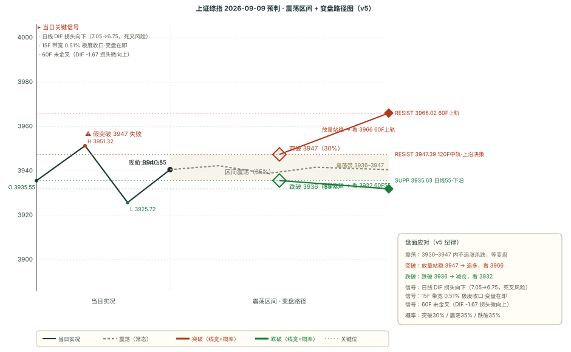

# 作战报告 · 晨报 · 2026-09-09（周三）

> 抓取窗口：2026-09-08 16:00 ~ 09:00 ｜ 星球 55 条 / 图片 44 张 / 附件 105 个 / T&J 1 条已归档

## 核心主线速览（三行）

- **今日主线**：AI 算力/光模块主线逻辑未变（美股科技大涨 + 高盛上修光通信 677→1314→1485 亿美元 + 剑桥科技激光器告急），但 9/8 A 股科技首次回调（电子 -1.11%、科创50 -1.52%）
- **关键反转**：风格切换——周期/高股息接棒（石油石化 +3.68% 领涨，美军打击伊朗哈尔克岛油价飙升），科技→旧经济资金回流
- **操作基调**：方向不明（v5 总分 -1 + 15F 带宽 0.51% 极度收口），T&J「评估 15F 二买很极限、不快速拉升则日线死叉主跌段、上下都有加速信号」；核心带 3936-3947，多空分水岭 3947.39（120F 中轨）

---

## 第一块 星球信息（知识星球晨报 · 55 条窗口内）

### 一、核心主线（按强度排序，逐条为唯一素材落地点）

#### 1. AI 算力/光模块：美股大涨 vs A股回调（主线未变，短线分化）

- **高盛上调光通信预测**（基业长青 08:38 GS China Open + Serenity 07:44）：2026→2028 年 677 亿 → 1314 亿 → 1485 亿美元（+33%/+81%/+115% 上修）；1.6T 硅光模块使用 4 个 70mW CW 激光器，SiPH 渗透率 80%
- **剑桥科技激光器告急**（白毛日报第90期 20:10）：CIG 70mW-200mW 激光器严重短缺、交货期延长、需付保证金保产能
- **长光华芯董事长调研**（基业长青 07:37 高盛纪要）：EML/CW 激光器产能三倍级跃升，规格升级驱动需求高增
- **阿贝尔押注 AI 瓶颈**（白毛日报）：巴菲特接班人押注 AI 下一个瓶颈，巴菲特备 3000 亿+美元应对调整
- **美股科技大涨**（基业长青 08:40）：GPT-6 Astra、Instinct、Meta MUSE 推动风险偏好回升；但 A 股 9/8 科技小调一天（大鹏鸟「估计会带动回暖但没量」）

#### 2. 油气/中东冲突（新催化，油价飙升）

- **GS China Open**（基业长青 08:38）：美军对伊朗哈尔克岛（主要石油出口枢纽）+ 贾斯克港口实施打击后，油价大幅飙升
- **大鹏鸟盘前热榜**（07:39）：中东大概率难太平，朗子「你炸我饭碗那就都别吃饭」的态度
- **石油石化 +3.68%** 领涨申万（见第五块），印证油气主线

#### 3. 周期/化工/高股息接棒（风格切换明确）

- **高盛中国日报**（基业长青 18:31）：9/8 A 股行情分化，高股息板块再度跑赢；化工板块再度上行（供需格局可能发生基本面变化）；电池走弱（理想汽车决定采用自研电池，直接带动宁德时代股价走弱）
- **房地产 +2.09% / 钢铁 +2.07% / 基础化工 +1.70%**（申万实时，见第五块）

#### 4. 厄尔尼诺/粮食 + 铜价新高（持续催化）

- **大鹏鸟盘前热榜**（07:39）：厄尔尼诺大周期（粮食）
- **卫斯李高盛铜**（16:36）：LME 铜价创历史新高，年内涨幅 80%（但判断多头强度仅 3/10，无全新驱动）

#### 5. 其他重要信息（与主线无关，不展开）

- 基业长青+：金刚石散热产业链调研（惠丰钻石/力量钻石，AI 算力核心耗材）、沃尔德金刚石微钻、金帝液冷微通道、3D 打印设备送机、高通-亚马逊定制 AI 芯片、长鑫科技 HBM TSV 技术困境、AMD Citi TMT 纪要、GPT-6 专家纪要、OpenAI CFO 会议笔记、谷歌-黑石 Project Braid 延误、古茗/美团小象调研
- 卫斯李：高盛非农（+16.2 万 vs 预期 5.3 万）、美债 10 年期逼近 5%、对冲基金净杠杆极低
- 180K Research：科技日报/隔夜北美小结/本土开盘前小结

### 二、Truth and Justice 核心隔夜定调（22:07，唯一完整落地点）

> **完整原文一字不差归档**：见 `outputs/TRUTH_AND_JUSTICE_原始记录_2026-09-09.md`

- 午后跳水刺破 60F55 线后，尾盘回到 15F55 线附近，核心是评估这个跳水是不是 **15F 级别二买**
- 反抽低点没有 3F 底背离，正常来说直接高举高打可能性不大，若低点会给**补偿性二买**
- 如果这里**不快速拉升，都会出现日线死叉下主跌段的风险**，很难事前判断是二买回踩还是跌着跌着跌穿
- 二买会**非常的极限**
- 窄幅震荡不会维持太久，**上下都会有明显的加速信号**

**对今日预判的影响**：T&J 定调「方向待加速信号确认、二买很极限、不快速拉升则日线死叉主跌段」→ 方向「方向不明」，核心看能否快速拉升避开日线死叉（见第四块）。

---

## 第二块 信息判断（跨星球观点对比 + 共识复盘）

### 一、跨星球观点对比

#### 共同观点（结论式，细节见第一块）

1. **AI 算力/光模块主线逻辑未变**（美股大涨 + 高盛上修光通信 + 激光器告急 + 阿贝尔押注，4+ 源共振）→ 景气持续上修，但 A 股短线回调（见第一块·一·1）
2. **风格切换：科技回调、周期/高股息接棒**（高盛高股息跑赢 + 申万石油石化领涨 + 化工上行，3 源）→ 资金回流旧经济（见第一块·一·3）
3. **油气/中东冲突催化**（美军打击伊朗哈尔克岛 + 油价飙升 + 大鹏鸟中东难太平，3 源）→ 事件驱动（见第一块·一·2）
4. **市场没量、追高需谨慎**（大鹏鸟「没量、游资只有前排」+ T&J「上下都有加速信号」，2 源）→ 不追高（见第一块·一·1 + 二）

#### 相反观点（方向互斥，按三步自检）

1. **9/9 大盘方向：向上加速（避开日线死叉）vs 向下加速（日线死叉主跌段）**
   - A 向上加速：美股科技大涨带动回暖 + 高盛光通信上修 + 周线一买 3927.85 支撑（见第一块·一·1）
   - B 向下加速：日线 DIF 拐头向下（7.05→6.75 死叉风险）+ 15F 带宽 0.51% 极度收口 + 没量 + 科技回调（见第三块 + 第一块·一·1）
   - 判定：**方向不明（多空拉锯）**，剧本 A 30% / B 35% / C 35%（见第四块）；T&J「不快速拉升则日线死叉主跌段」为操作纪律

2. **AI 主线条：持续上攻 vs 高位回调**
   - A 持续：美股大涨 + 高盛光通信上修（+115%）+ 激光器告急（见第一块·一·1）
   - B 回调：9/8 电子 -1.11%、通信 -0.28% 已回调 + 大鹏鸟「谨慎追高（强3）」+ 没量（见第五块）
   - 判定：主线方向不变（景气上修），短线回调 → **逢低不追高**，观察是洗盘还是见顶

#### 隐含共识

- **风格切换（科技→周期/高股息）是 9/8 明确的盘面信号**（申万石油石化领涨 + 高盛高股息跑赢 + 科技领跌，多源共振）
- **对「追高」的隐性共识**：没量 + 强3 形态 + T&J「上下都有加速信号」→ 追高风险，等方向明确

### 二、上期共识复盘（9/8-noon 共识链 → 9/8 全天验证）

| 共识/相反观点 | 类型 | 9/8 全天验证判定 | 说明 |
|---|---|---|---|
| AI 算力/光模块/CPO 主线延续（HBM 短缺更严 + 旭创 225%） | event | ⏸ 不参与复盘 | 事件事实类，9/8 科技回调但 9/9 高盛又上修光通信，景气逻辑未变 |
| 市场整体没量、超短性价比一般 | short | ✅ 兑现 | 9/8 成交 1.98 万亿、科技冲高回落、周期接棒，印证「没量+游资不追高」 |
| 技术面偏多修复但未确认（T&J 需 60F 金叉） | short | ✅ 兑现 | 9/8 收盘 3940.55，60F 始终未金叉，午后跳水刺破 60F55 后尾盘收回 15F55 附近 |
| 9/8 下午方向：有效突破 vs 磨叽回落 | opposite | B 磨叽回落侧占优 | 收盘未站上 120F 中轨，剧本 B 震荡/回落 70% 大致兑现 |

### 三、本期新共识（已追加 consensus_chain，避免重复不展开）

> 共同观点 1~4 → 追加为共识 1~4；相反观点 1~2 → 追加为相反共识 1~2（均已入 `consensus_chain`，status=pending）。内容即上文「共同观点 / 相反观点」，此处不重复铺开。

---

## 第三块 技术分析（缠论买卖点 + BOLL×缠论变盘）

### 引擎 B：chan-signal 缠论买卖点（五周期 · 现价 3940.55）

| 周期 | 最新价 | 涨跌 | 趋势 | 中枢位置 | 买点信号 | 卖点信号 |
|------|--------|------|------|---------|---------|---------|
| 日线 | 3940.55 | +0.20% | 向下 | 中枢下方（上沿 4175.35 / 下沿 4061.15） | — | 一卖@3847.09、三卖@3847.09 |
| 周线 | 3940.55 | +0.27% | 向下 | 中枢内部（上沿 4034.08 / 下沿 3927.85） | 一买@3927.85 | — |
| 60 分钟 | 3940.55 | -0.09% | **向上** | 中枢内部（上沿 3967.59 / 下沿 3927.55） | — | 三卖@3911.08（conf 0.75 强） |
| 15 分钟 | 3940.55 | -0.00% | 向下 | 无中枢参考 | — | — |
| 5 分钟 | 3940.55 | -0.02% | 向下 | 无中枢参考 | — | — |

> 关键信号：**60F 三卖@3911.08 conf0.75 仍压中枢下方**，但 60F 趋势已「向下」转「向上」；周线一买@3927.85 提供下方支撑锚。日线/周线仍向下，大级别偏空结构未变。

### BOLL×缠论变盘概率（多因子方向打分）

| 级别 | 上涨概率 | 下跌概率 | 方向 | 带宽状态 | 关键依据 |
|------|---------|---------|------|---------|---------|
| 15 分钟 | **64%** | 36% | 偏多 | 极度收口（变盘） | 中轨上方+1，中轨上行+2，收口偏多+2，趋势向下-2 |
| 60 分钟 | 46% | 54% | 中性 | 收口 | 中轨下方-1，中轨下行-2，趋势向上+2 |
| 120 分钟 | 58% | 42% | 偏多 | 常态 | 中轨下方-1，中轨上行+2 |
| 日线 | **64%** | 36% | 偏多 | 开口（趋势启动） | 中轨上方+1，中轨上行+2，开口向上+2，趋势向下-2 |

### 关键均线与 MACD（T&J 55 线体系 + 金叉确认）

| 级别 | MA55 | MA20（BOLL 中轨） | MACD 状态 |
|------|------|------------------|-----------|
| 日线 | 3935.63 | 3936.14 | DIF 6.75 > DEA 5.94（多头区），**DIF 拐头向下**（7.05→6.75，死叉风险） |
| 60 分钟 | 3931.87 | 3943.59 | DIF -1.67 < DEA -0.77（**未金叉**，零轴下方），DIF 拐头微向上 |
| 15 分钟 | 3942.13 | 3940.34 | DIF 0.61 < DEA 0.74（死叉），DIF 拐头向下 |

> **级别联动解读**：日线 DIF 拐头向下 = 大级别动能转弱、死叉风险逼近（T&J「不快速拉升则日线死叉主跌段」）；60F 未金叉但 DIF 拐头微向上 = 中端动能边际企稳靠拢；15F 死叉 + 带宽 0.51% 极度收口 = 短端变盘在即。三层结构精准对应 T&J「二买很极限、上下都有加速信号」的隔夜定调。

---

## 第四块 预判（技术预判与复盘）

### 一、上期复盘（9/8-noon → 9/8 全天走势）

| 维度 | 判定 | 说明 |
|---|---|---|
| 方向 | ✅ 命中 | 预判「方向不明」，实际全天微涨 +0.20% 无单边，午后跳水刺破 60F55 后尾盘收回，剧本 B 磨叽震荡兑现 |
| 区间 | ⚠️ 部分 | 预判核心 3943-3953 / 扩展 3936-3968，实际 3925.72-3951.32：收盘 3940.55 在扩展区间内但核心带下沿外，盘中跌破扩展下沿 3936 |
| 支撑 | ✅ 守住 | 支撑 3943.87（15F55），收盘 3940.55 仅低 0.084% 在容差内；盘中 low 3925.72 未破容差下限 3924.15，假破位收回 |
| 压力 | ✅ 守住 | 压力 3947.56（120F 中轨），盘中 high 3951.32 一度突破 +0.095% 但收盘收回压力下方，假突破 |

**核心结论**：方向+支撑+压力三维守住（压力假突破、支撑假破位），区间因午后跳水超预期判「部分」。真偏差=区间下沿假破位+压力位短暂突破，归入既有规律观察。

### 二、偏差观察统计表（v5 配对计数 · 42 期 · 截止 2026-09-09 08:58）

| 维度 | 命中 | 部分 | 失效 | 未判定 | 纯命中率 | 备注 |
|------|------|------|------|--------|---------|------|
| 方向 | 23 | 16 | 3 | 0 | **54.8%** | n=42 |
| 区间 | 17 | 23 | 2 | 0 | **40.5%** | n=42 |
| 支撑 | 28 | 5 | 8 | 1 | **68.3%** | n=41（含 1 ⏳ 跟踪中） |
| 压力 | 24 | 11 | 6 | 1 | **58.5%** | n=41（含 1 ⏳ 跟踪中） |

**趋势观察（vs 41 期午间档）**：方向 53.7%→54.8%（+1.1pct）；区间 41.5%→40.5%（-1.0pct）；支撑 67.5%→68.3%（+0.8pct）；压力 57.5%→58.5%（+1.0pct）。

**实装规则延续追踪**：压力位突破确认（已 6 次失效）——9/8-noon 压力 3947.56 假突破（盘中破后收回）→ 验证「不追高、待放量站稳」纪律；支撑位保守设定（8 次）——9/8-noon 支撑 3943.87 假破位（刺破后收回）→ 验证「支撑带容差」有效性。

### 三、本期预判（9/9 全天）

#### 一句话预判

> **方向不明，核心带 3936-3947，多空分水岭 3947.39（120F 中轨）**；T&J 隔夜「评估 15F 二买很极限、不快速拉升则日线死叉主跌段、上下都有加速信号」+ 日线 DIF 拐头向下 + 15F 带宽 0.51% 极度收口 = 变盘在即；剧本 A 30% / B 35% / C 35%。

#### 完整预判字段

| 字段 | 内容 |
|---|---|
| **方向** | 方向不明（v5 总分 -1：买卖点 0 + T&J 中性谨慎 0 + BOLL 变盘 0 + MACD DIF 拐头向下 -1；15F BOLL 带宽 0.51%<1% 触发「方向不明」） |
| **区间** | 3936-3947（核心 11 点，日线55~120F 中轨）/ 3932-3966（扩展） |
| **支撑** | 3935.63（日线 55·分水岭，-0.13%）/ 3931.87（60F 55）/ 3927.85（周线一买）/ 3925.72（9/8 午后低点·T&J 二买锚）/ 3915.22（前低双底） |
| **压力** | 3947.39（120F 中轨·分水岭，+0.17%）/ 3950.40（15F 上轨）/ 3966.02（60F 上轨）/ 3967.59（60F 中枢上沿）/ 3999.43（日线上轨，远端） |
| **置信度** | 中低（关键看能否快速拉升避开日线死叉 + 量能） |

#### v5 打分明细（三因子共振）

- 买卖点因子：60F/15F 近期无新买卖点（60F 三卖@3911 为旧信号、价格已涨破脱离）= **0**
- 时效信号因子：T&J 中性谨慎（评估 15F 二买、不快速拉升则死叉，方向待加速信号）= **0** + BOLL 变盘概率（60F 46/54、日线 64/36，偏离均 <15pct 不触发）= **0** + MACD DIF 拐头向下（日线 7.05→6.75）= **-1**
- **总分：0 + 0 + 0 - 1 = -1 ≤ 1 → 方向不明**，且 15F BOLL 带宽 0.51%<1% 双重触发「方向不明」

#### 剧本概率与触发条件

| 剧本 | 概率 | 触发条件 | 目标位 |
|------|------|---------|--------|
| **A 向上加速** | 30% | 美股科技带动回暖，快速拉升避开日线死叉，放量突破 3947.39（120F 中轨） | 看 3950.40 / 3966.02 |
| **B 窄幅震荡** | 35% | 3936-3947 窄幅磨，等 15F 二买确认或日线死叉表态（T&J「二买很极限」） | 区间内不追涨杀跌 |
| **C 向下加速**（警惕） | 35% | 日线死叉下主跌段，失守 3935.63（日线 55）→ 3931.87 → 3925.72 | 看 3925.72 / 3915 |

#### 关键操作纪律（T&J 游击战思路）

1. **不追高**：放量站稳 3947.39（120F 中轨）才看更高；没量 + 强3 形态谨慎追（大鹏鸟）
2. **等加速信号**：窄幅震荡不会维持太久，上下都有明显加速信号（T&J）
3. **日线死叉警戒**：不快速拉升则日线死叉主跌段，失守 3935.63 转防守
4. **关键位纪律**：放量站稳 3947.39 看 3966；失守 3935.63 看 3931.87/3925.72/3915

#### 开盘后重点观察（4 项）

1. **集合竞价高低开**（美股科技大涨 + 油价飙升 → 高开概率大，但警惕高开低走）
2. **量能**（T&J 二买 + 大鹏鸟「没量」→ 量是突破 3947.39 的前提）
3. **日线 DIF 拐头方向**（能否快速拉升扭转拐头向下、避开死叉）
4. **3947.39（120F 中轨）得失**（多空分水岭表态）

#### 关键位相对现价百分比（现价 3940.55）

| 关键位 | 价格 | 相对现价 | 方向 |
|---|---|---|---|
| 60F 上轨 | 3966.02 | +0.65% | 压力 |
| 15F 上轨 | 3950.40 | +0.25% | 压力 |
| **120F 中轨·分水岭** | **3947.39** | **+0.17%** | 压力 |
| **现价** | **3940.55** | **0.00%** | — |
| **日线 55** | **3935.63** | **-0.13%** | 支撑 |
| 60F 55 | 3931.87 | -0.22% | 支撑 |
| 周线一买 | 3927.85 | -0.32% | 支撑 |
| 9/8 午后低点 | 3925.72 | -0.38% | 支撑 |
| 前低双底 | 3915.22 | -0.64% | 支撑 |

---

## 第五块 行业强弱榜（申万一级实时 + 星球/缠论/复盘三要素推导）

> 数据时点：2026-09-09 08:56（A 股未开盘，实时涨跌幅为 9/8 收盘数据，作「隔夜参考」）

### 一、数据层

#### 1. 实时涨跌幅（akshare 申万一级 · 9/8 收盘）

**领涨 TOP5**：石油石化 +3.68%（中东油价飙升）｜ 房地产 +2.09% ｜ 钢铁 +2.07% ｜ 综合 +1.86% ｜ 基础化工 +1.70%

**领跌 TOP5**：非银金融 -0.48% ｜ 家用电器 -0.77% ｜ 计算机 -0.89% ｜ 电子 -1.11%（科技回调）｜ 电力设备 -1.14%（电池走弱）

**风格切换信号**：昨日（9/7 收盘）领涨的通信 +6.17%、电子 +3.92%，今日（9/8 收盘）通信 -0.28%、电子 -1.11%——科技主线全面回调，周期/高股息全面接棒。

#### 2. 缠论方向分（同花顺 · T+1 截至 9/8 收盘）

- 农林牧渔 +2.0、商贸零售 +2.7、传媒 +2.3、煤炭 +2.0（向上）；化工原料 +4.0（一买 conf0.5）偏强
- 钢铁 -5.0（三卖 conf0.75）、中证1000 -3.0（三卖 conf0.75）、半导体 -2.0、国防军工 -2.0 偏弱

### 二、推导层（三要素）

#### 做多榜 TOP3

| 行业 | 实时涨跌幅 | 缠论方向 | 星球依据 | 置信度 |
|------|-----------|---------|---------|--------|
| **石油石化** | +3.68% | +1.5 向上 | 美军打击伊朗哈尔克岛油价飙升（见第一块·一·2） | **高** |
| **基础化工** | +1.70% | 化工原料 +4.0 一买 | 高盛「化工供需格局基本面变化」（见第一块·一·3） | **中-高** |
| **农林牧渔** | +1.47% | +2.0 向上 | 厄尔尼诺大周期 + 粮食（见第一块·一·4） | **中-高** |

#### 规避榜 TOP3

| 行业 | 实时涨跌幅 | 缠论方向 | 依据 | 置信度 |
|------|-----------|---------|------|--------|
| **电力设备** | -1.14% | 向下 | 电池走弱（理想自研电池 → 宁德时代走弱） | **中-高** |
| **家用电器** | -0.77% | 向下 | 消费弱 + 科技/周期抽血 | **中** |
| **非银金融** | -0.48% | 交织 | 高股息分流 + 科技回调资金未回补 | **中** |

#### 主线回调观察（非规避）

- **电子 -1.11% / 计算机 -0.89% / 通信 -0.28%**：科技主线回调，但高盛上修光通信（+115%）、激光器告急（见第一块·一·1），景气逻辑未变 → 观察是洗盘还是见顶，逢低不追高

#### 共振/背离说明

- **石油石化 + 基础化工 + 农林牧渔三行业共振**：实时 + 缠论 + 星球事件三要素一致 → 高置信度
- **电子/通信背离**：实时领跌 vs 缠论通信看多 + 高盛上修光通信 → 主线回调，观察洗盘 or 见顶
- **有色金属背离**：铜价新高（LME 年内 +80%）vs 缠论 -1.0 → 事件驱动 vs 结构滞后
- **命中「方向相反」标签**：通信 9/7 +6.17% → 9/8 -0.28%（2 日反转）→ 符合「方向反转期买卖点滞后」
- **命中「主线回调」标签**：电子/通信短期涨幅过大，短线回调，主线逻辑未变，谨慎追高

---

## 附录 A 抓取通道信息

| 通道 | 工具 | 星球 | 9/9 抓取条数 | 备注 |
|---|---|---|---|---|
| 通道 A（Skill/zsxq-cli） | `zsxq-cli` | 卫斯李的投研笔记 | 30/6 | 高盛铜/非农/美债 |
| 通道 A | zsxq-cli | ⭕ 基业长青+ | 59/39 | morning 窗口内 39 条（最大来源） |
| 通道 A | zsxq-cli | Truth and Justice | 30/1 | 1 条原文已归档（22:07） |
| 通道 B（Cookie 直连） | api.zsxq.com | 大鹏鸟笔记 | 20/1 | 9/9 盘前热榜 07:39 |
| 通道 B | api.zsxq.com | ⭕ 短评&信息 | 20/0 | morning 窗口内 0 条 |
| 通道 B | api.zsxq.com | 180K Research | 20/6 | 科技日报+北美小结+开盘前小结 |
| 通道 B | api.zsxq.com | AI 产业链地图·Serenity速报 | 20/2 | 白毛日报第90期+Serenity 专享 |
| **合计** | | | **219/55** | **图片 44 张 / 附件 105 个** |

**数据完整性说明**：Cookie 路径 `.workbuddy/zsxq_cookie.txt`（不入 git，**严禁同步家里**）；IMA 知识库（基业长青浑水投研🥈 + 浑水调研🥇 + xxpq）；窗口内附件以 PDF 文件为主（105 个，多为基业长青研报），未逐一下载，仅记录元数据。

---

## 附录 B 星球代号对照表

> 正文直接表达观点，不出现星球代号；本附录仅供回溯

| 代号 | 星球 | 内容侧重 | 抓取通道 |
|---|---|---|---|
| 星球 ① | 卫斯李的投研笔记 | 美银/汇丰/瑞银/高盛海外研报、SAA 账户周报 | A (zsxq-cli) |
| 星球 ② | ⭕ 基业长青+ | 高盛/中信里昂/大摩/摩根大通卖方研报、产业链专家 | A (zsxq-cli) |
| 星球 ③ | Truth and Justice | 缠论复盘、60F 极弱/极强判定、游击战思路 | A (zsxq-cli) |
| 星球 ④ | 大鹏鸟笔记 | 盘前热榜、游资观点、午间总结、晚盘总结 | B (Cookie) |
| 星球 ⑤ | ⭕ 短评&信息 | 短评、突发信息 | B (Cookie) |
| 星球 ⑥ | 180K Research | 外资研报、科技周报、算力专题 | B (Cookie) |
| 星球 ⑦ | AI 产业链地图·Serenity 速报 | 白毛日报、CW-WDM 联盟、海外算力链 | B (Cookie) |
| 星球 ⑧ | 信息平权 | 资讯平权 | B (Cookie) |
| 星球 ⑨ | 投行圈子 | 投行视角 | B (Cookie) |
| 星球 ⑩ | 口罩哥 | 口罩哥专享 | B (Cookie) |
| IMA-① | 【基业长青】浑水投研🥈 | 浑水调研 | IMA 知识库 |
| IMA-② | 【浑水调研】叫我第一名🥇 | 浑水调研 | IMA 知识库 |
| IMA-③ | xxpq | 调研笔记 | IMA 知识库 |

---

## 产物清单

| 路径 | 类型 | 说明 |
|---|---|---|
| `outputs/作战报告_晨报_2026-09-09.md` | Markdown 报告 | 本文件（五块齐全 + 附录 A/B + 产物清单） |
| `outputs/作战报告_晨报_2026-09-09.html` | HTML 报告 | 浏览器预览版 |
| `outputs/000001_forecast_2026-09-09.svg` | SVG 走势图 | 9/9 全天预判条件触发决策路径图 |
| `outputs/TRUTH_AND_JUSTICE_原始记录_2026-09-09.md` | 原文归档 | T&J 1 条一字不差归档 |
| `.workbuddy/zsxq_fetch_raw.json` | 原始数据 | 55 条窗口内星球内容 |
| `.workbuddy/forecast_chain.json` | 预判链 | 43 条（42 verified + 1 pending 9/9-morning） |
| `.workbuddy/consensus_chain.json` | 共识链 | 12 条（11 verified + 1 pending 9/9-morning） |
