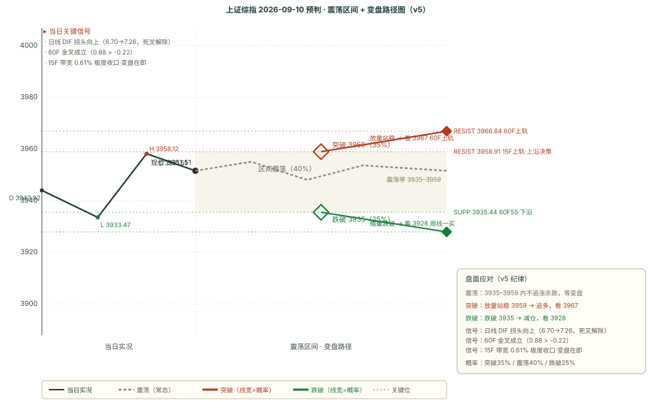

# 作战报告 · 晨报 · 2026-09-10（周四）

> 抓取窗口：2026-09-09 16:00 ~ 09:00 ｜ 星球 62 条 / 图片 33 张 / 附件 156 个 / T&J 2 条已归档

## 核心主线速览（三行）

- **今日主线**：AI 算力/光互连逻辑强化（高盛上修光模块 2027 年 1314 亿美元 +81%、谷歌 OCS 超 1 万台需求、Lumentum「需求远超供给」、电子布/高端铜箔/金刚石散热涨价），但 9/9 A 股科技继续回调（传媒 -2.77% 领跌）
- **关键分歧**：T&J 质疑科技筹码（需「放量冲锋」的理由 + 一级股东退出诉求 + DS IPO 辅导）vs 美股科技续涨（海力士创新高）+ 大鹏鸟「无量磨、两万亿以下只做容量标」
- **操作基调**：方向不明（v5 总分 +1 + 15F 带宽 0.61% 极度收口），但日线死叉解除 + 60F 金叉成立 + 收盘站上 120F 中轨 = 技术面转多未确认；核心带 3935-3959，上沿 3958.91（9/9 高点/15F 上轨）

---

## 第一块 星球信息（知识星球晨报 · 62 条窗口内）

### 一、核心主线（按强度排序，逐条为唯一素材落地点）

#### 1. AI 算力/光互连：逻辑强化 vs 缺量确认（主线未变，筹码有分歧）

- **高盛收盘综述**（基业长青 19:01）：9/9 上证 +0.28%、科创50 -0.69%，AI 板块分化、铜互连相关标的走高，A 股总成交额 1.87 万亿（依旧低位）
- **白毛日报第91期**（Serenity 20:12）：高盛上调光模块预测，2027 年 1314 亿美元（+81%）；AMZN 与 QCOM 签署 40 亿美元认股权证
- **是什么推动市场**（基业长青 20:24）：AI 芯片热潮盖过中东油价担忧，SK 海力士、三星跟随美股半导体涨（高通 + OpenAI 强 AI 需求信号），Verizon 与康宁签署数十亿光纤协议
- **OCS 纪要**（基业长青 22:42）：谷歌 2026 年 OCS 需求超 1 万台，量产瓶颈（普遍推迟约一个季度），已向压电陶瓷 Polatis 下达数千台订单
- **Lumentum 纪要**（基业长青 08:46）：AI 光互连需求远超供给、缺口仍在扩大，AI 处于极早期阶段
- **电子布专家**（基业长青 23:18）：7628 电子布 15 元/米、9 月再涨 10-20%，涨价连续三月加速，年底突破 15 元概率高
- **德福科技**（基业长青 20:57/23:17）：HVLP4 高端铜箔 8 月出货 70t、Q4 到 300t/月，H4 加工费 16-20 万/t
- **先锋精科**（基业长青 19:12）：陶瓷加热器已对中微中小批量出货，无锡产能下半年释放
- **沃尔德**（基业长青 00:32）：金刚石散热业务梳理；**茂莱**（08:46）：光刻机物镜（价值量最大环节，物镜价值是照明系统 5-10 倍）

#### 2. 科技筹码质疑（T&J 18:56，唯一完整落地点）

> 见本块·二；核心：科技需「放量冲锋」的理由，一级股东有退出诉求才有 EPS，DS IPO 辅导

#### 3. 周期/高股息/厄尔尼诺延续（风格切换强化）

- **煤炭 +3.03% / 有色 +1.49% / 交运 +1.35%** 领涨申万（见第五块），周期接棒延续
- **大鹏鸟盘前**（07:53）：投机人气妖还是厄尔尼诺大周期为主（粮食/糖/海运/化工）

#### 4. 量能分水岭（核心变量）

- **大鹏鸟盘前**（07:53）：两万亿以下只能做 100-500 亿流通市值容量标，出现近千亿容量标领头必须放量到 2 万亿以上；盘面没量说啥都没用
- **高盛 GS China Open**（08:44）：中国市场 V 型走势但成交量清淡，20 日均线支撑上证，缺乏新催化剂前可能继续盘整

#### 5. 宏观与其他重要信息

- **卫斯李**：美联储「点刹式」加息先例（1997 格林斯潘）、美债 10 年期；欧洲私人银行对欧股减仓
- **中东**：布伦特原油逼近每桶 100 美元（AI 芯片热潮盖过油价担忧）
- **高盛 GS China Open**（08:44）：今日下午 3 点金融监管简报会（央行/金融监管总局/证监会/外汇局讨论「十五五」规划），可能影响盘面
- **港股创新药离岸信托税收风波**（基业长青 20:25/20:29）：海底捞减持引发，港股创新药恐慌性回调，多公司回应「不涉及」；**石药集团** SYS6010 有望成首个获批 EGFR ADC；**上海家化**双11展望（佰草集/玉泽 GMV 高两位数）

### 二、Truth and Justice 核心隔夜定调（18:56 + 22:51）

> **完整原文一字不差归档**：见 `outputs/TRUTH_AND_JUSTICE_原始记录_2026-09-10.md`

- **18:56 科技筹码论**：科技需要一个理由让大家闭眼冲锋（基本面巨变/宏大叙事），闭眼冲锋的表现就是放量；一级股东有退出诉求就有 EPS、没有诉求 EPS 可以瞬间消失；DS 出 IPO 辅导新闻，看文峰是量化割大家赚得多还是一把解禁退出赚得多
- **22:51 技术定调**：技术上过于窄幅震荡，没看出什么特征，没啥好写的

**对今日预判的影响**：T&J 对科技偏谨慎（需放量确认）+ 技术上「窄幅震荡没特征」→ 方向「方向不明」，核心看量能能否放大确认突破（见第四块）。

---

## 第二块 信息判断（跨星球观点对比 + 共识复盘）

### 一、跨星球观点对比

#### 共同观点（结论式，细节见第一块）

1. **AI 算力/光互连景气逻辑强化**（高盛上修光模块 + 谷歌 OCS + Lumentum 缺口扩大 + 电子布/铜箔涨价，5+ 源共振）→ 景气持续上修，但缺放量确认（见第一块·一·1）
2. **风格切换延续：科技回调、周期/高股息接棒**（煤炭 +3.03% 领涨 + 传媒 -2.77% 领跌，2 源）→ 资金继续回流旧经济（见第一块·一·3）
3. **量能是核心变量**（大鹏鸟两万亿分水岭 + 高盛成交清淡，2 源）→ 无量不追高（见第一块·一·4）

#### 相反观点（方向互斥，按三步自检）

1. **AI 主线：持续上攻 vs 高位缺量回调**
   - A 持续：美股科技续涨（海力士创新高）+ 高盛上修光模块 + 光互连缺口扩大（见第一块·一·1）
   - B 缺量回调：T&J「科技需放量冲锋」+ 大鹏鸟「无量磨、科技只做前排活口」+ 传媒 -2.77% 领跌（见第一块·一·1/2 + 第五块）
   - 判定：**逻辑在但缺量**——景气上修是共识，分歧在「能不能放量」，逢低不追高，等放量确认

2. **9/10 大盘方向：向上突破（放量）vs 窄幅震荡（无量）vs 向下回落**
   - A 向上：日线死叉解除 + 60F 金叉成立 + 站上 120F 中轨 + BOLL 全偏多（见第三块）
   - B 窄幅震荡：T&J「窄幅震荡没特征」+ 大鹏鸟「无量磨」+ 15F 极度收口（见第一块·一·4 + 第三块）
   - C 向下：科技无量回调扩散 + 宽基中证1000/沪深300 同花顺方向向下（见第五块）
   - 判定：**方向不明（多空拉锯）**，剧本 A 35% / B 40% / C 25%（见第四块）

#### 隐含共识

- **「科技逻辑在、缺的是放量」是全场隐性共识**（T&J 放量论 + 大鹏鸟无量磨 + 高盛成交清淡，多源共振）
- **对「量能」的高度敏感**：两万亿是分水岭，量能不放大，任何主线逻辑都不追高

### 二、上期共识复盘（9/9-morning 共识链 → 9/9 全天验证）

| 共识/相反观点 | 类型 | 9/9 全天验证判定 | 说明 |
|---|---|---|---|
| AI 算力/光模块主线延续但短线回调 | event | ⏸ 不参与复盘 | 事件事实类，9/9 美股科技涨但 A 股科技继续回调，逻辑未变缺量确认 |
| 油气/中东冲突催化 | short | ✅ 兑现 | 9/9 周期普涨（煤炭 +3.03%、有色 +1.49%、交运 +1.35%），主角从石油石化外溢到煤炭有色 |
| 风格切换：科技回调、周期接棒 | short | ✅ 兑现 | 传媒 -2.77% 领跌 vs 煤炭 +3.03% 领涨，切换进一步强化 |
| 技术面：15F 二买 + 日线死叉风险 | short | ❌ 未兑现 | 日线 DIF 拐头向上（6.70→7.26）化解死叉、60F 金叉成立、收盘站上 120F 中轨，死叉未发生反而向上 |
| 9/9 方向：向上加速 vs 向下加速 | opposite | A 向上（温和） | 收盘 3951.51（+0.28%）站上 120F 中轨，日线死叉解除，但幅度温和非强攻 |

### 三、本期新共识（已追加 consensus_chain，避免重复不展开）

> 共同观点 1~3 → 追加为共识 1~3；相反观点 1~2 → 追加为相反共识 1~2（均已入 `consensus_chain`，status=pending）。内容即上文「共同观点 / 相反观点」，此处不重复铺开。

---

## 第三块 技术分析（缠论买卖点 + BOLL×缠论变盘）

### 引擎 B：chan-signal 缠论买卖点（五周期 · 现价 3951.51）

| 周期 | 最新价 | 涨跌 | 趋势 | 中枢位置 | 买点信号 | 卖点信号 |
|------|--------|------|------|---------|---------|---------|
| 日线 | 3951.51 | +0.28% | 向下 | 中枢下方（上沿 4175.35 / 下沿 4061.15） | — | 一卖@3847.09、三卖@3847.09 |
| 周线 | 3951.51 | +0.54% | 向下 | 中枢内部（上沿 4034.08 / 下沿 3927.85） | 一买@3927.85 | — |
| 60 分钟 | 3951.51 | -0.04% | **向上** | 中枢内部（上沿 3967.59 / 下沿 3927.55） | — | 三卖@3911.08（conf 0.75 强） |
| 15 分钟 | 3951.51 | -0.09% | **向上** | 无中枢参考 | — | — |
| 5 分钟 | 3951.51 | -0.03% | **向上** | 无中枢参考 | — | — |

> 关键信号：**60F/15F/5F 三周期趋势全部转向上**（昨日 15F/5F 尚向下）；60F 三卖@3911.08 conf0.75 已脱离（现价在上方 40 点）；周线一买@3927.85 提供下方支撑锚。日线/周线仍向下，大级别偏空结构未变，但短周期修复明确。

### BOLL×缠论变盘概率（多因子方向打分）

| 级别 | 上涨概率 | 下跌概率 | 方向 | 带宽状态 | 关键依据 |
|------|---------|---------|------|---------|---------|
| 15 分钟 | **82%** | 18% | 看多 | 极度收口（变盘） | 中轨上方+1，中轨上行+2，收口偏多+2，趋势向上+2 |
| 60 分钟 | 54% | 46% | 中性 | 收口 | 中轨上方+1，中轨下行-2，趋势向上+2 |
| 120 分钟 | **72%** | 28% | 看多 | 常态 | 中轨上方+1，中轨上行+2 |
| 日线 | **64%** | 36% | 偏多 | 开口（趋势启动） | 中轨上方+1，中轨上行+2，开口向上+2，趋势向下-2 |

### 关键均线与 MACD（T&J 55 线体系 + 金叉确认）

| 级别 | MA55 | MA20（BOLL 中轨） | MACD 状态 |
|------|------|------------------|-----------|
| 日线 | 3932.74 | 3936.38 | DIF 7.26 > DEA 6.14（多头区），**DIF 拐头向上**（6.70→7.26，死叉解除） |
| 60 分钟 | 3935.44 | 3944.56 | DIF 0.88 > DEA -0.22（**金叉成立**，零轴上方），DIF 拐头向上（0.40→0.88） |
| 15 分钟 | 3939.95 | 3946.83 | DIF 2.64 > DEA 2.26（金叉），DIF 拐头向上 |

> **级别联动解读**：日线 DIF 拐头向上 = 大级别动能转强、死叉风险解除（昨日的最大风险点今日化解）；60F 金叉成立 = 中端动能转多（昨日「需 60F 金叉确认」今日兑现）；15F 金叉 + 带宽 0.61% 极度收口 = 短端变盘在即。三层结构从昨日的「偏空待变盘」翻转为「偏多待放量确认」，唯一缺的是量能。

---

## 第四块 预判（技术预判与复盘）

### 一、上期复盘（9/9-morning → 9/9 全天走势）

| 维度 | 判定 | 说明 |
|---|---|---|
| 方向 | ✅ 命中 | 预判「方向不明」，实际全天微涨 +0.28% 无单边，且向上化解日线死叉（Scenario A 温和兑现），未现单边主跌 |
| 区间 | ⚠️ 部分 | 预判核心 3936-3947 / 扩展 3932-3966，实际 3933.47-3958.12：收盘 3951.51 站上核心上沿 3947 之外（高 4.12 点），高点逼近扩展上沿——实际比预判偏强，向上偏移 |
| 支撑 | ✅ 守住 | 支撑 3935.63（日线55），盘中 low 3933.47 一度跌破 -0.055% 在容差内，收盘 3951.51 收回上方——假破位/下跌衰竭 |
| 压力 | ❌ 突破 | 压力 3947.39（120F中轨），收盘 3951.51 站上 +0.104%、高点 3958.12 突破 +0.27%——收盘站稳，真突破 |

**核心结论**：方向+支撑二维守住（支撑假破位、方向不明兑现），区间因向上偏移判「部分」，压力因收盘站上判「突破」。核心教训：日线 DIF 拐头是方向的关键先行指标，拐头向上化解了死叉风险，预判的偏空倾向应更保守。

### 二、偏差观察统计表（v5 配对计数 · 43 期 · 截止 2026-09-10 09:00）

| 维度 | 命中 | 部分 | 失效 | 未判定 | 纯命中率 | 备注 |
|------|------|------|------|--------|---------|------|
| 方向 | 24 | 16 | 3 | 0 | **55.8%** | n=43 |
| 区间 | 17 | 24 | 2 | 0 | **39.5%** | n=43 |
| 支撑 | 29 | 5 | 8 | 1 | **69.0%** | n=42（含 1 ⏳ 跟踪中） |
| 压力 | 24 | 11 | 7 | 1 | **57.1%** | n=42（含 1 ⏳ 跟踪中） |

**趋势观察（vs 42 期晨报档）**：方向 54.8%→55.8%（+1.0pct）；区间 40.5%→39.5%（-1.0pct）；支撑 68.3%→69.0%（+0.7pct）；压力 58.5%→57.1%（-1.4pct）。

**实装规则延续追踪**：压力位突破确认（失效 6→7 次）——9/9-morning 压力 3947.39 收盘真突破（站上 +0.104%）→ 触达「放量站稳压力位上方」确认条件，看更高目标；支撑位保守设定（8 次）——9/9-morning 支撑 3935.63 假破位（刺破 -0.055% 后收回）→ 继续验证「支撑带容差」有效性。

### 三、本期预判（9/10 全天）

#### 一句话预判

> **方向不明，核心带 3935-3959，上沿 3958.91（9/9 高点/15F 上轨）**；日线死叉解除 + 60F 金叉成立 + 收盘站上 120F 中轨 = 技术面转多，但 T&J「窄幅震荡没特征」+ 大鹏鸟「无量磨」= 量能未确认；剧本 A 35% / B 40% / C 25%。

#### 完整预判字段

| 字段 | 内容 |
|---|---|
| **方向** | 方向不明（v5 总分 +1：买卖点 0 + T&J 中性 0 + BOLL 变盘 0 + MACD DIF 拐头向上 +1；15F BOLL 带宽 0.61%<1% 触发「方向不明」） |
| **区间** | 3935-3959（核心 24 点，60F55~15F 上轨/9/9 高点）/ 3928-3968（扩展） |
| **支撑** | 3935.44（60F 55·下沿，-0.41%）/ 3932.74（日线 55）/ 3933.47（9/9 低点）/ 3927.85（周线一买）/ 3915.22（前低双底） |
| **压力** | 3958.91（15F 上轨/9/9 高点，+0.19%）/ 3966.84（60F 上轨）/ 3967.59（60F 中枢上沿）/ 3999.87（日线上轨，远端） |
| **置信度** | 中低（关键看量能能否放大 + 15F 变盘方向） |

#### v5 打分明细（三因子共振）

- 买卖点因子：60F/15F 近期无新买卖点（60F 三卖@3911 为旧信号、价格已涨破脱离 40 点）= **0**
- 时效信号因子：T&J 中性（窄幅震荡没特征 + 科技需放量确认）= **0** + BOLL 变盘概率（60F 54/46、日线 64/36，偏离均 <15pct 不触发）= **0** + MACD DIF 拐头向上（日线 6.70→7.26）= **+1**
- **总分：0 + 0 + 0 + 1 = +1 ≤ 1 → 方向不明**，且 15F BOLL 带宽 0.61%<1% 双重触发「方向不明」

#### 剧本概率与触发条件

| 剧本 | 概率 | 触发条件 | 目标位 |
|------|------|---------|--------|
| **A 向上突破** | 35% | 放量突破 3958.91（9/9 高点/15F 上轨），两万亿以上放量 | 看 3966.84 / 3967.59 → 3999.87 |
| **B 窄幅震荡** | 40% | 3935-3959 无量磨（T&J「窄幅震荡没特征」+ 大鹏鸟「无量磨」） | 区间内不追涨杀跌 |
| **C 向下回落** | 25% | 科技无量回调扩散，失守 3935.44（60F55） | 看 3932.74 / 3927.85 / 3915 |

#### 关键操作纪律

1. **量能是核心变量**：两万亿以下只做 100-500 亿容量标，不追大盘股（大鹏鸟）
2. **不追高**：放量站稳 3958.91 才看更高；没量 + 窄幅震荡不重仓
3. **防守位**：失守 3935.44（60F55）转防守、看 3932.74/3927.85
4. **科技缺量确认**：T&J「放量冲锋」逻辑，科技只做前排活口、不碰无量大盘科技

#### 开盘后重点观察（4 项）

1. **量能**（两万亿分水岭，大鹏鸟「开盘看量」）
2. **3958.91（9/9 高点/15F 上轨）得失**（放量突破才看 3966）
3. **60F 金叉能否延续**（昨日刚金叉，延续则确认向上）
4. **下午 3 点金融监管简报会**（十五五规划，可能引发异动）

#### 关键位相对现价百分比（现价 3951.51）

| 关键位 | 价格 | 相对现价 | 方向 |
|---|---|---|---|
| 60F 上轨 | 3966.84 | +0.39% | 压力 |
| **15F 上轨/9/9 高点** | **3958.91** | **+0.19%** | 压力 |
| 120F 中轨 | 3950.99 | -0.01% | 已站上 |
| **现价** | **3951.51** | **0.00%** | — |
| **60F 55** | **3935.44** | **-0.41%** | 支撑 |
| 日线 55 | 3932.74 | -0.47% | 支撑 |
| 周线一买 | 3927.85 | -0.60% | 支撑 |
| 前低双底 | 3915.22 | -0.92% | 支撑 |

---

## 第五块 行业强弱榜（申万一级实时 + 星球/缠论/复盘三要素推导）

> 数据时点：2026-09-10 09:04（A 股盘前，实时涨跌幅为 9/9 收盘数据，作「隔夜参考」）

### 一、数据层

#### 1. 实时涨跌幅（akshare 申万一级 · 9/9 收盘）

**领涨 TOP5**：煤炭 +3.03% ｜ 有色金属 +1.49% ｜ 交通运输 +1.35% ｜ 国防军工 +1.30% ｜ 公用事业 +0.85%

**领跌 TOP5**：传媒 -2.77% ｜ 房地产 -1.72% ｜ 美容护理 -1.40% ｜ 医药生物 -1.23% ｜ 食品饮料 -1.10%

**风格切换延续**：周期/高股息（煤炭/有色/交运）连续第二日领涨，科技（传媒/计算机 -1.05%）连续第二日领跌——切换从「一日反转」固化为「趋势」。

#### 2. 缠论方向分（同花顺 · T+1 截至 9/9 收盘）

- 农林牧渔 +2.0、商贸零售 +2.5、基础化工 +3.0、建筑装饰 +2.0、交通运输 +2.0（向上）；光学光电子 +4.0（一买 conf0.5）、化学原料 +4.0、零售 +4.0 偏强
- 计算机 -3.0、钢铁 -3.0、半导体 -2.0、中证1000 -3.0（三卖 conf0.75）、沪深300 -2.0 偏弱

### 二、推导层（三要素）

#### 做多榜 TOP3

| 行业 | 实时涨跌幅 | 缠论方向 | 星球依据 | 置信度 |
|------|-----------|---------|---------|--------|
| **煤炭** | +3.03% | +2.0 向上（一买 conf0.5） | 周期/高股息接棒延续 + 厄尔尼诺大周期（见第一块·一·3） | **高** |
| **基础化工** | +0.42% | 化学原料 +4.0 一买 | 化工涨价（电子布/铜箔）+ 厄尔尼诺（见第一块·一·1/3） | **中-高** |
| **农林牧渔** | +0.64% | +2.0 向上（种植业/农产品加工 +2.0） | 厄尔尼诺大周期（粮食/糖/海运，见第一块·一·3） | **中-高** |

#### 规避榜 TOP3

| 行业 | 实时涨跌幅 | 缠论方向 | 依据 | 置信度 |
|------|-----------|---------|------|--------|
| **传媒** | -2.77% | 向下 | 连续领跌 + 科技无量回调扩散 | **高** |
| **计算机** | -1.05% | -3.0 向下 | 实时 + 缠论双弱共振 | **中-高** |
| **半导体** | 电子 -0.04% | -2.0 向下 | 科技缺量确认（T&J 放量论），同花顺方向向下 | **中** |

#### 主线回调观察（非规避）

- **传媒 -2.77% / 计算机 -1.05% / 半导体 -2.0**：科技连续第二日回调，但光模块/光互连景气逻辑未变（高盛上修 +81%、Lumentum 缺口扩大，见第一块·一·1）→ 观察是洗盘还是见顶，逢低不追高、等放量

#### 共振/背离说明

- **煤炭 + 基础化工 + 农林牧渔三行业共振**：实时 + 缠论 + 厄尔尼诺三要素一致 → 高置信度
- **光学光电子/光模块背离**：实时（电子 -0.04%）弱 vs 缠论光学光电子 +4.0（一买）+ 高盛上修光模块 → 主线逻辑强但盘面缺量，观察放量
- **半导体背离**：缠论一买 conf0.5 vs 方向 -2.0 向下 → 结构买点 vs 趋势向下的矛盾，规避为主
- **命中「风格切换」标签**：周期（煤炭有色）连续 2 日领涨、科技（传媒计算机）连续 2 日领跌 → 风格切换从反转固化为趋势

---

## 附录 A 抓取通道信息

| 通道 | 工具 | 星球 | 9/10 抓取条数 | 备注 |
|---|---|---|---|---|
| 通道 A（Skill/zsxq-cli） | `zsxq-cli` | 卫斯李的投研笔记 | 30/6 | 美联储点刹式加息/欧洲减仓/伊朗局势 |
| 通道 A | zsxq-cli | ⭕ 基业长青+ | 59/44 | morning 窗口内 44 条（最大来源） |
| 通道 A | zsxq-cli | Truth and Justice | 30/2 | 2 条原文已归档（18:56 + 22:51） |
| 通道 B（Cookie 直连） | api.zsxq.com | 大鹏鸟笔记 | 20/2 | 9/9 晚总结 22:47 + 9/10 盘前热榜 07:53 |
| 通道 B | api.zsxq.com | ⭕ 短评&信息 | 20/0 | morning 窗口内 0 条 |
| 通道 B | api.zsxq.com | 180K Research | 20/7 | 中港交易台/亚洲小结/科技日报/北美小结/开盘前小结 |
| 通道 B | api.zsxq.com | AI 产业链地图·Serenity速报 | 20/1 | 白毛日报第91期 |
| **合计** | | | **219/62** | **图片 33 张 / 附件 156 个** |

**数据完整性说明**：Cookie 路径 `.workbuddy/zsxq_cookie.txt`（不入 git，**严禁同步家里**）；窗口内附件以 PDF 文件为主（156 个，多为基业长青研报），未逐一下载，仅记录元数据。

---

## 附录 B 星球代号对照表

> 正文直接表达观点，不出现星球代号；本附录仅供回溯

| 代号 | 星球 | 内容侧重 | 抓取通道 |
|---|---|---|---|
| 星球 ① | 卫斯李的投研笔记 | 美银/汇丰/瑞银/高盛海外研报、宏观 | A (zsxq-cli) |
| 星球 ② | ⭕ 基业长青+ | 高盛/中信里昂/大摩/摩根大通卖方研报、产业链专家 | A (zsxq-cli) |
| 星球 ③ | Truth and Justice | 缠论复盘、60F 极弱/极强判定、游击战思路 | A (zsxq-cli) |
| 星球 ④ | 大鹏鸟笔记 | 盘前热榜、游资观点、午间总结、晚盘总结 | B (Cookie) |
| 星球 ⑤ | ⭕ 短评&信息 | 短评、突发信息 | B (Cookie) |
| 星球 ⑥ | 180K Research | 外资研报、科技周报、算力专题 | B (Cookie) |
| 星球 ⑦ | AI 产业链地图·Serenity 速报 | 白毛日报、CW-WDM 联盟、海外算力链 | B (Cookie) |
| 星球 ⑧ | 信息平权 | 资讯平权 | B (Cookie) |
| 星球 ⑨ | 投行圈子 | 投行视角 | B (Cookie) |
| 星球 ⑩ | 口罩哥 | 口罩哥专享 | B (Cookie) |

---

## 产物清单

| 路径 | 类型 | 说明 |
|---|---|---|
| `outputs/作战报告_晨报_2026-09-10.md` | Markdown 报告 | 本文件（五块齐全 + 附录 A/B + 产物清单） |
| `outputs/作战报告_晨报_2026-09-10.html` | HTML 报告 | 浏览器预览版 |
| `outputs/000001_forecast_2026-09-10.svg` | SVG 走势图 | 9/10 全天预判条件触发决策路径图 |
| `outputs/TRUTH_AND_JUSTICE_原始记录_2026-09-10.md` | 原文归档 | T&J 2 条一字不差归档 |
| `.workbuddy/zsxq_fetch_raw.json` | 原始数据 | 62 条窗口内星球内容 |
| `.workbuddy/forecast_chain.json` | 预判链 | 44 条（43 verified + 1 pending 9/10-morning） |
| `.workbuddy/consensus_chain.json` | 共识链 | 13 条（12 verified + 1 pending 9/10-morning） |
