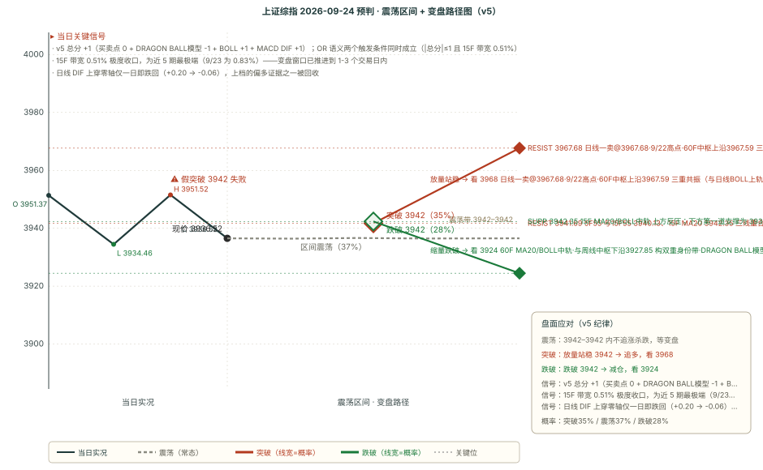

# 作战报告 · 晨报 · 2026-09-24（周四）

> 档位：晨报（morning）｜星球窗口：2026-09-23 16:31 ~ 2026-09-24 08:19（**52 条**）｜数据时点：09-24 08:19
>
> 现价基准 = 9/23 收盘 **3936.52**（-0.39%）；O 3951.37 / H 3951.52 / L 3934.46，振幅 17.06 点（**0.43%，9 月以来最窄之一**）
>
> 上一档（9/23 午间）的目标日为 9/23，本档已完成其**四维复盘**；本期对 9/24 全天给出预判
>
> ⚠️ **本档最关键的变化（一句话）**：日线 DIF **上穿零轴仅一日即跌回**（+0.20 → **-0.06**），上档列为偏多证据的第二条**已被回收**；同时 15F 带宽由 0.83% 进一步收窄至 **0.51%**（近 5 期最极端）。
>
> 🔁 **本档口径提示**：`levels.date` 字段本期填的是**数据基准日**（9/23）而记录 id 是**目标日**（9/24）——这一差异导致 SVG 生成脚本按默认规则把图写成了 `000001_forecast_2026-09-23.svg`（**覆盖了 9/23 午间档的走势图**），已用 `--out` 显式指定重生成至 `000001_forecast_2026-09-24.svg`。**建议下一档起统一把 `levels.date` 填为目标日**，并给脚本加一道「目标日 vs 数据日」的显式校验。

---

## 核心主线速览（三行）

1. **AI 硬件链从「需求叙事」转向「产能瓶颈的量化」**：供应链售罄 12-18 个月、InP 衬底成最大瓶颈、1.6T DSP 供不应求、HVLP 铜箔良率仅 65-70%、T 布排期 6 个月。
2. **全球长端利率重新定价（本档新增的系统性压制）**：10Y 美债 +14bp 至 **5.11%**（2007-07 以来最高收盘），10 月加息概率 55% → **69%**，美股四大指数全跌、半导体结束六连涨。
3. **本期维持「方向不明」（v5 +1）**，且**两个触发条件罕见地同时成立**；DRAGON BALL模型 明确偏空（考验 60F 中轨），剧本 A35／B37／C28。

---

## 第一块 星球信息（知识星球晨报 · 52 条窗口内）

> 六球有效（基业长青+ 31 + 卫斯李 9 + 180K Research 7 + 大鹏鸟 3 + AI 产业链地图 1 + DRAGON BALL模型 1）；短评&信息、信息平权、投行圈子、口罩哥本窗口内 0 条，说明见附录 A
>
> 本块只做「事实落地」，结论层推导统一放第二块与第四块

### 一、核心主线（按强度排序）

#### 1. AI 硬件链的「实物紧缺」被密集量化——五条互不重叠的链同一天给出硬约束

- **光通信（大摩 ECOC 大会观察：全速前进）**：**多数元器件/系统供应商未来 12-18 个月产能已售罄**；**磷化铟（InP）衬底成为最大产能瓶颈**（涉及 AXTI、Sumitomo）；**NPO 商业化时点一致指向 2028 年**，**Open CPX MSA 推动开放生态成型**，缓解此前 hyperscaler 对「供应商锁定」的抵触；第一代 NPO 大概率**全部采用外置激光器** → **高功率激光器需求将大幅攀升**（利好 LITE/COHR）；**首选 KEYS**（路径无关受益者）。
- **电芯片（野村 AI 专家电话会）**：**1.6T DSP 依赖 3nm、产能严重不足**——2026 年需求超 **2,000 万颗**但实际出货仅约 **1,600-1,700 万颗**，产能预计 **2027 下半年**才显著释放；800G DSP LTA 价 45-70 美元、1.6T LTA 价 120-150 美元（零售溢价 10-20%）；**NPO/CPO 下 DSP 被移除**，均衡/误码校正转由 TIA/驱动器承担。
- **铜箔（德福专家口径 0923）**：**高端 HVLP 铜箔良率仅 65-70%**；**3 倍上修明年 HVLP4 产能规划**；**四季度 AI 用铜箔非常缺、尤其是 HVLP3/4，加工费继续上涨 10% 以上**；RCC 专用铜箔全球仅三井和德福等个别公司生产。
- **电子布（宏和科技中信里昂香港策略会）**：**T 布排期已拉长到 6 个月**；客户订单指引**远远大于**公司所有已有+新建产能；**客户锁 T 布产能到 28-29 年，大量客户追加保证金希望锁到 2030 年之后**；日本调研反馈 **T 布单月需求量增长保守 7 倍以上**；**毛利率维持 70%+**。**现场小范围全部挤满投资者。**
- **光纤（瑞银首次覆盖中国光纤行业）**：板块股价自 6 月高点已回调 **37%**，瑞银认为**产能过剩风险被夸大**；**2026-2030 全球光纤需求 CAGR 11%**（数据中心 CAGR **37%**），**2030 年数据中心占比超 45%**；**上游预制棒扩产周期由 1.5-2 年延长至 2-3 年**，供需紧张至少维持至 **2027-2028**；长飞 H 股目标价 **330 港元（上行约 73%）**、A 股维持中性（上行约 12%）；**H-A 折价约 57%**，显著宽于同业。
- **存储链（三重印证）**：① **高盛——SK 海力士**（重申买入，目标价 350 万韩元、**上行 87.4%**）：2026 年剩余时间内存价格环比持续增长、**HBM4 年底前收入占比扩大**、2027 年 HBM ASP 受供需双重驱动上涨；**龙仁新厂 2027-02 启用但量产不早于 2027 年底**；**服务器内存（含 HBM）占 DRAM 收入约 60%，LTA 覆盖率最终达 50% 并非不可能**。② **伯恩斯坦——长鑫科技**（维持跑赢大盘，目标价 70 元、上行 21%）：**G5 有源区半节距 11.95 纳米**，与三星/SK 海力士/美光最新量产节点（1c/1γ nm）极为接近，**最小线宽已跻身全球第一梯队**；但 **G5 领先节距靠四重光刻图案化实现，良率损失风险更高**，量产竞争力**仍需出货记录验证**；**2026E 营收同比 +633%、毛利率 88.1%**。③ **野村《芯片经济学》**：标题即「**芯片短缺加剧，延长景气周期**」。

#### 2. DRAGON BALL模型 本期定调（9/23 22:21 · 本档唯一方向因子来源）

> 本期窗口内共 **1 条**（全窗口唯一），原文已一字不差归档至 `outputs/DRAGON_BALL_原始记录_2026-09-24.md`

- **原文（一字不差，137 字）**：「今天市场震荡调整，尾盘略微刺破了 15F55 线。昨晚写到因为 120F 极强都失败了，所以无缝传递到日线极强有难度，概率低于刺穿 15F55 线去找 60F 中轨支撑，我认为明天还是会考验 60F 中轨的。如果大幅击穿了 60F 中轨，意味着调整将延续到节后，因为日线上今天一跌，又是一个顶分型。」
- **四要素拆解**：① **方向**（**考验 60F 中轨** = 向下）；② **决策位**（**60F 中轨 3924.46**，距现价仅 **-0.31%**）；③ **条件分支**（**大幅**击穿 → 调整延续到节后）；④ **结构依据**（日线 9/23 一跌**又形成顶分型**，与引擎B「日线一卖@3967.68」同源）。
- **与上档的对照**：上档（9/23 午间）DRAGON BALL模型 为**缺失**（判 0），本期 DRAGON BALL模型 **明确给出 -1**——**方向因子由「沉默」转为「反对」**，这是本档与上档最重要的差别之一。

#### 3. 全球长端利率重新定价（本档窗口内新增，上档完全未覆盖）

- **触发链条**：① PMI 意外爆表——美国**服务业 PMI 初值 58.7**（预期 55.8，**59 个月新高**）、**制造业 57.0**（预期 53.7，**52 个月新高**），综合产出 58.4 为 **2021-07 以来最快扩张、连续第四个月加速**；**9 月企业投入成本以四年来最陡峭速率飙升**。② 美联储理事 **Barr 鹰派演讲**。③ **700 亿美元 5 年期国债拍卖历史性疲弱**（5Y **2007 年以来首次升破 5%**）。
- **市场反应**：**10Y 收益率 +约 14bp 至 5.11%**（2007-07 以来最高收盘、2025-04 以来最大单日变动）；**2Y +约 14bp 至约 4.89%**（2024-05 以来最高）；**10 月加息概率由约 55% 升至约 69%**（一个月前仅约 9%），**市场对未来一年累计近四次加息定价**。
- **美股**：四大指数全跌——**罗素 2000 -1.8%**、**纳指 -1.1%**、标普 -0.75%、道指 -0.68%；**市场广度崩塌，11 个板块仅能源上涨（+1%）；半导体结束连续六日上涨**。
- **卖方分歧（8 家）**：**偏鹰**——Wells Fargo「**真正的重新紧缩周期已经开始，整条收益率曲线同时重估**」、BMO「需求驱动型通胀重新加速」、Procyon「可能还会再加息两到三次」；**偏鸽**——Thornburg「一年内加息四次是对经济背景的剧烈反应」、Allspring「利率/紧缩/油价**相当于对经济增长征税**」、UBS CIO「通胀冲击不会广泛或持久到足以破坏经济增长」。
- **SOFR 期权反向信号**：截至 9/22 收盘，**2027 年 3 月 SOFR 看涨期权未平仓约 270 万手，较同期限看跌期权多出约 100 万手**——交易员正押注美联储路径**比市场定价更平缓**（与 69% 的加息概率构成直接对立，见第二块相反观点①）。

#### 4. 柴油成为全球能源市场的「最后一根稻草」：白宫拟 90 天出口禁令

- **事件**：Politico 报道称**白宫正在 11 月中期选举前筹备潜在的 90 天柴油出口禁令**（援引五位知情人士）；**特朗普表态支持**（财长贝森特已被指派评估可行性），但**能源部长赖特公开反对**——「**禁止柴油出口这种简单粗暴的手段绝对行不通**」。白宫官员称该报道为「Politico 炮制的又一则假新闻」，但**市场已按真实风险定价**。
- **即时价格反应**：**美国柴油期货暴跌逾 7%**；**欧洲柴油期货飙升逾 7%**；**欧洲柴油对布伦特溢价跃升至 95 美元/桶以上，为彭博 2011 年有数据记录以来最高**。
- **规模量级**：全球每日海运柴油 800 万桶，**美国供应约 150 万桶（约 20%）**；禁令将令约 **150 万桶/日滞留，占美国柴油产量 29%**；彭博情报估计墨西哥湾沿岸储能**仅能吸纳约三周**；标普全球能源估计**原油加工量可能需减少近 200 万桶/日**。
- **并行的运费冲击（FT）**：中东至亚洲航线 **VLCC 日租金首次突破 120 万美元**（一个月前翻倍多、年初水平的 **40 倍**）；**全球约 15% 的油轮船队滞留阿曼沿海海域**；Energy Aspects——「短期内运费极有可能成为**压垮市场的最后一根稻草**」；Argus——「**运费已占原油运抵炼厂总成本五分之一**」。**中国部分大型独立炼厂已开始下调开工率。**

#### 5. 消费级 AI 的代理（Agent）拐点 + 超大规模云 Q2 分化

- **伯恩斯坦《消费者 AI 使用追踪报告 Q3》**：**ChatGPT 全球 MAU 占比约 64%**（2025-08 为 78%）、美国约 60%；**Gemini 已确立全球第二大 AI 平台**、**Claude 正快速追赶**；**Meta Muse（9/8 上线）10 天内登顶美国 App Store 下载榜**；**ChatGPT 全球下载量自 2026-04 起同比转负、8 月同比 -27%**，而 Gemini/Claude/Meta AI 8 月全球同比 **+79% / +754% / +363%**；**行业合计下载量同比仅增 6%，初现平台期信号**。**投资启示（原文）**：「消费者 AI 正从『聊天工具』向『任务代理』跃迁，平台竞争焦点将逐步从**下载量与 MAU** 转向 **DAU、留存率及任务完成率**。」
- **伯恩斯坦《超大规模云季度综述》**：**最显著的结构性变化是「此前被视为落后者的一方在 AI 云赛道脱颖而出」**——**谷歌新增云收入绝对值已逼近微软**（云收入同比 **+82%**、利润率扩张至约 36%），**甲骨文依托较小基数实现远超同侪的增速**（**RPO 高达 6,640 亿美元**，核心来自 **OpenAI 约 3,000 亿美元 RPO**）；**AWS 收入同比 +37%**（18 个季度以来最快）；**全体 CSP 一致指向产能约束，瓶颈已从「GPU 可得性」切换至「已通电的物理数据中心容量」**；**CoreWeave 列跑输大盘**（资本开支 94 亿美元 vs 收入 25.8 亿，**报告利润与资本部署存在显著错配**）。

#### 6. 国内机构节前定调趋于一致：轻仓过节 + 结构性机会

- **游资端（连续三个时点同向）**：9/23 晚汇总——「老美开盘比较平淡。**国内信息也很少，预计节前也就这样了。轻仓过节。**……**这里还是看投机。**」；9/24 早盘前——「**大消息没有**，昨天盘中发酵了一个矢量分析仪，小众了一些。不过这两天**科技小妖还挺猛**……**目前还是投机线更火爆一些。**」
- **机构侧音频线索（20 个 mp3）**：**「第二阶段收尾加速行情值得期待——2026 年四季度 A 股投资策略」**、**「西部策略-地产反转了吗？」**、**「A 股风险偏好迎来修复，科技成长或占优」**、**「AI 应用增长与港股互联网战略看多」**——**四条偏多口径与「轻仓过节」在时间尺度上形成张力**（见第二块相反观点③）。
- **一条容易被忽略的上游信号**：「**国内科技——硅片涨价**」（9/24 早盘前），与上一档已读的「12 吋矽晶圆 2027 长约涨价 15-25%」相互印证——**连续两期出现的同向上游涨价信号**。
- **食饮/消费调研密集但信息偏中性**：黄酒（兰亭 Q3 维持倍增、1743 同增约 80%、绍兴成熟市场开瓶率 70-80%、今年量预计翻番至接近 3 亿元，**但均提示「省外动销与复购尚不具代表性」**）；低度酒（RTD 库存 3.7-3.8 个月、双节预计消化 1-1.5 个月）；精酿零售（自有品牌是「一号位工程」）。
- **上峰材料交流**：IC 基板现有中低端产品毛利率 25%、行业长期中枢 20-30%；持有投资公允价值 100 亿元+；水泥目标产能从 2,000 万吨提升至 3-4,000 万吨。
- **普利特/Prismark PCB 专家要点**：**CPO 对高速覆铜板影响大概率可控**（M7 或更高等级预计仍被采用）；**PTFE 落地尚未敲定、可加工性仍是核心制约**（「通过认证」≠ 可规模化制造）；**树脂或将成为覆铜板的下一个差异化赛道**；**高端 HVLP 铜箔供给仍存在结构性约束**（受制于良率与品质爬坡，而非铭牌产能公告）；行业格局持续利于存量头部厂商。

---

## 第二块 信息判断（跨星球观点对比 + 共识复盘）

### 一、跨星球观点对比

#### 共同观点（结论式，细节见第一块）

1. **AI 硬件链的紧缺已从「需求叙事」下沉到「产能瓶颈的量化」**——光通信售罄 12-18 个月 + InP 衬底瓶颈、1.6T DSP 供不应求、HVLP 铜箔良率 65-70%、T 布排期 6 个月、光纤预制棒扩产周期拉长，**五条链彼此独立却同向**。
2. **存储景气度获三重独立印证**——SK 海力士（价格与 LTA）、长鑫 G5（技术对标，但良率待验证）、野村（芯片短缺延长景气周期）。
3. **全球长端利率重新定价是本档窗口内最强的外生变量**——10Y 5.11%、10 月加息概率 69%、美股广度崩塌，**且完全落在上一档窗口之外**。
4. **能源侧的「最后一根稻草」是运费与柴油禁令，而非原油本身**——VLCC 日租金 40 倍、中国地炼已下调开工率。
5. **国内机构对 A 股短期口径高度一致：节前缩量、轻仓过节、投机线为主**——游资连续三个时点同向，量能连续 4 日递减。

#### 相反观点

**① 长端利率路径：SOFR 期权净多 100 万手（押注更平缓） vs 10 月加息概率跃升至 69%（押注更激进）**

- **看平缓侧（头寸证据 + 4 家机构）**：截至 9/22 收盘，**2027 年 3 月 SOFR 看涨期权未平仓约 270 万手，较同期限看跌期权多出约 100 万手**，表明交易员正押注美联储路径**比当前市场定价更为平缓**；Thornburg——「**一年内加息四次是对经济背景的剧烈反应**，将对宏观产生切实的连锁冲击」；Allspring——「收益率走高、货币政策趋紧以及油价上涨，**实际上都相当于对经济增长征税**」；Constitution Capital——「资金流向暗示美联储**还剩一两次谨慎加息空间**」；UBS CIO——「**能源供应中断相对有限，通胀冲击不会广泛或持久到足以破坏经济增长**」。
- **看激进侧（数据证据 + 3 家机构）**：PMI **服务业 59 个月新高 / 制造业 52 个月新高**、**投入成本四年来最陡峭**、**近二十年调查史上（除疫情外）最严重的供应链瓶颈之一**；**10 月加息概率 55% → 69%**（一个月前 9%）；Wells Fargo——「真正的重新紧缩周期已经开始，**整条收益率曲线同时重估**」；BMO——「**需求驱动型通胀重新加速的风险**」；Procyon——「美联储此时不可能降息或暂停，可能还会再加息两到三次」。
- **判定：未决，且这是本期最重要的分歧。** 两方**都有可验证路径**——头寸侧看的是**市场定价是否过量**，数据侧看的是**通胀是否重新加速**。**分界指标**：① **10 月 FOMC 是否落地加息**；② **9 月核心 PCE 与下月 PMI 投入成本分项**。**对本档的用法**：因该分歧未决，本档**不把它作为方向分因子**，但把它列入**剧本 C 的新增触发条件**（10Y 维持 5.10% 上方）。

**② 中国 AI：国内机构「科技成长占优 / AI 应用战略看多」 vs 监管调查 DeepSeek/Moonshot + HSI 阿里领跌**

- **看多侧**：三条国内机构口径同向（「**A 股风险偏好迎来修复，科技成长或占优**」「**AI 应用增长与港股互联网战略看多**」「**AI 大模型快速发展，参数将达 10 万亿**」）；**产业侧实物验证密集**——佰维存储 +2.5%（45 亿元先进封装三期）、**HBM 主题 +2.4%**、宏和 T 布毛利率 70%+、德福 Q4 加工费再涨 10%+；**资金流局部支持**——GS **「买入半导体设备」连续两期**。
- **看空/提示侧**：**有报道称政府正在调查包括 DeepSeek 与 Moonshot 在内的大语言模型开发商的数据安全实践**，**HSI -1.01% 创 9/10 以来最大单日跌幅、阿里为最大拖累**；**GS 资金流同时「卖出 AIDC 电源与 CCL」**；**A 股当日计算机 -1.23%、传媒 -2.30% 双双领跌**。
- **判定：不是方向对立，而是「分层对立」。** 偏多侧的证据集中在**上游材料与设备**（铜箔/布/衬底/预制棒/半导体设备），偏空侧的压制集中在**中游基建与下游软件/应用**（AIDC 电源、CCL、AI 软件、大模型）。**两层同时成立**，故本档将 AI 硬件链的分歧**从「板块内部分歧」细化为「按实物紧缺程度分层」**（与共识复盘第 3 条一致）。

**③ A 股的时间尺度：短期「轻仓过节 + 无量行情 + 投机线」（防守） vs 中期「第二阶段收尾加速行情」（进攻）**

- **短期防守侧**：游资连续三个时点（9/23 晚 / 9/24 早）口径一致——「**国内信息也很少，预计节前也就这样了。轻仓过节**」「**大消息没有**……还是**投机线**更火爆」；**量能 9/23 为近 6 日最低**，5 日窗口内自 9/17 起**连续 4 日递减**；MSCI 综述亦载「**假期效应拖累了中国及部分北亚市场的成交量，这些市场即将进入延长的休市期**」。
- **中期进攻侧**：四条机构口径同时出现（**四季度策略「第二阶段收尾加速行情值得期待」**、**「地产反转了吗？」**、**「A 股风险偏好迎来修复、科技成长或占优」**、**「AI 应用增长与港股互联网战略看多」**）。
- **判定：时间尺度差异型对立，不冲突。** 短期（节前最后几个交易日）指向**缩量防守**，中期（四季度）指向**加速行情**。**本档预判取短期口径**（目标日 9/24 在节前窗口内），中期口径列为**观察项、不进预判字段**。

#### 隐含共识

**所有星球都不讨论指数级崩跌或普涨，全部落在「实物紧缺的上游材料 / 节前缩量 / 外围利率」三个变量上**——这与本期技术面「**总分回到 ±1 平衡带 + 15F 带宽 0.51% 极端收口**」互为印证：**指数在收口区间内，胜负在结构分层与节奏**。

#### 独立视角：DRAGON BALL模型 是本轮唯一给出「决策位 + 条件分支」的体系

本期六个共同观点中，五个来自卖方机构与本档盘面数据，**只有 DRAGON BALL模型 给出了可执行的决策位链条**（考验 60F 中轨 3924.46 → 大幅击穿则调整延续到节后 → 依据是日线又形成顶分型），**且该决策位距现价仅 -0.31%（12.06 点）**——本期第四块的剧本触发条件直接建立在该框架上。**须注意本档 DRAGON BALL模型 的方向与本档 v5 总分的分歧**：DRAGON BALL模型 明确偏空（-1），而 BOLL 长端与日线 DIF 给出 +1/+1，**总分因此被压回 +1 平衡带**——这正是「方向不明」的成因，而非任何一方的缺席。

### 二、上期共识复盘（9/23-noon 共识链 → 9/24 开盘前判定）

| 上期共识                                    | 判定                           |
| --------------------------------------- | ---------------------------- |
| ① 中国储能：瑞银「2026 逆风、2027 反弹」              | ⚠️ **未决**                    |
| ② 中国房地产：房贷补贴传闻驱动困境房企大涨                  | ✅ **偏多侧验证**（归因须修正）           |
| ③ AI 硬件链：研报侧看多 vs GS 资金流反向              | ❌ **看空侧连续第二期验证**（分歧已细化为「分层」） |
| ④ 隔夜全球：油价与长端利率同步回落                      | ❌ **反向（长端利率假设被推翻）**          |
| ⑤ 家电出口退税 / 欧洲热泵替换                       | ⏸ **无当日可观测指标**               |
| ⑥ 半导体与 WAIC 级催化（矽晶圆 / 散热 / 玻璃基板 / 佰维三期） | ✅ **部分验证**                   |
| ⑦ A 股短期定性：节前缩量 + 无量温和                   | ✅ **验证（本档进一步强化）**            |
| ⑧ 两场家电/出口政策专家交流                         | ⏸ **同第 ⑤ 条**                 |

- **② 房地产（偏多侧被验证，但归因须修正）**：9/23 申万一级**房地产 +0.40% 居首、缠论方向分 +5.0 亦居首**，万科 +2.9%。⚠️ **但本期新增的事实是**「有报道称**监管机构已要求部分银行延长还款期限，并避免将逾期贷款计入不良贷款**」——这可能才是港股中国地产股 +15% 的直接驱动。**这与上档归因的「房贷补贴传闻」是两条不同的政策路径**（前者是**风险缓释/不良化解**，后者是**需求刺激**）。本档据此把地产驱动逻辑标记为**待重新归因**。
- **③ AI 硬件链（看空侧连续第二期验证）**：GS 资金流**连续第二期「买入半导体设备、卖出 AIDC 电源与 CCL」**；**计算机 -1.23%、传媒 -2.30% 领跌**（AI 软件/应用端在领跌一侧）。**同时偏多侧亦有验证**：佰维存储 +2.5%、HBM 主题 +2.4%，电子是本期唯一「三要素共振」标的。**结论：分歧形态从「板块内部分歧」细化为「按实物紧缺程度分层」**。
- **④ 长端利率（假设被推翻，但须注明作者已先行修正）**：上档已读口径含「油价大概率已见顶」「**长端美债或见顶**」——后者在 9/23 夜盘被明确推翻（10Y +14bp 至 5.11%、5Y 2007 以来首次破 5%）。⚠️ **口径校正**：该作者本人在 9/24 早的隔夜评论中已给出修正（「美债开始跟油价脱钩，哪怕油价继续下跌，长端美债可能也要跌不下去了」被市场反向验证）。本档记为「**该预判在发表后 24 小时内被市场修正，且作者本人已先行修正**」，而非机械记为「错误」。
- **⑦ 节前缩量（验证并强化）**：9/23 成交 **1.78 万亿**；量能序列显示 5 日窗口内自 9/17 起**连续 4 日递减**，9/23 为**近 6 日最低**；游资连续三个时点口径一致。

### 三、本期新共识（已追加 consensus_chain，避免重复不展开）

本期新增 7 条（5 条 mid + 2 条 short）与 3 组相反观点：AI 硬件链实物紧缺量化／存储链三重印证／全球长端利率重新定价／柴油与运费冲击／消费级 AI 代理拐点／超大规模云 Q2 分化／国内机构节前定调。细节见第一块，此处不重复。

---

## 第三块 技术分析（缠论买卖点 + BOLL×缠论变盘）

> 现价基准 = 9/23 收盘 **3936.52**（-0.39%）；O 3951.37 / H 3951.52 / L 3934.46，振幅 17.06 点（0.43%）

### 引擎 B：chan-signal 缠论买卖点（五周期）

| 周期 | 趋势 | 买卖点 | 中枢 | 位置 |
|---|---|---|---|---|
| **日线** | 向上 | 一卖 @3967.68（conf **0.8**） | 3884.44-3842.72 | 中枢上方 |
| **周线** | 向上 | 一卖 @3995.18（conf 0.5） | 3927.85-4034.08 | 中枢下方 |
| **60F** | 向上 | 三卖 @3891.48（conf 0.75） | 3927.55-3967.59 | 中枢下方，**现价高于其 +45.04 点，效力已被否定** |
| **15F** | **向下** | 无信号（笔 31） | 无中枢 | — |
| **5F** | **向下** | 无信号（笔 29） | 无中枢 | — |

**定性**：五周期结构为「日/周/60F 向上 + **15F/5F 向下**」——**与 9/23 午间首次出现的镜像结构保持一致，说明这是结构级切换而非单档噪声**。**60F 三卖@3891.48（conf 0.75）被现价站上 +45.04 点，效力被否定、不计分**。
**买卖点对方向分的贡献**：60F 三卖不计分；15F/5F 无信号；日线一卖/周线一卖按规则不进方向分（仅作点位锚） → **0**

> ⚠️ **本因子第 5 期连续计 0**——引擎B 近 5 个档期的 15F/5F 均处「无信号」状态，**买卖点维度对方向分的贡献已连续 5 期为空**，这是本模型当前最突出的**因子覆盖度缺口**。

### BOLL×缠论变盘概率（多因子方向打分）

| 级别 | 中轨 | 变盘概率 | 判定 | 关键变化 |
|---|---|---|---|---|
| **15F** | 3942.35 | 涨 **19%** / 跌 **81%** | **看空** | 带宽 **0.51% 极度收口**（近 5 期最极端）；偏离 62pct |
| **60F** | 3924.46 | 涨 **72%** / 跌 28% | **看多** | 偏离 **22pct 越阈**；带宽 2.92% 常态 |
| **120F** | 3908.80 | 涨 **88%** / 跌 12% | **看多** | 偏离 38pct（v5 不取该级别）；带宽 3.13% 开口 |
| **日线** | 3930.15 | 涨 **72%** / 跌 28% | **看多** | 偏离 **22pct 越阈**；带宽 3.34% 开口 |

**本期技术面最值得注意的两点**：
1. **短长端方向深度冲突**——**15F 看空 81%** 与 **60F/日线 双双看多 72%**、**120F 看多 88%** 并存。按 v5 现行规则 BOLL 因子**只取 60F/日线**，故本期取 60F 与日线同向偏多 → **+1**。这与 9/21 晨报的形态（15F 72% 看多 vs 日线 81% 看空）**恰好反向**——**两端换了边，冲突依旧**。
2. **15F 带宽 0.51%（近 5 期最极端）**——较 9/23 的 0.83% 进一步收窄，**变盘窗口已推进到 1-3 个交易日内**。

**关键轨道（四级中轨，由高到低）**：15F 3942.35（+0.15%）／日线 3930.15（-0.16%）／60F 3924.46（-0.31%）／120F 3908.80（-0.70%），**现价 3936.52 夹在 15F 中轨与日线中轨之间**。
**共振状态**：① **日线一卖@3967.68 与日线 BOLL 上轨 3995.72 相距 0.71% → 评级「弱共振」**（上档尚无此验证，本期新增）；② 60F 三卖 3891.48 与 60F 中轨相距 0.84% → **「无共振」**（已因现价站上而解除）；③ **15F 路径推演明文：「反弹 3942.35 中轨是卖点」** —— **与第五块压力位判定同价，两个独立体系在此位一致看压制**。

> **术语注：BOLL 中轨 ≡ MA20**（数学恒等，同一数值的两种叫法）——本报告统一以「BOLL 中轨」为正式名，仅在「关键均线与 MACD」表中保留 `MA20` 列名以对应引擎原始输出。

### 关键均线与 MACD（DRAGON BALL模型 55 线体系 + 级别分裂）

| 周期 | MA20 | MA55 | DIF | 前值 | DIF 方向 | 区域 |
|------|------|------|-----|------|---------|------|
| 日线 | 3930.15 | 3907.04 | **-0.06** | +0.20 | **向下（跌回零轴下）** | 多头区 |
| 120F（合成） | 3908.80 | 3925.72 | 5.37 | — | **向上** | 多头区 |
| 60F | 3924.46 | 3917.15 | 11.48 | 12.51 | 向下 | 多头区 |
| 30F | 3946.71 | 3910.78 | 5.43 | — | 向下 | 空头区 |
| 15F | 3942.35 | 3940.13 | **-1.93** | — | 向下 | 空头区 |
| 5F | 3938.55 | 3941.69 | -1.08 | — | 向下 | 空头区 |

**级别结构**：**短端全面转弱、长端仍偏多**——**5F/15F/30F/60F 四个短中级别 DIF 全部向下**，仅 **120F 向上**；**日线 DIF 由 +0.20 回落至 -0.06**，**上穿零轴仅一日即重新跌回零轴下方**。
**DRAGON BALL模型 55 线体系**：现价 3936.52 站上 **日线 MA55 3907.04（+0.75%）**、**日线 MA20 3930.15（+0.16%）**、**60F MA55 3917.15**、**120F MA20 3908.80**；但**下方贴身支撑已被压缩**——5F55 3941.69 与 15F MA20 3942.35 **已在现价上方**（转为反压），15F55 3940.13 亦然。
**DRAGON BALL模型 本期三条核验**：
1. **「明天还是会考验 60F 中轨」** → 目标位 **3924.46**，距现价 **-0.31%（12.06 点）**，**且与周线中枢下沿 3927.85 仅差 3.39 点**，构成**双重身份带**；
2. **「大幅击穿则调整延续到节后」** → 条件分支，**触发时点为盘中/次日**，本档列为剧本 C 的判定标准；
3. **「日线上今天一跌，又是一个顶分型」** → **与引擎B「日线一卖@3967.68」同源**，属结构级确认（该卖点 conf 0.8 为五周期最高）。

### 四周期联动 + 区间套

| 周期 | 价 3936.52 位置 | MA55 | 信号 |
|------|-------------|------|------|
| 日线 | 中枢上方（3884.44-3842.72） | 3907.04（上方，+0.75%） | 一卖@3967.68 |
| 120分钟 | 中枢内部 | 3925.72（下方，+0.27%） | — |
| 60分钟 | 中枢下方（3927.55-3967.59） | 3917.15（上方，+0.49%） | 三卖@3891.48 |
| 15分钟 | 无中枢参考 | 3940.13（**下方，-0.09%**） | 无 |

**区间套**：日线→120F 弱／120F→60F 弱／60F→15F 无信号——**三条仍全部为「弱」**，级别间无共振。**注意 15F MA55（3940.13）已转为现价上方**——即 DRAGON BALL模型 所指「尾盘略微刺破 15F55 线」在本档收盘口径下**为「收在其下方 3.61 点」**。

---

## 第四块 预判（技术预判与复盘）

### 一、上期复盘（9/23-noon → 9/23 实际收盘）

> 上期（9/23 午间档）的方向字段原文为「**方向不明**」，故方向维按半权重口径判定。

| 维度 | 预判 | 实际 | 判定 |
|---|---|---|---|
| 方向 | 方向不明 | 收 -0.39%（走弱侧） | ⚠️ **部分**（引擎 ❌ miss，人工按「方向不明而实测走出某一侧」校正） |
| 区间 | 核心 3936-3952 | L 3934.46 / C 3936.52 / H 3951.52 | ✅ **命中** |
| 支撑 | 主支撑 3842.72 | low 3934.46，主支撑未测 | ✅ **held** |
| 压力 | 3948.72 | 盘中高 3951.52 突破但收盘回落 | ✅ **守住**（假突破被证伪） |

- **方向（⚠️ 部分）**：引擎机械抽取上档 `direction` 字段措辞判为 `❌ miss`。**人工校正为 ⚠️ 部分**——依据是上档该字段原文即为「**方向不明**」，按 9/21 起沿用的口径「方向不明而实测走出某一侧 → 记 ⚠️ 部分」。**引擎 ❌ 供双口径留档。**
- **区间（✅）**：核心带 3936-3952 被完整包裹——最低 **3934.46** 仅低 1.54 点、收盘 **3936.52** 贴下沿 0.00 点、最高 **3951.52** 在上沿内侧 0.48 点。**这是本期四维中质量最高的一项。**
- **支撑（✅）**：主支撑 3842.72 **当日未被测试**；但须补注——**15F55 多空线（当时口径）被盘中轻微跌破后收回**（DRAGON BALL模型 原话「尾盘略微刺破了 15F55 线」）。按「主支撑优先」口径判 ✅，**并把 15F55 的刺破记入观察项**。
- **压力（✅ 守住）**：上档主压力 3948.72 被盘中最高 3951.52 突破 **+2.80 点**，但**收盘 3936.52 回落至其下方 12.20 点**——按 2026-08-31 实装的「压力位突破确认」规则（须「**放量 + 收盘站稳**」双条件），**该突破不成立、记为「假突破」，压力位实际守住**。

**配对结果：方向 ⚠️ ／ 区间 ✅ ／ 支撑 ✅ ／ 压力 ✅** —— 四项中三项命中、一项部分。

### 二、偏差观察统计表（54 期 · v5 配对计数 · 截止 2026-09-24 08:45）

| 维度 | ✅ 命中 | ⚠️ 部分 | ❌ 失效 | 纯命中率 | 含部分口径 |
|------|------|------|------|---------|------|
| 方向 | 28 | 20 | 6 | **51.9%** | 70.4% |
| 区间 | 19 | 30 | 5 | **35.2%** | 63.0% |
| 支撑 | 37 | 7 | 10 | **68.5%** | 75.0% |
| 压力 | 30 | 11 | 13 | **55.6%** | 65.7% |

**本期变化**：新增 `9/23-noon` 一个完整样本，统计期数 53 → **54 期**。方向 ⚠️ +1（52.8% → **51.9%**）；区间 ✅ +1（34.0% → **35.2%**）；支撑 ✅ +1（67.9% → **68.5%**）；压力 ✅ +1（54.7% → **55.6%**）。**四维中三维的纯命中率本期同时上升**（区间 / 支撑 / 压力），仅方向因新增一个 ⚠️ 样本而小幅回落。

**结构未变**：支撑（68.5%）> 压力（55.6%）> 方向（51.9%）> 区间（35.2%，**连续 54 期垫底**）。区间维「部分」占比 **30/54 = 55.6%**，仍是四维中最高——**区间判定本质是「方向对、幅度差一点」**，非方向错误。该结构连续 54 期未变，**继续观察、不修改规则**。

### 三、本期预判（9/24 全天）

#### 一句话预判

> **方向不明（v5 +1），核心带 3932-3952（精确 3932.23-3952.48）**。日线 DIF 跌回零轴下、DRAGON BALL模型 明确偏空（考验 60F 中轨 3924.46），但 60F 与日线 BOLL 双双 72% 看多、指数仍站双均线上方；15F 带宽 0.51% 为近 5 期最极端，**变盘几乎必然在 1-3 个交易日内**。剧本 A35／B37／C28。

#### 完整预判字段

| 字段 | 内容 |
|---|---|
| **方向** | 方向不明（v5 总分 **+1**：买卖点 **0** + DRAGON BALL模型 **-1** + BOLL 变盘 **+1** + MACD DIF 拐头 **+1**） |
| **区间** | 3932-3952（核心 20 点，15F BOLL 下轨 ~ 15F BOLL 上轨/9/23 高重合带）/ 3917-3968（扩展 51 点，60F MA55 ~ 日线一卖三重共振） |
| **支撑/压力** | **见下方「关键位相对现价」表（唯一落地处）**——主支撑 = 前低 3842.72（前低+日线中枢下沿完全重合）；主压力 = 5F55 3941.69（与 15F55、15F MA20 三线重合带） |
| **置信度** | **低（本档最弱的一档）**——偏多侧 4 项中已有 1 项（日线 DIF）被回收，有效证据仅 3 项；且本期新增长端利率这一系统性压制 |

#### v5 打分明细

- **买卖点因子（0）**：60F 三卖@3891.48 被现价站上 **+45.04 点**，效力被否定不计分；15F/5F **无信号**；日线一卖/周线一卖按规则不进方向分 → **0**（**第 5 期连续为 0**）
- **DRAGON BALL模型 定调（-1）**：9/23 22:21「**明天还是会考验 60F 中轨**」（决策位 3924.46、距离 -0.31%）+「**大幅击穿意味着调整延续到节后**」（条件分支）+「日线上今天一跌，**又是一个顶分型**」（结构依据）→ 方向明确偏空，且为本档窗口内**唯一**时效定调 → **-1**
- **BOLL 变盘概率（+1）**：60F 涨 **72%**（偏离 22pct，越阈）、日线涨 **72%**（偏离 22pct，越阈），**双双同向偏多** → 取主级别 → **+1**。（120F 涨 88% 亦偏多但 v5 不取；**15F 涨 19%/跌 81% 极度偏空**——**短端深度看空 vs 长端看多，是本期最大的级别冲突**。）
- **MACD DIF 拐头（+1）**：日线 DIF **-0.06**（前值 -1.53，向上，多头区 gap +2.67），按主级别主导取 **+1**。⚠️ **但须重点提示**：日线 DIF 由 9/23 的 **+0.20 回落至 -0.06**——**上穿零轴仅一日即重新跌回零轴下方**，上档列为偏多证据的第二条**已被回收**。
- **总分：0 -1 +1 +1 = +1 → |1| ≤ 1 → 方向不明**

> ⚠️ **附注一（OR 语义的两个触发条件本期罕见地同时成立）**：v5 的「方向不明」有两个 OR 触发条件——① |总分| ≤ 1；② 15F 带宽 < 1%。**本期两个条件同时满足**（总分 +1、带宽 0.51%）。这与前几期的性质**逐一不同**：9/18~9/21 三期是「**平衡型**方向不明」（多空证据强度接近，带宽均 >1%）；9/23 午间是「**总分 +2 已达偏多阈值、仅被带宽拦下**」；**本期是「平衡型 + 极端收口」的双重方向不明**——不仅总分回到平衡带，**收口程度还创近 5 期最极端**（0.51% vs 9/23 的 0.83%）。
> ⚠️ **附注二（与 OBS-1 边界区分）**：上档判 DRAGON BALL模型 为 0 的理由是「无可取定调」，9/21 判 +1 的理由是「可验证的方向性」。本期 DRAGON BALL模型 给出了**明确决策位 + 条件分支**，**不构成 OBS-1 所记的「可验证条件性双向」**（那种是「涨破 X 看多、跌破 Y 看空」的对称无信息表述）——因本期**先验方向已定**（考验中轨 = 向下），条件只决定**幅度/延续时长**，故计 **-1** 成立。
> ⚠️ **附注三（OBS-2 变盘倾向分，本档已实装）**：**本档起该分为正式流程、`A35／B37／C28` 为正式值**（用户 2026-09-24 拍板，v5 现行的 `A40／B35／C25` 退为历史对照）：按 `.workbuddy/calc_turn_score.py` 三因子核算——① **短端背离 0**（5F/15F/30F/60F DIF **全部向下**，向上计数 0 < 阈值 2；长端偏空虽成立但短端不达标）② **量能前兆 0**（9/23 为 4.669e8，未创近 5 日新低——窗口最小 4.529e8 来自 9/18）③ **带宽收口 +1**（15F 0.51% < 1.0%）→ **变盘倾向分 = 1** → 映射 **A-5 / B+2 / C+3** → 归一化后 **A35% / B37% / C28%**（对照 v5 现行分配 A40/B35/C25）。**最高概率剧本由 A 转为 B。**
> ⚠️ **附注四（量能口径差异，如实留档）**：脚本按「**近 5 日窗口**」判量能前兆 → 计 0；但若按「**近 6 日窗口**」，9/23 的 4.669e8 **确为最低**（前 6 日最小 4.409e8 来自 9/15）→ 应为 +1，届时总分将为 **2**、映射变为 **A27%/B38%/C35%**。**该口径已由用户 2026-09-24 拍板：定 5 日（含当日）** —— 与因子 3「15F 带宽」的短端属性对齐，且 `vol_hist[-5:]` 含当日即「近 5 个交易日新低」，与规则「缩量至**近期**极值」表述一致；6 日会把窗口拉到上周，在节前缩量场景下更易把「常态回落」误判成「前兆」。已固化为常量 `VOL_NEWLOW_DAYS=5`。**故本档因子 2 计 0、总分 1 为正式结论**；上列「按 6 日的 2 分版本」仅作口径敏感度留档。
> ⚠️ **附注五**：本报告全篇执行「**信息原子唯一落地**」——关键价位只在下方「关键位相对现价」表中完整落地一次，其余处用整数近似或指针引用。

#### 剧本概率与触发条件

| 剧本 | 概率 | 触发条件 | 路径 |
|------|------|---------|------|
| **A 夺回三线带后挑战三重共振** | **35%** | 放量收复 3940.13-3942.35 三线带并收盘站稳 → 打开 3951.52-3952.48 重合带；**需 15F 带宽向上开口 + 15F DIF 拐头 + 成交额回 2.0 万亿以上** | 3942 → 3952 → 3967.6-3967.7 三重共振（**无放量则视为卖点兑现**） |
| **B 带内窄幅收口震荡、尾盘留待次日** | **37%** | 15F 极度收口 + 节前缩量下，指数在 3924.46（DRAGON BALL模型 考验位）与 3940.1-3942.4 三线带之间拉锯；全天振幅维持 0.4%-0.6% | 3924-3942 带内反复；**本档最高概率剧本**（同时满足「收口持续」与「方向未定」两个已确认条件） |
| **C 跌破双重身份带** | **28%** | 跌破 **3924.46-3927.85** 双重身份带且不收回；**需 15F 带宽向下开口 + DIF 加速下行破 -2.5 + 放量下跌 + 隔夜 10Y 维持 5.10% 上方** | 3924 → 3917.15（60F MA55）→ 3910.78（30F MA55）→ 3907.04（日线 MA55，**最后防线**）；**大幅击穿则调整延续到节后** |

> **剧本 C 的概率较上档上调 3pct（25% → 28%）**，依据：① 日线 DIF 跌回零轴下方（偏多证据回收）；② DRAGON BALL模型 由 0 转 -1；③ 10Y 美债 5.11% 为 2007 年以来最高收盘。
> **下方支撑仍厚**：日线 MA20 3930.15 与 15F BOLL 下轨 3932.23 在跌破前为第一道；主支撑 3842.72（-2.38%）当日仍无被测试的技术条件。

#### 纪律与观察

**纪律（8 条）**

1. **3940.13-3942.35（三线重合带）= 本档第一决策位**——15F55 + 5F55 + 15F MA20 三线重合，**须「放量 + 收盘站稳」方视为有效夺回**；仅盘中一次上穿不构成买入理由。⚠️ BOLL 引擎的 15F 路径推演给的是「**反弹 3942.35 中轨是卖点**」——**与本档压力位判定同价，两个独立体系在此位一致看压制**。
2. **3967.6-3967.7 = 上行空间的实际天花板**——日线一卖（conf 0.8）+ 9/22 高 + 60F 中枢上沿三重共振，且**与日线 BOLL 上轨构成「弱共振」**；**遇放量滞涨应视为卖点兑现而非突破蓄势**。
3. **3924.46 = 本档最关键的多空线（双重身份）**——60F 中轨，**且与周线中枢下沿 3927.85 仅差 3.39 点**；**这也是 DRAGON BALL模型 明示的考验位，距现价仅 -0.31%（12.06 点）**。**跌破且不收回则剧本 C 激活**。
4. **3907.04（日线 MA55）= 偏多前提的最后防线**——本轮「站稳 MA55」的多头结构据此成立，**收盘跌破则本档全部偏多侧证据失效**。
5. **3842.72（前低 + 日线中枢下沿）= 主支撑**，当日无被测试的技术条件（距现价 -2.38%），但**共振余量已连续两期归零**，须留意其退化风险。
6. **不因「总分 +1」而加仓**——OR 语义的两个触发条件本期同时成立，且 0.51% 为近 5 期最极端收口，**变盘窗口已从「在即」推进到「几乎必然在 1-3 个交易日内」**；方向未定前，任何方向性加仓都是赌硬币。
7. **外围利率是本档新增的最大外生风险**——10Y 美债 5.11%、10 月加息概率 69%、美股四大指数全跌、半导体结束六连涨。**「外围利率重定价 + 节前缩量 + 15F 极端收口」三者叠加是本档最需防范的组合**；建议**仓位纪律服从节前效应**（游资端连续两日「轻仓过节」）。
8. **AI 硬件链须区分「实物紧缺」与「估值叙事」**——**有硬约束支撑的环节**：InP 衬底、1.6T DSP 3nm 产能、HVLP 铜箔、T 布/低介电布、光纤预制棒；**而 GS 资金流仍在小幅净卖出，并「卖出 AIDC 电源与 CCL」**——**同一条链内部的分歧连续两期存在，不宜按板块整体加仓**。

**开盘后重点观察（5 项）**

1. **15F 带宽方向**——由 0.51% 转为**向上开口**则剧本 A 激活、转**向下开口**则剧本 C 激活。**这是本档最灵敏的单一观察项**（0.51% 已是近 5 期最极端，任何方向的开口都会很快体现）。
2. **3924.46-3927.85 双重身份带的得失**——DRAGON BALL模型 明示的考验位；**「考验」不等于「击穿」**，收回则 B 剧本成立。
3. **量能能否维持 1.78 万亿**——量能序列已连续 4 日递减且 9/23 为近 6 日最低；若继续缩量至 1.7 万亿下方，则 B 剧本权重上升；**若放量至 2.0 万亿以上伴下跌，则 C 剧本确认**。
4. **隔夜 10Y 美债是否维持 5.10% 上方**——本档新增触发条件；维持或上行将压制高估值成长，下行则缓解。
5. **电子（唯一三要素共振标的）能否延续**——9/23 电子 +0.26% 居第三；若延续则「实物紧缺」叙事得到价格确认；若跟随计算机/传媒回落，则「分层」结论进一步坐实。

#### 关键位相对现价（现价 3936.52）

| 关键位 | 价格 | 相对现价 | 属性 | 依据 |
|---|---|---|---|---|
| 周线一卖 | 3995.18 | +1.49% | 压力（大级别） | 引擎B 周线一卖 conf 0.5 |
| 日线 BOLL 上轨 | 3995.72 | +1.50% | 压力（远期） | 与日线一卖构成「弱共振」（距 0.71%） |
| **日线一卖三重共振** | **3967.68** | **+0.79%** | **压力（上行天花板）** | 日线一卖 conf0.8 + 9/22 高 + 60F 中枢上沿 3967.59 |
| 15F BOLL 上轨 | 3952.48 | +0.41% | 压力 | 与 9/23 高 3951.52 构成重合带 |
| 9/23 高点 | 3951.52 | +0.38% | 压力 | 9/23 最高 |
| 30F MA20 | 3946.71 | +0.26% | 压力 | 短中端均线，已在现价上方 |
| 15F MA20 / BOLL 中轨 | 3942.35 | +0.15% | 压力（带内上沿） | 三线重合带；BOLL 引擎称「反弹至此为卖点」 |
| **5F55** | **3941.69** | **+0.13%** | **压力（主压力·第一决策位）** | 与 15F55、15F MA20 三线重合 |
| 15F55 | 3940.13 | +0.09% | 压力（贴身） | DRAGON BALL模型 称 9/23 尾盘「略微刺破」此线 |
| 5F MA20 | 3938.55 | +0.05% | 压力（贴身） | 短端均线 |
| **现价** | **3936.52** | **0.00%** | **现价（分界）** | 9/23 收盘；本行上下即压力/支撑分界 |
| 15F BOLL 下轨 | 3932.23 | -0.11% | 支撑（第一道） | 与日线 MA20 3930.15 贴合 |
| 日线 MA20 / BOLL 中轨 | 3930.15 | -0.16% | 支撑（结构） | 日线级中轨，跌破则日线转弱 |
| **60F 中轨（DRAGON BALL模型 考验位）** | **3924.46** | **-0.31%** | **支撑（核心·双重身份）** | 60F 中轨 + 与周线中枢下沿 3927.85 仅差 3.39 点 |
| 周线中枢下沿 | 3927.85 | -0.22% | 支撑（双重身份带） | 与 60F 中轨构成 3924.46-3927.85 带 |
| 60F MA55 | 3917.15 | -0.49% | 支撑 | 短中端均线 |
| 30F MA55 | 3910.78 | -0.65% | 支撑 | 短中端均线 |
| 120F MA20 | 3908.80 | -0.70% | 支撑 | 120F 合成中轨 |
| **日线 MA55** | **3907.04** | **-0.75%** | **支撑（偏多前提的最后防线）** | 本轮多头结构据此成立 |
| **前低（9/16）· 日线中枢下沿** | **3842.72** | **-2.38%** | **支撑（主支撑）** | 前低与日线中枢下沿**完全重合**（共振余量连续两期归零） |

---

## 第五块 行业强弱榜（申万一级实时数据 + 星球/缠论/复盘三要素推导）

> 数据时点：2026-09-23 14:29（申万一级 31 行业实时涨跌幅）
> **口径提示**：本档运行时为 9/24 盘前，实时数据为 **9/23 盘中 14:29 快照**；9/23 为下跌日（沪深300 -0.60%、成交环比 -17% 至 1.78 万亿）。

### 一、数据层

#### 1. 实时涨跌幅（申万一级 · 9/23 14:29）

**领涨 TOP5**：房地产 **+0.40%** ｜ 社会服务 +0.31% ｜ **电子 +0.26%** ｜ 机械设备 +0.25% ｜ 医药生物 +0.24%

**领跌 TOP5**：传媒 **-2.30%** ｜ 商贸零售 -1.88% ｜ 煤炭 -1.45% ｜ 农林牧渔 -1.35% ｜ **计算机 -1.23%**

**风格定性：9/23 是「科技内部分化 + 低位补涨」的一天。** 房地产与社会服务居首（低位补涨），电子逆势居第三（**唯一进入前五的科技行业**），而**计算机 -1.23% 与传媒 -2.30% 双双领跌**——**同一条 AI 链内部，硬件与软件/应用出现了明显的反向**，这与第二块相反观点②的「分层对立」结论完全一致。

#### 2. 缠论方向分（申万一级归组 · T+1）

- **做多侧**：**房地产 +5.0（全场最高）** ｜ 美容护理 +4.0 ｜ 轻工制造 +3.3 ｜ 纺织服饰 +3.0 ｜ **汽车 +3.0** ｜ **电子 +2.7**
- **做空侧**：环保 -2.0 ｜ 食品饮料 -1.7 ｜ 国防军工 -1.5 ｜ 有色金属 -1.0 ｜ 综合 -1.0 ｜ 电力设备 -0.7

### 二、推导层（三要素）

#### 做多榜 TOP3

| 行业 | 实时涨跌幅 | 缠论方向分 | 置信度 |
|------|-----------|---------|--------|
| **房地产** | **+0.40%（全场第一）** | **+5.0（全场最高）** | 中 |
| **电子** | +0.26%（全场第三） | **+2.7** | **高（三要素共振）** |
| **医药生物** | +0.24% | +1.7 | 中 |

- **房地产**：**价格与方向分双双居首**——9/23 申万房地产 +0.40%、缠论 +5.0、万科 +2.9%、港股中国地产股 +15%。**驱动归因须注意**：本期新增事实是「监管机构已要求部分银行延长还款期限、避免将逾期贷款计入不良」，与上档归因的「房贷补贴传闻」是**两条不同政策路径**（前者风险缓释、后者需求刺激）。**置信度取中而非高**：方向分 +5.0 虽为全场最高，但**驱动逻辑尚未归因清晰**，且价格涨幅偏温和（+0.40%）。
- **电子**：**本档唯一「三要素共振」标的**——① **实时价格** +0.26% 逆势居第三（在大盘 -0.60% 的背景下）；② **缠论方向分 +2.7** 为正；③ **星球侧产业密度为全窗口最高**——AI 硬件链五条线的硬约束（InP 衬底、1.6T DSP、HVLP 铜箔、T 布、光纤预制棒）**全部落在电子链内**，且本档 18 份已读研报中**过半属电子/通信方向**。**扣分项**：GS 资金流连续两期「卖出 AIDC 电源与 CCL」——**链内分层明显，只宜按细分环节而非板块整体对待**。
- **医药生物**：实时 +0.24% 居前五、缠论 +1.7 为正；**产业侧有支撑**——上档已记录的「美国考虑允许大多数与中国的制药许可交易」政策松动信号延续，且 9/23 盘面「CRO 和生物科技继续引领市场走高，成为行业轮动资金的关键流向」。**不足之处**：本档窗口内医药侧**无新增硬催化**（相关 5 个 mp3 附件未读），故置信度取中。

#### 规避榜 TOP3

| 行业 | 实时涨跌幅 | 缠论方向分 | 置信度 |
|------|-----------|---------|--------|
| **传媒** | **-2.30%（全场末位）** | 约 -0.5 附近 | 中-高 |
| **计算机** | **-1.23%** | 约 -0.3 附近 | **中-高（分层关键）** |
| **国防军工** | -1.18% | **-1.5** | 中 |

- **传媒**：**价格全场末位（-2.30%）**，且属 AI 软件/应用链——与计算机同向。星球侧无正向催化，**「消费者 AI 代理赢家 vs 输家」交易的负面映射（广告/内容分发受冲击）在本期继续**（上档已记录 Muse 冲击 Booking 搜索漏斗、Reddit 称 AI Overviews 未带来流量）。
- **计算机**：**本期最重要的「分层」验证标的**——价格 -1.23% 领跌，**是 AI 链内部与电子反向的直接证据**；叠加**监管对 DeepSeek/Moonshot 数据安全调查**的消息面压制。**「AI 硬件与 AI 软件反向」本期第二次出现**（上档已记录一次），故列为规避。
- **国防军工**：**本期唯一「仅附件命中」行业**（正文零提及、仅挂 1 个附件），缠论方向分 -1.5；价格未见明显异动。**须注意其信息覆盖偏薄**：该行业的判读主要依赖缠论方向分与附件（附件未读），星球侧正文无支撑，故置信度取中。

#### 主线回调观察（非规避）

- **汽车（+3.0，但价格 -0.43%）**：**本期最值得注意的「方向分高、价格未跟」标的**——缠论方向分 +3.0 居前五，但 9/23 价格 -0.43% 回落。这与上档记录的「汽车是星球侧看多行业之一」一致，**属「方向先于价格」的观察型机会**，需价格确认后才可升级。
- **煤炭（-1.45%，方向分未进做多侧）**：价格居领跌第三，与「外部利率上行阶段能源相对占优」的机构框架**形成张力**；但 9/23 美股唯一上涨板块恰为能源（+1%）。**属跨市场背离，列为观察。**
- **商贸零售（-1.88%，方向分未进做多侧）**：价格领跌第二；星球侧有消费调研密集覆盖（黄酒/低度酒/精酿），但**信息偏中性**（均提示「省外动销尚不具代表性」），故不列为做多。

#### 共振/背离说明

- **电子向上共振（本期唯一三要素共振）**：价格（逆势 +0.26%）+ 方向分（+2.7）+ 产业硬约束（五条链）三层同向 → **本期置信度最高的做多方向**，但须按细分环节区分（见上方扣分项）。
- **计算机/传媒向下共振（分层关键）**：价格领跌 + 方向分偏弱 + 消息面（监管调查）与产业逻辑（AI 软件受代理冲击）双重压制 → **与电子构成同链反向，是本期最重要的结构信号**。
- **房地产方向分与价格同向但驱动未明**：+5.0 方向分与 +0.40% 价格**同向**，但**驱动逻辑（风险缓释 vs 需求刺激）尚未归因清晰**——这是本档把其置信度压在中档的原因。
- **汽车反向（方向分 +3.0 vs 价格 -0.43%）**：**本期唯一的「方向分高、价格未跟」背离**，属方向先于价格，需价格确认。
- **宽基与量能**：沪深300 -0.60%、成交 1.78 万亿（环比 -17%）——**指数层面偏弱且缩量，与「节前效应」和「投机线为主」的定性一致**；这解释了为什么行业榜中**低位补涨（房地产/社会服务）居前、而高位科技分化**。

---

## 附录 A 抓取通道信息

**抓取窗口**：2026-09-23 16:31 ~ 2026-09-24 08:19（morning 窗口，环境变量覆盖 `ZSXQ_WIN_START/END`）

| 通道 | 工具 | 星球 | 本期条数 | 备注 |
|---|---|---|---|---|
| 通道 A（Skill/zsxq-cli） | `zsxq-cli` | ⭕ 基业长青+ | **31** | 本期最大来源：AI 硬件链五条线、SK 海力士/长鑫、云厂商季报、Prismark PCB、食饮调研、20 个音频附件 |
| 通道 A | `zsxq-cli` | 卫斯李的投研笔记 | **9** | 杰富瑞 IPP、花旗医疗 AI、隔夜美股评论 0924、PMI 爆表、柴油禁令、SOFR 期权、VLCC 运费 |
| 通道 A | `zsxq-cli` | **DRAGON BALL模型** | **1** | 9/23 22:21 缠论定调（137 字），**原文已一字不差归档**，含 4 个 HTML 监控页附件 |
| 通道 B（Cookie 直连） | api.zsxq.com | 180K Research | **7** | 中港/韩国/亚洲/本土开盘前小结 + 科技日报（编号 18003683-18003689）+ 外资研报包 7 个 PDF |
| 通道 B | api.zsxq.com | 大鹏鸟笔记 | **3** | 9/23 晚汇总（轻仓过节）+ 9/24 早盘前热榜（硅片涨价、投机线）+ 专属网盘说明 |
| 通道 B | api.zsxq.com | AI 产业链地图·Serenity速报 | **1** | 白毛日报第 105 期（马斯克「AI 最迟 2028 全面超人类」） |
| 通道 B | api.zsxq.com | ⭕ 短评&信息 | 0 | 窗口内无更新（非鉴权失败） |
| **合计** | | | **52** | **图片 42 张 / 附件 76 个** |

**本期未覆盖（非故障，属既定覆盖范围之外）**：星球⑧ 信息平权、⑨ 投行圈子、⑩ 口罩哥——三者 Cookie 直连通道**未配置**（凭证仅覆盖上述 4 个 Cookie 星球），故本期**未抓取、无条数**。附录 B 仍列出全部 10 个星球以保持代号表完整，读者请以本表为准。

**数据完整性说明**：

- ✅ **两条通道均正常**：Skill 通道三球共 41 条、Cookie 通道四球共 11 条；短评&信息本窗口零帖子，与其历史活跃度一致，**非抓取故障**；`degraded` 为空。
- ⚠️ **附件未读 58 个 —— 本期最大覆盖短板，且缺口比上一档显著扩大**：`fetch_zsxq_files.py` 退出码 **2（WARN）**，统计为 **总计 76 / 已读 18 / 未读 58 / 失败 0**。**须与「失败」严格区分**，三类构成如下：
  - **① .mp3 音频 39 个** —— 按整改口径「只记标题」（`.mp3 不在可抽文本类型内`），**不算失败**；
  - **② .html 4 个** —— 均为 DRAGON BALL模型 的监控页（亏钱效应反转监控 / 全市场趋势研究 / 行业强度 / 涨停情绪），同上只记标题；
  - **③ .pdf 15 个「无有效文本层」** —— **其中 11 个为「58 字」（水印层）**，含高盛 SK 海力士 / 瑞银中国光纤 / 野村芯片经济学 / **高盛宁德时代 / 伯恩斯坦长鑫科技 / 野村光通信电芯片 / 瑞银长飞光纤** / 野村美国路演 / 高盛宝马 / 高盛保时捷 / 伯恩斯坦全球软件云季度综述，另 4 个为 180K 科技日报（0 字）。**这 15 个是真正的「未读」（拦下 ≠ 读到）**，**其中 7 个属 AI 硬件链/存储链核心研报**——**缺口比上一档大得多**。
- ✅ **已读 18 个按 `file_id` 去重后仍为 18 个唯一文件**（本期无跨星球重复挂载，与上一档发现的「180K 与基业长青+ 互相转载」情况不同，清单是干净的）；构成为 1 个 `.docx` + 17 个 `.pdf`，覆盖 AI 硬件（ECOC 光学 / 消费 AI 追踪 / 人形机器人 Figure AI Helix 2.5 / 大摩北美互联网 / 戴尔 / Muse / 北美光学）+ 美股科技日报 + 调研（0923 路演 / 磷化铟 & PCB）。
- ✅ **行业覆盖审计（抓取后、撰写前已跑）**：`audit_coverage.py` 对窗口内 52 条做**申万一级 31 行业逐一遍历**。结果——**零命中「真盲区」3 个：汽车、纺织服饰、美容护理**；**「仅附件命中」1 个：国防军工**。**已逐项人工确认**：① **汽车**——正文零命中，但星球侧无对应信息，且**本档行业榜中汽车缠论方向分 +3.0 为正、价格 -0.43%**，已列入「主线回调观察」；② **纺织服饰**——零命中，星球侧确无信息（本档无相关产业链条目）；③ **美容护理**——零命中，但**缠论方向分 +4.0 居全场第二**，属「结构强而信息零覆盖」，须留意；④ **国防军工**——仅附件命中（1 个 PDF 未读），故其判读依据仅缠论方向分 -1.5，置信度已相应下调为中。
- ⚠️ **图片读取无可验证留痕（历史遗留问题，本期仍未解决）**：本档仅对**关键图**（MSCI 亚洲综述 ×3、量子/存储图表 ×2）用 Read 看细节，其余 37 张依赖抓取脚本提取的文字。**与历史各档一致，`zsxq_fetch_raw.json` 无 OCR 文本字段，「是否逐张读图」在产物中无法自证**——该整改项自上档提出后**尚未落地**。
- 凭证文件路径 `.workbuddy/zsxq_cookie.txt`（不入 git，**严禁跨机拷贝**）。

---

## 附录 B 星球代号对照表

> 正文直接表达观点，不出现星球代号；本附录仅供回溯

| 代号 | 星球 | 内容侧重 | 抓取通道 |
|---|---|---|---|
| 星球 ① | 卫斯李的投研笔记 | 美银/瑞银/大摩/德银/巴克莱/花旗海外研报、宏观、地缘 | A (zsxq-cli) |
| 星球 ② | ⭕ 基业长青+ | 高盛/大摩/摩根大通卖方研报、产业链专家、基金经理调查 | A (zsxq-cli) |
| 星球 ③ | DRAGON BALL模型 | 缠论复盘、60F 极弱/极强判定、级差传导、游击战思路 | A (zsxq-cli) |
| 星球 ④ | 大鹏鸟笔记 | 盘前热榜、游资观点、午间总结、晚盘总结 | B (Cookie) |
| 星球 ⑤ | ⭕ 短评&信息 | 短评、突发信息 | B (Cookie) |
| 星球 ⑥ | 180K Research | 外资研报、科技周报、算力专题 | B (Cookie) |
| 星球 ⑦ | AI 产业链地图·Serenity 速报 | 白毛日报、CW-WDM 联盟、海外算力链 | B (Cookie) |
| 星球 ⑧ | 信息平权 | 资讯平权 | B (Cookie) |
| 星球 ⑨ | 投行圈子 | 投行视角 | B (Cookie) |
| 星球 ⑩ | 口罩哥 | 口罩哥专享 | B (Cookie) |

---

## 产物清单

| 路径 | 类型 | 说明 |
|---|---|---|
| `outputs/作战报告_晨报_2026-09-24.md` | Markdown 报告 | 本文件（五块齐全 + 附录 A/B + 产物清单） |
| `outputs/作战报告_晨报_2026-09-24.html` | HTML 报告 | 浏览器预览版 |
| `outputs/000001_forecast_2026-09-24.svg` | SVG 走势图 | 9/24 全天预判条件触发决策路径图 |
| `outputs/DRAGON_BALL_原始记录_2026-09-24.md` | 原文归档 | DRAGON BALL模型 定调 1 条一字不差归档（含 4 个 HTML 附件元数据） |
| `.workbuddy/zsxq_fetch_raw.json` | 原始数据 | 52 条窗口内星球内容 |
| `.workbuddy/forecast_chain.json` | 预判链 | **55 条（54 verified + 1 pending：9/24-morning）** |
| `.workbuddy/consensus_chain.json` | 共识链 | **24 条（23 verified + 1 pending：9/24-morning）** |

**本期待办（交接给下一档）**：

1. **本档（`2026-09-24-morning`）四维复盘**——重点核验：① DRAGON BALL模型 的「考验 60F 中轨 3924.46」是否被击穿、**「大幅击穿」的判定标准需在下一档明确**（本档未给出量化阈值）；② 15F 带宽由 0.51% 向哪个方向开口（**这是验证 OBS-2 变盘倾向分有效性的关键样本**）；③ 剧本 A/B/C 实际落点。
2. **`levels.date` 字段口径统一（本档新发现的脚本缺陷）**——本档该字段填的是**数据基准日**（9/23）而非目标日（9/24），导致 `gen_forecast_svg.py` 按默认规则把图覆盖写到了 `000001_forecast_2026-09-23.svg`（**破坏了 9/23 午间档的走势图**）。**建议**：① 下一档起统一把 `levels.date` 填为**目标交易日**；② 给 `gen_forecast_svg.py` 加一道显式校验——若 `levels.date` 与记录 id 的日期不一致则**报错退出**（而非静默按 date 命名），避免同类覆盖再次发生。
3. **扫描版 PDF 的 OCR 能力补足**——本档新增 **15 个无文本层 PDF**（其中 11 个为 58 字水印层、7 个属 AI 硬件链/存储链核心研报），缺口显著大于上一档。**这是当前信息覆盖度最大的短板。**
4. ~~**量能前兆口径二选一（前序遗留）**~~ → ✅ **2026-09-24 已拍板：定 5 日（含当日）**，固化为常量 `VOL_NEWLOW_DAYS=5`（见第四块附注四）。**本条已结案。**
5. **读图结果落盘留痕（前序遗留，连续多期未落地）**——建议把逐张图片的识别结果写入 `_image_ocr.json`，使「图片正文已读」这一声明可被机器核验。

**用户拍板项（累计）** —— ✅ **三项已于 2026-09-24 全部拍板结案**：① OBS-2「同标的日合并计数」→ **固化「同一标的日只计 1 期」**（按 `target` 去重）；② OBS-2 变盘倾向分 → **正式实装**（本档 `A35／B37／C28` 为正式值，`A40／B35／C25` 退为历史对照）；③ 量能前兆窗口 → **定 5 日（含当日）**，常量 `VOL_NEWLOW_DAYS=5`。三项均已同步到 `.workbuddy/预判规则_v5.md`（第八节 OBS-2）与 `.workbuddy/报告生成流程.md`（第四块剧本概率章节）。
