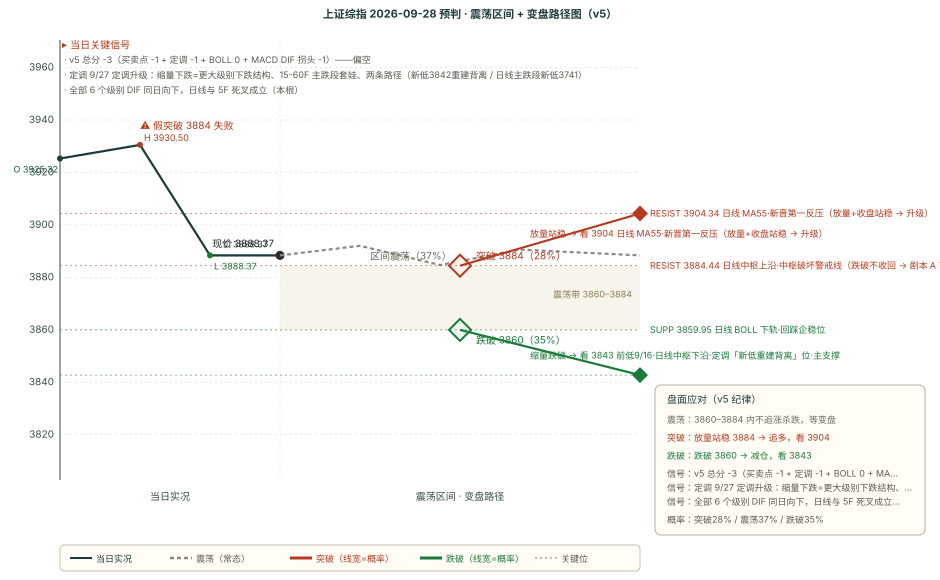

# 作战报告 · 晨报 · 2026-09-28（周一）

> 档位：晨报（morning）｜资讯窗口：2026-09-24 17:30 ~ 2026-09-28 08:40（**131 条**）｜数据时点：09-28 08:50
>
> 现价基准 = 9/24 收盘 **3888.37**（-1.22%）；O 3925.32 / H 3930.50 / L 3888.37（收盘即全天最低）
>
> 上一档（9/24-close）的目标日为 9/28（今日），今日未开盘**无法四维复盘** → 保持 pending；本档对 9/28 全天给出预判
>
> ⚠️ **本档最关键的变化（一句话）**：中秋假期无新增交易数据（9/25~9/27 休市），四因子输入冻结在 9/24 收盘根，方向维持**偏空 -3**；但**定调在 9/27 从「盘后发问」升级为「明确的下跌结构定调 + 15-60F 主跌段套娃 + 两条路径」**，同时**中美八点共识（对等降税 300 亿美元）**带来边际缓和。
>
> 🔁 **本档口径提示**：上一档（9/24-close）曾把 `target` 误写为「2026-09-25 全天（节前最后一个交易日）」，但 9/25 是中秋休市日。本档前已修正为「2026-09-28 全天（中秋假期后第一个交易日）」，`levels.date` 同步修正为 9/28（机器逻辑字段改动，预判内容逐字未动，备份于 `archive/backup_20260928_fixtarget/`）。

---

## 核心主线速览（三行）

1. **节后首日偏空延续 + 定调升级**：9/24 收盘 3888.37 为基准，跨节无交易、四因子冻结；定调 9/27 明确「下跌结构 + 主跌段套娃」。
2. **跨节「一紧一松」**：紧是定调偏空 + 美债创新高（10Y 2007 来最高、10 月加息 71%）；松是中美对等降税 300 亿美元。
3. **节前 3 天无量（游资）**：指数弱势震荡、投机线活跃；剧本 A35／B37／C28，主支撑 3842、主压力 3904。

---

## 第一块 资讯信息（晨报 · 131 条窗口内）

> 本期窗口 131 条内容，说明见文末附录
> 本块只做「事实落地」，结论层推导统一放第二块与第四块

### 一、核心主线（按强度排序）

#### 1. 定调升级（9/27 22:21 · 本档方向因子核心，原文已归档）

- **原文（一字不差，全文见归档）**：「周四市场缩量下跌，跌幅超出预期，在一个缩量的状态下出现这样的下跌，说明市场在更大级别中显然处于下跌结构而非向上结构中……已经出现了 15-60F 主跌段套娃特征。同时 3967 这个高点未形成周线金叉就转头向下，就是连最低限度的上涨结构都没有做完。」
- **两条路径**：① **3741 为周线拐点** → 最好情况日线第五段上涨突破 4012（需顶分型不坐实、快速新高 3995，「希望渺茫」），退一步「**通过新低 3842 重新构建背离**」（不强势），优先关注 60F 底背离+突破 60F 中轨、且须有效站上日线中轨防诱多；② **3741 非拐点** → 3741-3995 为反抽周线中轨的 X 段，当前为 3995 开始的新下跌结构、日线主跌段中、未来新低 3741（非近期）。
- **实战结论**：「**反抽不站上日线中轨，均无法排除日线主跌段**」；「单纯从 60F 级别起码得站上 60F MA55 线」；「创业板 3227 相对 3286 的底背离大概率失败、会新低 3227、参照 3158」。
- **与 9/24 盘后发问的关系**：从「还创业板日线底背离吗」（下跌衰竭观察）**升级为「明确的下跌结构定调 + 两条路径」**，且明确点名 **3842 与 60F MA55** 两个决策位。

#### 2. 中美八点共识（9/26）：对等降税 300 亿美元 + 贸易/投资理事会实体运转

- **双方文本一致内容**：① 关系新定位「基于尊重、公平、对等的建设性战略稳定关系」（措辞顺序一致）；② 元首互动机制化（年内可能还有 2 次会面：11 月深圳、12 月迈阿密）；③ **经贸：贸易理事会/投资理事会由「章程设立」进入「实体运转」，双向各 300 亿美元对等降税安排**；④ AI 治理：建立对话机制（下次 11 月）+ 事件沟通渠道；⑤ 国际议题：伊朗不得拥核、国际水道不收通行费；⑥ 历史与人文符号：二战盟友叙事、大熊猫赴美。
- **对 A 股的映射**：这是 9/24 收盘「中美两个月贸易延期使短期预期偏向悲观」的**边际反转**——节前最重要的宏观缓和信号。

#### 3. 光模块提案「非利空」（9/27 广发通信）

- **核心判断**：「总体不是利空而是利好」。① 提案即使通过仅约束美国国家安全类联邦采购，**不影响普通商用市场**；② 美国国家安全类联邦采购大部分已切换至美国光模块（微软/谷歌/亚马逊 CSP 自 23 年起做供应链备份、大部分完成国产替代）；③ 提案尚未表决、流程冗长、是否成法案存较大不确定性；④ 从「五年过渡期 + 有限可续期豁免」看，提案者较充分考虑产业现实，FCC 担忧明显过度。
- **与游资口径一致**：9/27 晚「科技主线假期主要是 FCC 说限制光模块、老调重弹」。

#### 4. 节前 3 天无量、投机会更强（9/28 盘前热榜）

- **盘前定性**：「这周离国庆只有 3 个交易日，预计还是无量，无量投机会更强一些。」
- **题材**：① 主线科技无太好消息（玻璃基板+ABF，但光模块走弱或拖累主线），**更看好 AI 安全与 AI 应用**；② **AI 医药**——周五外围 AI 治疗表现不错、国内「调得差不多、很多图形很好、看好强 1 转强点」；③ **AI 影视/传媒**——第一部 AI 电影将上映、AI 短剧龙头龙版出监管（今天最后一天）；④ **机器人 + 华字辈**投机活口——「人气标情绪杀两天了，看回暖」。
- **与 9/27 晚口径一致**：假期香港/欧美没休市、AI 医药挺猛；福建板块全量化不看好；马斯克机器人量产超预期但机器人一直没炒起来。

#### 5. AI 硬件链跨节继续量化紧缺

- **硅光子晶圆代工专家对话（9/28）**：云巨头总 NPO 出货需求 2027-2028 年超 **5000 万件**（3.2T/6.4T 主导），英伟达 NVL576 平台单独需 **2500 万件 3.2T NPO**；8 英寸硅光产能 2027 年 90% 以上已被四大客户预锁。
- **AI 材料观点（9/27）**：玻璃基板 NV 加码（希望日韩台基板厂两年内完成开发、最快 2028 落地）、陶瓷基板 Q4 导入、电子布 10 月继续涨价、六氟化钨 8 月出口价 +4%。
- **台积电 2nm（9/28）**：苹果/英伟达/AMD/高通/联发科加单 10-20%，月产能年底达 12 万片、提前于原定 2027 目标。
- **华为麒麟 9050 Pro（9/25）**：伯恩斯坦称「7nm 跑出 3nm 级性能」、「中国半导体 DeepSeek 时刻」。
- **三星 HBM（9/25）**：8 月出口数据指向三星 HBM 三季度超 SK 海力士。
- **「考虑允许字节跳动、阿里巴巴采购英伟达新款芯片」（9/27）**。

#### 6. 外盘利率压制未解除

- **美债创新高**：30 年期升至 2004 年以来最高、10 年期 2007 年 6 月以来最高、2 年期 2024 年以来最高；**10 月 FOMC 加息预期约 71%**、至明年末累计隐含近四次加息。
- **油价 100 美元附近**：美伊霍尔木兹海峡博弈（伊朗总统表态 vs 德黑兰强硬派）；美股 AI 硬件（CPU/互联/存储）受 Meta Muse 催化走强。

---

## 第二块 信息判断（多方观点对比 + 共识复盘）

### 一、多方观点对比

#### 共同观点（结论式，细节见第一块）

1. **方向偏空是跨节多方一致的底色**——定调（下跌结构定调）与盘面（9/24 单边下跌、全 6 级别 DIF 向下）同向；无任何一方给出「指数级反弹/普涨」的口径。
2. **节前 3 天无量、投机为主**——游资盘前明确「无量投机会更强」，与 9/24 收盘「轻仓过节 + 量能 5 日新低」一脉相承。
3. **AI 硬件链「研报继续量化紧缺、盘面资金撤离」的背离延续**——研报侧 NPO/玻璃基板/2nm 继续加码，盘面侧 9/24 GS 卖 PCB/CPO、游资对硬件主线偏谨慎。

#### 相反观点

**① 「下跌结构定调（日线主跌段）」 vs 「中美共识边际缓和 + 超卖反抽 + 节前无量磨底」**

- **看继续下跌侧**：定调 9/27——缩量下跌=更大级别下跌结构、15-60F 主跌段套娃、反抽不站日线中轨无法排除主跌；两条路径都指向下（新低 3842 / 日线主跌段新低 3741）；技术面全 6 级别 DIF 向下、四周期全破 55 线、日线死叉成立。
- **看跌幅受限侧**：中美八点共识（对等降税 300 亿美元）缓解「贸易延期」悲观；15F DIF -12.04 本轮最深（超卖）+ 定调亦明言「下周度过 60F 极弱和 120F 死叉后会有一定反抽」；节前 3 天无量下连续大跌动能不足。
- **判定：未决，但两条路径在操作上已统一。** 分歧在**下跌的幅度与节奏**（A 侧隐含破 3842，B 侧默认 3860-3915 带内磨底）。统一决策规则：反抽 3904-3914 默认遇阻；「放量 + 收盘站稳 3904 + 日线 DIF 拒绝死叉」是唯一升级条件；破 3884.44 不收回则下探段展开。**分界指标**：① 今日是否受中美共识高开/企稳；② 反抽高度与量能；③ 日线 DIF 今日读数（加速下行→A 侧，跌速收敛→B 侧）；④ 3842 是否被测试。

**② 「AI 硬件研报继续量化紧缺」 vs 「盘面资金撤离 + 光模块走弱或拖累主线」**

- **看多 AI 硬件侧**：NPO 需求 2027-28 超 5000 万件、英伟达 NVL576 需 2500 万件 3.2T；玻璃基板 NV 加码、电子布续涨、2nm 提前；光模块提案「非利空」。
- **看空/减仓侧**：GS 资金流 1.2x sell、卖 PCB 与 CPO（背离连续第三期）；游资盘前「主线科技没太好的消息、光模块走弱或拖累主线、更看好 AI 安全与应用」。
- **判定：未决，延续「分层框架」。** 节前操作权重上资金流 > 研报密度——这也是技术面偏空与 AI 硬件共识并存时，方向仍判偏空的理由。

#### 隐含共识

**所有信息都不指向指数级崩跌或普涨，全部落在「下跌结构（定调）+ 节前无量（游资）+ 中美缓和（宏观）」三个变量上**——与技术面「偏空 -3 + 单日超卖 + 节前无量」互为印证：**指数弱势、胜负在结构分层与节奏**。

#### 独立视角

- **定调是本轮唯一给出「决策位链条 + 两条路径」的体系**：3842（新低重建背离）/ 60F MA55（站上观察位）/ 日线中轨（防诱多有效站稳线），且明确「反抽不站上日线中轨无法排除主跌」——第四块的剧本触发条件直接建立在该框架上。
- **中美八点共识**是唯一与「偏空」反向的宏观变量——它不否认下跌结构，而是给「跌幅受限 + 开盘企稳扰动」提供依据。

### 二、上期共识复盘（9/24-close 共识链）

> 9/24-close 共识的目标日为 9/28（今日），今日未开盘，**无法兑现/未兑现判定** → 保持 pending。跨节期间可静态核对的部分已在第一块体现（定调升级、中美共识、光模块提案），待 9/28 收盘后统一复盘。

### 三、本期新共识（已追加 consensus_chain，避免重复不展开）

本期新增 5 条（3 条 mid + 2 条 short）与 2 组相反观点：定调升级（下跌结构定调）/ 中美八点共识 / 光模块提案非利空 / 节前 3 天无量投机 / AI 硬件链跨节量化。细节见第一块，此处不重复。

---

## 第三块 技术分析（缠论买卖点 + BOLL + 关键均线）

> 现价基准 = 9/24 收盘 **3888.37**（-1.22%）；OHLC 详见本报告头

### 引擎 B：chan-signal 缠论买卖点（五周期）

| 周期 | 趋势 | 买卖点 | 中枢 | 位置 |
|---|---|---|---|---|
| **日线** | 向上 | 一卖 @3967.68（conf **0.8**） | 3884.44-3842.72 | 中枢内部（距上沿 +3.93） |
| **周线** | 向下 | 一卖 @3995.18（conf 0.5） | 3927.85-4034.08 | 中枢下方 |
| **60F** | 向下 | 三卖 @3891.48（conf 0.75） | 3927.55-3967.59 | 中枢下方，**现价在其下方 3.11 点，三卖成立** |
| **15F** | 向下 | 无信号（笔 29） | 无中枢 | — |
| **5F** | 向下 | 无信号 | 无中枢 | — |

**定性**：五周期「日线（中枢内）+ 周/60F/15F/5F 向下」——**60F 三卖@3891.48（conf 0.75）现价在其下方，效力成立**，计 -1。15F/5F 无信号；日线一卖/周线一卖按规则不进方向分（仅作点位锚）。

### 关键均线与 MACD（多级别 55 线体系 + 级别分裂）

| 周期 | MA20 | MA55 | DIF | 前值 | DIF 方向 | 区域 |
|------|------|------|-----|------|---------|------|
| 日线 | 3926.74 | 3904.34 | **-2.74** | -0.06 | **向下** | 空头区（死叉成立本根） |
| 120F（合成） | 3904.61 | 3922.79 | -0.19 | +5.37 | **向下** | 多头区（gap 仅 +0.17，濒临失守） |
| 60F | 3929.19 | 3914.31 | -0.54 | +2.48 | 向下 | 空头区（极弱） |
| 30F | 3927.79 | 3915.20 | -9.58 | — | 向下 | 空头区 |
| 15F | 3911.52 | 3934.96 | **-12.04** | -11.69 | 向下 | 空头区（本轮最深，超卖） |
| 5F | 3896.68 | 3909.99 | -4.56 | — | 向下 | 空头区（死叉成立本根） |

> 注：表中 **MA20** 即各周期 BOLL 中轨（**BOLL 中轨 ≡ MA20**，数学恒等），下文「中轨」均指 MA20。

**级别结构**：**全部 6 个级别（5F/15F/30F/60F/120F/日线）DIF 同日向下**（9/24 收盘根，本轮首次）——短长端背离以「长端补跌」方式收敛，级别间零分歧。**BOLL 变盘**：60F 涨 46%/跌 54%、日线涨 46%/跌 54%（均中性，偏离 4pct 不越阈）→ 因子 0；15F 看空 72%（带宽 1.67% 已向下开口）、120F 看空 88%——**BOLL 体系全部四个级别现价均在中轨下方**，为近 5 期首次。

**关键轨道（四级中轨，由高到低）**：15F 3934.96 / 日线 3926.74 / 60F 3929.19 / 120F 3904.61——**现价 3888.37 在全部中轨下方**。

**四周期联动 + 区间套**：日线→120F「卖点但大周期已突破中枢（弱）」、120F→60F「卖点但大周期在支撑下方（弱）」、60F→15F 无信号——级别间无共振。

---

## 第四块 预判（技术预判与复盘）

### 一、上期复盘（9/24-close）

> 9/24-close 预判的目标日为 9/28（今日），今日未开盘，**无法四维复盘** → 保持 pending。其方向「偏空 -3」、区间 3860-3912、主支撑 3842、主压力 3904 均待 9/28 收盘后统一复盘。

### 二、偏差观察统计表（55 期 · v5 配对计数 · 截止 2026-09-28 08:50）

| 维度 | ✅ 命中 | ⚠️ 部分 | ❌ 失效 | 纯命中率 | 含部分口径 |
|------|------|------|------|---------|------|
| 方向 | 28 | 21 | 6 | **50.9%** | 70.0% |
| 区间 | 19 | 30 | 6 | **34.5%** | 61.8% |
| 支撑 | 38 | 7 | 10 | **69.1%** | 75.5% |
| 压力 | 31 | 11 | 13 | **56.4%** | 66.4% |

**结构未变**：支撑（69.1%）> 压力（56.4%）> 方向（50.9%）> 区间（34.5%，连续垫底）。区间维「部分」占比 30/55 = 54.5%，仍是四维中最高——区间判定本质是「方向对、幅度差一点」，非方向错误。**继续观察、不修改规则**（跨节无新增样本）。

### 三、本期预判（9/28 全天）

#### 一句话预判

> **偏空（v5 -3），核心带 3860-3915**。定调 9/27 升级为「下跌结构 + 主跌段套娃」，点名 3842（重建背离）与 60F MA55（观察位）；中美共识 + 超卖反抽 + 节前无量令指数大概率弱势震荡。剧本 A35／B37／C28。

#### 完整预判字段

| 字段 | 内容 |
|---|---|
| **方向** | 偏空（v5 总分 **-3**：买卖点 **-1** + 定调 **-1** + BOLL 变盘 **0** + MACD DIF 拐头 **-1**） |
| **区间** | 3860-3915（核心 55 点，日线 BOLL 下轨 3859.95 ~ 60F MA55 3914.31）/ 3843-3927（扩展 84 点，前低 3842.72 ~ 日线中轨 3926.74 / 周线中枢下沿 3927.85 双重身份带） |
| **支撑/压力** | **见下方「关键位相对现价」表（唯一落地处）**——主支撑 = 前低·日线中枢下沿（定调点名「新低重建背离」位）；主压力 = 日线 MA55（新晋反压） |
| **置信度** | **中**——方向分明确偏空 + 跨节定调强化，但节前无量 + 超卖反抽 + 中美共识，三重因素使置信度不达「高」 |

#### v5 打分明细

- **买卖点因子（-1）**：60F 三卖@3891.48（conf 0.75）现价位于其下方 3.11 点，效力成立 → **-1**；15F/5F 无信号；日线一卖/周线一卖不进方向分。
- **定调因子（-1）**：9/27 22:21「缩量下跌=更大级别下跌结构、15-60F 主跌段套娃、反抽不站日线中轨无法排除主跌」+ 两条路径（新低 3842 重建背离 / 日线主跌段新低 3741）→ 明确偏空 → **-1**。
- **BOLL 变盘因子（0）**：60F 涨 46%/跌 54%、日线涨 46%/跌 54%（均中性，偏离 4pct 不越阈）→ **0**。（15F 看空 72%、120F 看空 88% 但 v5 不取这两个级别。）
- **MACD DIF 拐头因子（-1）**：日线 DIF **-2.74**（前值 -0.06，死叉成立 DIF<DEA，空头区）→ **-1**。
- **总分：-1 -1 +0 -1 = -3 → |−3| > 1 → 偏空**（不触发方向不明；15F 带宽 1.67% > 1%）

> ⚠️ **附注一（与 9/24-close 的关系）**：本期总分与 9/24-close 一致（同为 -3），因跨节无交易数据、四因子输入冻结。但**性质已升级**——9/24-close 是「节前收盘偏空」，本期是「节后首日开盘前的偏空延续 + 跨节定调再确认」；定调因子由 9/24 盘后的「发问」升级为 9/27 的「明确下跌结构定调」。
> ⚠️ **附注二（OBS-2 变盘倾向分）**：本档剧本概率沿用 OBS-2 映射，与 9/24-close 同值（**35/37/28**）——三因子输入（短端背离 / 量能前兆 / 带宽收口）冻结在 9/24 收盘根，变盘倾向分 = 1/3 未变（短端背离 0 + 量能前兆 +1 + 带宽收口 0）。
> ⚠️ **附注三（量能口径）**：脚本按「近 5 日窗口」判量能前兆（4.385e8 为窗口最小）→ +1，常量 `VOL_NEWLOW_DAYS=5`（2026-09-24 拍板）。

#### 剧本概率与触发条件

| 剧本 | 概率 | 触发条件 | 路径 |
|------|------|---------|------|
| **A 延续偏空** | **35%** | 反抽 3904-3914 遇阻（量能不放大 <4.4 亿手）→ 破 3884.44 不收回 | 3904 → 3859.95 → 3845.60 → **3842.72**（跌破则中枢破坏+前低失守+背离重建三证叠加） |
| **B 弱势震荡磨底** | **37%（名义最高）** | 节前 3 天无量 + 超卖企稳，3860-3915 带内窄幅拉锯 | 3859.95-3914.31 带内反复；投机线活跃 |
| **C 反向超跌反弹** | **28%** | 放量收复 3904 且收盘站稳 + 日线 DIF 拒绝死叉 + 创业板底背离确认 | 3904 → 3914.31 → 3926.74（日线中轨，防诱多线） |

> **下方支撑仍厚**：主支撑 3842.72（-1.17%）今日是**可被测试的距离**；定调已明确点名「新低 3842 重建背离」。**上方逐级反压**：3904.34（日线 MA55）→ 3914.31（60F MA55，定调「站上观察位」）→ 3926.74（日线中轨，定调「防诱多有效站稳线」）→ 3967.68（天花板）。

#### 纪律与观察

**纪律（6 条）**

1. **3904-3914 第一反压带 = 今日多空分界**——日线 MA55 3904.34 + 15F BOLL 中轨 3911.52 + 60F MA55 3914.31 三线密集；反抽至此默认按遇阻对待（v5 逆势反抽纪律），不追涨；「放量 + 收盘站稳 3904」是唯一升级条件。
2. **3884.44（日线中枢上沿）= 中枢破坏警戒线**——跌破 30 分钟不收回则下探段展开。
3. **3842.72（前低·日线中枢下沿）= 主支撑、定调「新低重建背离」触发位**——距现价 -1.17%，今日可被测试；跌破则中枢破坏 + 前低失守 + 背离重建三证叠加。
4. **不因单日超卖抄底**——15F DIF -12.04 只给技术性反抽，不给趋势反转；趋势反转须「日线 DIF 拒绝死叉 + 收复 3904」两证。
5. **定调的关键边界**——「反抽不站上日线中轨 3926.74，均无法排除日线主跌段」；即使突破 60F 中轨、反抽至日线中轨，也要提防 X 段重置日线主跌（周线中轨压制）。
6. **节前 3 天无量、投机为主**——「无量投机会更强」；华字辈/机器人/AI 影视投机活口，指数级方向性加仓与节前无量相悖；OBS-2 教训记取：名义最高 B 37% 不构成承诺。

**开盘后重点观察（5 项）**

1. **中美共识是否带来高开/企稳**——对等降税 300 亿美元为节前最重要的边际缓和；高开幅度与能否守住是关键。
2. **反抽高度与量能**——反抽至 3904-3914 是否放量；缩量反抽=遇阻信号。
3. **3884.44 得失**——日线中枢上沿，跌破不收回则下探段展开。
4. **3842 是否被测试**——定调点名的「新低重建背离」触发位，今日是可被测试的距离。
5. **日线 DIF 今日读数**——加速下行 → 剧本 A；跌速收敛 → 剧本 B；拒绝死叉拐头 → 剧本 C。

#### 关键位相对现价（现价 3888.37）

| 关键位 | 价格 | 相对现价 | 属性 | 依据 |
|---|---|---|---|---|
| 日线一卖三重共振 | 3967.68 | +2.04% | 压力（上行天花板） | 日线一卖 conf0.8 + 9/22 高 + 60F 中枢上沿 |
| 15F MA55 | 3934.96 | +1.20% | 压力 | 短中端均线 |
| 周线中枢下沿 | 3927.85 | +1.02% | 压力（双重身份带） | 与日线中轨构成 3926.74-3927.85 带 |
| **日线中轨** | **3926.74** | **+0.98%** | **压力（防诱多线）** | 定调「有效站上日线中轨防诱多」 |
| 120F MA55 | 3922.79 | +0.88% | 压力 | 短中端均线 |
| **60F MA55** | **3914.31** | **+0.66%** | **压力（定调观察位）** | 定调「站上 60F MA55 线」 |
| 15F BOLL 中轨 | 3911.52 | +0.59% | 压力 | 引擎「反弹至此为卖点」 |
| **日线 MA55** | **3904.34** | **+0.41%** | **压力（主压力·新晋反压）** | 9/24 收盘跌破 18.67 点后转反压 |
| **现价** | **3888.37** | **0.00%** | **现价（分界）** | 9/24 收盘 |
| 日线中枢上沿 | 3884.44 | -0.10% | 支撑（中枢破坏警戒线） | 跌破不收回则下探段展开 |
| 日线 BOLL 下轨 | 3859.95 | -0.73% | 支撑（回踩企稳位） | 引擎日线路径「回踩企稳」 |
| 120F BOLL 下轨 | 3845.60 | -1.10% | 支撑 | 短中端下轨 |
| **前低（9/16）·日线中枢下沿** | **3842.72** | **-1.17%** | **支撑（主支撑）** | 前低+中枢下沿重合；定调「新低重建背离」触发位 |

---

## 第五块 行业强弱榜（申万一级数据 + 缠论方向分三要素推导）

> 数据时点：9/24 收盘（申万一级行业，9/28 未开盘前的最新已收盘数据）

### 一、数据层

#### 1. 涨跌幅（申万一级 · 9/24 收盘）

**领涨 TOP5**：煤炭 +0.63% ｜ 纺织服饰 +0.35% ｜ 银行 +0.31% ｜ 家用电器 +0.01% ｜ 公用事业 -0.11%

**领跌 TOP5**：医药生物 -2.56% ｜ 通信 -2.74% ｜ 建筑材料 -2.81% ｜ 电子 -2.92% ｜ 有色金属 -3.53%

**风格定性：9/24 是「防御性配置 + 成长全线杀跌」的一天。** 银行/煤炭/纺织服饰（防御）领涨，有色/电子/建材/通信/医药（成长+周期）领跌——与 9/24「GS 防御性配置、卖 PCB/CPO」口径一致。

#### 2. 缠论方向分（申万一级归组）

- **做多侧**：家用电器 +3.5 ｜ 房地产 +2.0 ｜ 银行 +2.0 ｜ 医药生物 +1.7 ｜ 纺织服饰 +1.5
- **做空侧**：有色金属 -1.8 ｜ 非银金融 -1.7 ｜ 农林牧渔 -1.3 ｜ 食品饮料 -1.3 ｜ 电力设备 -1.2

### 二、推导层（三要素）

#### 做多榜 TOP3

| 行业 | 涨跌幅 | 缠论方向分 | 置信度 |
|------|-----------|---------|--------|
| **家用电器** | +0.01% | **+3.5** | 中 |
| **银行** | +0.31% | **+2.0** | **中-高（防御主线）** |
| **房地产** | — | **+2.0** | 中 |

- **银行**：**价格与方向分双正、防御主线核心**——9/24 银行 +0.31% 为少数收涨板块之一（GS「防御性配置」），缠论 +2.0；节前 3 天无量的环境下，防御属性持续占优。**扣分项**：银行弹性有限，节前无量下更偏「避险配置」而非「进攻方向」。
- **家用电器**：缠论 +3.5 为全场最高，价格 +0.01% 收平（防御属性）；节前消费/防御方向一致。
- **房地产**：缠论 +2.0，但 9/24 无突出价格表现；上档已记录的「风险缓释 vs 需求刺激」归因未决问题延续，置信度取中。

#### 规避榜 TOP3

| 行业 | 涨跌幅 | 缠论方向分 | 置信度 |
|------|-----------|---------|--------|
| **有色金属** | **-3.53%（全场末位）** | **-1.8** | **高（共振）** |
| **电子** | **-2.92%** | 约 +0.7（弱） | **中-高（背离关键）** |
| **非银金融** | — | **-1.7** | 中 |

- **有色金属**：**价格全场末位 + 方向分 -1.8 双重共振**——节前资金撤离 + 大宗商品（铜/铝）关税不确定性，规避信号最明确。
- **电子**：**本期最重要的「分层验证」标的**——价格 -2.92% 领跌（GS 卖 PCB/CPO、半导体领跌），但研报侧 NPO/玻璃基板/2nm 继续量化紧缺——「研报看多、资金卖出」背离连续第三期；游资盘前亦「主线科技没太好的消息」。列为规避（节前资金说了算）。
- **非银金融**：方向分 -1.7 偏空，价格未见突出表现，置信度取中。

#### 主线回调观察（非规避）

- **医药生物（-2.56%，缠论 +1.7）**：价格领跌但方向分 +1.7 为正，且游资盘前明确「AI 医药看好强 1 转强点」——**「价格杀跌 + 方向分正 + 游资看多」三要素背离**，属「结构未坏、资金博弈」的观察型机会，需价格确认。
- **煤炭（+0.63%，领涨）**：防御性收涨，与「外部利率上行阶段能源相对占优」框架一致；但游资盘前未给煤炭任何催化，属被动防御。

#### 共振/背离说明

- **有色向下共振（规避信号最强）**：价格全场末位 + 方向分 -1.8 + 资金撤离三重同向。
- **电子「研报 vs 资金」背离（分层关键）**：价格领跌 + 研报继续量化紧缺——与第二块相反观点②的「分层」结论一致，节前资金说了算。
- **医药「价格杀跌 vs 方向分正 + 游资看多」背离**：节前唯一的「结构未坏、资金博弈」观察点，游资点名 AI 医药「看好强 1 转强点」。
- **宽基与量能**：沪深300 方向分 -2.0、上证50 -4.0（偏空），中证1000 +2.0（相对强）——**节前无量下小盘/投机相对占优**，与「无量投机会更强」的游资口径一致。

---

## 附录 抓取通道信息

**抓取窗口**：2026-09-24 17:30 ~ 2026-09-28 08:40（跨中秋周末窗口，环境变量覆盖 `ZSXQ_WIN_START/END`）

| 通道 | 工具 | 本期条数 | 备注 |
|---|---|---|---|
| 通道 A（Skill/zsxq-cli） | `zsxq-cli` | **110** | 卖方研报与产业链调研密集（NPO/玻璃基板/2nm/华为麒麟/三星 HBM 等）；海外宏观利率研报；定调 4 条 |
| 通道 B（Cookie 直连） | api.zsxq.com | **21** | 盘前热榜与游资观点、中港/北美交易台日报、AI 产业链速报、行业个股调研 |
| **合计** | | **131** | **图片 134 张 / 附件 155 个** |

**数据完整性说明**：

- ✅ **两条通道均正常**：Skill 通道 110 条 + Cookie 通道 21 条，均成功；其中一个 Cookie 通道星球一次限流抖动后重试成功（非鉴权失败）；`degraded` 为空。
- ✅ **定调 4 条原文已一字不差归档**（`outputs/DRAGON_BALL_原始记录_2026-09-28.md`，含第 4 条「下跌结构定调 + 两条路径」全文 + 4 个 HTML 监控附件 + 1 图）。
- ⚠️ **附件 155 个大部分为标题级记录**（.mp3 / .html / 扫描版 .pdf 无文本层），本期对关键图（定调第 4 条配图 + 盘前热榜图）用 Read 看细节，其余按约定用脚本文字。
- 凭证文件路径 `.workbuddy/zsxq_cookie.txt`（不入 git，**严禁跨机拷贝**）。

---

## 产物清单

| 路径 | 类型 | 说明 |
|---|---|---|
| `outputs/作战报告_晨报_2026-09-28.md` | Markdown 报告 | 本文件（五块齐全 + 附录 + 产物清单） |
| `outputs/作战报告_晨报_2026-09-28.html` | HTML 报告 | 浏览器预览版 |
| `outputs/000001_forecast_2026-09-28.svg` | SVG 走势图 | 9/28 全天预判条件触发决策路径图 |
| `outputs/DRAGON_BALL_原始记录_2026-09-28.md` | 原文归档 | 定调 4 条一字不差归档（含 4 个 HTML 附件元数据） |
| `.workbuddy/zsxq_fetch_raw.json` | 原始数据 | 131 条窗口内资讯内容 |
| `.workbuddy/forecast_chain.json` | 预判链 | **57 条（55 verified + 2 pending：9/24-close、9/28-morning）** |
| `.workbuddy/consensus_chain.json` | 共识链 | **26 条（24 verified + 2 pending：9/24-close、9/28-morning）** |

**本期待办（交接给下一档）**：

1. **9/28 收盘档统一复盘两条 pending**（9/24-close 与 9/28-morning 均 target 9/28）——重点核验：① 定调「反抽不站上日线中轨无法排除主跌」是否兑现；② 3842.72（定调「新低重建背离」位）是否被测试；③ 剧本 A/B/C 实际落点（OBS-2 样本）。
2. **`levels.date` 口径统一（前序遗留）**——本档已填为目标日 9/28（与 9/24-close 修正一致），后续档位继续保持「levels.date = 目标交易日」。
