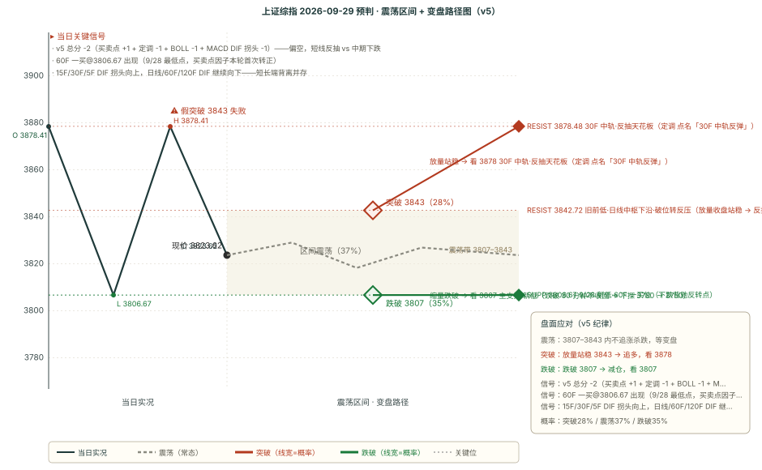

# 作战报告 · 晨报 · 2026-09-29（周二）

> 档位：晨报（morning）｜资讯窗口：2026-09-28 16:00 ~ 2026-09-29 08:30（**44 条**）｜数据时点：09-29 08:50
>
> 现价基准 = 9/28 收盘 **3823.62**（-1.67%）；O 3878.41 / H 3878.41 / L 3806.67（开盘即全天最高、单边下杀）
>
> 上一档（9/28-morning）的目标日为 9/28（昨日），已于昨日收盘档完成四维复盘（方向✅/区间❌/支撑❌/压力✅）；本档对 9/29 全天给出预判
>
> ⚠️ **本档最关键的变化（一句话）**：9/28 单边下杀 -1.67% 击穿旧前低·日线中枢下沿 3842，日线中枢向下破坏成立；定调 9/28 晚确认「**解除 30F 主跌（短线反抽可期）但大概率下月跌破月线中轨（中期下跌未结束）**」，v5 总分从 -3 收敛到 -2 是短线超跌信号转正、而非转多。
>
> 🔁 **本档口径提示**：9/28 收盘为本档最新已收盘基准；9/29 为节前倒数第 2 个交易日（9/30 周三为节前最后交易日，10/1 起国庆休市）。四因子输入全部更新到 9/28 收盘根，非冻结。

---

## 核心主线速览（三行）

1. **节后第二日偏空 -2：短线反抽 vs 中期下跌**——9/28 收盘 3823.62 单边下杀击穿旧前低 3842，中枢向下破坏成立；总分 -3→-2 是超跌信号转正、非转多。
2. **跨夜一紧一松**：紧是定调「大概率下月破月线中轨 + 连续加速」+ 游资「科技走熊慢慢熊途」；松是定调「解除 30F 主跌、短期有反弹」+「明天投机会更好」。
3. **技术对立明确**：60F 一买 + 15F/30F DIF 拐头（短线反抽）vs 四级别 BOLL 全看空 + 日线 DIF 加速（中期下跌）；剧本 A35/B37/C28。

---

## 第一块 资讯信息（晨报 · 44 条窗口内）

> 本期窗口 44 条内容，说明见文末附录
> 本块只做「事实落地」，结论层推导统一放第二块与第四块

### 一、核心主线（按强度排序）

#### 1. 定调（9/28 21:30 · 本档方向因子核心，原文已归档）

- **原文（一字不差，全文见归档）**：「今天市场大幅下跌，沪指回踩月线中轨附近，创业板大阴线破坏了前期的底背离。沪指下午突破了 5F 中轨，在双日死叉期间解除了 30F 主跌特征，所以后续可能会有一次面向 30F 中轨的反弹，可能会在月线中轨时发生，但 30F 中轨会快速下行，所以空间也没多大。总而言之这里核心就是判断月线中轨支撑的成色，大概率下个月会跌破月线中轨，月线中轨有效支撑起码要突破 60F 中轨才能右侧确认。结合创业板来看，主板能支撑住的希望较低……这根阴线其实只是中间的一部分，并不代表结束，最好的走势其实反而是连续加速+节后开门黑，打到市场不敢抄底……届时创业板出现 800-1000 点的反弹是可以展望的。」
- **三条实战结论**：① 「**解除了 30F 主跌特征**」→ 短期可能有一次面向 30F 中轨的反弹，但 30F 中轨快速下行、空间不大；② 「**核心是判断月线中轨支撑的成色，大概率下个月跌破月线中轨，月线中轨有效支撑起码要突破 60F 中轨才能右侧确认**」；③ 「**最好走势反而是连续加速 + 节后开门黑，打到市场不敢抄底**」，创业板 800-1000 点反弹需先发生连锁反应（鸟队若来则纯晦气）。
- **与 9/27 定调的关系**：从「日线主跌段套娃」边际转为「**30F 主跌特征已解除（短线反抽窗口打开）+ 中期下跌结构未结束**」——短期定性转松、中期定性不变。

#### 2. 游资「科技走熊 + 整体方向偏压制」（9/28 晚 + 9/29 盘前）

- **9/28 晚信息汇总**：「美债再次拉升，今晚老美开盘整体下跌……内心要有后期慢慢熊途的准备。科技这里已经在走熊市，机会都是小机会。很难有以前那种大行情了。」同时「我认为明天投机会比今天好很多，尤其看有没有大资金去撬跌停。」
- **9/29 盘前热榜**：「由于加息和高美债利率，整体市场大方向偏压制。……国内偏消息真空。个人还是看投机，看看华字辈、电力、消费，有没有大部队去承接。电池这种新能源冷这么久了，看会不会轮动到。」
- **口径**：外盘利率（加息 + 高美债）压制方向；科技已走熊、机会都是小机会；节前 2 天看投机轮动（华字辈 / 电力 / 消费 / 电池）。

#### 3. 坊间传闻「保险赎回较多引发较大回调」（9/28 22:47）

- **传闻**：「坊间传闻今日保险赎回较多引发较大回调，盈米基金数据供参考。」
- **机构数据佐证**：盈米数据显示当日机构客户交易**整体流入**（货币市场型 + 债券型基金流入为主），但**股票型基金净流出、其中保险类客户占比最大**；增强指数 / 被动指数基金亦净流出。
- **定性**：传闻与机构数据同向——「保险赎回 → 股票型基金被动卖压」是 9/28 单边下杀的潜在资金面归因之一（传闻未证实，但数据侧有佐证）。

#### 4. 海外投研：科技股估值回调「深水区」 + MLCC（村田）紧缺至 2030

- **摩根大通（科技股）**：科技/AI 反弹因持仓拥挤 + AI 资本开支可持续性担忧陷入停滞，「科技股估值回调已步入深水区」；半导体拥挤持仓正在解除、软件板块空头/弱势持仓回归正常化；「科技股或许难以重现昔日辉煌，但基本面依然向好，AI 生态链内机会众多」。
- **伯恩斯坦 / 高盛（村田 MLCC）**：AI 数据中心推动高端 MLCC 供需紧张**至少持续到 2030 年**；村田订单 BB 值维持 **1.47 倍**高位，AI/DC 占比 FY3/28 看至近 40%；高盛目标价 12900 日元（现价 7763 日元，+66.2%）。
- **定性**：海外投研对「科技估值回调」与「AI 硬件实物紧缺」并存——回调是估值层面、紧缺是产业层面，二者不矛盾。

#### 5. AI 硬件链：白毛日报 108 期「CPU/光学/内存算力链爆发」

- **白毛日报第 108 期（9/28）**：「CPU 需求预期上修带动光学内存算力链爆发」——CPU 三巨头涨 9%-14%（Intel 称供给仅五成）；LITE 称 NVDA CPO/NPO 需求大增、激光链走强；MU +2.23% / DRAM +2.83% 内存链跟涨；NBIS +4.7%。
- **定性**：美股 AI 硬件算力链（CPU/光学/内存）爆发，与国内 9/28 单边下杀形成「外强内弱」背离。

---

## 第二块 信息判断（多方观点对比 + 共识复盘）

### 一、多方观点对比

#### 共同观点（结论式，细节见第一块）

1. **中期方向偏空是多方一致的底色**——定调（大概率下月破月线中轨 + 连续加速）与游资（科技走熊、慢慢熊途、整体偏压制）同向；无任何一方给出「指数级反弹 / 普涨」的口径。
2. **节前 2 天无量、投机为主**——游资「看投机，华字辈 / 电力 / 消费 / 电池轮动」，与 9/28 单边下杀后「无量环境」一脉相承。
3. **AI 硬件链「产业长期紧缺、盘面短期走熊」的背离延续**——海外投研侧（MLCC 至 2030、白毛日报算力链爆发）继续加码，游资侧（科技已走熊、机会都是小机会）明确看空。

#### 相反观点

**① 「短线技术性反抽（解除 30F 主跌 + 60F 一买 + 短端 DIF 拐头）」 vs 「中期下跌延续（四级别 BOLL 全看空 + 日线 DIF 加速 + 科技走熊）」**

- **看短线反抽侧**：定调「解除了 30F 主跌特征、后续可能有一次面向 30F 中轨的反弹」；引擎B 60F 一买@3806（下跌背驰反转点）；15F DIF -22.71→-21.52、30F -30.06→-29.91 拐头向上、5F 向上——短端 3 级别抢跑；游资「明天投机会比今天好」。
- **看中期下跌侧**：定调「大概率下月跌破月线中轨、最好走势连续加速 + 节后开门黑」；四级别 BOLL 全看空（15F 81%/60F 72%/120F 95%/日线 86%）、带宽全开口向下；日线 DIF -2.74→-9.98 加速下杀、日线中枢下沿 3842 已破；游资「科技已走熊、慢慢熊途」。
- **判定：未决，方向权重中期偏空（v5 -2）。** 短线反抽与中期下跌并存，正是本档核心张力。**操作统一**：反抽 3836-3843 默认遇阻（不追多）；「放量 + 收盘站稳 3842 + 日线 DIF 拒绝下杀」三证齐全才升级为反抽剧本 C；破 3806 不收回则下探段展开。**分界指标**：① 今日低开/平开幅度（gap 方向 vs 偏空一致性）；② 反抽高度与量能；③ 日线 DIF 今日读数（继续加速 → 中期下跌主导，收敛 → 反抽有据）；④ 3806 是否被测试。

**② 「AI 硬件产业长期紧缺（MLCC 至 2030 + 算力链爆发）」 vs 「科技已走熊、机会都是小机会」**

- **看多 AI 硬件长期侧**：伯恩斯坦/高盛（MLCC 供需紧张至 2030、BB 值 1.47）；白毛日报 108 期（CPU/光学/内存算力链爆发）；摩根大通（科技股基本面依然向好、AI 生态链机会众多）。
- **看空科技短期侧**：游资「科技已走熊市、机会都是小机会、难有以前那种大行情」；摩根大通「科技股估值回调入深水区、半导体拥挤持仓正在解除」。
- **判定：未决，延续「分层框架」。** 产业长期紧缺与盘面短期走熊不矛盾（紧缺是 2030 级别产业趋势、走熊是当下估值/持仓出清）。**节前 2 天无量环境下操作权重盘面 > 产业逻辑；10/9 节后若半导体资金流回流，产业逻辑重新主导。**

#### 隐含共识

**所有信息都不指向指数级崩跌或普涨，全部落在「中期下跌结构（定调）+ 节前无量投机（游资）+ 短线超跌反抽（定调+技术）」三个变量上**——与技术面「偏空 -2 + 短线超卖 + 中期结构」互为印证：**指数弱势、胜负在短线反抽与中期下跌的节奏博弈**。

#### 独立视角

- **定调是本轮唯一给出「决策位链条 + 反抽空间边界」的体系**：月线中轨（支撑成色）/ 60F 中轨（右侧确认线）/ 30F 中轨（反抽天花板），且明确「反抽空间没多大」——第四块的剧本触发条件直接建立在该框架上。
- **坊间传闻（保险赎回）**是唯一与「资金面」直接挂钩的增量线索——它不改变方向，而是给「9/28 单边下杀」补一个资金面归因，若为真则 9/29 的被动卖压可能延续、若证伪则超跌反弹更有据。

### 二、上期共识复盘（9/28-morning 共识链）

> 9/28-morning 共识（5 条共识 + 2 组对立）目标日为 9/28（昨日），已于昨日收盘档复盘落盘。**关键兑现**：① 定调「下跌结构 + 主跌段套娃」**✅ 兑现且力度超出**（9/28 单边下杀、最低 3806 击穿「新低 3842」路径）；② 中美八点共识「开盘企稳扰动」**❌ 未兑现**（低开 -0.26% 后零反抽）；③ 「节前 3 天无量、投机会更强」**⚠️ 部分**（指数无量下跌成立，投机活跃无当日数据佐证）。两条 pending 均已转 verified，共识链 26 条全部 verified、pending=0。

### 三、本期新共识（已追加 consensus_chain，避免重复不展开）

本期新增 5 条（3 条 short + 2 条 mid）与 2 组相反观点：定调「解除 30F 主跌但中期下跌」/ 游资「科技走熊 + 整体偏压制」/ 坊间传闻「保险赎回」/ 海外投研「科技估值回调 + MLCC 紧缺」/ AI 硬件链「白毛日报算力链爆发」。细节见第一块，此处不重复。

---

## 第三块 技术分析（缠论买卖点 + BOLL + 关键均线）

> 现价基准 = 9/28 收盘 **3823.62**（-1.67%）；OHLC 详见本报告头

### 引擎 B：chan-signal 缠论买卖点（五周期）

| 周期 | 趋势 | 买卖点 | 中枢 | 位置 |
|---|---|---|---|---|
| **日线** | 向下 | 一卖 @3967.68（conf **0.8**） | 3884.44-3842.72 | 中枢下方（**已跌破下沿 19.10 点，向下破坏成立**） |
| **周线** | 向下 | 一卖 @3995.18（conf 0.5） | 4034.08-3927.85 | 中枢下方 |
| **60F** | 向下 | **一买 @3806.67（conf 0.5）** | 3896.26-3852.03 | 中枢下方，**9/28 最低 3806 处形成一买** |
| **15F** | 向下 | 无信号 | 无中枢 | — |
| **5F** | 向上 | 无信号 | 无中枢 | — |

**定性**：五周期「日线（中枢下破）+ 周/60F/15F 向下 + 5F 向上」——**60F 一买@3806（conf 0.5）是本轮首次出现的短线反抽信号（买卖点因子由 -1 转正 +1）**，但日线中枢向下破坏 + 周线/日线一卖在上方压制，中长期结构未修复。15F/5F 无信号；日线一卖/周线一卖按规则不进方向分（仅作点位锚）。

### 关键均线与 MACD（多级别 55 线体系 + 级别分裂）

| 周期 | MA20 | MA55 | DIF | 前值 | DIF 方向 | 区域 |
|------|------|------|-----|------|---------|------|
| 日线 | 3920.31 | 3901.2 | **-9.98** | -2.74 | **向下** | 空头区（死叉加深） |
| 120F（合成） | 3899.29 | 3918.1 | -13.64 | -7.91 | 向下 | 空头区 |
| 60F | 3911.61 | 3906.3 | -21.92 | -18.8 | 向下 | 空头区 |
| 30F | 3878.48 | 3907.22 | -29.91 | -30.06 | **向上** | 空头区 |
| 15F | 3839.72 | 3898.25 | -21.52 | -22.71 | **向上** | 多头区（金叉） |
| 5F | 3820.96 | 3835.84 | -1.36 | -1.42 | **向上** | 多头区 |

> 注：表中 **MA20** 即各周期 BOLL 中轨（**BOLL 中轨 ≡ MA20**，数学恒等），下文「中轨」均指 MA20。

**级别结构**：**长端 3 级别（日线/120F/60F）DIF 继续向下，短端 3 级别（30F/15F/5F）DIF 拐头向上**——短长端背离以「长端补跌 + 短端超跌反抽」的方式并存。**BOLL 变盘**：四级别全看空（详见下），带宽全开口向下。

**关键轨道（四级中轨，由高到低）**：日线 3920.31 / 60F 3911.61 / 120F 3899.29 / 30F 3878.48 / 15F 3839.72——**现价 3823.62 在全部中轨下方**。

**四周期联动 + 区间套**：日线→120F「卖点但大周期在支撑下方（弱）」、120F→60F「卖点但大周期在支撑下方（弱）」、60F→15F 无信号——级别间无共振。

### BOLL（boll_chan 四级别）

| 周期 | 概率 | 定性 | 带宽 | 状态 | 路径 |
|---|---|---|---|---|---|
| 15F | 涨 19% / 跌 **81%** | 看空 | 3.03% | 开口向下 | 趋势向下，反弹 3839.72 中轨是卖点 |
| 60F | 涨 28% / 跌 **72%** | 看空 | 4.99% | 开口向下 | 先反弹（买点 3806 兑现）→ 遇阻 3911.61 中轨回落 |
| 120F | 涨 5% / 跌 **95%** | 看空 | 3.87% | 开口向下 | 中轨下行，反弹 3899.29 遇阻则回落 |
| 日线 | 涨 14% / 跌 **86%** | 看空 | 4.05% | 开口向下 | 趋势向下，反弹 3920.31 中轨是卖点 |

**定性**：**BOLL 四级别现价全在中轨下方、且全部「开口向下·趋势启动」**——9/24 的「短端看空 + 长端中性」本期以「长端补跌」方式收敛为四级别全看空。**路径推演（引擎原文）**：15F「反弹 3839.72 中轨是卖点」；60F「先反弹（买点 3806）→ 遇阻 3911.61 中轨回落」；日线「反弹 3920.31 中轨是卖点」。共振读数：日线一卖 3967.68 与日线上轨 3999.65 距 0.82%「无共振」。

---

## 第四块 预判（技术预判与复盘）

### 一、上期复盘（9/28-morning）

> 9/28-morning 预判目标日为 9/28（昨日），已于昨日收盘档完成四维复盘，判定如下。

| 维度 | 判定 | 说明 |
|---|---|---|
| 方向 | ✅ 命中 | 判偏空 -3，实测收 3823.62（-1.67%）单边下跌。⚠️ 烈度被低估：定调「下跌结构」力度被 v5 等权低估，最低 3806 击穿主支撑达 36.05 点 |
| 区间 | ❌ 破位 | 核心 3860-3915 全天未进入（收盘低于下沿 36.38 点）；扩展 3843 下沿被跌破，收在扩展区间之外 |
| 支撑 | ❌ 失效 | 主支撑 3842 有效跌破（最低 3806，-36.05 点），「新低重建背离」三证叠加当日兑现 |
| 压力 | ✅ 守住 | 主压力 3904.34 全天未触及（最高 3878.41 距其 25.93 点），属「未测试型 ✅」 |

**复盘三问（OBS 自检）**：① OBS-1 否（无新「条件性双向被 v5 打 0」样本）；② OBS-2 **是**——名义最高 B（37% 震荡磨底），实际主导为「比 A 更深的单边下杀」（击穿 A 下探终点 3842 达 36 点），**累计第 8 期「实际主导非名义最高」**；③ OBS-3 否，但出现新候选——定调给出明确「下跌结构 + 两条路径」并点名 3842，v5 仍等权 -1、置信度压中，实际击穿 3842 踏入「新低 3741」下半程，记为 **OBS-4 候选「定性信号强度被等权低估」**（待同机制 ≥3 次再提请拍板）。

### 二、偏差观察统计表（57 期 · v5 配对计数 · 截止 2026-09-29 08:50）

| 维度 | ✅ 命中 | ⚠️ 部分 | ❌ 失效 | 纯命中率 | 含部分口径 |
|------|------|------|------|---------|------|
| 方向 | 30 | 21 | 6 | **52.6%** | 71.1% |
| 区间 | 19 | 30 | 8 | **33.3%** | 59.6% |
| 支撑 | 38 | 7 | 12 | **66.7%** | 72.8% |
| 压力 | 33 | 11 | 13 | **57.9%** | 67.5% |

**结构未变**：支撑（66.7%）> 压力（57.9%）> 方向（52.6%）> 区间（33.3%，连续垫底）。区间维「部分」占比 30/57 = 52.6%，仍是四维中最高——区间判定本质是「方向对、幅度差一点」，非方向错误。**继续观察、不修改规则**（引擎参数不动；OBS-4 候选累计不足，未提请拍板）。

### 三、本期预判（9/29 全天）

#### 一句话预判

> **偏空（v5 -2），核心带 3807-3843**。9/28 单边下杀击穿旧前低 3842，日线中枢向下破坏成立；60F 一买 + 短端 DIF 拐头给短线反抽，四级别 BOLL 全看空 + 日线 DIF 加速给中期下跌。反抽 3836-3843 默认遇阻，破 3806 下探 3780→3750。剧本 A35/B37/C28。

#### 完整预判字段

| 字段 | 内容 |
|---|---|
| **方向** | 偏空（v5 总分 **-2**：买卖点 **+1** + 定调 **-1** + BOLL **-1** + MACD DIF 拐头 **-1**） |
| **区间** | 3807-3843（核心 36 点，9/28 新低 3806 ~ 旧前低·中枢下沿 3842）/ 3780-3878（扩展 98 点，下探 3780 ~ 反抽 30F 中轨 3878.48） |
| **支撑/压力** | **见下方「关键位相对现价」表（唯一落地处）**——主支撑 = 9/28 新低·60F 一买 3806；主压力 = 旧前低·中枢下沿 3842（破位转反压） |
| **置信度** | **中**——方向偏空 -2 明确，但「短线超卖反抽」与「中期下跌结构」的对立使其不达「高」 |

#### v5 打分明细

- **买卖点因子（+1，由 -1 转正，本轮首次）**：60F 三卖@3891.48 已失效（现价远在其下方），**9/28 最低 3806 处出现新的 60F 一买@3806（conf 0.5，下跌背驰反转点·左侧建仓）**→ **+1**；15F/5F 无信号；日线一卖/周线一卖按规则不进方向分。
- **定调因子（-1）**：9/28 21:30 定调「解除 30F 主跌（短期反弹可期）但大概率下月跌破月线中轨、最好走势连续加速 + 节后开门黑」→ 中期偏空不变 → **-1**。
- **BOLL 变盘因子（-1，由 0 转负）**：四级别全看空（15F 81%/60F 72%/120F 95%/日线 86%）、带宽全开口向下，现价跌破 120F 下轨 3823.93 与日线下轨 3840.98 → **-1**。
- **MACD DIF 拐头因子（-1）**：日线 DIF **-2.74 → -9.98**（单日 -7.24，死叉加深、加速下行），DEA -4.18，空头区 → **-1**。
- **总分：+1 -1 -1 -1 = -2 → 偏空**（≤-2；不触发「方向不明」，|总分|=2>1 且 15F 带宽 3.03%>1%）

> ⚠️ **附注一（与 9/28-morning 的关系）**：总分从 -3 收敛到 -2，是**买卖点因子首次转正**（60F 一买）驱动，**非转多**——定调/BOLL/MACD 三个中期偏空因子不变。核心张力从「单边下跌」转为「短线反抽 vs 中期下跌」。
> ⚠️ **附注二（OBS-2 变盘倾向分）**：本档剧本概率由 OBS-2 映射产出（calc_turn_score.py），**变盘倾向分 = 1/3**：① 短端背离 **+1**（15F/30F DIF 向上 2/3 且日线偏空）；② 量能前兆 **0**（9/28 量能 4.523 亿手非近 5 日新低，9/24 的 4.385 亿手更低）；③ 带宽收口 **0**（15F 带宽 3.03%≥1%，开口向下）。映射 A/B/C = 40/35/25 → 1 分「A−5/B+2/C+3」→ **35/37/28**。
> ⚠️ **附注三（量能口径）**：量能前兆按「近 5 日窗口（含当日）」判（VOL_NEWLOW_DAYS=5，2026-09-24 拍板）；9/28 量能 4.523 亿手，近 5 日（9/21~9/28）最小值是 9/24 的 4.385 亿手，故「缩量至 5 日新低」未命中。

#### 剧本概率与触发条件

| 剧本 | 概率 | 触发条件 | 路径 |
|------|------|---------|------|
| **A 延续偏空** | **35%** | 反抽 3836-3843 遇阻（量能不放大）→ 破 3806 不收回 | 3835.84 → 3839.72 → **3842.72** 遇阻回落 → 破 3806 → 3780 → 3750 → 3741 |
| **B 弱势震荡磨底** | **37%（名义最高）** | 节前 2 天无量 + 短线超卖企稳，3807-3843 带内窄幅拉锯 | 3806-3842 带内反复；投机线活跃 |
| **C 反向超跌反弹** | **28%** | 放量（>4.5 亿手）收复 3842 且收盘站稳 + 日线 DIF 拒绝下杀 | 3842 → 3878.48（30F 中轨，反抽天花板） |

> **下方支撑仍厚**：主支撑 3806（-0.44%）今日是**可被测试的距离**；跌破则「中枢下破 + 前低失守 + 新低」三证叠加，DRAGON BALL「连续加速打到不敢抄底」路径激活。**上方逐级反压**：3836-3843（第一反压带）→ 3878.48（30F 中轨，定调「反抽天花板」）→ 3901.2（日线 MA55）→ 3967.68（天花板）。

#### 纪律与观察

**纪律（6 条）**

1. **3836-3843 第一反压带 = 今日多空分界**——5F MA55 3835.84 + 15F 中轨 3839.72 + 日线 BOLL 下轨 3840.98 + 旧前低 3842 四线密集；反抽至此默认按遇阻对待（v5 逆势反抽纪律 + BOLL 15F「反弹 3839.72 是卖点」）；「放量 + 收盘站稳 3842」是唯一升级条件。
2. **3806（9/28 新低·60F 一买）= 主支撑、短线生死线**——跌破 30 分钟不收回则下探段展开，下一站 3780 → 3750。
3. **不因 60F 一买抄底追多**——一买是「下跌背驰反转点·左侧建仓」，只给技术性反抽（剧本 A/B），不给趋势反转；趋势反转须「日线 DIF 拒绝下杀 + 收复 3842 + 放量」三证。
4. **节前 2 天无量、投机为主**——游资「无量投机会更强」；华字辈/电力/消费/电池投机活口，指数级方向性加仓与节前无量相悖。
5. **定调的关键边界**——「月线中轨有效支撑起码要突破 60F 中轨才能右侧确认」「反抽不站上日线中轨无法排除主跌」；反抽到 30F 中轨 3878.48 也要提防是「下跌中继」。
6. **OBS-2 教训记取**——名义最高 B 37% 不构成承诺（累计 8 期实际主导非名义最高），操作以触发条件而非概率排序决策（3842 得失 → 反抽升级或回落；3806 得失 → 下探展开）。

**开盘后重点观察（5 项）**

1. **gap 方向 vs 偏空一致性**——低开则开盘即确认偏空（剧本 A 下探段前移）；高开则谨防高开反抽后回落、看是否回补缺口。
2. **反抽高度与量能**——反抽至 3836-3843 是否放量；缩量反抽=遇阻信号。
3. **3842 得失**——旧前低·中枢下沿，放量收盘站稳才升级反抽剧本 C。
4. **3806 是否被测试**——主支撑·60F 一买位，跌破不收回则下探段展开。
5. **日线 DIF 今日读数**——继续加速下行 → 剧本 A；跌速收敛 → 剧本 B；拒绝下杀拐头 → 剧本 C。

#### 关键位相对现价（现价 3823.62）

| 关键位 | 价格 | 相对现价 | 属性 | 依据 |
|---|---|---|---|---|
| 日线一卖 | 3967.68 | +3.77% | 压力（上行天花板） | 日线一卖 conf0.8 + 9/22 高 |
| 60F 中轨 | 3911.61 | +2.30% | 压力 | 定调「突破 60F 中轨才能右侧确认」 |
| 日线 MA55 | 3901.2 | +2.03% | 压力 | 新晋反压（现价跌破 77.58 点） |
| **30F 中轨** | **3878.48** | **+1.43%** | **压力（反抽天花板）** | 定调点名「30F 中轨反弹（空间不大）」 |
| **旧前低·中枢下沿** | **3842.72** | **+0.50%** | **压力（主压力·破位转反压）** | 9/16 低点 + 中枢下沿，9/28 破位转反压 |
| 日线 BOLL 下轨 | 3840.98 | +0.45% | 压力 | 现价跌破下轨 |
| 15F 中轨 | 3839.72 | +0.42% | 压力 | 引擎「反弹至此为卖点」 |
| 5F MA55 | 3835.84 | +0.32% | 压力 | 短中端均线 |
| **现价** | **3823.62** | **0.00%** | **现价（分界）** | 9/28 收盘 |
| 5F MA20 | 3820.96 | -0.07% | 支撑 | 现价贴身 |
| **9/28 新低·60F 一买** | **3806.67** | **-0.44%** | **支撑（主支撑）** | 前低 + 60F 一买（下跌背驰反转点） |
| 日线主跌段新低 | 3741 | -2.16% | 支撑（最低） | 定调 9/27「日线主跌段新低 3741」 |

---

## 第五块 行业强弱榜（申万一级 · 9/28 收盘）

> 数据时点：9/28 收盘（申万一级行业，akshare-shenwan-realtime 实时榜）

### 一、数据层

#### 1. 涨跌幅（申万一级 · 9/28 收盘）

**领涨 TOP5**：石油石化 +0.85% ｜ 公用事业 +0.12% ｜ 农林牧渔 +0.02% ｜ 煤炭 -0.02% ｜ 食品饮料 -0.21%

**领跌 TOP5**：通信 -7.39% ｜ 电子 -4.98% ｜ 建筑材料 -4.50% ｜ 有色金属 -3.82% ｜ 机械设备 -3.72%

**风格定性：9/28 是「防御微涨抗跌 + 成长全线杀跌」的一天。** 石油石化/公用事业/农林牧渔（防御）微涨领涨，通信/电子/建材/有色/机械（成长+周期）领跌——通信 -7.39% 对应游资「光模块走弱拖累主线」、电子 -4.98% 对应半导体杀跌，与 9/28 单边 -1.67% 一致。

#### 2. 缠论方向分（申万一级归组 · 沿用 9/24 收盘）

> ⚠️ 同花顺数据源本轮被网络拦截，缠论方向分**沿用 9/24 收盘值（非本期刷新）**，仅作方向参考、不与 9/28 涨跌幅强耦合。

- **做多侧**：家用电器 +3.5 ｜ 房地产 +2.0 ｜ 银行 +2.0 ｜ 医药生物 +1.7 ｜ 纺织服饰 +1.5
- **做空侧**：有色金属 -1.8 ｜ 非银金融 -1.7 ｜ 农林牧渔 -1.3 ｜ 食品饮料 -1.3 ｜ 电力设备 -1.2

### 二、推导层（三要素）

#### 规避榜 TOP3（基于 9/28 涨跌幅，最新）

| 行业 | 涨跌幅 | 定性 | 置信度 |
|------|-----------|---------|--------|
| **通信** | **-7.39%（全场末位）** | 光模块/CPO 拖累，游资「光模块走弱拖累主线」 | **高** |
| **电子** | **-4.98%** | 半导体杀跌，9/24 缠论方向分 +2.7 但仍资金撤离 | **中-高（背离关键）** |
| **有色金属** | **-3.82%** | 周期杀跌，9/24 方向分 -1.8 同向偏空 | **高（共振）** |

- **通信（-7.39%）**：全场末位、单日深跌，游资 9/28 明示「光模块走弱或拖累主线」——节前资金撤离最明确的板块。
- **电子（-4.98%）**：**「产业看多、资金卖出」背离的连续第 N 期**——海外投研（MLCC 至 2030、白毛日报算力链爆发）继续量化紧缺，但盘面资金撤离，节前资金说了算。
- **有色金属（-3.82%）**：9/24 缠论方向分 -1.8 已偏空，9/28 价格继续杀跌，同向偏空共振，规避信号明确。

#### 防御抗跌观察（非规避）

- **石油石化（+0.85%，领涨）**：防御性收涨，与「外部利率上行阶段能源相对占优」框架一致；属被动防御、非进攻方向。
- **公用事业（+0.12%）/ 农林牧渔（+0.02%）**：防御性微涨，无催化，属资金避险配置。

#### 共振/背离说明

- **通信/有色向下共振（规避信号最强）**：通信价格全场末位 + 游资点名光模块拖累；有色价格领跌 + 缠论方向分 -1.8 同向。
- **电子「研报 vs 资金」背离（分层关键）**：海外投研继续量化紧缺（MLCC/算力链），但价格 -4.98% 领跌——与第二块相反观点②的「分层」结论一致，节前资金说了算。
- **宽基与量能**：9/28 单边 -1.67% 下，成长全线杀跌、防御微涨抗跌——与「无量环境下资金避险、投机轮动」的游资口径一致。

---

## 附录 抓取通道信息

**抓取窗口**：2026-09-28 16:00 ~ 2026-09-29 08:30（节后第二个交易日前夜）

| 通道 | 工具 | 本期条数 | 备注 |
|---|---|---|---|
| 通道 A（Skill/zsxq-cli） | `zsxq-cli` | **32** | 卖方研报与海外宏观密集（摩根大通/高盛/伯恩斯坦村田 MLCC）；定调 1 条 |
| 通道 B（Cookie 直连） | api.zsxq.com | **12** | 盘前热榜与游资观点、180K Research、AI 产业链速报 |
| **合计** | | **44** | **图片 72 张 / 附件 53 个** |

**数据完整性说明**：

- ✅ **两条通道均正常**：Skill 通道 32 条 + Cookie 通道 12 条，均成功；其中一个 Cookie 通道星球一次限流抖动后重试成功（非鉴权失败）；`degraded` 为空。
- ✅ **定调 1 条原文已一字不差归档**（`outputs/DRAGON_BALL_原始记录_2026-09-29.md`）。
- ⚠️ **同花顺行业数据源被网络拦截**（`q.10jqka.com.cn:80`）——第五块缠论方向分沿用 9/24 收盘值，涨跌幅已用 akshare 实时榜补齐（非关键）。
- 凭证文件路径 `.workbuddy/zsxq_cookie.txt`（不入 git，**严禁跨机拷贝**）。

---

## 产物清单

| 路径 | 类型 | 说明 |
|---|---|---|
| `outputs/作战报告_晨报_2026-09-29.md` | Markdown 报告 | 本文件（五块齐全 + 附录 + 产物清单） |
| `outputs/作战报告_晨报_2026-09-29.html` | HTML 报告 | 浏览器预览版 |
| `outputs/000001_forecast_2026-09-29.svg` | SVG 走势图 | 9/29 全天预判条件触发决策路径图 |
| `outputs/DRAGON_BALL_原始记录_2026-09-29.md` | 原文归档 | 定调 1 条一字不差归档 |
| `.workbuddy/zsxq_fetch_raw.json` | 原始数据 | 44 条窗口内资讯内容 |
| `.workbuddy/forecast_chain.json` | 预判链 | **58 条（57 verified + 1 pending：9/29-morning）** |
| `.workbuddy/consensus_chain.json` | 共识链 | **27 条（26 verified + 1 pending：9/29-morning）** |

**本期待办（交接给下一档）**：

1. **9/29 收盘档统一复盘 9/29-morning 两条 pending**（forecast 与 consensus 均 target 9/29）——重点核验：① 定调「反抽空间不大、大概率下月破月线中轨」是否兑现；② 3842（破位转反压）与 3806（主支撑·60F 一买）两个决策位的得失；③ 剧本 A/B/C 实际落点（OBS-2 累计第 9 期样本）。
2. **OBS-4 候选跟踪**——「定性信号强度被等权低估」已 2 次（9/24-close、9/28-morning），待同机制 ≥3 次再提请拍板。
3. **开盘后跑 gap 校准**（可选，9:25 后秒级）——`run_morning_report.py gap`，确认 gap 方向 vs 偏空一致性。
