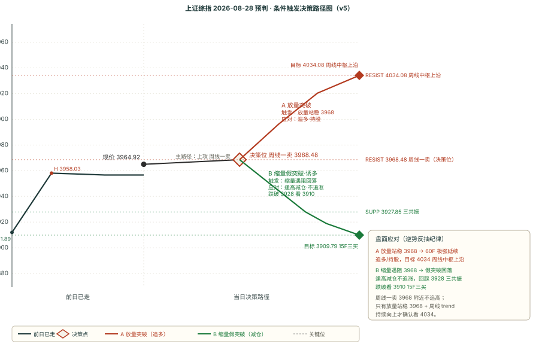

# 作战报告 · 盘中快报 · 2026-08-28（周五）

> 抓取窗口：2026-08-28 08:00 ~ 10:07（早盘增量）· 五块完整模式 · 双引擎对比表原样 · SVG 走势图
> 抓取通道：① zsxq-cli Skill 4 球 + ② Cookie 直连 6 球 · 早盘增量 **12 条**（基业长青+ 11 / 180K 1 / 卫斯李 0 / T&J 0 / 大鹏鸟 0 / 短评 0）

---

## 🔥 核心主线速览（5 句话）

1. **【盘中】上证综指现价 3964.92 +0.21%**：逼近周线一卖 3968.48（差 3 点）与 60F 中枢上沿 3967.59，**尚未突破**——延续昨收「震荡偏多、关键 3968」预判，今日焦点就是 3968 能否放量拿下。
2. **【星球·AI 主线延续】NV 财报推动 AI 交易信心、Agentic AI 已跨临界点**：中芯国际 Q2 超预期（指引 Q3 环比 +2~4%）、潍柴动力 Q2 账面净利 +57% 大超预期；**但英伟达暂停与 AI 云公司收入分成协议**（反垄断审视隐忧，上周退出、距宣布不到两月）。
3. **【星球·电力设备 EO14420 禁令】思源/阳光/金盘被错杀**：东吴电新判「错杀上车机会」，重点捞本土化最优的金盘科技；谨慎方则提示 120 天出细则才可充分评估，初期禁令严格、实操留余地。
4. **【行业】通信 +2.02% / 计算机 +1.95% 领涨，AI 算力链盘中延续**；煤炭 -1.04% / 有色 -0.83% 领跌，周期资源走弱——资金未回流低估值防守，仍偏主线 + 扩散。
5. **【宏面】今晚沃什杰克逊霍尔发言，市场预期中性偏鹰**：昨日放量 2.14 万亿回 3 字头；技术面 60F 向上逼近中枢上沿，15F 三买 3909.79 站稳，但日线仍向下——跨级别「大级别压制 + 小级别偏强」博弈未变。

---

## 第一块 · 星球信息（早盘增量）

### 1. AI 算力链 / 半导体（主线延续）

**基业长青+**：

- **[09:44] 英伟达暂停与 AI 云公司收入分成协议**
  - 英伟达暂停一项向 AI 云服务商提供信贷以换收入分成的新融资计划
  - 员工担忧引发反垄断审查；上周退出，距宣布不到两个月
- **[09:06] 英伟达暂停 AI 云收入分成（反垄断隐忧）**
  - 此举正值英伟达因用资产负债表支持"反过来又对其芯片产生需求"的项目而面临越来越多审视
- **[09:44] Anthropic 或允许部分股东在重磅 IPO 中出售股票**
- **[09:04] 盘前 0828**
  - 昨晚美股上涨修复，NV 业绩展望推动科技大涨，几乎凭一己之力推高大盘
  - NV 财报核心是 AI 整体景气度强化的信号；约束不是终端需求不足，而是供给瓶颈
  - Agentic AI 上个月已跨越临界点，中期景气预期可抬升，向更广场景渗透未停滞
  - 昨天放量 2.14 万亿回 3 字头
- **[09:01] GS 中国开盘速递**
  - 潍柴动力（000338.SZ）：Q2 账面净利同比 +57% 大超预期，核心业务强劲
  - 中芯国际：Q2 小幅超预期，指引 Q3 营收环比 +2~4%，毛利率 26~28%
  - 宏观：杰克逊霍尔会议，高盛预期沃什重申 2% 通胀目标承诺
- **[08:25] 国际复材交流要点**
  - 二代布 8~10 月 SY 新单 300 万米，报价 +5%
  - AI 布产能：年底一代布 150 万米/月、二代布 200 万米/月，9~10 月快速上量
  - E 布预计 9 月再涨价（厚布 +1.5 元/米、薄布 +2 元/米）

### 2. 电力设备 / 新能源（EO14420 禁令）

**基业长青+**：

- **[09:03] 东吴电新 · 如何看待美国 EO14420 禁令**
  - 底层逻辑仍是美国本土制造、重心在电网侧；很多公司被错杀，创造极好上车机会
  - 重点捞本土化优质电力设备：金盘科技（美国品牌 JST、本土团队与售后）
- **[08:54] 美国大容量电力系统设备禁令**
  - 思源、阳光等股价较大调整；120 天内出细则才能充分评估影响
  - 变压器主要限电网侧高压场景，离网/数据中心影响预计有限

### 3. 消费 / 其他

**基业长青+**：

- **[10:01] 电子布涨价解读**
  - 涨价函是 CCL 涨价、PP 涨价，不涉及电子布本身；7628 做的 PP +10%、薄布 PP +20%
  - 正确解读：电子布的下游提价了
- **[09:40] 立高食品 26H1 业绩交流**
  - Q2 冷冻烘焙 +18%，原料增速放缓至 +8%；商超渠道 +40%，毛利率 29.81% 同比持平
- **[08:25] 征和工业半年度业绩**
  - 农机碳化钨涂层刀具（A 股稀缺），进入约翰迪尔、凯斯等海外头部农机供应链
  - 26H1 刀具收入 3000~4000 万，同比 +3~4 倍；26 年目标 1.5 亿、27 年 5 亿以上

**180K Research**：

- **[08:29] 本土开盘前小结**

---

## 第二块 · 信息判断（跨星球观点对比）

### 一、共同观点（共识）

| 主题 | 观点 | 来源 |
|------|------|------|
| **AI 主线延续** | NV 财报确认 AI 景气度强化、Agentic AI 跨临界点；中芯/潍柴超预期佐证算力+半导体基本面 | 基业长青+（9:04 / 9:01） |
| **宏面中性偏鹰** | 今晚沃什 JH 发言，市场预期中性偏鹰，关注对 2% 通胀目标的表态 | 基业长青+（9:04 / 9:01） |

### 二、相反观点（分章列表式）

**主题：美国 EO14420 电力设备禁令**

**方向 A · 乐观（错杀上车）**：
- 东吴电新：底层逻辑是"美国本土制造"，很多公司被错杀，创造极好上车机会；重点捞本土化最优的金盘科技（美国品牌 JST、本土团队售后）。

**方向 B · 谨慎（等细则）**：
- 基业长青+（8:54）：120 天内出细则才能充分评估；初期禁令严格、后续实操留余地；离网/数据中心影响预计有限。

### 三、上期共识复盘

> 昨收共识「AI 主线 + 周期扩散、低估值防守流出」今日盘中延续：通信/计算机领涨、煤炭/有色/银行走弱，资金未回流防守，共识兑现中。

---

## 第三块 · 技术分析（缠论双引擎）

### 引擎 A · 多级别交叉对比表（盘中 10:07）

| 级别 | 综合信号 | 信号值 | 置信度 | 缠论结构 |
|------|---------|--------|--------|---------|
| 日线 | 观望 | +0.017 | 63% | down |
| 60分钟 | 观望 | +0.078 | 68% | sideways |
| 15分钟 | 观望 | +0.265 | 68% | up |
| 5分钟 | 观望 | +0.207 | 73% | sideways |

### 引擎 B · 买卖点对比表（盘中 3964.92 +0.21%）

| 周期 | 最新价 | 涨跌 | 趋势 | 中枢位置 | 买点信号 | 卖点信号 |
|------|--------|------|------|---------|---------|---------|
| 日线 | 3965.53 | +0.23% | 向下 | 中枢下方（4175.35/4061.15） | — | 一卖@3847.09、三卖@3847.09 |
| 周线 | 3965.53 | +1.54% | 向上 | 中枢内部（4034.08/3927.85） | — | 一卖@3968.48 |
| 60分钟 | 3964.92 | +0.21% | 向上 | 中枢内部（3967.59/3927.55） | — | 一卖@3911.08、三卖@3911.08 |
| 15分钟 | 3964.92 | +0.02% | 向上 | 中枢上方（3841.49/3800.50） | 三买@3909.79 | — |
| 5分钟 | 3964.92 | -0.02% | 向上 | 无中枢参考 | — | — |

### BOLL × 缠论

| 周期 | 上轨 | 中轨 | 下轨 | 带宽 | 价格位置 |
|------|------|------|------|------|---------|
| 日线 | 4009.47 | 3916.71 | 3823.95 | 4.74% 开口 | 中轨上方（+48） |
| 60分钟 | — | 3923.20 | 3853.89 | 3.53% 开口 | 中轨上方 |

> 双引擎结论：**大级别（日线向下）压制 + 小级别（60F/15F 向上）偏强**的博弈，现价 3964.92 正处周线一卖 3968.48 与 60F 中枢上沿 3967.59 双重压力下方，尚未突破。引擎 A 全级别观望（无强共振），15F 最强 +0.265 up。

---

## 第四块 · 技术预判与复盘

### 一、昨收预判盘中校验（2026-08-28-close → 盘中观察）

> 昨收预判 target 为 8/28 全天，尚未到收盘，仅做盘中校验（非正式复盘）。

| 维度 | 昨收预判 | 早盘实际（10:07） | 校验 |
|------|---------|------------------|------|
| 方向 | 震荡偏多（v5 0~+1） | 现价 +0.21%，AI 主线延续，通信/计算机领涨 | ✅ 偏多方向符合 |
| 关键位 | 3968.48 周线一卖（分水岭） | 现价 3964.92 逼近 3968，差 3 点未突破 | 正在测试，待分晓 |

### 二、本期预判（2026-08-28-intraday，target=8/28 剩余时段）

#### 1. 方向量化打分（v5）

| 因子 | 分值 | 说明 |
|------|------|------|
| 趋势因子（日线±2 + 周线±2） | **0** | 日线向下 -2 + 周线向上 +2 |
| 买卖点因子 | **0** | 周线一卖 -1（conf0.5）+ 15F 三买 +1（conf0.75）；60F 一卖三卖 3911 已被突破失效 |
| MACD 动能因子 | 待确认 | 现价 3965 逼近 3968，日线 DIF 或向上拐头拒绝死叉 |
| **总分** | **0~+1** | 边界 → 震荡偏多 / 方向不明 |

#### 2. 关键位

| 类型 | 价格 | 相对现价 | 基础 |
|------|------|---------|------|
| **支撑 SUPP 主** | **3927.85** | **-0.94%** | 三共振 + 60F 中枢下沿 3927.55 |
| 支撑 SUPP 备援 | 3911.08 | -1.36% | 60F 一卖三卖突破位 |
| 支撑 SUPP 再下 | 3909.79 | -1.39% | 15F 三买 conf 0.75 |
| **压力 RESIST 主** | **3968.48** | **+0.09%** | 周线一卖 conf 0.5 + 60F 中枢上沿 3967.59（双重压力） |
| 压力 RESIST 远 | 4034.08 | +1.75% | 周线中枢上沿 |

#### 3. 区间

- 核心区间：3927-3968（41 点）
- 扩展区间：3911-4034（123 点）

#### 4. 置信度与双向剧本

**置信度**：中等

**A 突破周线一卖 50%**：放量站稳 3968.48（同时破 60F 中枢上沿 3967.59）→ 60F 极强延续 → 冲 4034（周线中枢上沿）
**B 遇阻回踩 50%**：缩量假突破 3968 → 回踩 3927（三共振支撑）→ 跌破看 3911/3909（15F 三买）

**逆势反抽纪律**：周线一卖 3968 附近不追高，放量站稳才看 4034；缩量遇阻则回踩 3927 低吸。

#### 5. 条件触发决策路径图（v5）

### 三、偏差观察统计表（v5 第六节：四维配对计数 + bias_type 三分类）

> 累计 ≥3 类「规律已现」标签 = 仅观察不修改任何策略/逻辑/参数（绝不修改）
> 截至 2026-08-28，已复盘 **24 期**预判；四维配对计数从 `forecast_chain.json` 逐条 review 程序化重算

#### 四维配对计数（每维 ✅命中 / ⚠️部分 / ❌失效 分别计数，绝不抵消）

| 维度 | ✅ 命中 | ⚠️ 部分 | ❌ 失效 | 纯命中率 |
|------|--------|--------|--------|---------|
| **方向** | 12 | 9 | 3 | 50.0% |
| **区间** | 12 | 11 | 1 | 50.0% |
| **支撑** | 14 | 3 | 7 | 58.3% |
| **压力** | 15 | 7 | 2 | 62.5% |

#### bias_type 三分类统计

| 真偏差类（计入 ≥3 阈值） | 累计 | 规律化 |
|----------------------|------|--------|
| **支撑跌破** | **7** | ✅ 规律已现（≥3） |
| **压力位短暂突破** | **6** | ✅ 规律已现（≥3） |
| **区间下沿破位** | **3** | ✅ 规律已现（≥3） |
| **方向错误/相反** | **3** | ✅ 规律已现（≥3） |

> 关键观察（仅观察，不修改任何策略/逻辑/参数）：命中「规律已现」的维度仅标注不优化。

---

## 第五块 · 行业强弱榜

> 数据源：东财妙想实时（`scan_sw_realtime.py`，ts=2026-08-28 10:07）+ 同花顺缠论方向分（`scan_ths.py`，T+1）
> 推导逻辑：与 v5 预判模型一致的三要素——①星球观点 ②缠论信号 ③复盘经验，**不只看涨跌幅**。

### 一、三要素数据底

**要素① · 星球观点**：电子→看多；通信→看多；计算机→看多；汽车→看多；电力设备→看空；银行→看空；公用事业→看空

**要素② · 缠论方向分**：
- 偏多：房地产 +4.0 / 综合 +4.0 / 农林牧渔 +2.7 / 石油石化 +2.5 / 煤炭 +2.0 / 建筑装饰 +2.0 / 纺织服饰 +2.0 / 交通运输 +2.0 / 公用事业 +1.5 / 商贸零售 +1.3 / 轻工制造 +1.0 / 汽车 +1.0 / 银行 +1.0 / 电子 +0.8 / 家用电器 +0.8 / 食品饮料 +0.7
- 偏空：国防军工 -3.5 / 计算机 -3.0 / 通信 -2.0 / 传媒 -2.0 / 美容护理 -2.0 / 电力设备 -1.8 / 机械设备 -1.6 / 建筑材料 -1.0 / 钢铁 -1.0

**要素③ · 实时涨跌幅**：
- 领涨：通信 +2.02 / 计算机 +1.95 / 传媒 +1.25 / 基础化工 +1.16 / 电子 +1.06 / 建筑材料 +1.02 / 社会服务 +0.94 / 纺织服饰 +0.84
- 领跌：银行 -0.46 / 公用事业 -0.47 / 医药生物 -0.53 / 有色金属 -0.83 / 煤炭 -1.04

### 二、做多榜 TOP 3（三要素共振：缠论偏多 + 实时领涨 + 星球共振）

| 排名 | 行业 | 实时涨跌 | 缠论方向分 | 星球依据 | 置信度 | 推导 |
|------|------|---------|-----------|---------|--------|------|
| **1** | **电子** | **+1.06%** | **+0.8 向上**（成员6） | NVDA 财报 + 存储国产化 + HBM/DDR 短缺 | **高** | 三要素共振；缠论弱多，需实时确认站稳 |
| **2** | **纺织服饰** | **+0.84%** | **+2.0 向上**（成员2） | 防守/周期（星球弱共振） | **中** | 缠论+实时共振 |
| **3** | **石油石化** | **+0.59%** | **+2.5 向上**（成员2） | 防守/周期（星球弱共振） | **中** | 缠论+实时共振 |

> 滞后背离主线（星球强共振 + 实时涨，但缠论 T+1 慢变量仍偏空）：
> - **通信 +2.02%** + 缠论 -2.0 → 命中「方向相反」规律（趋势反转期买卖点滞后），高波动，防缩量假突破
> - **计算机 +1.95%** + 缠论 -3.0 → 命中「方向相反」规律（趋势反转期买卖点滞后），高波动，防缩量假突破

### 三、规避榜 TOP 3（缠论偏空 + 实时领跌，同向偏空）

| 排名 | 行业 | 实时涨跌 | 缠论方向分 | 规避依据 | 置信度 |
|------|------|---------|-----------|---------|--------|
| **1** | **钢铁** | **-0.30%** | **-1.0 向下**（成员1） | 同向偏空，无买点背书 | **中** |
| **2** | **电力设备** | **-0.15%** | **-1.8 向下**（成员6） | 缠论+实时同向偏空；电网 4.5 万亿属长逻辑未兑现 | **高** |

### 四、共振 / 背离说明

- **三要素共振（高置信做多）**：**电子**——星球 + 缠论 + 实时三向一致，唯一无背离做多方向。
- **星球/实时共振 vs 缠论背离（高波动）**：**通信、计算机**——缠论 T+1 慢变量未跟上，反转期买卖点滞后，防假突破。
- **低估值防守流出**：煤炭（+2.0 vs -1.04）、公用事业（+1.5 vs -0.47）、银行（+1.0 vs -0.46） → 资金未回流防守，印证「反抽修复」偏主线 + 周期扩散。
- **命中最强空头却实时反弹**：国防军工（-3.5 vs +0.74）、传媒（-2.0 vs +1.25）、美容护理（-2.0 vs +0.22）、机械设备（-1.6 vs +0.16） → 观察，缩量回落则印证「假突破/反抽」。

### 五、口径备注

- 实时涨跌幅 `ts=2026-08-28 10:07`（东财妙想，当前分钟），30/30 申万一级（「综合」缺失属正常）。
- 缠论方向分 = 前一交易日收盘 T+1（慢变量），`sw_agg` 成员 = 同花顺细分行业数、趋势 = 成员多数投票。
- 推导逻辑与 v5 一致：|direction|≤1 或缠论与星球背离 → 标「方向不明」不硬猜；缠论方向与实时相反 → 提示「趋势反转期买卖点滞后」谨慎。

---

## 附录 A · 抓取通道信息

- 通道 A（Skill）：卫斯李 0 / 基业长青+ 11 / T&J 0 / 口罩哥 0（权限缺失）
- 通道 B（Cookie）：大鹏鸟 0 / 短评 0 / 信息平权 0 / 投行圈子 0 / 180K 1 / AI 产业链 0
- 抓取窗口：8:00 ~ 10:07（--window noon 增量）
- Cookie 状态：有效

## 附录 B · 星球代号对照表

| 代号 | 星球 | 通道 | 类型 |
|------|------|------|------|
| ① | 基业长青+ | Skill | 卖方研究综合 |
| ② | 卫斯李 | Skill | 投研笔记 |
| ③ | Truth and Justice（T&J） | Skill | 技术分析 |
| ④ | 大鹏鸟笔记 | Cookie | 游资观点+热榜 |
| ⑥ | 180K Research | Cookie | 外资研报 |
| ⑦ | AI 产业链地图 | Cookie | AI 产业链专享 |

---

## 产物清单

| 文件 | 类型 |
|------|------|
| `outputs/作战报告_盘中_2026-08-28.md` | 主报告（五块完整） |
| `outputs/作战报告_盘中_2026-08-28.html` | HTML 阅读版（内嵌走势图） |
| `outputs/000001_forecast_2026-08-28.svg` | 预判走势图（条件触发决策路径图） |
