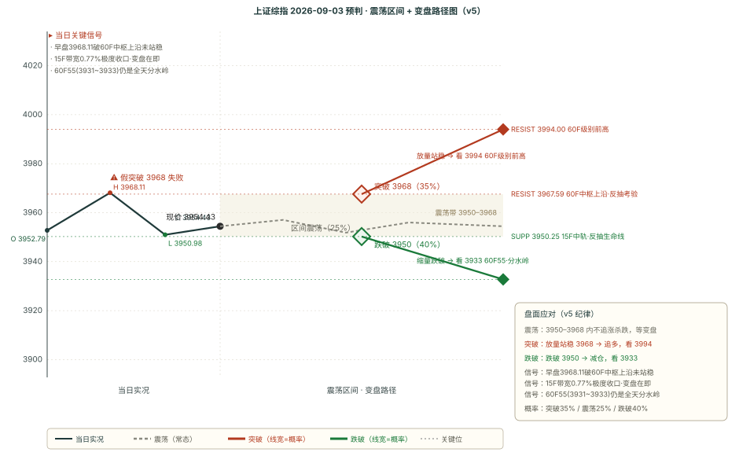

# 作战报告 · 盘中快报 · 2026-09-03（周四）

> 抓取窗口：2026-09-03 08:00 ~ 10:10（早盘增量）· 五块完整模式 · 盘中快照 10:10
> 抓取通道：zsxq-cli Skill + Cookie 直连 · 早盘增量 **17 条**（基业长青+ 14 / 卫斯李 2 / 180K 1 / T&J 0 / 大鹏鸟 0 / AI 产业链 0）

---

## 🔥 核心主线速览（5 句话）

1. **【盘中】现价 3961.46 +0.51%**：早盘高开 3952.79，冲高 **3968.11**（已触及 60F 中枢上沿 3967.59 后小幅回落），现价站上 15F55（3961.62）与日线 MA55（3948.77），**正拉锯测试 60F 中枢上沿 3967.59**——T&J「反抽必须站稳 15F55 否则难见底」的关键位盘中已过，能否收盘站稳决定反抽成色。
2. **【风格切换】资金从 AI 算力切向顺周期/防守**：非银金融 +1.87%、有色金属 +1.39%、煤炭 +1.14%、传媒 +1.28% 领涨；通信 -0.04%、电子 -0.08% 转平——晨报时（9/2 收盘）领跌的周期资源今日集体反弹，防守补涨资金回流。
3. **【高盛 vs 盘中】高盛「情绪低迷、资金偏防御、成交走低 1.82 万亿」**：但盘中资金行为反向——非银/有色/煤炭领涨，防御+顺周期双双走强，卖方情绪与盘中资金行为背离。
4. **【AI 硬件信息面仍强、资金已切走】摩根大通 PCB/CCL（NVL576 PTFE 但高速 CCL 升级不变）+ 亚太数据中心（2030 容量 20GW→53GW）+ 美银中国 AI 模型（8 月升级浪潮）+ 微软 Azure 披露销售**：信息面延续，但盘中通信/电子转平，AI 算力链熄火。
5. **【T&J 盘中 0 条】**：昨夜 23:52「反抽无法站稳 15F55 就很难见底、60F55 得失是明后天分水岭」仍是其最新观点，今日收盘 60F55（3931）分水岭见分晓。

---

## 第一块 · 星球信息（早盘增量 17 条）

### 1. AI 硬件 / 半导体（信息面仍强）

**基业长青+**：

- **[08:57] 摩根大通——PCB、覆铜板（CCL）与基板**：英伟达 NVL576 交换机托盘采用 PTFE，但高速 CCL 升级路线图不变（Rubin Ultra 的 CCL 材料规格探讨）
- **[08:58] 摩根大通——亚太数据中心——供给端的意外**：受 AI 驱动，亚太（除中国）数据中心迎大规模建设潮，预计 2030 年总容量从 2025 年约 20GW 激增至 53GW
- **[08:59] 美银——中国 AI 模型监测（8月）**：三大趋势——①模型升级浪潮（腾讯混元 4 等云巨头）②使用量激增 ③云业务上行空间
- **[08:35] 微软将在投资者抱怨后披露 Azure 销售数据**

### 2. 宏观 / 外资研判

**基业长青+**：

- **[08:53] 高盛中国开盘简报**：9 月已过两个交易日，市场情绪依旧低迷，受宏观担忧资金偏向防御板块，成交额持续走低；昨日成交 1.82 万亿元（今年以来偏低）

### 3. 建筑 / 新能源 / 其他调研

**基业长青+**：

- **[08:33] 天风建筑建材&新材料——中国建筑国际调研纪要**：MiC 建筑工业化是核心看点；现房销售政策被视为行业范式级变化（类似 2010 年限购），倒逼 MiC 增量
- **[09:28] 第一商用车网谢总、燃料电池公司 FCEL 交流要点**（260903）
- **[09:29] 策略会上市公司核心要点**：凯文教育海淀 AI 订单已进入最后决策环节，方案及预算基本一致，拟三年合作按年付费，2026 年预算已安排、争取年内落地
- **[08:51 / 08:54 / 08:55 / 08:56 / 09:34] 附件帖 5 个**（文件/图片，正文见附件）

**180K Research**：

- **[08:28] 中港交易台**（hashtag，无正文）

**卫斯李的投研笔记**：

- **[08:32] 日评**（hashtag）
- **[09:39] @Ken 提及**（无正文要点）

> T&J 盘中 0 条新帖，昨夜 23:52 技术判断仍为其最新观点（原文已归档）。

---

## 第二块 · 信息判断（跨星球观点对比）

### 一、共同观点（共识）

| 主题 | 观点 | 来源 |
|------|------|------|
| **AI 硬件景气延续（信息面）** | 摩根大通 PCB/CCL 升级不变 + 亚太数据中心 20→53GW + 美银中国 AI 模型升级浪潮 + 微软 Azure 披露 | 基业长青+（4 条，主导） |
| **宏观情绪低迷** | 高盛：情绪低迷、资金偏防御、成交走低（1.82 万亿） | 基业长青+ |

### 二、相反观点（分章列表式）

**主题：今日盘中资金方向**

**方向 A · 资金偏防御（卖方研判）**：
- 高盛开盘简报：宏观担忧下资金偏向防御板块、成交持续走低，市场情绪低迷。

**方向 B · 资金切向顺周期/非银（盘中实际行为）**：
- 盘中实况：非银金融 +1.87%、有色金属 +1.39%、煤炭 +1.14%、传媒 +1.28% 领涨，而 AI 算力链（通信/电子）转平——资金并未纯防守，而是流向「周期资源 + 非银 + 传媒」的顺周期扩散。

> 两方向并不冲突：**卖方情绪滞后于盘中资金行为**——高盛写的是开盘前研判，盘中资金已用实际行动切向顺周期/防守双线。

### 三、上期共识复盘

> 昨日（9/2）共识「AI 硬件信息面强但资金切走、防守补涨接近尾声」今日盘中**部分修正**：AI 硬件信息面仍强（摩根大通/美银续报）且资金继续切走（通信/电子转平）✅ 兑现；但「防守补涨接近尾声」❌ 被盘中推翻——石油石化/煤炭/有色今日集体反弹领涨，防守+顺周期资金回流，风格切换而非熄火。

---

## 第三块 · 技术分析（缠论双引擎）

### 引擎 A · 多级别交叉对比表（盘中 10:10，现价 3961.46）

| 级别 | 趋势 | 中枢位置 | 最新信号 | MA55（位置/斜率/距离） |
|------|------|---------|---------|------------------|
| 日线 | 向下 | 中枢下方（4061.15/4175.35） | 一卖@3847.09（07-31，超期） | 3948.77（上方，向下，+0.32%） |
| 120分钟 | 向上 | 中枢上方（3767.50/3858.31） | 一卖@3970.31（08-28） | 3904.18（上方，向上，+1.47%） |
| 60分钟 | 向上 | 中枢内部（3927.55/3967.59） | 一卖@3911.08（08-21） | 3931.52（上方，向上，+0.76%） |
| 15分钟 | 向上 | 中枢上方（3800.50/3841.49） | 无信号 | 3961.62（贴线，向下，-0.00%） |

### 引擎 B · 买卖点对比表（盘中 3961.46 +0.51%）

| 周期 | 最新价 | 涨跌 | 趋势 | 中枢位置 | 买点信号 | 卖点信号 |
|------|--------|------|------|---------|---------|---------|
| 日线 | 3961.46 | +0.51% | 向下 | 中枢下方（4175.35/4061.15） | — | 一卖@3847.09、三卖@3847.09 |
| 周线 | 3961.46 | +0.51% | 向下 | 中枢内部（4034.08/3927.85） | 一买@3927.85 | — |
| 60分钟 | 3961.46 | +0.51% | 向上 | 中枢内部（3967.59/3927.55） | — | 一卖@3911.08、三卖@3911.08 |
| 15分钟 | 3961.46 | +0.51% | 向上 | 中枢上方（3841.49/3800.50） | — | — |
| 5分钟 | 3961.46 | +0.51% | 向下 | 无中枢参考 | — | — |

### BOLL × 缠论

| 周期 | 上轨 | 中轨 | 下轨 | 带宽 | 价格位置 |
|------|------|------|------|------|---------|
| 15分钟 | — | 3950.99 | — | 1.29% | 中轨上方（+0.26%） |
| 60分钟 | — | 3960.18 | — | 1.73% | 中轨上方（+0.03%） |
| 日线 | — | 3939.03 | — | 3.41% | 中轨上方（+0.57%） |

> 双引擎结论：**现价 3961.46 已站上全部三条 55 线**（日线 3948.77 / 60F 3931.52 / 15F 3961.62），BOLL 三周期现价均站上中轨、短线偏强——晨报时（3941.39）的「三重均线夹缝」已被向上突破，现价正测试 60F 中枢上沿 3967.59（早盘高 3968.11 已触及）。但日线/周线大级别仍向下、5F 转弱，短线反抽 vs 大级别空的结构博弈未变。tj_bypass：日线状态「极弱→极强」、信号「解除极弱」（超跌反弹逻辑，仅旁路标注不进方向打分）。

---

## 第四块 · 技术预判

### 一、晨报预判盘中校验（2026-09-03-morning → 盘中，非正式复盘）

| 维度 | 晨报预判 | 盘中实际（10:10） | 校验 |
|------|---------|------------------|------|
| 方向 | 震荡偏空（v5 -3） | 现价 +0.51%，反抽站上 15F55 | ⚠️ 偏空未兑现，短线反抽 |
| 压力 | 3961.62（15F55，T&J 反抽必站稳） | 高 3968.11 已突破 | ❌ 突破（压力位短暂突破） |
| 支撑 | 3931.52（60F55 分水岭） | 低 3952.79 未触及 | ✅ 守住 |
| 区间 | 核心带 3931-3962 | 高 3968.11 破上沿 | ⚠️ 上沿破位 |

### 二、本期预判（2026-09-03-intraday，target=今日剩余时段）

#### 1. 方向量化打分（v5）

| 因子 | 分值 | 说明 |
|------|------|------|
| 趋势因子（日线±2 + 周线±2） | **-4** | 日线向下 -2 + 周线向下 -2 |
| 买卖点因子 | **+2** | 周线一买 3927.85 +2（已兑现保留）+ 60F 向上 MA55 上方 +1 + 15F 站上 MA55 +1 - 日线一卖超期 -0 - 5F 转弱 -1 |
| MACD 动能因子 | **-1** | 日线 DIF 空头区死叉未解，反抽持续性待确认 |
| **总分** | **-3** | **震荡偏空**（大级别空主导，盘中反抽动能对冲，未确认翻多） |

#### 2. 关键位（相对现价 3961.46）

| 类型 | 价格 | 相对现价 | 基础 |
|------|------|---------|------|
| **压力 RESIST 主** | **3967.59** | **+0.15%** | 60F 中枢上沿 · 反抽第一考验（早盘高 3968.11 已触及未站稳） |
| 压力 RESIST 远 | 3994.0 | +0.82% | 60F 级别前高（3741-3994 三段上涨顶） |
| **支撑 SUPP 近** | **3960.18** | **-0.03%** | 60F BOLL 中轨 + 15F55 共振 · 反抽生命线 |
| 支撑 SUPP 备援 | 3950.99 | -0.26% | 15F BOLL 中轨 |
| **支撑 SUPP 主** | **3931.52** | **-0.76%** | 60F55 线 · T&J 全天分水岭（不能有效跌破） |
| 支撑 SUPP 强 | 3927.85 | -0.85% | 周线一买 |

#### 3. 区间

- 核心震荡带：3960-3968（8 点，60F 中轨 ~ 中枢上沿）
- 扩展区间：3931-3994（63 点，60F55 分水岭 ~ 60F 前高）

#### 4. 置信度与双向剧本

**置信度**：中等偏低（大级别向下 + 反抽未确认翻多；但现价站上三条 55 线、BOLL 三周期偏强，短线动能向上，方向不确定性强）

**A 放量站稳 3967.59（35%）**：15F X 段成立 → 反抽延续看 3994（60F 前高，需放量 + 收盘确认）
**B 反抽遇阻回落（40%）**：回踩 3960/3950（60F 中轨/15F 中轨）→ 跌破再测 60F55 分水岭（3931）
**C 3960-3968 窄幅震荡（25%）**：缩量观望，等 60F 中枢上沿 3967.59 的突破/回落答案

**逆势反抽纪律（v5）**：日线空头区里 60F 反抽站上 MA55 ≠ 买点，反抽不追高；只有放量站稳 3967.59 才看 3994；跌破 3960/15F55 则反抽失败、转防守，下看 3931。

#### 5. 条件触发决策路径图（v5）

### 三、偏差观察统计表（v5 第六节：四维配对计数 + bias_type 三分类）

> 累计 ≥3 类「规律已现」标签 = 仅观察不修改任何策略/逻辑/参数（绝不修改）
> 截至 2026-09-03，已复盘 **32 期**预判；四维配对计数从 `forecast_chain.json` 逐条 review 程序化重算

#### 四维配对计数（每维 ✅命中 / ⚠️部分 / ❌失效 分别计数，绝不抵消）

| 维度 | ✅ 命中 | ⚠️ 部分 | ❌ 失效 | 纯命中率 |
|------|--------|--------|--------|---------|
| **方向** | 15 | 14 | 3 | 46.9% |
| **区间** | 15 | 16 | 1 | 46.9% |
| **支撑** | 22 | 3 | 7 | 68.8% |
| **压力** | 18 | 10 | 4 | 56.2% |

#### bias_type 三分类统计

| 真偏差类（计入 ≥3 阈值） | 累计 | 状态 |
|----------------------|------|------|
| **压力位短暂突破** | **9** | ✅ 规律已现（≥3） |
| **支撑跌破** | **5** | ✅ 规律已现（≥3） |
| **支撑精准命中** | **3** | ✅ 规律已现（≥3） |
| **区间下沿破位** | **3** | ✅ 规律已现（≥3） |
| **压力位突破（有效）** | **3** | ✅ 规律已现（≥3） |

> 关键观察（仅观察，不修改任何策略/逻辑/参数）：今日盘中「高 3968.11 触及 60F 中枢上沿 3967.59 未站稳」正是「压力位短暂突破」规律（累计 9 次）的再次显现——反抽遇阻压力位不追高。

---

## 第五块 · 行业强弱榜

> 数据源：akshare 申万一级实时（`scan_sw_realtime.py`，ts=2026-09-03 10:07）+ 同花顺缠论方向分（`scan_ths.py`，T+1 已更新至 9/2 收盘）
> 推导逻辑：与 v5 预判模型一致的三要素——①星球观点 ②缠论信号 ③实时涨跌，**不只看涨跌幅**。

### 一、三要素数据底

**要素① · 星球观点**：AI 硬件（电子/通信/计算机）→ 信息面强但资金切走；汽车（无人驾驶）→ 看多；消费电子（苹果折叠屏）→ 看多；社会服务（国庆旅游）→ 看多；公用事业（电力）→ 看多；电力设备（锂电排产超预期）→ 看多

**要素② · 缠论方向分（sw_agg，T+1）**：
- 偏多：石油石化 +3.5 / 传媒 +3.3 / 公用事业 +3.0 / 纺织服饰 +3.0 / 农林牧渔 +2.7 / 商贸零售 +2.7 / 汽车 +2.3 / 交通运输 +2.2 / 煤炭 +2.0 / 美容护理 +2.0 / 建筑装饰 +2.0 / 电子 +1.8 / 社会服务 +1.7 / 非银金融 +1.7 / 食品饮料 +1.3 / 机械设备 +1.2 / 房地产 +1.0 / 计算机 +1.0 / 综合 +1.0 / 家用电器 +1.0 / 银行 +1.0
- 偏空：钢铁 -3.0 / 国防军工 -1.5 / 有色金属 -1.2 / 电力设备 -1.0 / 医药生物 -0.2

**要素③ · 实时涨跌幅（10:07）**：
- 领涨：非银金融 +1.87 / 交通运输 +1.44 / 有色金属 +1.39 / 传媒 +1.28 / 煤炭 +1.14 / 石油石化 +1.05 / 家用电器 +0.99
- 领跌：建筑材料 -0.74 / 农林牧渔 -0.28 / 环保 -0.20 / 电子 -0.08 / 通信 -0.04

### 二、做多榜 TOP 3（三要素共振：缠论偏多 + 实时领涨 + 星球共振）

| 排名 | 行业 | 实时涨跌 | 缠论方向分 | 星球依据 | 置信度 | 推导 |
|------|------|---------|-----------|---------|--------|------|
| **1** | **非银金融** | **+1.87%** | **+1.7 向上**（成员3） | 顺周期扩散（弱共振） | **中** | 缠论偏多 + 实时领涨第一，风格切换受益 |
| **2** | **传媒** | **+1.28%** | **+3.3 向上**（成员3） | 苹果折叠屏/消费电子催化（弱共振） | **中** | 缠论最强之一 + 实时领涨，双共振 |
| **3** | **交通运输** | **+1.44%** | **+2.2 向上**（成员4） | 顺周期扩散（弱共振） | **中** | 缠论偏多 + 实时领涨，双共振 |

> 防守/顺周期资金回流：**煤炭 +1.14%（缠论 +2.0）、石油石化 +1.05%（缠论 +3.5）**——晨报时（9/2 收盘）领跌的防守资源今日集体反弹，缠论方向分最强 + 实时领涨双共振，印证「防守补涨」未熄火、资金回流。

### 三、规避榜 TOP 3（缠论偏空 + 实时领跌，同向偏空）

| 排名 | 行业 | 实时涨跌 | 缠论方向分 | 规避依据 | 置信度 |
|------|------|---------|-----------|---------|--------|
| **1** | **钢铁** | **+0.46%** | **-3.0 向下**（成员1） | 缠论最弱，实时仅微涨无买点背书 | **中** |
| **2** | **电力设备** | **+0.63%** | **-1.0 向下**（成员6） | 缠论偏空，反弹无结构背书 | **中** |
| **3** | **国防军工** | **+0.10%** | **-1.5 向下**（成员2） | 缠论偏空，事件驱动不持续 | **中** |

### 四、共振 / 背离说明

- **强背离 · 有色金属（缠论 -1.2 空 vs 实时 +1.39 涨）**：命中「方向相反」规律（趋势反转期买卖点滞后），缠论 T+1 慢变量未跟上，高波动防缩量假突破。
- **双共振做多 · 非银/传媒/交运/煤炭/石油石化**：缠论偏多 + 实时领涨同向，风格切换主线（顺周期 + 防守补涨回流）。
- **主线熄火 · 通信/电子/计算机（AI 算力链）**：信息面（摩根大通 PCB/CCL + 亚太数据中心 + 美银）强，但资金面盘中转平/切走，典型「洗盘 or 见顶」观察窗口。

### 五、口径备注

- 实时涨跌幅 `ts=2026-09-03 10:07`（akshare index_realtime_sw，当前分钟），覆盖申万一级 31 行业，无缺失。
- 缠论方向分 = 9/2 收盘 T+1（慢变量），`sw_agg` 成员 = 同花顺细分行业数、趋势 = 成员多数投票。
- 推导逻辑与 v5 一致：|direction|≤1 或缠论与星球背离 → 标「方向不明」不硬猜；缠论方向与实时相反 → 提示「趋势反转期买卖点滞后」谨慎。

---

## 附录 A · 抓取通道信息

- 通道 A（Skill）：基业长青+ 14 / 卫斯李 2 / T&J 0
- 通道 B（Cookie）：大鹏鸟 0 / 短评&信息 0 / 180K 1 / AI 产业链 0
- 抓取窗口：8:00 ~ 10:10（--window noon 增量）
- Cookie 状态：有效

## 附录 B · 星球代号对照表

| 代号 | 星球 | 通道 | 类型 |
|------|------|------|------|
| ① | 基业长青+ | Skill | 卖方研究综合 |
| ② | 卫斯李 | Skill | 投研笔记 |
| ③ | Truth and Justice（T&J） | Skill | 技术分析 |
| ④ | 大鹏鸟笔记 | Cookie | 游资观点+热榜 |
| ⑥ | 180K Research | Cookie | 外资研报 |
| ⑦ | AI 产业链地图 | Cookie | AI 产业链专享 |

---

## 产物清单

| 文件 | 类型 |
|------|------|
| `outputs/作战报告_盘中_2026-09-03.md` | 主报告（五块完整） |
| `outputs/作战报告_盘中_2026-09-03.html` | HTML 阅读版（内嵌走势图） |
| `outputs/000001_forecast_2026-09-03.svg` | 预判走势图（条件触发决策路径图） |
