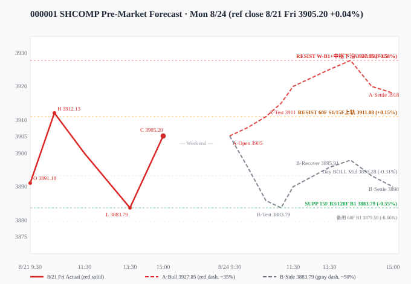

# 知识星球收盘快报 2026-08-22（周六休市）改进版

> **窗口**：12:30 - 16:00｜**生成时间**：16:05｜**改进版规范**：正文隐藏通道/代号，文末附录对照表

---

## 0. 核心数据快照

| 指标 | 数值 |
|------|------|
| 上证综指 8/21 收盘 | **3905.20**（+0.04%）|
| 8/21 真实区间 | 3883.79 - 3912.13 |
| 当前市场状态 | 8/22 周六休市，下一交易日 **8/24 周一** |
| 8/21 成交 | 1.89 万亿（4 月以来最低 / 年内第四低）|
| 周末关键事件日历 | 8/24 国内 8 月 LPR 决议、8/27 7 月 PCE + NVDA 财报、8/29 杰克逊霍尔（沃什讲话）|

---

## 一、星球信息（12:30-16:00 新增）

### 1.1 新增速览

| 维度 | 数量 |
|------|------|
| 星球新增 | **12 条**（基业长青+ 6 / 卫斯李 4 / AI 产业链 2 / 其余 0）|
| 图片 | 13 张 |
| 附件 | 2 份（同一份 SemiAnalysis《Are Open Models Catching Up?》PDF，4.5MB）|
| 抓取异常 | 口罩哥 Skill 通道暂未开通权限（0 条获取）|

**主题分布**：宏观研究 5 条（高盛 7 月数据 + 花旗欧股 + 隔夜全球大类资产 + 有趣图表 + SemiAnalysis）× AI 算力 4 条（阿里 4 大行 + 腾讯克制估值 + Anthropic 自研 + SemiAnalysis 开放模型）× 个股调研 3 条（古茗/中国巨石/金盘科技）。

### 1.2 分板块明细

#### AI 算力与硬件（4 条）

- **12:38 · AI 产业链·Serenity**：腾讯控股公司深度研究。"盈利还在涨，倍数却从 18 倍跌到 13 倍"——AI 投入最克制的大平台（算力上游基本外采，不自研对外销售芯片）。核心看点：现金流结构 + AI 投入边界 + 算力外采成本弹性 + 产业链位置。判断"克制"是否换来了安全边际。🔗 aichainmap.com/stocks/腾讯控股

- **12:45 · 基业长青+**：Anthropic 聘请 Alphabet 旗下 Google 定制 AI 芯片（TPU）前项目创始人 Amir Salek 进军硬件领域（8/5 在 Cloud 开发者大会亮相）。Salek 2022 年主导第七代 TPU 芯片；Anthropic 累计融资数百亿美元（Google 参投），估值 2022 年起翻 5 倍至 1830 亿美元。Anthropic 正以 2.5 亿美元收购由其员工共同创立的 AI 芯片初创公司**莓塔（Finite）**，并与**雨果公司（Riot Platforms）**签署算力协议。**对手动态**：OpenAI 计划 2025 年发布为 AI 优化的首款芯片"Jalapeno"（与博通联合开发），预计今年交付首批芯片。投资逻辑意义：Cybersecurity Capital Management 高级董事总经理评论"萨莱克是坐拥美国防御部原型、史密森尼等共同创办人，私营股权公司"。

- **12:46 · 基业长青+**：苹果公司正在裁减负责 Siri 数字助理和 Vision Pro 头戴式耳机的团队员工，专注新设备和 AI 战略。Vision Pro 团队去年裁减 100 多个岗位；公司秘密项目"Project Atlas"为下一代家用机器人产品做调研；Vision Pro 在 2024 年 2 月发布后销量不佳（起价 3,499 美元/最高 3,899 美元），将 2026/2027 观察期；前苹果 Vision Pro 工程师加入 Meta 3D 视频部门。

- **15:15 · AI 产业链·Serenity**：SemiAnalysis《Are Open Models Catching Up?》深度解读。**核心数据**：开放模型追平闭源前沿模型所需时间从 19.7 月 → 8.5 月 → 4.8 月（每代减半）；DeepSeek/Kimi/GLM 已能完成高价值编程/Agent/知识工作。**但并非模型层快速商品化**：OpenAI/Anthropic 仍有更强产品化能力 + 前沿 Token 算力变现效率远高。**未来竞争关键**：从模型算法 → 算力集中度——若 OpenAI/Anthropic 凭借更高回报率持续获得更多新增算力，闭源与开放的差距可能再次被拉大。📎 Are Open Models Catching Up.pdf

#### 海外宏观与全球资产（3 条）

- **13:40 · 卫斯李**：隔夜全球大类资产评论 0822。
  - **宏观**：原油期货结算价继续走高但盘后回吐；伊朗总统佩泽什基安支持结束战争 vs 伊朗海军司令强硬警告"敌人即将迎来历史性教训"；周五美债收益率全线上行，**熊平**（短端领涨），10Y 回到年内高点附近；MOVE 指数反弹有限；美元指数维持 200 日均线下方低位震荡（支撑全球风险资产）。
  - **美股数据**：标普全球 PMI 初值——美国制造业弱、服务业超预期，综合 PMI 54.5 → 56.0，对应 Q3 增速 ~3.0%（明显高于 Q2 的 1.5%）。
  - **下周焦点**：周一贝森特对伊朗新制裁、**美国 PCE、BLS 就业数据初步基准修订**、**美联储沃什杰克逊霍尔讲话**。
  - **美股板块**：材料/医疗保健/非必需消费品领涨，公用事业落后（NEE/SO/DUK/AEP 承压）；能源矿业股（CRAK 创新高）；科技板块内部分化（SKYY/IGV 反弹，SMH/CHAT 未突破 100 日均线）；**RSP 跑赢 VOO**（等权重/价值风格占优）。
  - **商品/币**：金银延续涨势（美元信用重新定价），铜价大幅反弹（中国财政刺激预期+金属价格上涨，铜矿股 ETF 突破上行压力位），比特币突破 200 日均线本周累计反弹约 23%。
  - **国际股市**：巴西领涨（美元走弱受益，200 日均线压制仍存）；泰国/希腊/欧洲接近历史高位；印度/台湾/韩国疲弱（科技拖累）。
  - 图片正文：全球主要 ETF 涨跌幅表（**IBIT 比特币 +6.02% 领涨，TLT 美债 -0.35%**）。

- **13:59 · 卫斯李**：有趣图表-20260822。
  - **中国总储蓄率 43%**（较 2010 年近 50% 回落，仍高于印度/德国/日本）；经常账户顺差形成资本净输出。
  - **中国海外资产**（不含官方储备）超 8 万亿美元（较 2012 年增 5 倍），净国际投资头寸接近平衡。
  - **跨境贷款人民币占比约 50%**（中资银行境外人民币贷款从 < 3000 亿 → ~3 万亿）；**点心债存量 ~1.9 万亿**（中资银行持有 > 60%）。
  - **外资境内人民币债 11 个月净卖出 1.25 万亿**（-28%）；低收益率+中美负利差+资本流动限制削弱人民币资产风险调整后回报。
  - **MSCI 中国指数**：可选消费/公用事业未来 12 个月盈利负增长，信息技术增速近零。
  - **科创 50 信息权重 86%**（9 只半导体），2026 年跑赢沪深 300 约 30%，是跟踪本土 AI 硬科技的更直接指标。
  - 高盛 A 股新模型建议：消费板块（含美妆、白酒）超配，制造业升级（半导体、化工、自动化设备、医疗器械）维持，**金融板块（银行、券商）低配**。

- **15:54 · 卫斯李**：花旗：解析欧洲股市的反弹。**三大因素**：
  1. **周期性改善**——欧洲 CESI 大幅回升（历史数据：强 CESI 走势通常伴随周期股跑赢）；**盈利修正指数 ERI 逆势上扬**（财报季前夕通常 ERI 会恶化，但欧洲 ERI 近期不仅没恶化还攀升）；覆盖范围广（绝大多数欧股 EPS 获净上调）。
  2. **持续财政支持**——2025 财政是欧元区 GDP 净拖累 → **2026 财政贡献 +30bp** 提振；**德国赤字从 2.7% 升至 4.0%**；欧盟 7 年 2 万亿美元长期预算；财政格局变化推动 EPS 增长支撑整体估值。
  3. **欧洲作为 AI 对冲工具角色**——欧股科技板块敞口低于其他主要市场，在 AI 情绪动摇时往往逆势跑赢。
  - **花旗中性评级**，预计 2027 年中约 **8% 上行空间**；地缘政治风险（油价+利率传导）仍是关键隐患。
  - 图片正文：Figure 1（全球指数 3m 表现：Stoxx 600 / Euro Stoxx 50 领涨）/ Figure 2（CESI+ERI 改善）/ Figure 3（5y Fwd EPS CAGR vs 12m Fwd PE 散点图）/ Figure 4（全球行业/地区与 AI 指数相关性 Z-Score：科技/工业/资源高相关，公用事业/必需消费负相关）/ Figure 5（2026 ERI vs 季节性均值）/ Figure 6（Stoxx 600 选股清单：EBS.VA/FRES.L/GIVN.S/MCOD.L/SIKA.S 等 41 只）。

#### 中国宏观（1 条）

- **15:58 · 卫斯李**：高盛：中国 7 月经济数据解读与展望。
  - **7 月数据较 6 月进一步走弱**：工业增加值 +4.5%（出口支撑）、社零 +0.6%、**1-7 月 FAI -6.7%（7 月单月降幅达两位数）**；Q3 上半段官方实际 GDP 增速约 4%。
  - **货币政策宽松预期升温**：10Y CGB 收益率跌至 **1.70% 以下**（较 2 月底下行 10bp，反映"今年由能源驱动的通胀可能暂时性"+政策宽松合理性）。
  - **需求驱动型疲弱**：钢铁周度产量 7-8 月下降（8/21 **-8.7% YoY**），螺纹钢价格持续下跌，**量价齐跌**指向需求不足；去年 7 月"反内卷"行动价格回升但因需求支撑不足最终回落。
  - **季末月份模式**：IP/PMI 季末走强、季后回落（4/7/10 月环比下滑），制造业产出前置支撑 GDP。
  - **基建 FAI 和水泥产量 6→7 月降幅最大**（其他指标详见 Exhibit 7）。
  - **持续疲弱根源**：
    - **私营非金融部门 DSR**（债务偿付比率）：**美国次贷危机后降 4pct（联储降息+多项债务重组）**；**中国 2020Q3 后反升 2pct**（Exhibit 8，对比鲜明）。
    - 政府几乎完全聚焦科技创新和高技术制造业（Exhibit 9：疫情后制造业就业反超非制造业）。
    - 房地产/财政发力受限于政治换届年（反腐调查数量创高，政府债发行缓慢）。
    - 山西 5 月煤矿事故后煤炭产量大幅下降（Exhibit 11）。
  - **政策选项**（Exhibit 10）：投资（专项金融工具/六网建设/十五五重大工程）+ 产业（电子设备/半导体）+ 住房（公积金扩用）+ 消费（低线城市/农村）。
  - 图片正文：Exhibits 1-11（活动数据/10Y 国债/钢铁量价/IP 季节性/服务零售/基建 FAI/DSR/PMI 就业/政策选项/煤炭）。

#### 消费调研（1 条）

- **12:56 · 基业长青+**：古茗加盟商（合肥）调研反馈。
  - **单店业绩**：2026/1-7 月实收 ~12 万/月（同比 -20%+，2025 同期 ~16 万；下滑主因 2025 外卖大战补贴退坡/单量回落，非行业竞争）；**8 月前半月环比大涨**，叠加"秋天的第一杯奶茶"+七夕，预计创全年单月新高；三四季最差不低于 1-7 月、降幅逐季收窄；**2027 经营预计好于 2026**。
  - **咖啡第二曲线**：咖啡占门店销售 ~20%（与 25 年底持平，**"苦尽甘来"为全店销量第一单品**，持续出爆款下占比有望达 30% 公司目标）；战略上以咖啡承接粉冲奶茶淘汰的营收缺口，不对主流茶饮形成挤压。
  - **下沉壁垒**：皖南县域/乡镇市场碾压级优势，**旺季单店日销超 1 万元**、业绩超省会合肥门店；新开门店放缓缓解门店加密压力。
  - **行业格局**：咖啡赛道明显收缩（库迪 6 月单月全国关店超千家、幸运咖合肥大量关闭、瑞幸 2026 开年业绩下滑、蜜雪门店密度过高加盟价值降低）；多品牌加盟商视角，**古茗为当前发展势头最好的茶饮品牌**。
  - **增长驱动**：早餐品类广州测试表现较好，全面上线后预计带来业绩增量；2026 糯米酸奶+"苦尽甘来"咖啡双爆款验证新品研发能力；**2027 经营确定性增强**。

#### 制造业（2 条）

- **12:57 · 基业长青+**：中国巨石 26H1 业绩会要点。
  - **特种布**：除二代布外，一代布、低膨胀、Q 布均已实现技术突破，小批量生产，头部客户处认证验证；月产能 15-30 万米；二代布推进坩埚法+窑炉法，**26H2 出样**；特种布产能规划纳入 27 年投资计划，**27H2 起逐步释放**。
  - **普通电子布**：行业扩产克制（新增产能多在特种布+设备交付周期长+技术壁垒+新进入者导入周期长+贵金属价格高+投资意愿低）。
  - **电子布项目节奏**：
    - 桐乡 2.5 亿米：逐步爬坡满产预计到 30 年。
    - **淮安 3.2 亿米**：原计划 27H2 或 Q4 投产，调整为先做 7628 等产品锻炼团队；**26Q4 小批量生产，27H1 布局 100 台织机逐步上量，28H1 满产**（薄布/超薄布/极薄布为核心）。
  - **粗纱展望**：**27 年粗纱新增产能有限**（海外友商关厂+窑炉冷修+铂铑合金价格高企+海外关税上升），需求端工程改性塑料/新能源车 PCB 增长，**27 年粗纱价格存在上涨可能**。

- **12:59 · 基业长青+**：金盘科技 26H1 业绩交流会增量。
  - **海外订单**：26H1 海外新增订单 **42 亿元**（1/3 油变+1/3 干变），海外新能源/数据中心/电力领域头部企业多年期框架协议，**海外订单增长确定性较强**。
  - **国内订单**：26H1 国内新增订单 **33 亿元**（数据中心 1/3+新能源 1/3），电网业务加速拓展。
  - **交付周期**：开关/干变 2-4 个月，高压油浸变压器 6-8 个月+运输整体 ~12 个月；**目前海外数据中心客户无项目延期情况**。
  - **产能**：海外干变产能利用率已达 80%-90%（仍有扩产计划）；**2026 美国工厂产能利用率预计 40%-50%、2027 满产**；规划下半年启动欧洲制造基地建设。

---

## 二、信息判断（跨星球观点 + 上期共识复盘）

### 2.1 跨星球共同观点（8 条）

1. **SemiAnalysis：开放模型快速追赶闭源（追赶速度每代减半）**——AI 产业链·Serenity（12:38/15:15 两次解读同一份报告）+ 基业长青+（13:26 摘要）。DeepSeek/Kimi/GLM 4.8 月追平闭源前沿；但未来竞争关键不再是模型算法，而是算力集中度。

2. **AI 算力链：阿里 + Anthropic 双重催化（4 大行看多 + 自研芯片）**——卫斯李（4 大行看多延续）+ 基业长青+（Anthropic 聘谷歌 TPU 老将）+ AI 产业链·Serenity（外采 vs 自研双轨制）。

3. **中国 7 月经济数据疲弱 + 政策刺激预期升温**——卫斯李（高盛 7 月数据 + 隔夜评论提到中国可能推出额外财政刺激）。社零 +0.6%/FAI -6.7%/钢铁量价齐跌；但 10Y CGB 收益率跌至 1.70% 以下反映宽松预期升温；下周一 8 月 LPR 决议为关键窗口。

4. **欧洲股市看多逻辑（AI 对冲工具 + 财政支持 + 周期改善）**——卫斯李（花旗欧股反弹）。CESI 大幅回升 / ERI 逆势上扬；2026 财政贡献 +30bp；德国赤字 2.7%→4.0%；花旗中性评级，2027 年中约 8% 上行空间。

5. **北美数据中心/海外订单：变压器与电子布确定性高**——基业长青+（金盘科技海外订单 42 亿+中国巨石电子布 27H2 起逐步释放+粗纱 27 年价格存上涨可能）。短期设备商订单确定性极强。

6. **全球大类资产：金银/铜/比特币强势，美股广度较好**——卫斯李（隔夜全球大类资产评论）。金银延续涨势（美元信用重新定价），铜价大幅反弹（中国财政刺激预期+金属价格上涨），比特币突破 200 日均线本周累计反弹约 23%；美股材料/医疗保健/非必需消费品领涨。

7. **苹果 AI 战略调整：裁减 Siri/Vision Pro 团队员工**——基业长青+（专注新设备和 AI 战略；Vision Pro 2024 年 2 月发布后销量不佳 2026/2027 待观察）。

8. **消费调研：古茗下沉市场碾压级优势 + 咖啡第二曲线**——基业长青+（古茗加盟商合肥调研）。8 月环比大涨 + "苦尽甘来" 全店销量第一单品 + 皖南县域碾压级优势 + 2027 经营确定性增强。

### 2.2 跨星球相反观点（2 条，方向互斥）

#### ① AI 算力发展模式：克制自研 vs 重投入增长

| 维度 | 侧 A：克制外采（盈利涨估值跌） | 侧 B：重投入自研（capex 持续上修）|
|------|--------------------------------|-----------------------------------|
| **方向标签** | 安全边际估值修复 | 成长性 capex 持续上修 |
| **代表** | **腾讯**（盈利还在涨，倍数从 18 跌到 13 倍；AI 投入最克制的大平台，算力上游基本外采，不自研对外销售芯片；"不需要靠故事支撑的公司留下的安全边际"）| **阿里**（4 大行同日看多，capex 持续上修+ROIC 路径清晰）+ **Anthropic**（聘谷歌 TPU 老将自研芯片、累计融资数百亿美元、估值 1830 亿）+ **OpenAI**（计划 2025 发布 Jalapeno 芯片+博通定制芯片）|
| **来源** | AI 产业链·Serenity（腾讯控股公司深度研究）| 基业长青+（Anthropic 谷歌 TPU 老将）+ 卫斯李（4 大行看多阿里）|
| **判定** | **风格分歧，非资产方向互斥**：腾讯代表"现金流+克制"逻辑；阿里/Anthropic 代表"重投入+成长性"逻辑。两者不矛盾（不同公司在 AI 价值链不同位置采取不同策略），但市场会按风格重新定价。

#### ② 中国短期经济：政策刺激预期 vs 实际数据疲弱

| 维度 | 侧 A：政策刺激预期（偏多） | 侧 B：实际数据疲弱（偏空）|
|------|---------------------------|--------------------------|
| **方向标签** | 偏多（情绪领先）| 偏空（基本面滞后）|
| **代表** | **10Y CGB 收益率跌至 1.70% 以下**反映宽松预期升温；隔夜全球评论：中国可能推出额外财政刺激措施预期推动铜价大幅反弹，铜矿股 ETF 突破上行压力位；下周一 8 月 LPR 决议窗口 | **高盛 7 月数据**：社零 +0.6%、FAI -6.7%、钢铁量价齐跌、基建/水泥降幅最大、私营非金融部门 DSR 反升 2pct；7 月单月降幅两位数；**季末月份模式** IP/PMI 走强、季后回落（4/7/10 月环比下滑）|
| **来源** | 卫斯李（隔夜全球大类资产评论 + 高盛 7 月数据文末政策选项）| 卫斯李（高盛：中国 7 月经济数据解读，Exhibits 1-11）|
| **判定** | **预期 vs 现实分歧，非资产方向互斥**：政策刺激预期反映市场情绪（铜价/CGB 收益率领先），实际数据反映基本面（社零/FAI/钢铁）；下周一 8 月 LPR 决议 + 后续政策落地为关键验证窗口。

### 2.3 上期共识复盘（2026-08-22-noon 午间快报）

> 验证窗口：12:30→16:00 周六休市，无新行情，做**延续性参考核验**；正式验证顺延至 8/24 周一开盘。

| 共识/相反观点 | 判定 | 说明 |
|--------------|------|------|
| **MARVELL 谷歌权证 + NVIDIA 财报双重催化** | 不参与（事件事实）| 8/24 周一开盘后无北美观测，事件事实描述 |
| **8/24 周一开盘：15F 极度收口变盘方向为关键变量** | 跟踪中（待 8/24 开盘验证）| 12:30→16:00 无新行情（周六休市），技术面状态完全延续；15F 极度收口 0.44% 变盘窗口仍在累积 |
| **下周一开盘 8/24 走势：技术偏多 vs 资金/情绪偏空** | 跟踪中（延续性参考）| 12:30→16:00 无新数据；技术偏多（15F三买 3883.79 / 60F一卖 3911.08 / 日线BOLL 82%）与资金/情绪偏空（60F/120F BOLL 72% / 1.89 万亿 / B&B 9.5）的多空分歧延续；8/24 开盘初 30-60 分钟为关键验证窗口 |

---

## 三、技术分析（双引擎 + BOLL + 四周期联动）

### 3.1 引擎A：多维融合（四级别，2026-08-21 收盘口径）

| 级别 | 综合信号 | 信号值 | 置信度 | 缠论结构 | 笔/线段/中枢 | 操作建议 |
|------|---------|--------|--------|---------|-------------|---------|
| 日线 | 观望 | -0.129 | 60% | down | 48/9/3 | 信号不明确，建议观望等待 |
| 60分钟 | 观望 | -0.029 | 62% | sideways | 48/9/2 | 信号不明确，建议观望等待 |
| 15分钟 | 观望 | +0.162 | 63% | down | 45/9/2 | 信号不明确，建议观望等待 |
| 5分钟 | 观望 | -0.111 | 53% | sideways | 43/8/2 | 信号不明确，建议观望等待 |

> 区间套解读：四级别全"观望"——日线 down / 60F sideways / 15F down / 5F sideways，**无方向共振**；15F 是唯一偏多信号（+0.162/63%），但其余三级别均为观望/偏空。

### 3.2 引擎B：chan-signal 买卖点（五周期）

| 周期 | 最新价 | 涨跌 | 趋势 | 中枢位置 | 买点信号 | 卖点信号 |
|------|--------|------|------|---------|---------|---------|
| 日线 | 3905.20 | +0.04% | 向上 | 在中枢下方（上沿 4175.35 / 下沿 4061.15） | — | 一卖@3847.09 + 三卖@3847.09（07-31 滞后） |
| 周线 | 3905.20 | -0.56% | 向下 | 在中枢下方（上沿 4034.08 / 下沿 3927.85） | **一买@3927.85** | — |
| 60分钟 | 3905.20 | +0.18% | 向上 | 在中枢下方（上沿 3967.59 / 下沿 3927.55） | — | **一卖@3911.08 + 三卖@3911.08**（8/21 今日） |
| 15分钟 | 3905.20 | -0.06% | 向下 | 在中枢上方（上沿 3841.49 / 下沿 3800.50） | **三买@3895.91**（置信度 0.75） | — |
| 5分钟 | 3905.20 | -0.01% | 向上 | 无中枢参考 | — | 一卖@3904.48（置信度 0.5）|

> 周期联动：周线/日线定方向（周线一买 3927.85 vs 日线一卖 3847.09 矛盾，但日线一卖滞后至 07-31 不参与）；60F 一卖 3911.08（短线压力）/ 15F 三买 3895.91（短线支撑）形成关键区间。

### 3.3 引擎C：BOLL×缠论 交叉验证 + 变盘概率预判

| 级别 | 上涨概率 | 下跌概率 | 方向 | 带宽状态 | 关键依据 |
|------|---------|---------|------|---------|---------|
| 15分钟 | **72%** | **28%** | 看多 | 极度收口（变盘）0.44% | 中轨上方 +1，中轨上行 +2，收口偏多 +2，趋势向下 -2，缠论买点 +2 |
| 60分钟 | **28%** | **72%** | 看空 | 开口（趋势启动）3.48% | 中轨下方 -1，中轨下行 -2，开口向下 -2，趋势向上 +2，缠论卖点 -2 |
| 120分钟 | **28%** | **72%** | 看空 | 常态 2.89% | 中轨下方 -1，中轨下行 -2（无缠论数据，仅 3 因子）|
| 日线 | **82%** | **18%** | 看多 | 开口（趋势启动）5.98% | 中轨上方 +1，中轨上行 +2，开口向上 +2，趋势向上 +2 |

**共振比对（强信号）**：
- 15F 三买 @3895.91 = BOLL 下轨 3894.00 距离 **0.05%** → **强共振** ✅
- 60F 一卖/三卖 @3911.08 = BOLL 中轨 3930.51 距离 0.49% → **弱共振** ✅
- 60F 一卖/三卖 @3911.08 = BOLL 上轨 3998.96 距离 1.83% → 无共振
- 日线一卖 @3847.09 = BOLL 中轨 3893.28 距离 1.19% → 无共振（07-31 滞后信号，不参与）

**路径推演（分阶段）**：
- 15F：先反弹（三买 3895.91 兑现）→ 反弹遇阻 3902.51 中轨后，趋势向下再回落；**带宽 0.44% 极度收口，即将变盘**
- 60F：先回调（卖点 3911.08 兑现）→ 回踩 3862.07 下轨企稳后，趋势向上再拉升；带宽 3.48% 开口，趋势延续
- 120F：中轨下行，反弹 3938.36 中轨遇阻则回落
- 日线：趋势向上，回踩 3893.28 中轨是买点，沿趋势上行；带宽 5.98% 开口，趋势延续

### 3.4 四周期联动 + 区间套

| 周期 | 价 | 趋势 | 中枢位置 | MA55 | MA 位置/斜率/偏离 | 最新信号 |
|------|------|------|---------|------|------------------|---------|
| 日线 | 3905.20 | 向上 | 中枢下方(4061~4175) | 3961.44 | 下方 / 向下 / **-1.42%** | 一卖@3847.09（07-31 滞后） |
| 120分钟 | 3905.20 | 向下 | 中枢上方(3767~3858) | 3879.59 | 上方 / 向下 / **+0.66%** | **一买@3883.79（8/21 今日，0.5）** |
| 60分钟 | 3905.20 | 向上 | 中枢下方(3927~3967) | 3922.19 | 下方 / 向上 / **-0.43%** | 一卖@3911.08（8/21 今日，0.5） |
| 15分钟 | 3905.20 | 向下 | 中枢上方(3800~3841) | 3915.87 | 下方 / 向下 / **-0.27%** | **三买@3895.91（8/21 今日，0.75）** |

**区间套判定（相邻周期）**：
- **日线 → 120分钟**（大周期价在中枢 -136.6% 位置）→ 买点但大周期已跌破中枢（一买）→ **弱**
- **120分钟 → 60分钟**（大周期价在中枢 +151.6% 位置）→ 卖点但大周期已突破中枢（一卖）→ **弱**
- **60分钟 → 15分钟**（大周期价在中枢 -55.8% 位置）→ 买点但大周期已跌破中枢（三买）→ **弱**

> **整体区间套结论**：三个相邻周期区间套全部为"弱"——日线卖点滞后（一卖 3847.09 7/31 不参与）+ 120F 一买 3883.79 + 60F 一卖 3911.08 + 15F 三买 3895.91，**无强区间套信号**；多空信号交织但小级别偏多（15F 三买+15F BOLL 72% 看多）与大周期偏空（120F/60F BOLL 72% 看空）形成对照。

### 3.5 跨星球对照（技术面 vs 星球）

| 维度 | 偏多证据 | 偏空证据 |
|------|---------|---------|
| **技术面** | 15F 三买 3883.79（连续 2 日精准支撑验证）+ 15F BOLL 72% 看多极度收口变盘 + 日线 BOLL 82% 看多开口 5.98% + 60F MA55 向上 | 60F 一卖 3911.08 + 120F BOLL 72% 看空 + 日线 MA55 向下 -1.42% + 60F BOLL 72% 看空开口 3.48% |
| **星球观点** | 卫斯李 4 大行同日看多阿里 + AI 产业链·Serenity SemiAnalysis 算力集中度论 + 基业长青+ Anthropic 自研芯片催化 + 花旗欧股 8% 上行空间 + 卫斯李隔夜美股广度较好 | 基业长青+ 卫斯李 高盛 7 月数据（社零 0.6%/FAI -6.7%/DSR 反升 2pct）+ 8/21 成交 1.89 万亿 4 月以来最低 + 苹果 Siri/Vision Pro 裁减 + 1.89 万亿成交萎缩 |

> **结论**：技术面**短线看多（15F 极度收口变盘+日线 BOLL 开口）** vs 星球面**短线偏空（高盛 7 月疲弱+成交萎缩）**——多空分歧未化解，下周一 8/24 开盘初 30-60 分钟方向性突破概率提升。

---

## 四、技术预判与复盘

### 4.1 上期预判复盘（2026-08-22-noon 午间快报）

> **目标**：2026-08-24（下周一）下午（13:00-15:00）；**验证窗口**：12:30→16:00 周六休市无新行情，做**延续性参考核验**；正式开盘初验顺延至 2026-08-24（周一）9:00 晨报。

| 维度 | 12:30 预判 | 实际参考 | 判定 |
|------|-----------|---------|------|
| 方向 | 震荡偏多（窄幅，15F 极度收口变盘）| 8/21 收盘 3905.20 +0.04%（窄幅震荡偏多）| ✅ 延续（基调一致，12:30→16:00 无新行情） |
| 区间 | 3884-3928 | 高 3912.13 / 低 3883.79 | ✅ 延续（下沿精准触及 3883.79）|
| 支撑 | 3883.79（15F 三买 = 120F 一买 = 8/21 实际最低）| 实际最低 3883.79（误差 0.00 点）| ✅ 延续（连续 3 日验证：8/20/8/21 实际最低均 3883.79）|
| 压力 | 3911.08（60F 一卖 = 60F BOLL 中轨上沿 = 15F BOLL 上轨 3911.01 强共振）| 实际最高 3912.13（误差 0.03% 突破 1.05 点后回落）| ✅ 延续（短线有效压制）|

### 4.2 偏差归因与统计

**本次复盘偏差**：无新数据（12:30→16:00 周六休市），属"延续性参考"。

- **bias_type**：延续性参考（无新数据）· 关键位结构完全延续
- **foreseeable**：可预料（周六 A 股休市，12:30→16:00 无新数据，关键位与变盘状态自然延续）
- **foresee_reason**：周六 A 股休市，12:30 至 16:00 无新行情，缠论与 BOLL 信号状态不变，验证周期内本就无可变化量

**历史偏差标签统计**（读 forecast_chain.json 所有已 verified 记录）：

| 偏差标签 | 出现次数 | 观察 |
|---------|---------|------|
| 压力位精准命中（误差 0.03%）· 短暂突破后回落 | 1 | 8/21 午间复盘 |
| 支撑精准命中（误差 0.00 点）· 15F 三买有效性验证 | 1 | 8/21 收盘复盘 |
| 支撑精准命中（误差 0.00 点）· 15F 三买有效性再次验证 | 1 | 8/22 晨报复盘 |
| 延续性参考（无新数据）· 关键位结构完全延续 | 1 | 8/22 午间复盘（本次新增）|

> 合并观察：**"支撑精准命中（15F 三买 3883.79）"** 实际出现 **2 次**（合并"验证"+"再次验证"），尚未达 ≥3 阈值（用户约定），**仅观察不修改**。15F 三买 3883.79 在 8/20-8/21 连续 2 个交易日作为实际最低点验证，但样本量不足以下结论；继续观察 8/24 周一开盘后是否仍精准生效。

### 4.3 本期预判（2026-08-24 下周一全天）

> **新增 pending 记录**：`forecast_chain.json#2026-08-22-close`

| 维度 | 预判 |
|------|------|
| **方向** | **震荡偏多（窄幅，15F 极度收口变盘在即）** |
| **区间** | **3884 - 3930** |
| **支撑** | **3883.79**（-0.55%）= 15F 三买 = 120F 一买（连续 2 日最低点验证，置信度 0.75）+ 日线 BOLL 中轨 3893.28（-0.31%）|
| **压力** | **3927.85**（+0.58%）= 周线一买 + 60F 中枢下沿 3927.55 双压力叠加；第一关 3911.08（60F 一卖 = 15F 上轨 3911.01 强共振 +0.15%）|
| **置信度** | 中等（日线 BOLL 82% 看多 + 15F 三买 72% 看多极度收口变盘 vs 60F/120F BOLL 72% 看空 + A 股成交萎缩 1.89 万亿 + BofA B&B 9.5 极端 V Bullish；多空交织但偏多基调明确，**15F 极度收口 0.44% 变盘在即**）|

**预判依据汇总**：
- **引擎A**：日线观望 -0.129/60% / 60F 观望 -0.029/62% / 15F 观望 +0.162/63% / 5F 观望 -0.111/53%
- **引擎B**：日线一卖三卖@3847.09（滞后） / 周线一买@3927.85 / 60F 一卖三卖@3911.08（紧贴现价 +0.15%） / 15F 三买@3895.91（0.75） / 5F 一卖@3904.48
- **BOLL×缠论**：15F 72% 涨极度收口 0.44% 变盘在即 / 60F 28% 涨开口 3.48% / 120F 28% 涨常态 2.89% / 日线 82% 涨开口 5.98%；15F 三买@3895.91 = 下轨 0.05% 强共振、60F 一卖@3911.08 = 中轨 0.49% 弱共振
- **区间套**：日→120(弱·买点跌破中枢) / 120→60(弱·卖点突破中枢) / 60→15(弱·三买跌破中枢) — **无强区间套**
- **星球催化**：偏多 - SemiAnalysis 开放模型快速追赶（4.8 月追平闭源前沿，闭源护城河转向算力集中度）+ Anthropic 聘谷歌 TPU 老将自研芯片 + 阿里 4 大行同日看多 + 金盘科技海外订单 42 亿 + 中国巨石 27H2 特种布释放 + 花旗欧股看多 8% 上行空间；偏空 - 高盛 7 月经济数据（社零 +0.6%/FAI -6.7%/钢铁量价齐跌/DSR 反升 2pct）+ 8/21 成交 1.89 万亿 4 月以来最低 + 苹果 Siri/Vision Pro 裁减

**下周一 8/24 开盘后三条路径**：

- **路径 ①（向上突破）**：若 60F 一卖 3911.08（=15F BOLL 上轨 3911.01 精准共振）突破并站稳，则向周线一买 3927.85 + 60F 中枢下沿 3927.55 双压力区冲击（3927-3928 = 区间上沿）。
- **路径 ②（窄幅震荡）**：若 3911 一线承压回落但 15F 三买 3883.79 不破，则维持 3884-3911 窄幅震荡。
- **路径 ③（向下破位）**：若 3883.79 跌破，则回踩 60F 一买 3879.58（备援）寻求二次止跌。

**关键事件日历**：
- **周一 8/24**：国内 8 月 LPR 决议（高盛 7 月疲弱数据下政策宽松预期升温的关键验证窗口）
- **周三 8/27**：7 月 PCE 数据 + NVIDIA 财报（AI 算力链核心催化）
- **周五 8/29**：杰克逊霍尔年会（沃什讲话）

> **宏观组合判定**：日线 BOLL 开口 5.98% 看多 + 4 大行看多阿里催化 + 15F 三买支撑 = **偏多基调**；但 60F/120F BOLL 看空 + 高盛 7 月数据疲弱 + 1.89 万亿成交萎缩（4 月以来最低）= **不追高**，区间 3884-3930 **高抛低吸**。**15F 极度收口（带宽 0.44%）变盘在即，周一开盘初 30-60 分钟方向性突破概率提升**。

### 4.4 预判走势图

> **图表说明**：实线（红）= 8/21 周五已走路径（Open 3891.18 → 早盘高 3912.13 → 午后低 3883.79 → 收盘 3905.20）；虚线 A·Bull（红）= 向上剧本（Open 3905 → 试 3911 突破 → 试 3927.85 → 收 3918）；虚线 B·Side（灰）= 震荡剧本（Open 3905 → 试 3883.79 支撑 → 拉回 3895.91 → 收 3890）。水平参考线：RESIST 3927.85（周线一买+60F 中枢下沿）/ RESIST 3911.08（60F 一卖+15F BOLL 上轨 3911.01 强共振）/ Day BOLL Mid 3893.28 / SUPP 3883.79（15F 三买+120F 一买）/ 备用 60F 一买 3879.58。

---

## 附录A：抓取通道与权限

| 星球 | 通道 | 状态 | 窗口抓取量 |
|------|------|------|----------|
| 卫斯李的投研笔记（48888151228258）| Skill (zsxq-cli) | ✅ 正常 | 4 条 / 5 图 |
| 基业长青+（28855811424141）| Skill (zsxq-cli) | ✅ 正常 | 6 条 / 2 图 |
| Truth and Justice（88512145458842）| Skill (zsxq-cli) | ✅ 正常 | **0 条**（窗口内无更新）|
| 口罩哥的星球（51285445548824）| Skill (zsxq-cli) | ⚠️ 暂未开通 Skill 权限 | 0 条（API 报错"该星球暂未开通 Skill 权限"）|
| 大鹏鸟笔记（48841181481248）| Cookie 直连 api.zsxq.com | ✅ 正常 | 0 条（窗口内无更新）|
| 短评&信息（48418411254128）| Cookie 直连 | ✅ 正常 | 0 条（窗口内无更新）|
| 信息平权（88888558554112）| Cookie 直连 | ⚠️ 无返回 | 0 条 |
| 投行圈子~私密交流圈（28858555421441）| Cookie 直连 | ⚠️ 无返回 | 0 条 |
| 180K Research（28888222154481）| Cookie 直连 | ✅ 正常 | 0 条（窗口内无更新）|
| AI 产业链地图·Serenity速报（51115885414844）| Cookie 直连 | ✅ 正常 | 2 条 / 0 图 / 2 附件 |

> **本窗口总计**：12 条新增 / 13 图 / 2 附件（同一份 SemiAnalysis《Are Open Models Catching Up?》PDF，4.5MB）。Cookie 文件路径：`.workbuddy/zsxq_cookie.txt`（当前有效）。

---

## 附录B：星球代号对照

| 代号 | 星球全称 | 主要球主/来源 |
|------|---------|-------------|
| 星球① | 基业长青+ | 调研纪要为主 |
| 星球② | 卫斯李的投研笔记 | 隔夜全球大类资产评论、全球研报摘要 |
| 星球③ | Truth and Justice | 缠论/技术分析 |
| 星球④ | 大鹏鸟笔记 | 容量龙头/趋势研判 |
| 星球⑤ | 短评&信息 | 短评/快讯 |
| 星球⑥ | 180K Research | 外资研报/GS/MS/JPM 等摘要 |
| 星球⑦ | AI 产业链地图·Serenity速报 | AI 算力/公司深度 |
| 星球⑧ | 口罩哥的星球 | （Skill 权限暂未开通）|
| 星球⑨ | 信息平权 | 投研资讯 |
| 星球⑩ | 投行圈子~私密交流圈 | 投行视角 |
| 游资A | 流沙河 | 游资视角 |
| 游资B | 好运哥 | 游资视角 |
| 知识库A | IMA·基业长青 | 公司深度/调研 |
| 知识库B | IMA·浑水调研 | 调研纪要日报 |
| 知识库C | IMA·xxpq | 外资研报全文 |

---

## 元信息

- **生成时间**：2026-08-22 16:05（Operation Twilight 收盘档，周六休市）
- **改进版规范**：通道信息隐藏于附录 A / 匿名代号隐藏于附录 B / 共同观点去代号 / 相反观点方向标签互斥（按 8/19 三步自检）/ 按板块组织明细
- **下一档验证窗口**：2026-08-24（周一）9:00 晨报 — 正式开盘初验本预判的方向/区间/支撑/压力
- **关联文件**：
  - 抓取原始数据：`.workbuddy/zsxq_fetch_raw.json` + `.workbuddy/zsxq_images/`
  - 预判走势图：`outputs/000001_forecast_2026-08-24.svg`
  - 引擎 A 多维对比表：`~/.workbuddy/skills/chanlun-multidimensional-tech-analysis__skillhub/output/000001_20260822_多级别对比表.md`（HTML 不复制/不 present，引擎中间产物）
  - 引擎 B 买卖点对比表：`~/.workbuddy/skills/chan-signal__skillhub/output/000001_20260822_买卖点对比表.md` + `000001_20260822_chansignal.json`
  - 引擎 C BOLL×缠论：`~/.workbuddy/skills/chan-signal__skillhub/output/000001_20260822_BOLL缠论交叉验证.md` + `000001_20260822_boll_chan.json`
  - 四周期联动：`outputs/000001_四周期联动_2026-08-22.json`
  - 预判链：`.workbuddy/forecast_chain.json`（已更新）
  - 共识链：`.workbuddy/consensus_chain.json`（已更新）
