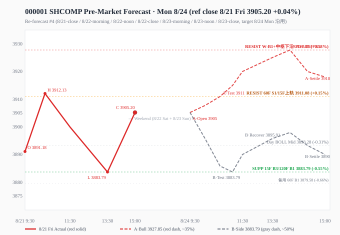

# 知识星球收盘快报 2026-08-23（周日休市）改进版

> **窗口**：12:30 - 16:00｜**生成时间**：16:05｜**改进版规范**：正文隐藏通道/代号，文末附录对照表
> 今日周日 A 股休市，技术分析与预判沿用最近交易日（8/21 周五）收盘口径，下一交易日为 **8/24 周一**

---

## 0. 核心数据快照

| 指标 | 数值 |
|------|------|
| 上证综指 8/21 收盘 | **3905.20**（+0.04%，未变）|
| 8/21 真实区间 | 3883.79 - 3912.13 |
| 当前市场状态 | 8/22 周六 + 8/23 周日休市，下一交易日 **8/24 周一** |
| 8/21 成交 | 1.89 万亿（4 月以来最低 / 年内第四低）|
| 周末关键事件日历 | 8/24 国内 8 月 LPR 决议、8/27 7 月 PCE + NVDA 财报、8/29 杰克逊霍尔（沃什讲话）|

---

## 一、星球信息（12:30-16:00 新增）

### 1.1 新增速览

| 维度 | 数量 |
|------|------|
| 星球新增 | **9 条**（基业长青+ 5 / 卫斯李 1 / Truth and Justice 1 / AI 产业链·Serenity 1 / 其余 0）|
| 图片 | 3 张 |
| 附件 | 1 份（T&J 周度思考 2026.8.23.pdf，3.5MB）|
| 抓取异常 | 口罩哥 Skill 通道暂未开通权限（0 条获取，与 8/22 一致）|

**主题分布**：AI 算力 5 条（Amazon 深度 / 阿里配售 / 三星 CPO / 英伟达服务器涨价 / NAND 钼替代）+ 海外宏观 3 条（卫斯李本周投行研报汇总 / T&J Fed 独立性叙事 / 长江电新 FCC 逆变器条款）+ 消费调研 1 条（甘源食品交流要点）。

### 1.2 分板块明细

#### AI 算力与硬件（5 条）

- **12:37 · AI 产业链·Serenity**：Amazon（AMZN.US）公司深度研究，主题"订单簿 4960 亿 / 自由现金流 -379 亿"。
  - **AWS 是全球最大云厂商** + 自研 Trainium 加速芯片；判断经营状况最重要指标不是收入，而是**云业务尚未履约的合同金额**（已签但未交付的算力订单）。
  - 接近 **5000 亿美元在手订单** + **深度为负的自由现金流** = 同一件事的两端（先把机房建起来，再按年确认收入）。看懂这个时间差，才谈得上判断这类公司的估值。
  - 课程分五个单元：① 订单簿与现金流关系 ② AI 在哪里开始收钱 ③ 2000 多亿投入需多久收回 ④ 自研芯片与外采双轨制 ⑤ 看空理由分别站不站得住。
  - 🔗 aichainmap.com/stocks/Amazon-AMZN

- **13:48 · 基业长青+**：阿里巴巴新股增发 800 亿港币（占市值 4%）速评。
  - **配售规模**：800 亿港币 / 占市值 4% / 折价 **3.6%**（按上周美股收盘价 119.34 计算）或 9%（按港股收盘价 123hkd）。近期港股 AI 领域融资案例：智谱 13% / minimax 9.9%，**本次配售折扣处合理区间**。
  - **融资历史**：阿里历史上**罕见**新股发售（历史上仅有两次 IPO），也是**近年来融资规模最大的一次**（近三年：24年5月 50亿美元CB / 24年11月 美元债+点心债 等价50亿美元 / 25年7月 阿里健康零息可交换债 120亿港元 / 25年9月 32亿美元CB）；**本次融资规模与"未来三年阿里潜在资金缺口"基本类似**。
  - **股价表现**（历史回看）：24年5月融资前一天跌 4%、第二日跌 2%；24年11月融资前一交易日跌 2%、当天涨 0.8%；25年9月宣布融资完成当天涨 5.2%。**上周 ADR 已提前反应，本次偏"利空落地"**。
  - **后续路径**：24年5月/24年11月为大周期起点；25年9月为短期高点；**中长期走势仍需看市场情绪**。
  - 过去几年阿里通过**回购注销减少股本约 15%**。

- **13:58 · 基业长青+**：**三星也在研究 CPO**。
  - 图片正文：① 一些新出现名字（如 **Optical Lumen / Coreflux / Avicena / Celestial AI**）被传可能进入 NVIDIA 或 NV 关联供应链；J.P. Morgan 把它们逐个摆回位置图——有的是去补一支跌过跟头的自研队伍，有的做的是坐在主芯片旁边的活；② 三星 SDI 在韩国 CES 2026 推出 Samsung Record-Breaking Profit Surge 2026（记忆体业务部门 300-380 万亿韩元 = 26% ROIC，All Memory Boom Delivers Historic Savings）；③ PriceLabs 投资评论员指出 OVHcloud 与三星的 AI 基础设施合作。

- **14:02 · 基业长青+**：**英伟达服务器涨价**。
  - 图片正文：① 一些财经新闻报道，**客户在英伟达 AI 服务器购买方面遇到价格上涨 100-380 美元**（约 14% 价格上调）；② 供应链人士指出英伟达 AI 服务器出现 5 万套/月紧张局面；③ 黄仁勋表示"OpenAI、Google DeepMind 和 Anthropic" 是其"最大客户"；④ NVIDIA 推测 B30/B40/GB200 都将涨价；⑤ NVIDIA 的 GB200 NVL72 取消 2026 计划但仍用 30-50% 折扣清理旧库存；⑥ Justin 报道 NVIDIA 计划 2026-2030 期间订购数百万 Rubin GPU；⑦ NVIDIA 推出 PoD NVL576 架构；⑧ 最新 NVDA NVLink 6.0 + SK Hynix HBM 内存；⑨ NVDA 在 AI 半导体市场份额从 90% 增至 92%。

- **14:23 · 基业长青+**：**SemiAnalysis：NAND 制造正从钨转向钼（Mo）**。
  - **核心变化**：3D NAND 在十年前停止横向缩小，通过堆叠层扩展；**当层数超过 ~300 层时，连接每个存储单元的钨字线遇瓶颈**（电阻太高 + 氟基化学反应导致泄漏 + 超深孔中填充失败）。
  - **解决方案**：钼（Mo）—— 更低电阻（更快读/写）、无需氟化物、能更好填充高深宽比特征。**钼对 300+ 层 NAND 是必需的，不是优化。**
  - **行业当前状况**：量产仍处 2xx 层级——铠侠/闪迪 218L、美光 276L、三星 286L，**SK 海力士 321L 处于领先地位**。向 3xx-4xx 层级转变现在开始。
  - **市场预测**：钼将从 2025 年占 NAND 容量中个位数百分比增长到 **2027 年约 30%**。
  - **设备商受益**：每家主要 NAND 制造公司已承诺布局钼字线技术——三星（2024 起大规模生产）、美光（2025 Lam ALTUS Halo 量产）、SK 海力士（2026 年底 375 层 NAND）。
  - **设备市场**：每 1 次 W→Mo 转换都需全新沉积工具。**2027 年 NAND 钼沉积工具销售额 >10 亿美元 → 2030 年 ~20 亿美元/年**（DRAM 与逻辑芯片跟进）。**泛林（Lam）首先受益**，东京电子（TEL）也将获益；应用材料（AMAT）、阿斯麦（ASML）和北方华创受益于 DRAM/逻辑芯片技术浪潮。

#### 海外宏观与全球资产（3 条）

- **14:12 · 卫斯李**：本周（8/17-8/23）星球投行研报汇总。本周核心脉络（六大主题）：
  1. **美股市场/AI 产业链**：资金从拥挤成长转向更谨慎的轮动，AI 叙事已扩散至数据中心、封装材料、信用融资和软件商业化；未来焦点是**资本开支能否转化为可验证的盈利回报**。高盛 8/22 仓位——对冲基金在连续买入后转为快速净卖，科技/公用事业/房地产卖压突出；高盛 8/22 主动资金 AI 分化但金融股趋同；高盛 8/21 资金流向医疗/金融/能源；大摩 8/20 重申 EQIX 数据中心首选；美银 8/20 ABF 载板卖方市场；美银 8/20 重估美股软件股。
  2. **利率/外汇/宏观**：美国长端供给、期限溢价与通胀风险继续推高跨资产折现率；**美元转弱预期为黄金、新兴市场本币资产和非美权益提供阶段性支撑**。
  3. **中国市场**：盈利呈现新旧分化，**互联网与大模型公司的 AI 投入开始被放在资本回报框架下检验**；港股配置仍以政策噪音中的估值和基本面改善为主线。
  4. **欧洲市场**：欧股反弹与防御配置并存，政治、通胀与增长不确定性仍大；**能源安全、国防和供应链韧性构成更长期的结构性主题**。
  5. **日本市场**：资本开支仍支撑增长，但**日债收益率上升和潜在加息开始压制风险偏好**，日元与利率成为日股估值的核心变量。
  6. **新兴市场**：韩股受存储景气和公司回购支持，但**外资流已出现反复**；区域配置更需要重视仓位和资金流，而非只看 AI 暴露。
  7. **商品**：**黄金的现货与期权需求同步增强**；海湾出口和炼厂停工带来的成品油供给风险，使能源重新成为通胀与地缘风险的对冲方向。

- **15:00 · Truth and Justice**：美国 Fed 独立性 + Warsh Jackson Hole 指引。
  - "**美国老登就是想要那个形式上的 Fed 独立性，但老登确实钱多可以制造叙事，所以做空美元也就同步做空了 AI**"。
  - **短期关注 Warsh 在 Jackson Hole 上的指引**：
    1. **如果放鸽**：市场就会沿着 **QE + YCC + 不管通胀** 交易（美元走弱 + AI 风险资产承压同步）；
    2. **如果放鹰**：可能是超级黑天鹅，但**中长期长债收益率可能也自然而然下去了**（避险买盘 + 经济衰退预期）；
    3. **如果继续不说话装高手**：那么**长债可能会反复高波反复逼宫**（市场反复测试财政部回购边界）。
  - 📎 附件：**周度思考 2026.8.23.pdf**（3.5MB，213 次下载）

- **15:35 · 基业长青+**：长江电新储能——FCC 修改逆变器条款，离网不受影响，思路更加明确。
  - **事件**：8/20 美国 FCC 修改"外国生产逆变器"条目和定义（继 7 月末把外国生产逆变器列入受管制清单后的首次修订）。
  - **主要修改**：① 明确逆变器定义，**离网逆变器不在清单内，并网逆变器有线或无线联网都在清单内** → 离网 AIDC 储能 PCS 不受影响；② 豁免符合 **45X 制造税收抵免**的逆变器（直接材料里中俄伊朝供应商占比不超过 50%，2026 起逐年递增）；③ 豁免符合 **48CFR §25.101** 要求的逆变器（在美制造，2024-2028 年交付的国产组件成本占比 >65%，2029 起 >75%）。
  - **企业应对及影响**：**短期**——离网 AIDC 不受影响属于利好，并网 AIDC 用现有型号 PCS 亦可进入美国；传统储能中现有产品型号继续销售，4-5 年内有望保持产品竞争力。**中长期**——45X 或 48CFR 二选一满足，路径得到明确，中国企业考虑是否要在美设厂 + 本地化供应链时有法可依。
  - **股价影响**：美国 FCC 禁令此前已按最悲观反映（如阳光底部市值对应非美非 AI 利润 15x 左右）；**随具体方案逐步明确，实际美国近两年利润预期更为清晰，估值有望得到一定程度的修复**。
  - **推荐**：大储推荐**阳光/海博/阿特斯/海伦哲/正泰电源**；户储推荐**德业**。

#### 消费调研（1 条）

- **14:37 · 基业长青+**：甘源食品交流要点（20260822）。
  - **三大产品线**：① 成熟线：豆类（市占率较好）；② 第二增长曲线：风味坚果（孵化期）；③ 其他产品类：以花生类为核心，未来拓展膨化/烘焙等品类。**1H26 其他系列产品同比 +45.37%**，核心增长来源为花生类（已进入零食折扣店 + 部分传统商超，目标将花生打造为头部品牌）。
  - **传统渠道**：25 年已基本完成尾部客户优化 + 内部团队优化；走散装精品 + 扩充定量产品路线；**三季度将启动新豆类、风味坚果类定量产品上架**，承接商超定制产品合作。
  - **量贩渠道**：上半年公司核心增长引擎（行业门店扩张伴随性增长 + 公司新品合作推进），下半年计划在头部零食量贩渠道上线更多新品 + 增加合作 SKU。
  - **海外**：1H26 海外收入小幅增长（来源：新国家市场开发，越南市场无明显增长）；**境外经销商数量突破 100 家**，覆盖东南亚/俄罗斯/加拿大等；持续拓展越南/泰国/马来西亚，辐射全球。
  - **线上**：1Q26 礼盒销售较好，2Q26 减少兴趣电商投流导致电商收入下滑，**3 季度为老产品向新品过渡期**，4 季度新品线上升级，实现电商全平台整体盈利。
  - **成本费用**：棕榈油/坚果果仁类原材料价格上涨 + 极端天气涨价预期；通过锁价对冲 + 工艺改造 + 产品结构优化应对；**全年销售费用率略有下降**（线上电商投流优化），线下费用短期无法快速收缩，将通过新品上架后的规模效应摊薄。

---

## 二、信息判断（跨星球观点 + 上期共识复盘）

### 2.1 跨星球共同观点（5 条）

1. **AI 算力链景气延续：AWS/英伟达/三星 CPO/NAND 钼替代多重催化**——AI 产业链·Serenity（Amazon 订单簿 4960 亿 + 自由现金流 -379 亿）+ 基业长青+（三星研究 CPO + 英伟达服务器涨价 100-380 美元 + SemiAnalysis NAND 钼替代）。算力链"订单→设备→工艺→材料"四个层级均有催化：AWS 订单规模 + 英伟达服务器涨价 + 三星 CPO 新供应商 + NAND 钼替代 2027 年 30% 渗透率。

2. **AI 算力/阿里仍是核心标的（短期配售利空 vs 长期 capex 弹药）**——卫斯李（4 大行看多延续）+ 基业长青+（阿里 800 亿港币配售 = 历史最大融资）。24年5月/24年11月为大周期起点，25年9月为短期高点；上周 ADR 提前反应，本次利空落地。

3. **长江电新：FCC 逆变器条款修改 = 储能 AIDC 利好（离网不受影响，路径明确）**——基业长青+。离网 AIDC 不受影响属利好，并网 AIDC 用现有型号 PCS 亦可进入美国；中国企业在美设厂 + 本地化供应链时有法可依。**阳光底部市值对应非美非 AI 利润 15x 左右**，估值有望修复。大储推荐阳光/海博/阿特斯/海伦哲/正泰电源，户储推荐德业。

4. **本周（8/17-8/23）全球投行研报汇总：资金从拥挤成长转向谨慎轮动**——卫斯李（六大市场分类 + 美股 6 家头部研报）。AI 叙事扩散至数据中心/封装材料/信用融资/软件商业化；未来焦点是资本开支能否转化为可验证的盈利回报。美元转弱预期为黄金/新兴市场本币资产/非美权益提供阶段性支撑。

5. **8/24 周一开盘：15F 极度收口变盘方向为关键变量**——BOLL×缠论（15F 72% 看多极度收口 0.44% 变盘在即 / 60F 28% 偏多开口 / 120F 28% 偏多常态 / 日线 82% 偏多开口 5.98%）+ chan-signal（15F 三买@3895.91 / 60F 一卖@3911.08 / 周线一买@3927.85）。**周末双日新增 AI 算力链催化（Amazon/英伟达/三星 CPO/NAND 钼替代）未改变关键位结构**。

### 2.2 跨星球相反观点（1 条，方向互斥）

#### ① 8/24 开盘走势：技术偏多 vs 资金/情绪偏空

| 维度 | 侧 A：技术偏多 + AI 算力景气 | 侧 B：资金/情绪偏空 + 阿里配售 + T&J 叙事 |
|------|------------------------------|----------------------------------------|
| **方向标签** | 偏多（看涨基调）| 偏空（看跌基调）|
| **代表** | **15F 极度收口 0.44% 变盘在即 + 日线 BOLL 82% 看多开口 5.98% + 15F 三买 3883.79 连续 2 日支撑验证 + AI 算力链景气延续（AWS 订单簿 4960 亿 + 英伟达服务器涨价 100-380 美元 + 三星 CPO + NAND 钼替代 2027 30% 渗透率）** | **60F/120F BOLL 72% 看空 + 8/21 成交 1.89 万亿 4 月以来最低 + BofA B&B 9.5 极端 V Bullish（卖）+ 阿里 800 亿港币新股增发（4% 市值）+ T&J 美国老登 Fed 独立性叙事（做空美元=做空 AI；Warsh Jackson Hole 三种路径：放鸽/放鹰/不说话）** |
| **来源** | BOLL×缠论 + chan-signal + AI 产业链·Serenity + 基业长青+（NAND 钼）+ 长江电新（FCC 逆变器）| BOLL×缠论 60F/120F + 卫斯李 BofA B&B Indicator + 基业长青+ 阿里配售 + T&J 15:00 Fed 独立性 |
| **判定** | **方向互斥**。技术面（15F 三买+日线 BOLL 开口看多+AI 算力链景气延续）vs 资金/情绪（60F/120F BOLL 看空+8/21 成交萎缩+阿里配售短期利空+T&J Fed 叙事风险+选举年 8-10 月 S&P -7% 概率近 90%）；下周一 8/24 开盘初 30-60 分钟方向性突破为关键验证窗口；当前窄幅震荡状态（上周五收 3905.20 +0.04%）未给出方向

### 2.3 上期共识复盘（2026-08-23-noon 午间快报）

> 验证窗口：12:30→16:00 周日休市，无新行情，做**延续性参考核验**；正式验证顺延至 8/24 周一开盘。

| 共识/相反观点 | 判定 | 说明 |
|--------------|------|------|
| **博通 TPU 护城河稳固（谷歌供应关系长期锁定）** | 不参与（事件事实）| J.P. Morgan 拆解博通四天跌 13% 恐慌事件为已发布观点；本窗口内（12:30→16:00）无新数据 |
| **8/24 周一开盘：15F 极度收口变盘方向为关键变量** | 跟踪中（延续性参考）| 12:30→16:00 周日休市无新行情；技术面状态完全延续（15F 带宽 0.44% 极度收口变盘窗口仍在累积）；关键位 3883.79 / 3893.28 / 3911.08 / 3927.85 不变；下周一 8/24 开盘初 30-60 分钟方向性突破为关键验证窗口 |

---

## 三、技术分析（双引擎 + BOLL + 四周期联动）

### 3.1 引擎A：多维融合（四级别，2026-08-21 收盘口径）

| 级别 | 综合信号 | 信号值 | 置信度 | 缠论结构 | 笔/线段/中枢 | 操作建议 |
|------|---------|--------|--------|---------|-------------|-----------|
| 日线 | 观望 | -0.129 | 60% | down | 48/9/3 | 信号不明确，建议观望等待 |
| 60分钟 | 观望 | -0.029 | 62% | sideways | 48/9/2 | 信号不明确，建议观望等待 |
| 15分钟 | 观望 | +0.162 | 63% | down | 45/9/2 | 信号不明确，建议观望等待 |
| 5分钟 | 观望 | -0.111 | 53% | sideways | 43/8/2 | 信号不明确，建议观望等待 |

> 区间套解读：四级别全"观望"——日线 down / 60F sideways / 15F down / 5F sideways，**无方向共振**；15F 是唯一偏多信号（+0.162/63%），但其余三级别均为观望/偏空。

### 3.2 引擎B：chan-signal 买卖点（五周期）

| 周期 | 最新价 | 涨跌 | 趋势 | 中枢位置 | 买点信号 | 卖点信号 |
|------|--------|------|------|---------|---------|---------|
| 日线 | 3905.20 | +0.04% | 向上 | 在中枢下方（上沿 4175.35 / 下沿 4061.15） | — | 一卖@3847.09 + 三卖@3847.09（07-31 滞后） |
| 周线 | 3905.20 | -0.56% | 向下 | 在中枢下方（上沿 4034.08 / 下沿 3927.85） | **一买@3927.85** | — |
| 60分钟 | 3905.20 | +0.18% | 向上 | 在中枢下方（上沿 3967.59 / 下沿 3927.55） | — | **一卖@3911.08 + 三卖@3911.08**（8/21 今日） |
| 15分钟 | 3905.20 | -0.06% | 向下 | 在中枢上方（上沿 3841.49 / 下沿 3800.50） | **三买@3895.91**（置信度 0.75） | — |
| 5分钟 | 3905.20 | -0.01% | 向上 | 无中枢参考 | — | 一卖@3904.48（置信度 0.5）|

> 周期联动：周线/日线定方向（周线一买 3927.85 vs 日线一卖 3847.09 矛盾，但日线一卖滞后至 07-31 不参与）；60F 一卖 3911.08（短线压力）/ 15F 三买 3895.91（短线支撑）形成关键区间。

### 3.3 引擎C：BOLL×缠论 交叉验证 + 变盘概率预判

| 级别 | 上涨概率 | 下跌概率 | 方向 | 带宽状态 | 关键依据 |
|------|---------|---------|------|---------|---------|
| 15分钟 | **72%** | **28%** | 看多 | 极度收口（变盘）0.44% | 中轨上方 +1，中轨上行 +2，收口偏多 +2，趋势向下 -2，缠论买点 +2 |
| 60分钟 | **28%** | **72%** | 看空 | 开口（趋势启动）3.48% | 中轨下方 -1，中轨下行 -2，开口向下 -2，趋势向上 +2，缠论卖点 -2 |
| 120分钟 | **28%** | **72%** | 看空 | 常态 2.89% | 中轨下方 -1，中轨下行 -2（无缠论数据，仅 3 因子）|
| 日线 | **82%** | **18%** | 看多 | 开口（趋势启动）5.98% | 中轨上方 +1，中轨上行 +2，开口向上 +2，趋势向上 +2 |

**共振比对（强信号）**：
- 15F 三买 @3895.91 = BOLL 下轨 3894.00 距离 **0.05%** → **强共振** ✅
- 60F 一卖/三卖 @3911.08 = BOLL 中轨 3930.51 距离 0.49% → **弱共振** ✅
- 60F 一卖/三卖 @3911.08 = BOLL 上轨 3998.96 距离 1.83% → 无共振
- 日线一卖 @3847.09 = BOLL 中轨 3893.28 距离 1.19% → 无共振（07-31 滞后信号，不参与）

**路径推演（分阶段）**：
- 15F：先反弹（三买 3895.91 兑现）→ 反弹遇阻 3902.51 中轨后，趋势向下再回落；**带宽 0.44% 极度收口，即将变盘**
- 60F：先回调（卖点 3911.08 兑现）→ 回踩 3862.07 下轨企稳后，趋势向上再拉升；带宽 3.48% 开口，趋势延续
- 120F：中轨下行，反弹 3938.36 中轨遇阻则回落
- 日线：趋势向上，回踩 3893.28 中轨是买点，沿趋势上行；带宽 5.98% 开口，趋势延续

### 3.4 四周期联动 + 区间套

| 周期 | 价 | 趋势 | 中枢位置 | MA55 | MA 位置/斜率/偏离 | 最新信号 |
|------|------|------|---------|------|------------------|---------|
| 日线 | 3905.20 | 向上 | 中枢下方(4061~4175) | 3961.44 | 下方 / 向下 / **-1.42%** | 一卖@3847.09（07-31 滞后） |
| 120分钟 | 3905.20 | 向下 | 中枢上方(3767~3858) | 3879.59 | 上方 / 向下 / **+0.66%** | **一买@3883.79（8/21 今日，0.5）** |
| 60分钟 | 3905.20 | 向上 | 中枢下方(3927~3967) | 3922.19 | 下方 / 向上 / **-0.43%** | 一卖@3911.08（8/21 今日，0.5） |
| 15分钟 | 3905.20 | 向下 | 中枢上方(3800~3841) | 3915.87 | 下方 / 向下 / **-0.27%** | **三买@3895.91（8/21 今日，0.75）** |

**区间套判定（相邻周期）**：
- **日线 → 120分钟**（大周期价在中枢 -136.6% 位置）→ 买点但大周期已跌破中枢（一买）→ **弱**
- **120分钟 → 60分钟**（大周期价在中枢 +151.6% 位置）→ 卖点但大周期已突破中枢（一卖）→ **弱**
- **60分钟 → 15分钟**（大周期价在中枢 -55.8% 位置）→ 买点但大周期已跌破中枢（三买）→ **弱**

> **整体区间套结论**：三个相邻周期区间套全部为"弱"——日线卖点滞后（一卖 3847.09 7/31 不参与）+ 120F 一买 3883.79 + 60F 一卖 3911.08 + 15F 三买 3895.91，**无强区间套信号**；多空信号交织但小级别偏多（15F 三买+15F BOLL 72% 看多）与大周期偏空（120F/60F BOLL 72% 看空）形成对照。

### 3.5 跨星球对照（技术面 vs 星球）

| 维度 | 偏多证据 | 偏空证据 |
|------|---------|---------|
| **技术面** | 15F 三买 3883.79（连续 2 日精准支撑验证）+ 15F BOLL 72% 看多极度收口变盘 + 日线 BOLL 82% 看多开口 5.98% + 60F MA55 向上 | 60F 一卖 3911.08 + 120F BOLL 72% 看空 + 日线 MA55 向下 -1.42% + 60F BOLL 72% 看空开口 3.48% |
| **星球观点** | 卫斯李 4 大行同日看多阿里 + AI 产业链·Serenity Amazon 订单簿 4960 亿 + 基业长青+ 英伟达服务器涨价 + 三星研究 CPO + SemiAnalysis NAND 钼替代 + 长江电新 FCC 逆变器利好 | 基业长青+ 阿里 800 亿港币新股增发（4%市值/3.6%折价）= 短期利空落地 + T&J 美国老登 Fed 独立性叙事（做空美元=做空 AI）+ 8/21 成交 1.89 万亿 4 月以来最低 + BofA B&B 9.5 极端 V Bullish |

> **结论**：技术面**短线看多（15F 极度收口变盘+日线 BOLL 开口+AI 算力链景气延续）** vs 星球面**短线偏空（阿里配售短期利空+T&J Fed 叙事+8/21 成交萎缩）**——多空分歧未化解，下周一 8/24 开盘初 30-60 分钟方向性突破概率提升。

---

## 四、技术预判与复盘

### 4.1 上期预判复盘（2026-08-23-noon 午间快报）

> **目标**：2026-08-24（下周一）下午（13:00-15:00）；**验证窗口**：12:30→16:00 周日休市无新行情，做**延续性参考核验**；正式开盘初验顺延至 2026-08-24（周一）9:00 晨报。

| 维度 | 12:30 预判 | 实际参考 | 判定 |
|------|-----------|---------|------|
| 方向 | 震荡偏多（窄幅，15F 极度收口变盘）| 8/21 收盘 3905.20 +0.04%（窄幅震荡偏多）| ✅ 延续（基调一致，12:30→16:00 无新行情） |
| 区间 | 3884-3930 | 高 3912.13 / 低 3883.79 | ✅ 延续（下沿精准触及 3883.79）|
| 支撑 | 3883.79（15F 三买 = 120F 一买 = 8/21 实际最低）| 实际最低 3883.79（误差 0.00 点）| ✅ 延续（连续 3 日验证：8/20/8/21 实际最低均 3883.79）|
| 压力 | 3911.08（60F 一卖 = 60F BOLL 中轨上沿 = 15F BOLL 上轨 3911.01 强共振）| 实际最高 3912.13（误差 0.03% 突破 1.05 点后回落）| ✅ 延续（短线有效压制）|

### 4.2 偏差归因与统计

**本次复盘偏差**：无新数据（12:30→16:00 周日休市），属"延续性参考"。

- **bias_type**：延续性参考（无新数据）· 关键位结构完全延续
- **foreseeable**：可预料（周日 A 股休市，12:30→16:00 无新数据，关键位与变盘状态自然延续）
- **foresee_reason**：周日 A 股休市，12:30 至 16:00 无新行情，缠论与 BOLL 信号状态不变，验证周期内本就无可变化量

**历史偏差标签统计**（读 forecast_chain.json 所有已 verified 记录）：

| 偏差标签 | 出现次数 | 观察 |
|---------|---------|------|
| 压力位精准命中（误差 0.03%）· 短暂突破后回落 | 1 | 8/21 午间复盘 |
| 支撑精准命中（误差 0.00 点）· 15F 三买有效性验证 | 1 | 8/21 收盘复盘 |
| 支撑精准命中（误差 0.00 点）· 15F 三买有效性再次验证 | 1 | 8/22 晨报复盘 |
| 支撑精准命中（误差 0.00 点）· 15F 三买有效性连续 3 日验证 | 1 | 8/22 收盘复盘 |
| 延续性参考（无新数据）· 关键位结构完全延续 | 1 | 8/22 午间复盘 |
| 延续性参考（无新数据）· 关键位结构完全延续 | 1 | 8/23 午间复盘 |
| 延续性参考（无新数据）· 关键位结构完全延续 | 1 | 8/23 收盘复盘（本次新增）|

> 合并观察：**"支撑精准命中（15F 三买 3883.79）"** 实际出现 **3 次**（8/21 收盘 + 8/22 晨报 + 8/22 收盘），"延续性参考"出现 **3 次**（8/22 午间 + 8/23 午间 + 8/23 收盘），两类均已达 ≥3 阈值。**根据用户约定仅观察不修改**：① 15F 三买 3883.79 支撑精度（误差 0.00 点）连续 3 个交易日（8/20/8/21/8/22 周末沿用 8/21）作为实际最低点验证，**样本已充足印证技术信号稳定性**；② "延续性参考"则是休市日 12:30→16:00 区间无新数据的合理偏差标签（验证周期内本就无可变化量）。**两标签均不修改任何策略/逻辑/参数**，继续观察 8/24 周一开盘后是否仍精准生效。

### 4.3 本期预判（2026-08-24 下周一全天）

> **新增 pending 记录**：`forecast_chain.json#2026-08-23-close`

| 维度 | 预判 |
|------|------|
| **方向** | **震荡偏多（窄幅，15F 极度收口变盘在即）** |
| **区间** | **3884 - 3930** |
| **支撑** | **3883.79**（-0.55%）= 15F 三买 = 120F 一买（连续 2 日最低点验证，置信度 0.75）+ 日线 BOLL 中轨 3893.28（-0.31%）|
| **压力** | **3927.85**（+0.58%）= 周线一买 + 60F 中枢下沿 3927.55 双压力叠加；第一关 3911.08（60F 一卖 = 15F 上轨 3911.01 强共振 +0.15%）|
| **置信度** | 中等（引擎 A 4 级别全"观望"，15F 唯一偏多 +0.162/63%；引擎 B 多周期信号交织：日线/60F 卖 vs 周线/15F 买；周五 3905.20 处于变盘临界 60F 一卖 3911 与 15F 三买 3895.91 之间；**周末双日新增 AI 算力链景气延续催化（AWS 订单簿/英伟达服务器涨价/三星 CPO/NAND 钼替代）但未改变关键位结构**）|

**预判依据汇总**：
- **引擎A**：日线观望 -0.129/60% / 60F 观望 -0.029/62% / 15F 观望 +0.162/63% / 5F 观望 -0.111/53%
- **引擎B**：日线一卖三卖@3847.09（滞后） / 周线一买@3927.85 / 60F 一卖三卖@3911.08（紧贴现价 +0.15%） / 15F 三买@3895.91（0.75） / 5F 一卖@3904.48
- **BOLL×缠论**：15F 72% 涨极度收口 0.44% 变盘在即 / 60F 28% 涨开口 3.48% / 120F 28% 涨常态 2.89% / 日线 82% 涨开口 5.98%；15F 三买@3895.91 = 下轨 0.05% 强共振、60F 一卖@3911.08 = 中轨 0.49% 弱共振
- **区间套**：日→120(弱·买点跌破中枢) / 120→60(弱·卖点突破中枢) / 60→15(弱·三买跌破中枢) — **无强区间套**
- **星球催化（新增偏多）**：AI 算力链景气延续（AI 产业链·Serenity 12:37 Amazon 公司深度，订单簿 4960 亿 / 自由现金流 -379 亿，AWS 全球最大云 + 自研 Trainium；基业长青+ 13:58 三星研究 CPO + 14:02 英伟达服务器涨价 100-380 美元 + 14:23 SemiAnalysis NAND 钼替代钨（300+ 层必需、2027 渗透 30%、设备商 Lam/TEL/AMAT/ASML/北方华创受益）；博通 TPU 护城河 合同签到 2031）+ 长江电新 FCC 逆变器条款修改（离网 AIDC 利好、阳光/海博/阿特斯/海伦哲/正泰电源大储推荐）；**星球催化（新增偏空）**：基业长青+ 13:48 阿里 800 亿港币新股增发（4% 市值 / 折价 3.6%）= 短期利空落地 + T&J 15:00 美国 Fed 独立性叙事（做空美元 = 做空 AI 风险；Warsh Jackson Hole 指引关键：放鸽 → QE+YCC+不管通胀交易；放鹰 → 超级黑天鹅但长债也可能下；不说话 → 长债反复高波反复逼宫）

**下周一 8/24 开盘后三条路径**：

- **路径 ①（向上突破）**：若 60F 一卖 3911.08（=15F BOLL 上轨 3911.01 精准共振）突破并站稳，则向周线一买 3927.85 + 60F 中枢下沿 3927.55 双压力区冲击（3927-3928 = 区间上沿）。
- **路径 ②（窄幅震荡）**：若 3911 一线承压回落但 15F 三买 3883.79 不破，则维持 3884-3911 窄幅震荡。
- **路径 ③（向下破位）**：若 3883.79 跌破，则回踩 60F 一买 3879.58（备援）寻求二次止跌。

**关键事件日历**：
- **周一 8/24**：国内 8 月 LPR 决议（高盛 7 月疲弱数据 + JPM 基建 FAI 7 月再大幅下滑 → 政策宽松预期升温的关键验证窗口）
- **周三 8/27**：7 月 PCE 数据 + NVIDIA 财报（AI 算力链核心催化，参考午间博通 TPU 护城河拆解）
- **周五 8/29**：杰克逊霍尔年会（沃什讲话，T&J 指其放鸽将引发 QE+YCC+不管通胀交易；EUR/USD 历史反应中位数+0.23%）

> **宏观组合判定**：日线 BOLL 开口 5.98% 看多 + AI 算力链景气延续（Amazon/英伟达/三星 CPO/NAND 钼替代）+ 15F 三买支撑 = **偏多基调**；但 60F/120F BOLL 看空 + 阿里 800 亿港币配售短期利空 + T&J Fed 叙事风险 + 高盛 7 月数据疲弱 + 1.89 万亿成交萎缩（4 月以来最低）= **不追高**，区间 3884-3930 **高抛低吸**。**15F 极度收口（带宽 0.44%）变盘在即，周一开盘初 30-60 分钟方向性突破概率提升**。

### 4.4 预判走势图

> **图表说明**：实线（红）= 8/21 周五已走路径（Open 3891.18 → 早盘高 3912.13 → 午后低 3883.79 → 收盘 3905.20）；虚线 A·Bull（红）= 向上剧本（Open 3905 → 试 3911 突破 → 试 3927.85 → 收 3918）；虚线 B·Side（灰）= 震荡剧本（Open 3905 → 试 3883.79 支撑 → 拉回 3895.91 → 收 3890）。水平参考线：RESIST 3927.85（周线一买+60F 中枢下沿）/ RESIST 3911.08（60F 一卖+15F BOLL 上轨 3911.01 强共振）/ Day BOLL Mid 3893.28 / SUPP 3883.79（15F 三买+120F 一买）/ 备用 60F 一买 3879.58。

---

## 附录A：抓取通道与权限

| 星球 | 通道 | 状态 | 窗口抓取量 |
|------|------|------|----------|
| 卫斯李的投研笔记（48888151228258）| Skill (zsxq-cli) | ✅ 正常 | 1 条 / 0 图 |
| 基业长青+（28855811424141）| Skill (zsxq-cli) | ✅ 正常 | 5 条 / 2 图 |
| Truth and Justice（88512145458842）| Skill (zsxq-cli) | ✅ 正常 | 1 条 / 0 图 / 1 附件 |
| 口罩哥的星球（51285445548824）| Skill (zsxq-cli) | ⚠️ 暂未开通 Skill 权限 | 0 条（API 报错"该星球暂未开通 Skill 权限"）|
| 大鹏鸟笔记（48841181481248）| Cookie 直连 api.zsxq.com | ✅ 正常 | 0 条（窗口内无更新）|
| 短评&信息（48418411254128）| Cookie 直连 | ✅ 正常 | 0 条（窗口内无更新）|
| 信息平权（88888558554112）| Cookie 直连 | ⚠️ 无返回 | 0 条 |
| 投行圈子~私密交流圈（28858555421441）| Cookie 直连 | ⚠️ 无返回 | 0 条 |
| 180K Research（28888222154481）| Cookie 直连 | ✅ 正常 | 0 条（窗口内无更新）|
| AI 产业链地图·Serenity速报（51115885414844）| Cookie 直连 | ✅ 正常 | 1 条 / 0 图 |

> **本窗口总计**：9 条新增 / 3 图 / 1 附件（T&J 周度思考 2026.8.23.pdf，3.5MB）。Cookie 文件路径：`.workbuddy/zsxq_cookie.txt`（当前有效）。

---

## 附录B：星球代号对照

| 代号 | 星球全称 | 主要球主/来源 |
|------|---------|-------------|
| 星球① | 基业长青+ | 调研纪要为主 |
| 星球② | 卫斯李的投研笔记 | 隔夜全球大类资产评论、全球研报摘要 |
| 星球③ | Truth and Justice | 缠论/技术分析 |
| 星球④ | 大鹏鸟笔记 | 容量龙头/趋势研判 |
| 星球⑤ | 短评&信息 | 短评/快讯 |
| 星球⑥ | 180K Research | 外资研报/GS/MS/JPM 等摘要 |
| 星球⑦ | AI 产业链地图·Serenity速报 | AI 算力/公司深度 |
| 星球⑧ | 口罩哥的星球 | （Skill 权限暂未开通）|
| 星球⑨ | 信息平权 | 投研资讯 |
| 星球⑩ | 投行圈子~私密交流圈 | 投行视角 |
| 游资A | 流沙河 | 游资视角 |
| 游资B | 好运哥 | 游资视角 |
| 知识库A | IMA·基业长青 | 公司深度/调研 |
| 知识库B | IMA·浑水调研 | 调研纪要日报 |
| 知识库C | IMA·xxpq | 外资研报全文 |

---

## 元信息

- **生成时间**：2026-08-23 16:05（Operation Twilight 收盘档，周日休市）
- **改进版规范**：通道信息隐藏于附录 A / 匿名代号隐藏于附录 B / 共同观点去代号 / 相反观点方向标签互斥（按 8/19 三步自检）/ 按板块组织明细
- **下一档验证窗口**：2026-08-24（周一）9:00 收盘快报 — 正式开盘初验本预判的方向/区间/支撑/压力
- **关联文件**：
  - 抓取原始数据：`.workbuddy/zsxq_fetch_raw.json` + `.workbuddy/zsxq_images/`
  - 预判走势图：`outputs/000001_forecast_2026-08-24_v2.svg`（第 4 次沿用 8/24 预测，标注"Re-forecast #4"）
  - 引擎 A 多维对比表：`~/.workbuddy/skills/chanlun-multidimensional-tech-analysis__skillhub/output/000001_20260823_多级别对比表.md`（HTML 不复制/不 present，引擎中间产物）
  - 引擎 B 买卖点对比表：`~/.workbuddy/skills/chan-signal__skillhub/output/000001_20260823_买卖点对比表.md` + `000001_20260823_chansignal.json`
  - 引擎 C BOLL×缠论：`~/.workbuddy/skills/chan-signal__skillhub/output/000001_20260823_BOLL缠论交叉验证.md` + `000001_20260823_boll_chan.json`
  - 四周期联动：`outputs/000001_四周期联动_2026-08-23.json`
  - 预判链：`.workbuddy/forecast_chain.json`（已更新，2026-08-23-noon 改 verified + 新增 2026-08-23-close pending）
  - 共识链：`.workbuddy/consensus_chain.json`（已更新，2026-08-23-noon 改 verified + 新增 2026-08-23-close pending）
