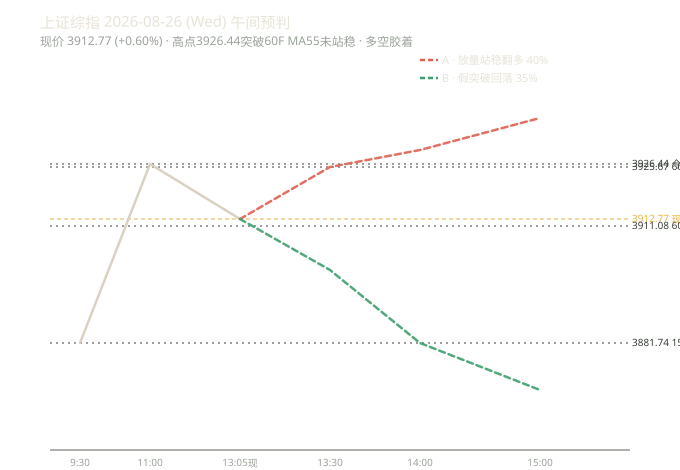

# 收盘快报 2026-08-25（最新代码版）

> 用 confidence 降权 + ③④ 修复 + 标签三分类后的最新代码跑版

## 一、引擎信号（收盘 3889.44，+0.19%）

| 周期 | 趋势 | 买卖点 | confidence |
|---|---|---|---|
| 日线 | 向下 | 一卖@3847.09 / 三卖@3847.09 | 0.5（弱）/ 0.75 |
| 周线 | 向下 | 一卖@3968.48 | 0.5（弱） |
| 60分钟 | 向下 | 一卖@3911.08 / 三卖@3911.08 | 0.5（弱）/ 0.75 |
| 15分钟 | 向上 | 无 | — |
| 5分钟 | 向上 | 无 | — |

**关键**：大级别（日/周/60F）一卖都是「无背驰」的弱信号（confidence 0.5），15F/5F 短线反弹。

## 二、方向打分（confidence 降权后）

| 因子 | 明细 | 得分 |
|---|---|---|
| 趋势 | 日线向下 -2 / 周线向下 -2 | **-4** |
| 买卖点（降权） | 日线一卖 0.5弱→-1 / 周线一卖 0.5弱→-1 / 60F一卖 0.5弱→-1 | **-3** |
| MACD | 日线空头区 | **-1** |
| **总分** | | **-8（偏空）** |

> 对比：降权前 -11，降权后 -8。弱信号（无背驰一卖）不再和强信号同权重，偏空强度更真实。

## 三、次日预判（8-26 周三）

**方向：偏空**（-8）

| 项 | 值 |
|---|---|
| 支撑 | 3850.86（前低，贴价 0.99%）/ 3844（60F BOLL 下轨） |
| 压力 | 3894.40（60F中轨）→ 3898.27（日线中轨）→ **3925.67（60F MA55 强压）** |
| 置信度 | 中等 |

**三剧本**：
- **A 反抽遇阻回落 55%**：反抽 3894-3898 遇阻 → 回落测 3850 → 3844
- **B 跌破前低下探 30%**：破 3850.86 → 测 3844 → 3800
- **C 放量站稳翻多 15%**：站稳 60F MA55 3925.67 才考虑反转

**逆势反抽纪律**：空头区反抽 60F55（3925.67）= 减仓非追涨；只有放量站稳 3925.67 才翻多。

## 四、本次跑版验证的最新改动

| 改动 | 状态 |
|---|---|
| confidence 降权（弱信号降半权） | ✅ 方向打分 -11 → -8，结论不变（偏空） |
| ③ 一卖 has_zs 门槛 | ✅ 引擎正常，信号输出稳定 |
| ④ price_vs_zs 口径一致 | ✅ 趋势↔中枢位置对齐 |
| 引擎缓存（backtest） | ✅ 回测 83 秒 → 5 秒 |
| 标签三分类 | ✅ forecast_chain 真偏差/正面/中性已区分 |
