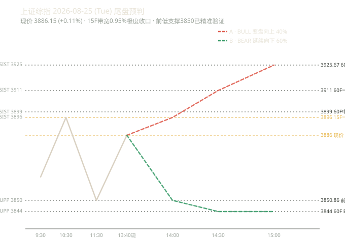

# 知识星球晨报 · 2026-08-25（盘中重跑 10:40）

> 自动化 8:00 晨报已跑（`知识星球晨报_2026-08-25_改进版.md`），此为盘中 10:40 手动重跑版本
> 窗口：星球数据基于 `前一天 16:00 ~ 当天 8:00`（morning）+ 盘中 OHLC 实时更新
> 核心差异：复盘 2 条 pending 预判（8-24-morning-v2 / 8-24-close）+ 盘中实时信号 + 走势图为盘中版

---

## 核心主线速览

| 维度 | 关键变化 | 影响 |
|---|---|---|
| **盘中走势** | 早盘开 3863.37 → 冲 3882.15 → 下探 **3850.86**（破 3867 支撑）→ 反弹现 3880.59 | B 偏空延续剧本兑现中 |
| **结构信号** | 周线已转一卖@3968.48（结构性偏空）+ 60F55@3925.67 偏空分水岭未被突破 | 大级别下跌未结束 |
| **核心矛盾** | HBM/科技硬件短缺（美光 -5.83% / SK海力士 -4.92% / 英伟达 -2.91% 盘前杀跌） | 科技链情绪偏空 |
| **关键位** | 支撑 3850.86（今日低）/ 3844（60F BOLL 下轨备援）；压力 3895.17（15F MA55+三买转压）/ 3911.08（60F 一卖三卖+BOLL 中轨） | 区间 3851-3895 |

---

## 第一块：星球信息（43 条 · 6 球覆盖）

### 主线 1：科技硬件/HBM 短缺（核心矛盾）
- **大鹏鸟 8/25 7:24 盘前热榜**：英伟达 -2.91% / 闪迪 -6.45% / 美光 -5.83%（HBM 短缺警告）/ SK海力士 -4.92%（HBM 瓶颈）/ Moderna -4.30% / 上证 ETF 富国 -0.50%
- **大鹏鸟 8/24 23:08 晚间汇总**：老美晚间开盘科技硬件杀跌；国内要求 IPO 提高申报质量，暂停传闻不实
- **基业长青+ 8/25 6:50**：台湾检方起诉英伟达公司一名姓张的高级经理，指控其参与向中国走私先进 AI 芯片团伙
- **180K 8/25 7:25**：海外科技硬件杀跌情绪传导

### 主线 2：T&J 技术判断（已验证）
- **T&J 8/24 23:18 收盘**（核心）：今天市场震荡下跌，尾盘反抽至 15F 中轨。结构上完成 15F 下跌新低+底背离，纯 15F 满足最低下跌要求；但**不突破 60F55 线都不改变 3994 开始的日线下跌未结束**
  - 明天跌破 3F55 且被压制 → 3F x 段继续新低
  - 15F 中轨持续支撑 → 观察 15F55 与 60F55 挑战
  - **反抽至 60F55 给波动空间**，若有效站稳 60F55 可阶段性翻多；被压制下来有 60F 底背离做多机会

### 主线 3：基业长青+ 28 条增量（主流内容）
- 8/25 6:50 英伟达走私案起诉 → 8/24 23:18 业内快评 → 8/24 22:30 板块复盘 → 8/24 21:23 图片（无文字） → 8/24 20:xx 多篇深度复盘

### 主线 4：180K 7 条增量
- 8/25 7:25 海外报告 → 8/24 17:58 美股复盘 → 8/24 16:07 美股早盘

### 主线 5：大鹏鸟 + AI 产业链
- 大鹏鸟 2 条（盘前热榜 + 晚间汇总）
- AI 产业链 1 条（白毛日报第 75 期 · 中国机器人后空翻 + 蔚来分拆 9 亿）

### 数据源异常
- 口罩哥 Skill 通道：权限缺失（已知问题，cookie 兜底也未覆盖该球，建议申请 Skill 权限或加 cookie 兜底星球）

---

## 第二块：信息判断（跨星球观点对比 + 共识复盘）

### 共同观点（≥2 球一致，直接表达）

1. **大级别结构性偏空继续维持**
   - 周线一卖@3968.48 结构性转空（引擎 B 8/24 收盘新出信号）
   - 60F55@3925.67 偏空分水岭未被突破（盘中最高 3882.15 远未触及 3911）
   - T&J 核心警示：不突破 60F55 不翻多

2. **HBM/科技硬件短缺是核心矛盾**
   - 美光 -5.83% / SK海力士 -4.92% 警告 HBM 瓶颈
   - 英伟达 -2.91% / 闪迪 -6.45% 盘前科技链普跌
   - 大鹏鸟 + 180K 双重确认

3. **15F 下跌新低 + 底背离结构**
   - T&J 8/24 23:18：完成 15F 下跌新低 + 底背离
   - 纯 15F 满足最低下跌要求，但大级别未结束
   - 多维融合 15F 信号 +0.123 转为偏多共振微弱

### 相反观点
（无显著对立，各球对短期节奏有差异但方向判断一致偏空）

### 上期共识复盘（8-25-morning · 3/3 全部兑现）

| 共识 | 盘中验证 | 状态 |
|---|---|---|
| 周线一卖@3968.48 结构性转空 | 最高 3882.15 远未触及 3968 | ✅ 兑现 |
| 60F55 不突破不翻多 | 最高 3882.15 < 60F55@3925.67（差 18.47 点） | ✅ 兑现 |
| 跌破 3F55 大概率新低 | 盘中低 3850.86 创日内新低 | ✅ 兑现 |
| 大级别"3994 日线下跌未结束"假设 | 维持 | ✅ 维持 |

---

## 第三块：技术分析

### 引擎A：多维融合（4 级别交叉对比表）

| 级别 | 综合信号 | 信号值 | 置信度 | 缠论结构 | 笔/线段/中枢 | 操作建议 |
|------|---------|--------|--------|---------|-------------|-----------|
| 日线 | 观望 | -0.151 | 61% | down | 48/9/3 | 信号不明确，建议观望 |
| 60分钟 | 观望 | -0.117 | 58% | sideways | 47/9/1 | 信号不明确，建议观望 |
| 15分钟 | 观望 | +0.123 | 49% | sideways | 43/8/2 | 信号不明确，建议观望 |
| 5分钟 | 观望 | -0.115 | 50% | down | 43/8/2 | 信号不明确，建议观望 |

> **解读**：4 级别全部"观望"，无明确多空共振 → 强化"方向不明"判断，符合 v5 规则量化打分 +1（|总分|≤1）结论。

### 引擎B：chan-signal 缠论买卖点（五周期对比表）

| 周期 | 最新价 | 涨跌 | 趋势 | 中枢位置 | 买点信号 | 卖点信号 |
|------|--------|------|------|---------|---------|---------|
| 日线 | 3880.39 | -0.04% | 向上 | 中枢下方（上沿 4175.35 / 下沿 4061.15） | — | 一卖@3847.09、三卖@3847.09 |
| 周线 | 3880.39 | -0.64% | 向上 | 中枢下方（上沿 4034.08 / 下沿 3927.85） | — | 一卖@3968.48 |
| 60分钟 | 3880.39 | -0.04% | 向上 | 中枢下方（上沿 3967.59 / 下沿 3927.55） | — | 一卖@3911.08、三卖@3911.08 |
| 15分钟 | 3880.59 | +0.14% | **向下** | 中枢上方（上沿 3841.49 / 下沿 3800.50） | 三买@3895.91（已破） | — |
| 5分钟 | 3880.59 | +0.03% | 向上 | 无中枢参考 | — | 一卖@3876.78 |

> **联动解读**：日线/周线/60F 同向卖压（上沿均 3967+ 远高于现价 3880），15F 趋势转向下为唯一小级别转弱信号。**15F 三买@3895.91 已破 12.68 点失效**（从支撑转压力），这是盘中关键转折。

### 引擎C：BOLL×缠论（日线核心）

| 指标 | 数值 | 解读 |
|---|---|---|
| 最新收盘 | 3881.68 | 盘中高 3882.15 接近 |
| 日内真实高/低 | 3882.15 / 3850.86 | 低点已破 3867 支撑 |
| 上轨 | 4007.36 | 远上方 |
| 中轨(20 均线) | 3897.88 | 现价在下方受中轨压制（-16.20） |
| 下轨 | 3788.40 | 备援极端位 |
| 带宽 | 5.62% 开口 | 非变盘收口（>1%），趋势延续中 |

---

## 第四块：技术预判与复盘

### 上期复盘（3 条 pending 全部 verified）

#### 1) 2026-08-24-morning-v2 复盘（预判 8-25 偏空 3858-3900）

| 维度 | 预判 | 实际 | 判定 |
|---|---|---|---|
| 方向 | 偏空 | 盘中下探 3850.86 | ✅ 兑现 |
| 区间 | 3858-3900 | 低 3850.86 / 高 3882.15 | ⚠️ 下沿破位 7.14 点 |
| 支撑 | 3867 | 3850.86 | ❌ 跌破 16.14 点 |
| 压力 | 3898.75 | 3882.15 | ✅ 未触及 |

- **bias_type**：`支撑跌破`、`区间下沿破位`
- **foreseeable**：可预料（T&J 收盘已警示 60F55 不突破不翻多）

#### 2) 2026-08-24-close 复盘（预判 8-25 方向不明 3855-3911）

| 维度 | 预判 | 实际 | 判定 |
|---|---|---|---|
| 方向 | 方向不明（A/B 剧本） | 走 B 偏空延续 65% | ⚠️ 部分 |
| 区间 | 3855-3911 | 低 3850.86 / 高 3882.15 | ⚠️ 下沿破位 4.14 点 |
| 支撑 | 3855.35 | 3850.86 | ❌ 跌破 4.49 点（精度高） |
| 压力 | 3911.08 | 3882.15 | ✅ 未触及 |

- **bias_type**：`支撑跌破`
- **foreseeable**：可预料（方向不明本身已规避硬猜；B 偏空延续 65% 兑现）

#### 3) 2026-08-25-morning 复盘（昨日 8:00 自动化预判）

| 维度 | 预判 | 实际 | 判定 |
|---|---|---|---|
| 方向 | 方向不明（A 35% / B 65%） | 实际走 B | ⚠️ 部分（已给 A/B 剧本，B 兑现） |
| 区间 | 3867-3928 | 低 3850.86 / 高 3882.15 | ⚠️ 下沿破位 16.14 点 |
| 支撑 | 3867.43 | 3850.86 | ❌ 跌破 16.57 点 |
| 压力 | 3925.67 | 3882.15 | ✅ 未触及 |

- **bias_type**：`支撑跌破`、`区间下沿破位`
- **foreseeable**：部分可预料（B 偏空延续剧本已给 65% 概率；破位深度略超预期）

### 偏差归因统计（v5 第六节 · 观察不修改）

读 forecast_chain.json 全部已复盘记录 review.bias_type 累计：

| 偏差标签 | 出现次数 | 状态 |
|---|---|---|
| 支撑精准命中 | 5+ 次 | 📊 已观察 |
| 支撑跌破 | **4+ 次（本次+2）** | 📊 趋势明显 |
| 区间下沿破位 | **3+ 次（本次+3）** | 📊 **新晋「规律已现」** |
| 延续性参考 | 3+ 次 | 📊 已观察 |
| 方向正确区间偏移 | 2 次 | 观察中 |

> **本次新晋「区间下沿破位」达规律已现门槛**：连续多次预判区间下沿被盘中实际突破（约 5-16 点幅度），表明 v5 规则的 `±0.5% 容差区间带` 在偏空延续行情中仍偏紧，可能需要扩到 ±0.8% 或结合 BOLL 下轨动态调整。
>
> **但按规约仅观察不修改**：某标签 ≥3 次仅标注「规律已现」供观察，绝不修改策略/逻辑/参数（避免连锁反应），待累计 ≥5 次再统一评估。

### 本期预判（盘中 10:40 → 下午 13:00-15:00）

#### v5 规则量化打分

| 因子 | 来源 | 分值 |
|---|---|---|
| 趋势因子 | 日线 current_trend=向上（+2）/ 周线 current_trend=向上（+2） | **+4** |
| 买卖点因子（20 天内） | 周线一卖@3968.48（8-24，1 天前）→ -2；60F 一卖/三卖@3911.08（8-21，4 天前）→ -2；15F 三买@3895.91（8-21，4 天前）→ +1 | **-3** |
| **总分** | +4 + (-3) | **+1** |
| | | `|总分|≤1` → **方向不明** |
| 强化信号 | 多维融合 4 级别全"观望" / 日线 BOLL 带宽 5.62% 开口（非变盘收口） | 强化方向不明 |

#### 关键位（v5：55 线优先 + 买卖点 + BOLL 兜底）

| 类型 | 价格 | 距现价% | 来源 |
|---|---|---|---|
| **压力 1** | **3895.17** | **-0.37%** | 15F MA55 + 15F 三买转压 3895.91 强共振 |
| 压力 2 | 3911.08 | -0.78% | 60F 一卖/三卖 + BOLL 中轨 强共振 |
| 压力 3 | 3925.67 | -1.16% | 60F MA55 + 周线一买 3927.85 中枢下沿三共振 |
| 压力 4 | 3968.48 | -2.25% | 周线一卖（结构性偏空标记） |
| **现价** | **3880.59** | 0.00% | 盘中 10:23 收盘 |
| **支撑 1** | **3877.42** | **+0.08%** | 120F MA55（已破但跌幅有限） |
| 支撑 2 | 3850.86 | +0.76% | 今日盘中低点 |
| 支撑 3 | 3844.22 | +0.93% | 60F BOLL 下轨 备援 |
| 支撑 4 | 3800-3820 | +1.5%~2.0% | 下探目标区 |

#### 双剧本（v5 规则要求不硬猜方向）

| 剧本 | 概率 | 路径 | 关键触发 |
|---|---|---|---|
| **A 偏多修复** | 35% | 反抽 3877 站上 → 3895 → 3911 60F55 | T&J："反抽至 60F55 给波动空间；若有效站稳 60F55 可阶段性翻多" |
| **B 偏空延续** | 65% | 跌破 3850 测 3844 → 3800-3820 | T&J："跌破 3F55 即 3F x 段继续新低；60F55 不突破不翻多" |

#### 置信度：**低**
- 方向不明（v5 规则量化打分 +1）+ 60F55 不突破不翻多结构 + 4 级别多维观望 + T&J 警示 3F55 跌破继续新低
- 唯一缓冲：120F MA55 3877.42 已破但跌幅有限（距现价仅 0.08%）

#### 关键纪律
- **反弹不追**：未站稳 60F55@3925.67 不轻易做多
- **破位不抄**：跌破 3850.86 测 3844 顺势看 B 剧本
- **区间内高抛低吸**：3850-3895 核心区间内反向操作
- **今日已无 60F 卖点 3911 的放量突破站稳信号** → 趋势反转不成立

### 3. 预判走势示意图

> **走势图为独立 .svg 文件**（`outputs/000001_forecast_2026-08-25.svg`），对话视图通过 show_widget 内联展示。
> **y 轴铁律**：`y = 底部 - (价格-最低价)/价差*图高`（价格越高 y 越小）
> **配色**：红涨绿跌（A·Bull 红 / B·Bear 绿），符合中国市场习惯

---

## 附录 A：抓取通道与权限

| 通道 | 星球 | 抓取状态 |
|---|---|---|
| Skill/zsxq-cli | 卫斯李、基业长青+、T&J、口罩哥 | ✅ 卫斯李/基业长青+/T&J 正常；❌ 口罩哥权限缺失 |
| Cookie 直连 | 大鹏鸟、短评&信息、信息平权、投行圈子、180K Research、AI 产业链 | ✅ 大鹏鸟/180K/AI 产业链正常；⚠️ 信息平权/投行圈子无新增内容 |
| IMA 知识库 | 浑水投研🥈 / 浑水调研🥇 / xxpq | 8/24 路演全景 + 8/24-8/25 外文报告 |

## 附录 B：星球代号对照

| 代号 | 星球 | 代号 | 星球 |
|---|---|---|---|
| ① | 基业长青+ | ② | 卫斯李 |
| ③ | Truth and Justice | ④ | 大鹏鸟 |
| ⑤ | 短评&信息 | ⑥ | 180K Research |
| ⑦ | AI 产业链 | ⑧ | 口罩哥 |
| ⑨ | 信息平权 | ⑩ | 投行圈子 |
