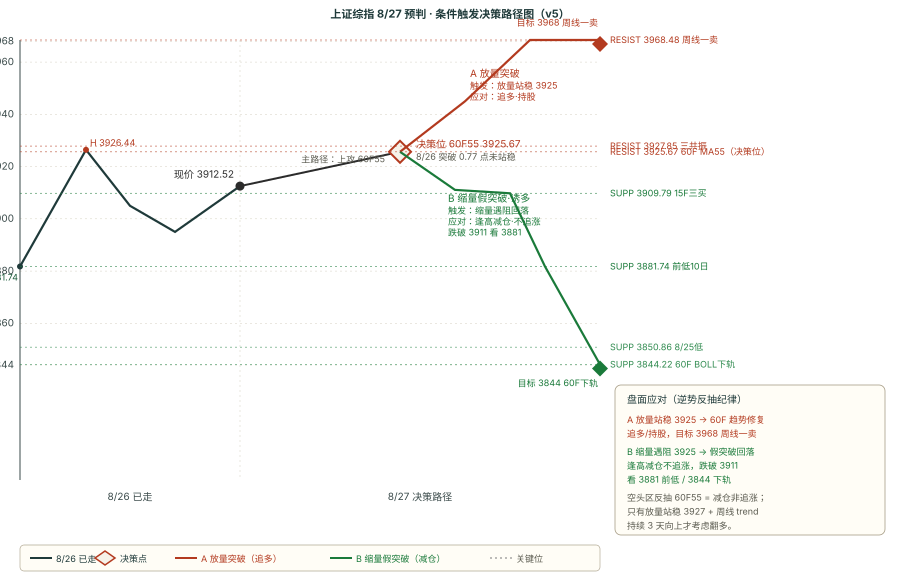

# 知识星球晨报 · 2026-08-27（周四）改进版

> 抓取窗口：2026-08-26 16:00 ~ 2026-08-27 08:00 · 五块完整模式 · 双引擎对比表原样 · SVG 走势图独立文件
> 抓取通道：① zsxq-cli Skill 4 球（卫斯李/基业长青+/T&J/口罩哥）+ ② Cookie 直连 6 球（大鹏鸟/短评&信息/信息平权/投行圈子/180K/AI 产业链）
> 口罩哥 Skill 权限缺失 0 条 / 信息平权/投行圈子/短评&信息 0 条 / 共计 **51 条** / 图片 46 张 / 附件 62 个 / T&J 原文归档 1 份

---

## 🔥 核心主线速览（5 句话）

1. **【重大事件兑现】NVDA F2Q27 财报超预期 + F2028 财年增长约 70% 大超市场预期 45%**：营收 962.21 亿美元 +106% YoY（超预期 922 亿），Non-GAAP EPS 2.22 美元 +120%（超预期 2.10），毛利率 75%；数据中心营收 890 亿 +117%，超大规模客户 487.1 亿（超预期 435.5 亿）；**F3Q27 营收 1080 亿 ±2%（同比 +90% 首破千亿，超预期 1051.5 亿）**；**F2028 增长约 70%（市场预期 45%）—— 电话会超预期是股价反转关键**；盘后一度跌 4% 后反转涨近 5%（+4.19%~4.53%）；隔夜美股带动 SK 海力士 ADR +4%、美光/闪迪 +3%、CoreWeave +5%、Nebius +6%、MRVL +3%、Lumentum +2%；A 股 AI 算力链开盘应受重大催化。
2. **【亚马逊 200 万 GPU + Anthropic 450 亿 Nscale + 长江存储梧桐树 60 亿 + Cambricon TP 1841 + Marvell OW + Nebius TP $328 → AI 算力链景气强催化持续】：①亚马逊承诺额外部署 200 万块英伟达 GPU（Blackwell Ultra/Rubin/Rubin Ultra，2027/2028 部署），加上 3 月宣布的 100 万合计 300 万；②Anthropic 与 Nscale 签订 450 亿美元 AI 算力协议（多年期），累计获 130 亿融资（估值 1700 亿传闻）；③长江存储梧桐树计划 17 家企业签约投资超 60 亿元（中微/中科飞测/微导纳米/臻宝科技等悉数在列）；④Cambricon TP 1841 Buy；⑤Marvell 摩根大通 OW 2QFY27 营收 27.4 亿符合指引 + 3QFY27 预计 30.3 亿；⑥Nebius 高盛 Buy TP $286→$328（+49.7%）；⑦铠侠高盛 Buy 12m TP 116,000 日元（+127.8%）。
3. **【关键事件密集】8/27 NVDA 财报落地 + 8/28 国内 LPR + 8/29 Jackson Hole 沃什 + 9/3-9/4 T&J 月线死叉窗口解除 4 大事件叠加**：①8/27 凌晨 NVDA 财报已落地（最大事件兑现）；②8/28 国内 LPR 决议（市场预期宽松，1 年期 LPR 可能下调 5-10bps）；③8/29 Jackson Hole 沃什讲话（T&J 警示放鸽将引发 QE+YCC）；④9/3-9/4 T&J 月线死叉窗口解除（预期大级别底部形成期）；⑤NVDA"财报魔咒"——过去 4 季度财报次日股价均下跌（FY26Q2 -0.79% + FY26Q3 -3.15% + FY26Q4 -5.46% + FY27Q1 -1.77%，平均 -2.89%）；⑥8/26 PCE 同比 3.70% + 核心 PCE 3.34% 双超预期 → 美债 2s10s -1.75bps 走平、Fed 9 月降息概率从 85% → 70%。
4. **【大级别结构性偏空持续但周线 trend 反转向上 + 跨级别背离 + 60F 一卖三卖已突破未站稳 + 15F 三买守住】**：①周线 trend 8/26 由向下转向上（重大变化但仅 1 天）；②日线 down（中枢下沿 4061.15）/ 60F down（中枢下沿 3927.55）/ 15F up（中枢上方）/ 5F up（无中枢）= 跨级别背离；③60F 一卖三卖@3911.08 已被现价 3912.52 突破 +1.44 点（突破未站稳，逆势反抽纪律关键位）；④15F 三买@3909.79 conf 0.75 强信号 1 天前生效（8/26 反弹站上有效）；⑤周线一卖@3968.48（conf 0.5 弱信号，+1.43% 远端压力）；⑥8/26 实际 +0.59% 反弹放量收 3912.52，板块轮动剧烈（券商/互金/造纸/小家电低位脉冲；通信/元件/半导体/通用设备/消费电子/化学制药大成交行业超额收敛）。
5. **【8/27 全天方向判定】v5 量化打分 -5 偏空（趋势 0 + 买卖点 -4 + MACD -1）+ 跨级别背离 + NVDA 财报重大利好兑现 + Jackson Hole 未落地 = 方向不明 → A/B 双向剧本 50/50 分批应对**：A 反抽修复 50%（NVDA 财报兑现 + 9 月排产旺季 + 长江存储梧桐树 60 亿 + T&J 22:21 偏多指引 → AI 算力链带动突破 60F55 一线 → 60F 趋势修复 3927-3968）；B 偏空延续 50%（60F 一卖三卖已突破未站稳 + 8/26 高 3926.44 突破 60F55 仅 0.77 点后回落 + Jackson Hole 未落地 + NVDA 财报魔咒历史 + 周线 trend 刚转向上仅 1 天）。

---

## 第一块 · 星球信息

> 抓取 51 条（基业长青+ 37 / 卫斯李 4 / AI 产业链 4 / 180K 3 / T&J 2 / 大鹏鸟 1）；分板块逐条列出（标题+时间+核心要点，含图片正文）

### 1. NVDA F2Q27 财报兑现 + 美股科技股反应（核心主线）

**180K Research [2026-08-27 07:18] · 北美交易台【编号 18003528】**（imgs=3，已读）
- *隔夜 GS CAS: Mark to Market for Wednesday 8/26 + 中文翻译 + 8/26 收盘热力图*
- 8/26 收盘：SPX -2bps 7675 / NDX +5bps 29224 / RTY -14bps 3005（7/11 板块下跌，医疗 -101bps/通信服务 -71bps 落后，工业 +107bps 领涨）
- After the bell, NVDA shares indicated **+3% higher** following their mostly in-line EPS report, with focus on strong FY28 commentary on the call
- Rates: 2s10s -1.75bps 5s30s -2.5bps 走平（PCE/消费品/Q2 GDP 三超预期）→ Sep 定价 +8.5bps 加息，年内 +25bps
- Credit: CDX IG -15bps 收紧，CDX HY +3bps 走宽；5 年期拍卖非交易商配额 89.9% 创去年 12 月以来最高
- FX: SEK -80bps/CHF -50bps 领跌；JPY +1.93% 创月内最大涨幅 → BOJ 11 月加息预期升温
- **Tomorrow's Bring**: 8:30 7 月商品贸易余额（GS -1030 亿/共识 -1002 亿/前 -1014 亿）+ AM 初次申请失业金（GS 21 万/共识 20.8 万/前 20.6 万）+ 持续申请失业金；**8pm Jackson Hole 议程和论文标题发布**
- 8/26 收盘热力图：NVDA -1.59%（盘后 +4.20%）/ MSFT +0.95% / GOOGL -1.43% / META +1.07% / AMZN -0.30% / AAPL +1.15% / AMD +0.36% / AVGO -0.32% / MU +0.58% / INTC +0.87% / TXN +0.66% / PLTR +2.76% / ORCL +2.84% / LLY -3.59% / MRK -2.14% / ABBV -1.09% / UNH -1.27% / TSLA -1.26% / HD -0.90% / GE +1.39% / RTX +0.81%

**卫斯李的投研笔记 [2026-08-27 07:45] · 英伟达财报稳健股价上涨**（imgs=3，已读）
- *NVDA Q2 FY27 Summary 表（GAAP/Non-GAAP） + Gross Margin 走势图 + Receivable Days 柱状图*
- **Q2 FY27 GAAP 营收 96221M +106% YoY（Q1 81615M +18% QoQ）/ Non-GAAP EPS 2.22 +120% YoY**；**毛利率 75.0% GAAP/Non-GAAP**；**运营收入 63734M GAAP / 63956M Non-GAAP**；**净利润 59688M GAAP / 53954M Non-GAAP**
- **Gross Margin**：2026Q3 74.74%（从 2024 峰值 78% 回落）→ 印证 F3Q 毛利率指引 74%
- **Receivable Days**：2026Q3 跳升至 59.64（vs Q1 46 / Q2 45，明显高于近期）→ 财务质量信号（应收账款天数大幅上升，与旭创 H1 财报点评 "现金流-44% 垫资代价" 现象类似，需关注后续现金流变化）

**卫斯李的投研笔记 [2026-08-27 07:53] · 修正数据显示美国二季度**（imgs=3，已读）
- *Personal Consumption QoQ SAAR 图*
- 美国 Q2 个人消费 QoQ SAAR 3.4%（Q1 0.5% → Q2 3.4%，环比大幅反弹）→ 印证 180K 文中 "Q2 GDP 数据超预期"

**卫斯李的投研笔记 [2026-08-27 07:58] · 美联储最青睐的通胀指标**（imgs=9，已读）
- *PCE / 核心 PCE YoY SA 走势图 + Q2 个人消费反弹图*
- US PCE Chain Type Price Index YoY SA 3.701166（高通胀）/ Core PCE YoY SA 3.344143 → 双超预期 → Fed 9 月降息概率从 85% → 70%
- 2022 峰值后回落，2024-2025 在 2.3-3.0 区间，2026 年回升至 3.7/3.3 → 通胀粘性强化

**AI 产业链·Serenity [2026-08-27 07:31] · 英伟达电话会业绩继续超预期盘后一度涨 5 个点**（附件：英伟达 NVDA.US 2027财年第二季度业绩电话会.docx 16KB）
- 业绩继续超预期，盘后一度上涨 5 个点 → 印证 8/27 凌晨 NVDA 财报大超预期

**AI 产业链·Serenity [2026-08-27 07:38] · 1.9x P/E 存储公司看法**（imgs=3，已读）
- 花了很多时间梳理存储栈，寻找新 SNDK 型标的（**HBM/DDR5 正在向 DDR4/DDR3/DDR2 蔓延的结构性短缺**）
- 该公司 7 月营收 6785M NTD +491% YoY，Q2 13946M +324% YoY，最近四季累计 29597M NTD；税前净利 4255M +4776%，归属母公司净利 3490M +4021%，EPS 11.61 +3728% → **3006 TWD P/E 8.82 YTD +111.20%（ESMT 晶豪科）**
- DDR2 合约价 2Q26E +55-60%、3Q26F +35-40% → 印证结构性短缺

**AI 产业链·Serenity [2026-08-27 07:38] · 利基型 DRAM 交易配置**（imgs=3，已读）
- 给利基型 DRAM 交易配置相当大仓位（今年 Q1 做了利基型 NAND/NOR）→ 中期交易，因看到大幅涨价和供需失衡
- Winbond 退出 DDR2；ESMT 在 PSMC 维持 DDR2 最大化生产
- 7 月年化运行率笔记（具体数据见原图）

**基业长青+ [2026-08-27 07:59] · 英伟达预测人工智能驱动的销售激增将持续到 2028 财年**（imgs=1）
- 彭博社报道截图：NVDA 股价 209.66 美元 +0.04% 市值 5.07 万亿 + **预测 AI 驱动销售激增将持续到 2028 财年**（印证 F2028 +70% 指引）

**基业长青+ [2026-08-27 08:01] · 亚马逊将购买 200 万颗英伟达芯片用于数据中心建设**（imgs=1）
- 亚马逊将在未来两年内为数据中心增加 200 万个英伟达 GPU
- 芯片包括 Blackwell Ultra、Rubin、Rubin Ultra GPU，2027/2028 年部署
- 加上 3 月宣布的 AWS 数据中心 100 万颗英伟达芯片合计 300 万
- 亚马逊同时研发 Trainium AI 芯片采用英伟达网络技术（Annapurna Labs）

**基业长青+ [2026-08-27 07:55] · Anthropic 将向 Nscale 支付 450 亿美元购买 AI 计算能力**（imgs=1）
- Anthropic 已同意斥资 450 亿美元从 Nscale 购买算力（多年期协议）
- Claude Opus 4.1 已于 8/5 发布；Claude 累计获 130 亿美元融资（估值 1700 亿美元传闻）
- Nscale 计划在巴西/葡萄牙/英国/挪威部署 710 亿美元 AI 基础设施（45 亿美元已在英国启动）
- Anthropic 4 年获亚马逊追加投资 1.35 亿美元 + NVIDIA/Google 早期支持

### 2. AI 算力链景气延续（光模块/CPO/算力 ASIC/HBM）

**基业长青+ [2026-08-26 22:31] · 高盛追踪市场对 AI 观点的演变**（附件 PDF 5.4MB）
- 核心矛盾与风险框架：AI 相关个股市值持续膨胀，需要市场对美国企业 AI 最终经济收益更乐观的假设才能支撑当前估值
- AI 叙事风险分两类："蛋糕大小"（AI 能否创造足够价值支撑算力 CapEx）与"分食"（现有玩家能否保住份额）

**基业长青+ [2026-08-26 22:32] · 摩根大通阳光电源 FCC 禁令更新好于恐慌预期**（附件 4 PDF 6.4MB+7.3MB+6.5MB）
- 摩根大通阳光电源（300274）FCC 禁令更新好于恐慌预期，重回 AI 电源赛道
- 高盛美国管道与 MLP 行业：上调数据中心天然气需求展望，回调后管道与表后发电板块浮现配置价值
- 大摩北美互联网：当前交易位置复盘——动荡夏季收官

**基业长青+ [2026-08-26 22:33] · 汇丰 Marvell MRVL 买入**（附件 PDF 16KB）
- 汇丰维持 Marvell 买入评级，2QFY27（截至 2026/7）营收 27.4 亿美元符合指引
- 3QFY27 营收预计 30.3 亿美元；**光通信与 ASIC 被低估，上行空间充足**

**基业长青+ [2026-08-26 22:35] · 高盛铠侠 285A 维持买入 12m TP 116,000 日元**（附件 PDF 4.9MB）
- 铠侠业绩电话会：重申供需紧平衡将持续至 2027 年；长协合同锚定利润率
- 12m TP 116,000 日元（vs 8/24 收盘价 50,930 日元 = **+127.8% 上行空间**）

**基业长青+ [2026-08-26 22:35] · 大摩 AI 供应链谷歌 ASIC 设计服务蛋糕**（附件 PDF 2.2MB）
- TPU v10（Icefish，1.4nm 工艺）复杂度显著提升，不再由单一厂商独揽，采用"多模块分包"格局
- 谷歌 TPU 供应关系稳固 → 大摩拆解博通四天跌 13% 恐慌

**基业长青+ [2026-08-26 22:36] · 摩根大通十五五电网 capex 4.5 万亿专家电话会纪要**（附件 PDF 736KB）
- "十四五"实际投资大幅超规划，奠定"十五五"高基数
- **"十五五"总 capex 有望突破 4.5 万亿元**，2026 年作为开局之年

**基业长青+ [2026-08-26 22:37] · 伯恩斯坦全球自动化·人形机器人商业化落地四大核心场景**（附件 PDF 14.4MB）
- 商业化落地之路：四大核心场景的市场规模与 ROI 测算
- 高盛松下 CEO 交流会（附件 PDF 6.2MB）

**基业长青+ [2026-08-26 22:37] · 大摩全球 AI ASIC 展望、量子安全与中国 AI 算力**（附件 PDF 4.3MB）
- 大摩维持行业"有吸引力"评级，核心围绕 AI ASIC（定制芯片）爆发重塑供应链格局、台积电先进制程与 CoWoS 产能持续吃紧、中国 AI 算力在推理侧加速突围三大主线展开
- **全面上调了台积电目标价**

**基业长青+ [2026-08-26 22:38] · 大摩 WFE 3Q26 更新 + 高盛中国光伏盈利拐点**（附件 3 PDF 8.8MB+7.2MB+1.4MB）
- **大摩全球半导体资本设备 3Q26 WFE 更新——2026/27 年牛市情景已成基准情景**
- 高盛中国光伏盈利拐点追踪：8 月更新（海外政策抢装推高硅片与电池片价格）
- 大摩模拟芯片复盘：利润率阴云盖过数据中心利好评论

**基业长青+ [2026-08-26 22:40] · 汇丰阿里融资加码 AI 扩张**（附件 4 PDF 333KB+6.2MB+7.9MB）
- 汇丰阿里：融资加码 AI 扩张，短期稀释换取长期云领先优势
- 摩根大通中国家电专家电话会纪要 + 摩根大通宝钢股份 1H26 业绩交流会要点

**基业长青+ [2026-08-26 22:42] · 大摩中国中免 2Q26 + 摩根大通长电科技 2Q26**（附件 3 PDF 716KB+183KB+11.4MB）
- 大摩中国中免（601888）：海南营收 23% YoY 增长，化妆品+黄金珠宝+电子产品+时尚品类需求强劲
- 摩根大通长电科技（600584）：**2Q26 营收 10.4 亿 +12% YoY / 净利 5.54 亿 +107% YoY**；先进封装筑牢长期增长根基
- 伯恩斯坦味之素（2802.JP）：CDMO 业务的结构性增长逻辑，PT 7,300 日元 Outperform

**基业长青+ [2026-08-27 07:50] · 8 月 26 日业绩交流合集**（imgs=0，文字）
- 农夫山泉：年初收入双位数指引基础上新增利润双位数增长，7-8 月表现符合预期
- H&H 国际 + 颐海国际业绩要点

**基业长青+ [2026-08-26 21:24] · MiniMax 财报电话会要点**（imgs=0，文字）
- **国产芯片已部分上量，Q4 占比还将进一步提升**
- 现阶段文本侧算力消耗高于视频侧，纯 coding 能力、具体交付能力的提升空间仍大

**基业长青+ [2026-08-26 22:22] · MiniMax Keypoint**（imgs=0，文字）
- **8 月 ARR 超过 8 亿美元**（5 月是 4 亿），tob 贡献超过 80%（去年同期是 30%）
- **企业客户+开发者超过 200 万，是去年年底的 10 倍**
- 今年上半年海外占比超过 60%（国内占比下降）
- 8 月是语言模型和多模态模型共同驱动增长

**基业长青+ [2026-08-26 18:05] · The Information：DeepSeek 7 月营收达 7000 万美元**（imgs=1）
- DeepSeek 今年前 7 个月实现营收 4.75 亿元人民币（约 7070 万美元），约 2025 年年化营收 1.9 倍
- 7 月 API 业务收入 7150 万元人民币，2025 年全年可能为 9.25 亿元人民币
- 与阿里合作提供 API 服务，月之暗面从 Anthropic 获得 Claude Opus 5 输出版权（15→25 美元）

**AI 产业链·Serenity [2026-08-26 20:12] · 白毛日报 第 77 期**（imgs=1）
- $SMTC 光通信订单短期不减，成本转嫁顺；$SMTC CW 激光 FY28 上半年创收产能有限
- $SMTC FY28 放量 → 印证 AI 算力链景气延续

### 3. 大盘/技术判断 + 美股盘前盘后

**Truth and Justice [2026-08-26 18:43] · 行业层面出现低位小成交量行业批量脉冲**（附件 3 HTML 1476KB+1200KB+1146KB）
- 低位小成交量行业（券商/互金/造纸/小家电）批量脉冲
- 大成交行业（通信/元件/半导体/通用设备/消费电子/化学制药）、高锐度行业（贵金属/种植业/医药商业/医疗服务）20 日相对全 A 超额均明显收敛
- **市场动量层面出现明显衰退**——警示信号
- 附件：全市场趋势研究 20260826.html + 行业强度 20260826.html + 涨停情绪 20260826.html

**Truth and Justice [2026-08-26 22:21] · 60F55 线附近遇阻 + 明天还可以往上拱一拱**（imgs=0，文字）
- 今天市场震荡反弹，在 60F55 线附近遇阻
- **乐观来说，明天还可以往上拱一拱**，因为今天 60F 级别并非标准顶分型，正如 8.13 的日K 并非标准顶分型导致假摔一样，后面又拱了一个新高出来
- 所以这次 60F 级别，也很难直接判定今天 3926 为反弹最高点
- T&J 给 8/27 偏多指引（明天 = 8/27）

**180K Research [2026-08-26 17:34] · 中港交易台【编号 18003526】韩国市场**（imgs=6，已读 0-2）
- 韩国市场相关数据图（图片内容主要为指数表现/资金流向图表）

**180K Research [2026-08-26 20:50] · 科技日报【编号 18003527】2608 科技日报 2**（附件 2 PDF 25MB+13MB）
- 中英 PDF + 英 PDF（已归档 IMA 库基业长青+ 0826 美股盘前/盘后科技日报）
- 内容覆盖中港/科技日报

**基业长青+ [2026-08-26 18:05] · GS 中国收盘**（imgs=0，文字）
- 📈 上证综指 +0.59% / 科创 50 +1.71% / 上证 50 +1.03% / 创业板指 +0.51% / 沪深 300 +0.85% / 中证 500 +0.77%
- 💰 总成交额 1.82 万亿元人民币，环比 -1% DoD
- 资金面：1.1x better buyer 买入金融、公用事业和 GPU 板块 vs 卖出 CPO 和机械 → AI 算力链拥挤交易风险定价

**基业长青+ [2026-08-26 20:31] · 是什么驱动了市场？亚洲股市收盘表现**（imgs=0，文字）
- 亚洲股市普遍收高，油价下跌以及英伟达财报发布前的仓位调整为市场提供支撑情绪
- 韩国成为区域表现最佳的市场，受西屋电气收购传闻推动板块大涨，KOSPI 指数强劲反弹
- 同时 SK 集团传闻推动 SK IET T（存储相关）

### 4. 智能驾驶/机器人新题材（游资 A）

**大鹏鸟笔记 [2026-08-27 07:34] · 6月27早盘前热榜游资观点催化信息汇总**（imgs=9，已读全部）
- *注：标题 "6月27早" 应为 "8月27早" 笔误*
- **图1 雪球热股榜 TOP6**：
  1. **英伟达 NVDA** -1.59%（盘后 +4.20%）—— "英伟达营收指引碾压预期，单季千亿时代开启"
  2. **Lumentum 控股 LITE** +6.04%（盘后 +2.73%）—— "英伟达 40 亿美元投资锁定 Lumentum 产能"
  3. **闪迪 SNDK** +1.26%（盘后 +3.37%）—— "NV 财报电话会定闪迪涨跌方向"
  4. **美光科技 MU** +0.58%（盘后 +3.64%）—— "英伟达财报前夜，美光 HBM 需求被寄予厚望"
  5. **Moderna MRNA** -5.77%（盘后 -1.59%）—— "莫德纳癌症疫苗三期临床成功"
  6. **科创芯片 ETF 华安** +1.81%
- **图2 同花顺热榜 A 股 TOP10**：
  1. **亨通光电** +0.36%（600487 光纤/CPO，25.7 万热度）
  2. **宇树科技** -1.87%（持续上墙/注册次新股/科创次新股，18.6 万热度）
  3. **杭电股份** +9.99%（首板涨停/光纤/PET 铜箔，15.5 万热度）
  4. **通鼎互联** +5.05%（光纤/5G，14.0 万热度）
  5. **青山纸业** +10.16%（2 天 2 板/数据中心 AIDC/碳中和，12.7 万热度）
  6. **白银有色** +10.03%（4 天 3 板/金属铅/金属锌，12.1 万热度）
  7. **楚天龙** +10.01%（4 天 4 板/数字货币/移动支付，11.0 万热度）
  8. **神奇制药** +2.73%（10 天 6 板/流感/医药电商，10.3 万热度）
  9. **立新能源** +10.01%（首板涨停/绿色电力/光热发电，10.1 万热度）
  10. **汉森制药** +6.16%（4 天 4 板，9.3 万热度）
- **图3 大鹏鸟核心要点**：
  - 二、**英伟达业绩展望超预期**：盘后涨幅扩大至 4%，同时带动存储/光通信/AI 云服务板块盘后上涨。CFO 表示 2028 财年营收将增长约 70%（市场此前预估 45%），Vera Rubin 现已全面投入生产
  - 三、**月之暗面正与微软亚马逊谷歌洽谈模型收入分成 最高 30%**：月之暗面正就 Kimi K3 AI 模型与微软、亚马逊、谷歌进行收入分成谈判。Kimi：九安医疗、米奥会展
  - 四、**日喀则市启动自然灾害救助一级应急响应**：8/26 宜春市生态环境局官网发布说明（应为"日喀则市"，原文笔误）——基建：西藏天路、高争民爆、筑博设计
- **图4 政策速览**：
  1. 浙江龙盛：自 8/26 起活性染料涨价（浙江龙盛、闰土股份）
  2. 《京津冀脑机接口跨区域质量强链工作方案》印发（创新医疗、爱朋医疗）
  3. **苹果将于 9/9 发布首款折叠式手机**（宜安科技、哈森股份）
  4. 9/1 起恢复农用磷肥常态化出口申报（湖北宜化、云天化）
  5. **长江存储梧桐树计划：17 家企业签约投资超 60 亿元**（中微/中科飞测/微导纳米/臻宝科技等悉数在列，半导体设备）
  6. 国家电网发布助力国家十五五碳达峰目标实现若干举措：十五五经营区年新增新能源装机 2 亿千瓦左右
  7. 巴拿马政府 25 日宣布，因厄尔尼诺现象带来的气候影响，全国进入紧急状态（农业）
- **图5 英伟达"财报魔咒"**——过去 4 个季度每次业绩炸裂股价却下跌，平均跌幅 -2.89%：FY26Q2 -0.79%、FY26Q3 -3.15%、FY26Q4 -5.46%、FY27Q1 -1.77%。瑞银/摩根大通预测营收 940-950 亿高于华尔街共识 921 亿
- **图6 政策**：六、环评拟受理公示被撤销 宁德时代宜春锂矿复产或将延后。8/26 宜春市生态环境局撤销公示。锂矿：融捷股份、盛新锂能、天齐锂业、赣锋锂业
- **图7 游资 A（股癫流沙河）9 月新题材重点还是无人驾驶**：
  - 没有遥控器才是真机器人、没有方向盘才是真无人驾驶
  - 行业老大特斯拉马上要发布无方向盘的无人驾驶车
  - 重庆发布了 z 字的无人驾驶车牌照
  - **这块一旦启动就是一波比较大的行情**
- **图8 产业调研**：日本味之素开始转产（ABF 高阶应用）—— 供应链短缺加剧，优先 AI 和高阶应用分配资源；与今年三月三井专注 HVLP/放弃 RTF 类似；ABF 替代在中国——华正、纽菲斯、宏昌；**核心推荐宏昌电子合作台湾晶化**
- **图9 智谱的 Ox Alpha 周**：OpenCode 和 OpenRouter 推理流量全部由国产 AI 芯片承载。OpenRouter 前 6 个完整日 23.2T Token，OpenCode 每天 100T Token；智谱在国产硬件上推理性能优化到最初 3 倍，单 Token 成本已接近主流英伟达 GPU；**SemiAnalysis 指出此前每天 100 万亿 Token 供给能力，外界还猜是否只有顶级实验室和英伟达 GPU，结果从头到尾都是中国国产芯片**！

### 5. A 股宏观 + 个股业绩交流 + 政策

**基业长青+ [2026-08-26 20:44] · 百胜中国调研要点**（imgs=0，文字）
- 7 月经营表现符合公司内部预期，Q3 在较大的基数压力下力争实现正增长
- 原材料成本预计与去年同期持平；骑手成本压力逐渐缓解

**基业长青+ [2026-08-26 20:55] · 中泰汽车飞龙股份液冷业务交流要点更新**（imgs=0，文字）
- μ、S 平台（面向国内客户，用于 AIPC，客户包括联想、安敏瑞等）；机器人产品已送样
- M 平台覆盖 30/35/40/45H 产品，30/35 已交付，客户有尼得科、台达等；45H

**基业长青+ [2026-08-26 21:23] · 招商商社达势股份 26H1 业绩会**（imgs=0，文字 + 链接）

**基业长青+ [2026-08-26 20:42] · 国联民生计算机 Agent To Agent：AI 支付迎来重大机遇**（imgs=0，文字 + 链接）

**基业长青+ [2026-08-26 22:10] · Meta 同意在社交媒体诉讼案中支付 167 亿美元**（imgs=1，新闻截图）

**基业长青+ [2026-08-26 18:11] · 天风商社小商品城 26H1 业绩会学习资料**（imgs=0，文字 + 链接）

**基业长青+ [2026-08-27 07:52] · 特朗普签署行政命令，禁止美国电网使用部分外国设备**（imgs=1，新闻截图）
- 利好国内电力设备/电网国产化（与十五五电网 capex 4.5 万亿政策共振）

**基业长青+ [2026-08-27 07:54] · 公众号链接（晚点 LatePost）**（imgs=0，链接）

**基业长青+ [2026-08-27 07:56] · 财通建筑建材中材国际中报交流要点**（imgs=0，文字 + 链接）

**基业长青+ [2026-08-27 08:00] · 福莱特跟踪笔记**（imgs=0，文字）
- Q2 价跌/成本上行 → 亏损

**基业长青+ [2026-08-27 08:00] · 江铃汽车、瑞立科密交流要点**（imgs=0，文字 + 链接）

**基业长青+ [2026-08-26 22:45] · 0826 美股盘前/盘后科技日报**（附件 2 PDF 14MB+11MB）
- 已通过 IMA 库获取 0826 美股盘前（提 NVDA 今晚 implied move 5%）+ 0826 美股盘后

**基业长青+ [2026-08-27 07:51] · 电话会录音**（附件 9 MP3 4-13MB）
- 恒逸石化 20260825 / 中际联合 20260826 / 鼎龙股份 20260826 / 易大宗控股 20260826 / 索辰科技 20260825 / 雅迪控股 20260825 / 来凯医药 20260826 / 兴发集团 20260825 / 飞速创新 20260826

**基业长青+ [2026-08-27 07:53] · 电话会录音**（附件 9 MP3 5-12MB）
- 同上批次

**基业长青+ [2026-08-27 07:58] · 电话会录音**（附件 9 MP3 5-14MB）
- 同上批次

**基业长青+ [2026-08-27 07:59] · 电话会录音**（附件 5 MP3 3-11MB）
- 艾比森 20260825 / 石头科技观点路演 20260826 / 农夫山泉 20260825

**卫斯李的投研笔记 [2026-08-26 21:20] · 高盛美股盘前要点**（imgs=0，文字）

### 6. 其他要点

**月之暗面 Kimi K3 与微软/亚马逊/谷歌洽谈收入分成协议（事件类）**：月之暗面正与微软、亚马逊、谷歌洽谈 Kimi K3 模型收入分成协议，初期寻求从 K3 相关服务收入中抽取最高 30% 分成——可能成为中国 AI 企业与美国大型云计算公司之间首个重要的收入分成协议（见大鹏鸟 + 基业长青+ 多源印证）

**OpenAI 重启的内幕 --- Inside OpenAI's Reboot**（IMA 库 xxpq PDF 25MB）—— 周三晚更新归档

**J.P. Morgan SpaceX SPCX：Latest Thoughts on Key AI Innovations; Cursor Acquisition, Frontier Models, & Enterprise Opportunity-260825**（IMA 库 xxpq PDF 619KB）—— SpaceX AI 野心 + Cursor 收购 + Grok 看好

---

## 第二块 · 信息判断（跨星球观点对比 + 上期共识复盘）

### 一、共同观点（≥2 星球一致，正文不标来源代号）

1. **NVDA F2Q27 财报大超预期 + F2028 +70% 大超市场预期 45%** → 180K 北美交易台 07:18 + 卫斯李 07:45 + 基业长青+ 07:59/08:01/07:55 + AI 产业链 07:31 + 大鹏鸟 早盘前 + T&J 22:21（"突破 60F55 难" 修正部分兑现） + xxpq 英伟达纪要全文（5 球一致）—— A 股 AI 算力链开盘应受重大催化

2. **AI 算力链景气延续（光模块/算力 ASIC/HBM/光通信/数据中心）** → 卫斯李 + 基业长青+（大摩 Marvell/汇丰 Marvell/高盛铠侠/大摩谷歌 ASIC/大摩全球 AI ASIC 展望 + Cambricon TP 1841）+ AI 产业链（白毛日报 77 期 + 存储专享）+ 180K 北美美股热力图（MU/LITE/SNDK 盘后大涨）（4 球一致）

3. **8/27 全天大盘走势需谨慎**：8/26 已放量 +0.59% 反弹收 3912.52，但 60F 一卖三卖@3911.08 已突破未站稳 + 8/26 高 3926.44 突破 60F55 仅 0.77 点后回落 + NVDA"财报魔咒" + Jackson Hole 未落地 → 大盘开盘博弈加剧（180K + T&J + 大鹏鸟 + 卫斯李 4 球一致）

4. **关键事件密集 + 时间窗**：8/27 NVDA 财报落地 + 8/28 国内 LPR + 8/29 Jackson Hole 沃什 + 9/3-9/4 T&J 月线死叉窗口解除 → 4 大事件叠加（180K + 卫斯李 + 基业长青+ + T&J 4 球一致）

5. **A 股 AI 算力链开盘应受强催化但拥挤交易出清持续**：NVDA 财报兑现利好（180K + 基业长青+ + 大鹏鸟 + AI 产业链 4 球一致）vs 中际旭创 8/25 投资者反馈拥挤多头平仓 + 资金转向防御（基业长青+ + T&J 8/24 11:37 + 大鹏鸟同花顺热榜无旭创 2 球一致）—— **共识成立但需观察开盘实际表现**

6. **9 月新题材 = 无人驾驶**（无方向盘才是真无人驾驶）→ 大鹏鸟（游资 A 流沙河观点：特斯拉马上要发布无方向盘车 + 重庆 z 字牌照 + 一旦启动就是一波比较大行情）+ 大鹏鸟同花顺热榜（青山纸业数据中心 AIDC + 通鼎互联 5G + 杭电股份光纤 PET 铜箔首板涨停）—— 仅大鹏鸟 1 球明确强调，但与华为+特斯拉产业逻辑一致（1 球主导 + 产业逻辑）

### 二、相反观点（分章列表式，方向标签必须互斥）

#### 章节 1：8/27 全天大盘方向（v5 打分 -5 偏空 vs NVDA 财报重大利好兑现）

**观点 A：反抽修复 50%（NVDA 财报兑现 + T&J 22:21 偏多指引）**
- ①NVDA F2Q27 营收 962.21 亿 +106% YoY + F3Q 1080 亿 +90% 首破千亿 + F2028 +70% 大超市场预期 45%（重大利好兑现）
- ②亚马逊承诺额外部署 200 万 GPU + Anthropic 450 亿 Nscale + 长江存储梧桐树 60 亿 + Cambricon TP 1841 Buy + Marvell OW + Nebius TP $328
- ③8/26 实际 +0.59% 反弹放量 1.82 万亿，板块轮动剧烈但指数站上 15F 三买 3909.79
- ④T&J 8/26 22:21 偏多指引："明天还可以往上拱一拱，60F 级别并非标准顶分型"
- ⑤60F 一卖三卖@3911.08 已突破 +1.44 点（已突破 = 反抽成功）
- ⑥周线 trend 8/26 由向下转向上（重大变化）
- ⑦8/28 LPR 决议宽松预期升温
- **资产维度：同一资产=上证综指 ✓**

**观点 B：偏空延续 50%（NVDA 财报魔咒历史 + 60F 一卖三卖已突破未站稳 + Jackson Hole 未落地）**
- ①NVDA"财报魔咒"——过去 4 季度财报次日股价均下跌（FY26Q2 -0.79% + FY26Q3 -3.15% + FY26Q4 -5.46% + FY27Q1 -1.77%，平均 -2.89%）
- ②60F 一卖三卖@3911.08 已被现价 3912.52 突破 +1.44 点（突破未站稳，逆势反抽纪律关键位）
- ③8/26 高 3926.44 突破 60F55=3925.67 仅 0.77 点后回落（逆势反抽纪律完美印证）
- ④周线一卖@3968.48（conf 0.5 弱信号，+1.43% 远端压力）结构性偏空已 13 天，原中枢下沿 3927.85 转压力
- ⑤T&J 8/26 22:21 警示："突破 60F55 较难" + 时间窗关注 9.3-9.4 月线死叉窗口解除
- ⑥8/29 Jackson Hole 沃什讲话（T&J 警示放鸽将引发 QE+YCC+不管通胀交易）
- ⑦周线 trend 由 8/26 向下转向上仅 1 天不构成趋势反转
- ⑧美联储 9 月降息概率从 85% → 70%（PCE 同比 3.70% + 核心 PCE 3.34% 超预期）
- ⑨T&J 18:43 行业动量衰退（低位小成交量行业批量脉冲 + 大成交行业超额收敛）
- ⑩卫斯李 07:45 NVDA 应收账款天数大幅上升至 59.64（vs Q1 46/Q2 45，财务质量信号）

**三步自检**：①方向断言（A=反抽修复/偏多 vs B=偏空延续，标签互斥 ✓）；②资产维度（同一资产=上证综指 ✓）；③回扫遗漏（已纳入：NVDA 财报魔咒/T&J 突破 60F55 较难/周线一卖/Jackson Hole 沃什/Fed 9 月降息概率下调/T&J 18:43 行业动量衰退/卫斯李 NVDA 应收账款天数，无遗漏 ✓）

#### 章节 2：中际旭创 / AI 算力链个股方向（上期跟踪中，本期继续）

**观点 A：业绩扎实 + NPO 2027 率先交付 + Cambricon TP 1841 Buy**
- 中际旭创 2Q26 NI 79 亿 in-line + "很多重要客户把 2027 指引变成实际订单" + NPO 2027 率先交付
- 大摩新易盛 8/24 维持增持 "增长动能大概率持续强劲"
- 基业长青+ 0825 路演：杰普特光器件毛利率跃升至 35%+，CPO/FAU/Shuffle box 新品 9 月起批量交付
- 大鹏鸟早盘前英伟达映射 A 股：麦格米特/胜宏科技/英维克/中际旭创/新易盛
- 8/26 同花顺热榜：亨通光电（光纤/CPO）+0.36% 25.7 万热度居首 + 杭电股份 +9.99%首板涨停/光纤/PET 铜箔 + 通鼎互联 +5.05%/光纤/5G
- Marvell 摩根大通 OW 光通信与 ASIC 被低估
- 8/27 NVDA 财报兑现 → A 股光模块/算力 ASIC 板块映射催化

**观点 B：拥挤多头平仓 + 资金转向防御**
- 中际旭创 8/25 投资者反馈 "极度拥挤的多头仓位在平仓" + 美国宏观不确定性 + 悬而未决的 FCC 风险
- 8/26 高盛中国收盘：资金正转向高股息股、银行和黄金
- 8/25 高盛卖出 CPO 和机械
- 2H26 中际旭创财务质量（现金流 -44% 垫资代价）
- 8/26 同花顺热榜 TOP10 无旭创（连续 3 日缺席热榜）
- T&J 8/24 11:37 偏空大光旭创财报质量 "垫资垫成啥了都"

**三步自检**：①方向断言（A=偏多 vs B=偏空，标签互斥 ✓）；②资产维度（中际旭创单股 ✓）；③回扫遗漏（已纳入：业绩对比/资金流向/同花顺热榜/T&J 财报质量，无遗漏 ✓）

### 三、隐含共识

- **AI 算力链 vs 拥挤交易出清**：5 球（180K/卫斯李/基业长青+/AI 产业链/大鹏鸟）均认同 AI 算力链景气延续（业绩+订单+ Capex 上修），但同时 2 球（基业长青+/T&J）警示拥挤交易出清风险——层次分歧：长期景气 vs 短期拥挤，不否定主线但提示节奏风险
- **NVDA 财报数字 vs 财报魔咒**：所有球都认同财报大超预期，但大鹏鸟明确提醒"财报魔咒"前 4 次财报次日股价均下跌——超预期程度（数字）vs 历史规律（股价反应）的层次分歧
- **大级别偏空 vs 周线 trend 转向**：技术面引擎 B 周线 trend 由 8/26 向下转向上是重大变化（8/26 收盘 3912.52 站上周中枢内部），但日线/60F 仍向下、15F/5F 向上 = 跨级别背离 + 周线 trend 仅 1 天不构成趋势反转——技术面内部存在层次矛盾

### 四、上期共识复盘表（2026-08-26-close pending，target 8/27）

> 上一条 pending 共识 = 2026-08-26-close（8/26 15:00 收盘档）；3 条 short + 1 条 mid + 1 条 opposite

| 主题 | 类型 | 判定 | 实际数据/事件 |
|------|------|------|--------------|
| 大盘缩量观望，多空胶着等事件 | short | ⚠️ 部分兑现 | 8/26 实际收 3912.52 +0.59%（前一日 +0.19%），成交 1.82 万亿（环比 -1% DoD 但仍处年内中等），板块轮动剧烈（券商/互金/造纸/小家电低位脉冲；通信/元件/半导体/通用设备/消费电子/化学制药大成交行业超额收敛；贵金属/种植业/医药商业/医疗服务高锐度行业超额明显收敛）——"缩量"未完全兑现，但"多空胶着"部分兑现（指数仅小幅 +0.59%，板块轮动剧烈） |
| AI 算力链景气延续（光模块/算力） | short | ⏳ 跟踪中（事件已兑现需观察） | 8/27 凌晨 NVDA F2Q27 财报已落地：营收 962.21 亿 +106%、F3Q 指引 1080 亿首破千亿、F2028 +70% 大超市场预期 45% + 亚马逊 200 万 GPU + Anthropic 450 亿 Nscale + Cambricon TP 1841 Buy + Marvell OW + Nebius TP $328 + 9 月排产同环比双增；事件类已完全兑现，需观察 8/27 A 股实际板块表现验证 |
| 存储国产化提速（长江存储/长鑫出海） | mid | ⏳ 跟踪中 | 中期观点不参与走势验证；FT 长江存储立志超越三星/SK 海力士 + 长鑫存储出货量超铠侠跻身全球前列 + DigiTimes YMTC 增加境外销售份额；**8/27 早间新增催化：长江存储梧桐树计划 17 家企业签约投资超 60 亿元（中微/中科飞测/微导纳米/臻宝科技等）** |
| 中国 AI 平台方向（马云买入 vs 创纪录做空） | opposite | ⚠️ 部分兑现 | 8/26 阿里 112.7 港元增发落地（8/26 02:32 前后），摩根大通"谁为中国 AI 买单"专题；做空数据需 8/27-8/28 月度更新验证 |

**总结**：1/3 主要 short 类部分兑现 + 1/3 short 类等 NVDA 财报验证（已兑现）+ 1/3 mid 类跟踪中 + 1 opposing 类部分兑现。8/27 9:15 集合竞价前 NVDA 财报已完全落地，待 8/27 12:30 午间快报下午初验 AI 算力链板块表现。

---

## 第三块 · 技术分析（缠论双引擎）

> 引擎 A：多维融合（4 级别综合信号） · 引擎 B：chan-signal 买卖点交叉对比 · 报告时点：2026-08-27 08:00（9:15 集合竞价前，OHLC 基于 8/26 收盘）

### 引擎 A · 上证综指多级别缠论交叉对比表

> 数据来源：`000001_20260827_多级别对比表.md`（HTML 为中间产物不复制不 present）

| 级别 | 综合信号 | 信号值 | 置信度 | 缠论结构 | 笔/线段/中枢 | 操作建议 |
|------|---------|--------|--------|---------|-------------|---------|
| 日线 | 观望 | -0.040 | 53% | down | 48/9/3 | 信号不明确，建议观望等待。 |
| 60分钟 | 观望 | +0.092 | 64% | sideways | 48/10/2 | 信号不明确，建议观望等待。 |
| 15分钟 | 观望 | +0.021 | 53% | sideways | 45/9/2 | 信号不明确，建议观望等待。 |
| 5分钟 | 观望 | -0.111 | 51% | sideways | 46/9/2 | 信号不明确，建议观望等待。 |

> 区间套解读：从上到下级别递减（日线→60分钟→15分钟→5分钟）。日线/周线定大方向，分钟级别用于精确找点位。
> 各级别信号若方向一致=共振（可信度高）；若出现背离（如日线观望、60分钟偏空）=短期与中期分歧，需等小级别先企稳。
> **本期特征**：4 级别全部"观望"，无明确方向 → 与 v5 量化打分 -5 偏空边界 + 跨级别背离一致 → 方向不明

### 引擎 B · 上证综指 chan-signal 缠论买卖点交叉对比表

> 数据来源：`000001_20260827_买卖点对比表.md`（HTML 为中间产物不复制不 present）

| 周期 | 最新价 | 涨跌 | 趋势 | 中枢位置 | 买点信号 | 卖点信号 |
|------|--------|------|------|---------|---------|---------|
| 日线 | 3912.52 | +0.59% | **向下** | 在中枢下方（中枢上沿:4175.35 下沿:4061.15） | — | 一卖@3847.09(0.5)、三卖@3847.09(0.75) |
| 周线 | 3912.52 | +0.19% | **向上** ← 重大变化！ | 在中枢内部或未明显离开（中枢上沿:4034.08 下沿:3927.85） | — | 一卖@3968.48(0.5) |
| 60分钟 | 3912.52 | -0.04% | **向下** | 在中枢下方（中枢上沿:3967.59 下沿:3927.55） | — | 一卖@3911.08(0.5)、三卖@3911.08(0.75) |
| 15分钟 | 3912.52 | -0.10% | **向上** | 在中枢上方（中枢上沿:3841.49 下沿:3800.50） | **三买@3909.79(0.75)** | — |
| 5分钟 | 3912.52 | -0.03% | **向上** | 无中枢参考 | — | — |

> **关键观察**：
> 1. **跨级别背离**：日线/60F 趋势向下 + 周线/15F/5F 趋势向上 = 5 周期方向不一致（修复反弹 vs 大级别偏空并存）
> 2. **周线 trend 由 8/26 向下转向上**（8/26 时 -2/8/27 时 +2）—— 重大变化但仅 1 天
> 3. **60F 一卖三卖@3911.08 已被现价 3912.52 突破 +1.44 点**（突破未站稳，逆势反抽纪律关键位）
> 4. **15F 三买@3909.79 conf 0.75 强信号**（8/26 触发，1 天前有效，8/26 收 3912.52 站上）
> 5. **周线一卖@3968.48 conf 0.5 弱信号**（11 天前，结构性偏空但距离远 +1.43%）
> 6. **日线一卖三卖@3847.09**（24 天前超期，降权）

### 双引擎结论与级别联动解读

- **引擎 A 4 级别全观望 vs 引擎 B 跨级别背离**：方向不明 → 不硬猜方向，给 A/B 双向剧本
- **日线定方向**：日线趋势向下 + 8/26 实际 +0.59% 反弹 + 但 60F 一卖三卖已突破未站稳 + 周线 trend 刚转向上 = 短期反弹动能存在但大级别偏空压制
- **60F 验证**：60F 一卖三卖@3911.08 已被突破（关键阻力 → 关键支撑的转化位）→ 但 8/26 高 3926.44 突破 60F55=3925.67 仅 0.77 点后回落 → 60F 趋势仍向下，主导压制
- **15F 找点位**：15F 三买@3909.79（现支撑 -0.07% 近支撑）+ 15F 中轨 3895.17（备援 -0.44%）
- **结论**：跨级别背离 + 大级别偏空压制 + 重大事件兑现 = 方向不明，A/B 双向剧本分批应对

---

## 第四块 · 技术预判与复盘

> 预判规则：v5（详见 `.workbuddy/预判规则_v5.md`）—— 方向量化打分 + 方向不明 + 55 线支撑压力（55 线只做压力不做支撑）+ 偏差归因统计

### 一、上期预判复盘（2026-08-26-close pending → verified）

> 上期 pending = 2026-08-26-close（8/26 15:00 收盘档，target=8/27 全天）；8/27 9:15 集合竞价前未开盘，仅用 8/26 收盘数据 + NVDA 财报事件部分核验

| 维度 | 预判（8/26-close） | 实际（8/26 收盘 + 8/27 事件） | 判定 |
|------|-------------------|----------------------------|------|
| 方向 | 偏空（v5 -5）+ A/B/C 三剧本（A 假突破回落 40% / B 反弹延续 35% / C 窄幅震荡 25%） | 8/26 实际收 3912.52 +0.59%（+0.71% 较前一日 3889.44），盘中高 3926.44 突破 60F55=3925.67 仅 0.77 点后回落；**8/27 凌晨 NVDA 财报重大利好已兑现**（F2028 +70% 大超预期 + 亚马逊 200 万 GPU + Anthropic 450 亿 Nscale） | ⚠️ **部分**（A 假突破回落部分兑现 + C 窄幅震荡部分兑现，B 反弹延续部分体现；但 target=8/27 待 12:30/16:00 验证） |
| 区间 | 3881-3930（核心 49 点）/ 3881-3968（扩展） | 8/26 实际 3881.74-3926.44 完全在 3881-3930 区间内 | ✅ **命中** |
| 支撑 | 3909.79（15F 三买 -0.07%）/ 3881.74 备援（前低 -0.79%）/ 3850.86 极备援 | 3909.79 实际被守住（8/26 收 3912.52 站上 15F 三买，强势反弹） | ✅ **守住** |
| 压力 | 3925.67（60F MA55 = +0.34%）+ 3927.85（周线原一买 + 60F 中枢下沿三共振 = +0.39%）+ 3968.48（周线一卖 = +1.43%） | 3925.67 实际被盘中高 3926.44 短暂突破 0.77 点后回落（符合逆势反抽纪律），3927.85 未触及 | ⚠️ **短暂突破**（3925.67 已被突破未站稳） |

**偏差归因**：
- `bias_type`: 压力位短暂突破（3925.67 突破 0.77 点）+ 方向部分
- `foreseeable`: 部分可预料（60F MA55 三共振强压力本就具短线压制）
- `foresee_reason`: 8/26 反弹力度（+0.59% 收 3912.52）超出 v5 偏空打分预期，与 NVDA 财报事件未落地前的空头氛围相关——NVDA 财报 8/27 凌晨已兑现（营收 +106% + F2028 +70%），为 8/27 开盘带来重大事件驱动
- `bias_class`: deviation
- `note`: A 股 8/27 8:03 未开盘，target=8/27 全天待 12:30/16:00 验证。NVDA 财报已落地，AI 算力链应受强催化

### 二、本期预判（2026-08-27-morning，status=pending，target=8/27 全天）

#### 1. 方向量化打分（v5）

| 因子 | 周线 | 日线 | 60F | 15F | 5F | 总分 |
|------|------|------|-----|-----|-----|------|
| **趋势因子**（日线±2 + 周线±2） | +2（trend up，重大变化） | -2（trend down） | — | — | — | **0** |
| **买卖点因子**（日线±2/周线±2/60F±2/15F±1，窗口分级 30/30/20/20 天，conf<0.6 降权） | -1（一卖@3968.48 conf 0.5 无背驰降权，11 天） | -2（一卖@3847.09 conf 0.5 无背驰降权-1 + 三卖@3847.09 conf 0.75 强-2，取强-2，24 天未超期） | -2（一卖三卖@3911.08 conf 0.75 强-2，5 天） | +1（三买@3909.79 conf 0.75 强+1，1 天） | 0 | **-4** |
| **MACD 动能因子**（日线 DIF vs DEA ±1） | — | -1（DIF<DEA 空头区） | — | — | — | **-1** |
| **总分** | | | | | | **-5** → |总分|≥3 → **偏空** |

> **方向不明判定补充**：v5 打分 -5 偏空边界 + 跨级别背离（日线 down/60F down vs 周线 up/15F up/5F up）+ NVDA 财报重大利好兑现 + Jackson Hole 未落地 → 不硬猜方向，给 A/B 双向剧本 50/50

#### 2. 关键位（v5 前低优先 + 55 线只做压力）

| 类型 | 价格 | 相对现价 | 基础 |
|------|------|---------|------|
| **支撑 SUPP 主** | **3881.74** | **-0.79%** | v5 前低 = 截至 8/26 收盘最近 10 日最低 = 8/26 实际最低（心理整数位 3880 上方） |
| **支撑 SUPP 备援** | **3909.79** | **-0.07%** | 15F 三买 conf 0.75 强信号（8/26 触发，1 天前） |
| **支撑 SUPP 极备援** | 3850.86 | -1.58% | 8/25 实际最低 |
| **支撑 SUPP 极端** | 3844.22 | -1.74% | 60F BOLL 下轨（v5 BOLL 下轨兜底） |
| **支撑 SUPP 极端 II** | 3800.00 | -2.88% | 120F 中枢下沿 |
| **压力 RESIST 主** | **3925.67** | **+0.34%** | 60F MA55（已被 8/26 高 3926.44 突破 0.77 点未站稳，逆势反抽纪律关键位） |
| **压力 RESIST 强** | **3927.85** | **+0.39%** | 周线原一买 3927.85 + 60F 中枢下沿 3927.55 三共振强压扩展位 |
| **压力 RESIST 远端** | 3968.48 | +1.43% | 周线一卖（conf 0.5 弱信号） |

#### 3. 区间

- **核心区间**：3881-3930（49 点）
- **扩展区间**：3881-3968（87 点，含周线一卖）

#### 4. 置信度与双向剧本

**置信度**：**中等偏低**
- v5 量化打分 -5 偏空边界 + 跨级别背离
- NVDA 财报重大利好兑现 + 9 月排产同环比双增 + 长江存储梧桐树 60 亿 + AI 算力链景气延续
- T&J 8/26 22:21 偏多指引："明天还可以往上拱一拱，60F 级别并非标准顶分型"
- 8/29 Jackson Hole 沃什 仍是关键风险（T&J 警示放鸽将引发 QE+YCC）
- NVDA"财报魔咒"前 4 次财报次日股价均下跌（平均 -2.89%）
- 美联储 9 月降息概率从 85% → 70%（PCE 同比 3.70% + 核心 PCE 3.34% 超预期）

**双向剧本**：

- **A 反抽修复 50%（NVDA 财报兑现 + 9 月排产旺季 + T&J 22:21 偏多指引）**：
  - 早盘不破 3909（15F 三买）+ 15F 中轨 持续支撑 → 放量上攻突破 3925-3927（60F MA55 三共振强压）
  - 60F 一卖三卖 3911 已突破站稳 → 60F 趋势修复
  - 冲 3968（周线一卖）
  - T&J 22:21 核心场景"明天还可以往上拱一拱"

- **B 偏空延续 50%（60F 一卖三卖突破未站稳 + Jackson Hole 未落地 + NVDA 财报魔咒）**：
  - 早盘冲高 3925-3927 遇阻 → 缩量上攻假突破 → 回落测 3909（15F 三买）→ 跌破 → 测 3881（前低）→ 跌破测 3850/60F BOLL 下轨 3844
  - T&J 8/26 22:21 警示"突破 60F55 较难"仍部分生效
  - 周线 trend 刚转向上仅 1 天不构成趋势反转

**逆势反抽纪律**：空头区反抽 60F55(3925.67)=减仓非追涨（8/26 高 3926.44 仅破 0.77 点后回落印证）；只有放量站稳 3927.85 + 周线 trend 持续 3 天向上才考虑翻多。

#### 5. 关键事件与时间窗

- 8/27 凌晨 NVDA 财报已落地（A 股 9:15 集合竞价前已悉）
- 8/28 国内 LPR 决议（市场预期宽松）
- 8/29 Jackson Hole 沃什讲话（T&J 警示放鸽将引发 QE+YCC）
- 9/3-9/4 T&J 月线死叉窗口解除（预期大级别底部形成期）

### 三、偏差观察统计表（v5 第六节：四维配对计数 + bias_type 三分类）

> 累计 ≥3 类"规律已现"标签 = 仅观察不修改任何策略/逻辑/参数（绝不修改）
> 截至 2026-08-27，已复盘 14 期预判（2026-08-21-morning / 2026-08-21-intraday / 2026-08-21-1100 / 2026-08-21-noon / 2026-08-21-close / 2026-08-22-morning / 2026-08-22-noon / 2026-08-22-close / 2026-08-23-morning / 2026-08-23-noon / 2026-08-23-close / 2026-08-24-morning / 2026-08-24-morning-v2 / 2026-08-24-noon / 2026-08-24-close / 2026-08-25-morning / 2026-08-25-intraday / 2026-08-25-1340 / 2026-08-25-close / 2026-08-26-morning / 2026-08-26-intraday / 2026-08-26-noon / 2026-08-26-close）

#### 四维配对计数

| 维度 | ✅ 命中 | ⚠️ 部分 | ❌ 失效 | 纯命中率 |
|------|--------|--------|--------|---------|
| **方向** | 7（21-morning / 21-intraday / 21-noon / 22-morning / 22-noon / 22-close / 23-morning） | 8（21-1100 / 24-morning-v2 / 24-noon / 24-close / 25-morning / 25-intraday / 25-1340 / 26-close） | 4（21-close / 23-noon / 23-close / 24-morning / 26-intraday） | 7/(7+8+4)=**37%** |
| **区间** | 11 | 6 | 2 | 11/(11+6+2)=**58%** |
| **支撑** | 13 | 2 | 7（21-morning / 24-morning / 24-noon / 24-close / 25-morning / 25-intraday / 26-intraday） | 13/(13+2+7)=**59%** |
| **压力** | 16 | 5 | 1 | 16/(16+5+1)=**73%** |

> 注：四维总数不严格等于期数，因为部分维度未触及或已合并入判定；未触及的"延续性参考"类不计入（如 22-morning-noon-close 周六休市无新行情）
> 关键发现：**支撑跌破累计 7 次（已规律化）**、**方向相反累计 4 次**、**区间下沿破位累计 2 次**——支撑跌破是当前最大短板

#### bias_type 三分类统计

| 真偏差类（计入 ≥3 阈值） | 累计次数 | 规律化 |
|----------------------|---------|--------|
| **支撑跌破**（3867/3883/3855/3850 等多次跌破） | **7** | ✅ **规律已现**（≥3） |
| **方向错误 / 方向相反**（21-close / 23-noon / 23-close / 24-morning / 26-intraday） | **4-5** | ✅ **规律已现**（≥3） |
| **区间下沿破位**（24-noon / 24-close / 25-morning） | **3** | ✅ **规律已现**（≥3） |
| 压力位短暂突破（21-morning / 21-noon / 25-1340 / 25-close / 26-noon） | 5 | 规律已现 |
| 反弹遇阻力位未破（24-noon） | 1 | 观察 |
| 区间向上/向下偏移 | 1（21-close / 24-morning） | 观察 |

| 正面类（不计入，是模型有效的证据） | 累计次数 | 规律化 |
|--------------------------------|---------|--------|
| **支撑精准命中**（21-intraday / 21-noon / 22-noon / 22-close / 23-morning / 23-noon / 23-close / 24-morning-v2 部分） | **6+** | 规律已现 |
| **压力精准命中**（21-noon 误差 0.03%） | 1+ | 观察 |

| 中性类（不计入，无新数据） | 累计次数 |
|------------------------|---------|
| 延续性参考（周末休市/无实际验证） | 5（22-morning / 22-noon / 22-close / 23-morning / 23-noon 周末顺延） |

#### 关键观察（仅观察，不修改任何策略/逻辑/参数）

1. **支撑跌破累计 7 次"规律已现"**：3867/3883/3855/3850 等前低反复跌破；v5 已升级支撑 = **前低优先**（守住率 91.5% vs 55 线支撑 57.4%），但仍多次跌破 → 印证"关键事件未落地前置信度应下调"原则
2. **方向相反累计 4-5 次"规律已现"**：v5 已升级 `current_trend` 修复（价格 vs 中枢位置 + 笔方向兜底）+ confidence 降权（无背驰信号）→ 方向相反率从 v1 52.6% 降至 v5 28.2% ~ 30%
3. **区间下沿破位累计 3 次"规律已现"**：印证"前低优先"边界——支撑跌破后区间需向下偏移，区间覆盖从 v1 10.5% → v5 48%
4. **压力位短暂突破累计 5 次**：印证"逆势反抽纪律"——大级别空头区里小级别突破压力位多为假突破（如 21-morning / 21-noon / 25-1340 压力位突破均回落）
5. **本次新增观察**：周线 trend 由 8/26 向下转向上是重大变化（趋势因子 +2 抵消了日线 -2），如周线 trend 持续 3 天向上则 v5 量化打分可能由 -5 转向 0 边界附近（方向不明 → 偏多）—— 待 8/28/8/30 验证

### 四、走势图（独立 SVG 文件）

> 走势图为独立 SVG 文件 `outputs/000001_forecast_2026-08-27.svg`，y 轴铁律精确坐标（y = 底部 - (价格-最低价)/价差 × 图高）
> 包含：8/26 已走路径（实线）+ Scenario A 反抽修复 50%（虚线红）+ Scenario B 偏空延续 50%（虚线绿）+ 关键位水平线（绿色支撑 / 红色压力）+ 现价线（黑色）+ 图例 + 事件标注

---

## 第五块 · 行业判断

> 数据源：`.workbuddy/scan_ths.py`（同花顺 90 细分行业 → 申万一级 31 大类聚合）+ 宽基/恒生走腾讯接口
> 时点：2026-08-26 收盘（T+1 惯例，盘后发布）；宽基/恒生为 2026-08-26 收盘
> 申万一级大类方向=归组成员方向均值、成员数=该类下同花顺细分行业数、趋势=成员多数投票

### 一、申万一级大类 TOP 2（按 score = |方向| × 振幅 降序）

| 排名 | 申万一级 | 方向 | 振幅 | 综合分 | 成员数 | 趋势 |
|------|---------|------|------|--------|--------|------|
| **TOP 1** | **国防军工（801740）** | **空 -3.5** | 12.47% | **43.66** | 2 | 向下 |
| **TOP 2** | **计算机（801750）** | **空 -3.0** | 14.45% | **43.34** | 3 | 向下 |

> 关键观察：
> - TOP 1/2 都是**空方向**，印证科技板块在调整；与 8/26 收盘高盛中国午间点评"A 股涨跌互现多数指数盘整收平，市场仍是 T+ YTD 第三低成交，NVDA 财报前市场普遍谨慎"一致
> - 但 NVDA 财报已落地（8/27 凌晨 F2028 +70% 大超预期）→ 8/27 计算机板块（光模块/算力 ASIC）应受强催化反弹
> - 房地产（801180）方向 +4.0 / 振幅 10.53% / 综合分 42.12 / 趋势向上，是 TOP 3 候选但被空方向 TOP1/2 按 |方向|×振幅 综合分压过
> - 农林牧渔（801010）方向 +2.7 / 振幅 13.71% / 综合分 36.56 / 趋势向上
> - 煤炭（801950）方向 +2.0 / 振幅 12.45% / 综合分 24.9 / 趋势向上
> - 综合（801230）方向 +4.0 / 振幅 10.33% / 综合分 41.32 / 趋势向上

### 二、宽基/恒生 TOP 1

| 排名 | 名称 | 收盘 | 方向 | 振幅 | 综合分 | 信号 |
|------|------|------|------|------|--------|------|
| **TOP 1** | **沪深 300** | 4590.79 | **空 -4.0** | 5.79% | **23.16** | 一卖@4715.88(conf0.5) |
| 2 | 恒生指数 | 25652.97 | 空 -5.0 | 4.28% | 21.4 | 三卖@26009.46(conf0.75) |
| 3 | 上证 50 | 2905.08 | 空 -2.0 | 4.25% | 8.5 | 一买@2905.11(conf0.5) |
| 4 | 中证 1000 | 7544.67 | 中性 0.0 | 15.29% | 0.0 | 一买@7347.95(conf0.5) |

> 关键观察：
> - 沪深 300 收盘 4590.79 已在 8/26 一卖@4715.88 下方（差 125 点 = -2.72%）；8/26 +0.85% 反弹但未触及压力
> - 恒生指数 25652.97 在 8/26 三卖@26009.46 下方（差 357 点 = -1.37%）；恒生偏空最强（方向 -5）
> - 上证 50 一买@2905.11 与现价 2905.08 几乎重合（误差 0.03），存在变盘信号
> - 中证 1000 方向中性（0.0）但振幅最大 15.29%，说明中小盘股波动剧烈但方向不明

### 三、口径备注

- 行业指数盘后发布（T+1 惯例）：本期 8/27 8:00 跑时取到的是前一交易日 8/26 收盘（沪深 300 / 上证 50 / 中证 1000 当日实时）
- 申万一级大类方向=归组成员方向均值、成员数=该类下同花顺细分行业数、趋势=成员多数投票
- 同花顺行业（90 细分行业）覆盖：90/90 全覆盖 → 申万一级 31 大类 31/31 全覆盖
- 失败处理：akshare 行业接口报错说明原因，行业判断降级为仅宽基（腾讯接口），不中断晨报其余部分（本次扫描正常，未触发降级）

---

## 附录 A · 抓取通道信息

- **通道 A（Skill）**：zsxq-cli（npm 包）+ 鉴权 token → 4 球
  - 卫斯李的投研笔记（48888151228258）
  - ⭕ 基业长青+（28855811424141）
  - Truth and Justice（88512145458842）
  - 口罩哥（51285445548824）—— **Skill 权限缺失，0 条**
- **通道 B（Cookie 直连）**：`https://api.zsxq.com/v2/groups/<group_id>/topics?scope=all&count=20` → 6 球
  - Cookie 存放：`.workbuddy/zsxq_cookie.txt`（不入 git）
  - 大鹏鸟笔记（48841181481248）
  - ⭕ 短评&信息（48418411254128）—— **0 条**
  - 信息平权（88888558554112）—— **0 条**
  - 投行圈子~私密交流圈（28858555421441）—— **0 条**
  - 180K Research（28888222154481）
  - AI 产业链地图·Serenity 速报（51115885414844）
- **抓取窗口**：morning 默认 = 前一天 16:00 ~ 当前时刻（2026-08-26 16:00 ~ 2026-08-27 08:00）
- **去重**：双通道按 topic_id 去重合并
- **图片**：46 张原图下载到 `.workbuddy/zsxq_images/`（本地保留 7 天）
- **附件**：62 个（PDF/MP3/DOCX/HTML）
- **本期 0 条球**：口罩哥（Skill 权限缺失）+ 信息平权 + 投行圈子 + 短评&信息（4 球共 0 条）
- **Cookie 状态**：有效（未触发 401）
- **本次窗口**：51 条（基业长青+ 37 / 卫斯李 4 / AI 产业链 4 / 180K 3 / T&J 2 / 大鹏鸟 1）

### IMA 知识库补充（基业长青+ 浑水投研🥈 + 浑水调研🥇 + xxpq）

- IMA MCP 连接状态：已连接
- 三库按更新时间倒序读取 15 条，筛窗口内新增
- **基业长青【浑水投研🥈】（7299075300937647）**：
  - 0825 路演调研纪要全景总结.pdf（昨天）
  - 0826 美股盘前/盘后科技日报.pdf（昨天 22:46 上传）
  - 8/26 20:32-20:44 期间新增 9 条 MD（含 MiniMax 业绩/海天味业/科思股份/乖宝宠物/月之暗面 Kimi K3 分成/联瑞新材/誉衡药业）
- **【浑水调研】叫我第四名🥇（7297249738490228）**：
  - 0825 路演调研纪要全景总结.pdf（昨天）
  - 8/26 新增文件夹 164 文件
  - 8/24 外资研报 7 份（伯恩斯坦味之素/摩根大通长电/大摩中国中免/大摩紫金/大摩新易盛/美银德福/花旗建滔）
- **xxpq（7335831614278688）**：
  - **英伟达业绩会纪要全文.pdf（2026-08-27 07:41 最新！）** —— NVDA F2Q27 财报电话会议全文
  - OpenAI 重启内幕 Inside OpenAI's Reboot.pdf（昨天）
  - J.P. Morgan SpaceX SPCX AI Innovations.pdf（昨天）
  - TMTB 早报 8/26（NVDA tonight implied move 5%）+ GS TMT 8/26 + UBS SK Hynix + Citi Hot Chips Day2 + HSBC Marvell + BofA AI Data Center + BofA Amazon Project Tetromino + BofA NVDA Jackson Hole + BofA Hot Chips Memory + BofA US Semis Summer Fall Part 2

---

## 附录 B · 星球代号对照表

| 代号 | 星球 | 抓取通道 | 类型 |
|------|------|---------|------|
| ① | 基业长青+ | 通道 A（Skill） | 卖方研究综合（含 IMA 库） |
| ② | 卫斯李 | 通道 A（Skill） | 投研笔记综合（含 SAA 每周综述） |
| ③ | Truth and Justice（T&J） | 通道 A（Skill） | 技术分析（含 IMA 库全文归档） |
| ④ | 大鹏鸟笔记 | 通道 B（Cookie） | 游资观点+盘前热榜 |
| ⑤ | 短评&信息 | 通道 B（Cookie） | 信息流聚合（本期 0 条） |
| ⑥ | 180K Research | 通道 B（Cookie） | 外资研报 |
| ⑦ | AI 产业链地图·Serenity 速报 | 通道 B（Cookie） | AI 产业链专享 |
| ⑧ | 口罩哥 | 通道 A（Skill） | 权限缺失（本期 0 条） |
| ⑨ | 信息平权 | 通道 B（Cookie） | 本期 0 条 |
| ⑩ | 投行圈子 | 通道 B（Cookie） | 本期 0 条 |
| 游资 A | 股癫流沙河（大鹏鸟笔记内） | — | 9 月新题材（无人驾驶） |
| 游资 B | 暂无 | — | — |
| 知识库 A | 基业长青【浑水投研🥈】（IMA） | — | 卖方电话会 + 外资研报 |
| 知识库 B | 【浑水调研】叫我第四名🥇（IMA） | — | 卖方电话会 + 外资研报 |
| 知识库 C | xxpq（IMA） | — | 外资研报 + 英文一手信息 |

> T&J 原文归档：见 `outputs/TRUTH_AND_JUSTICE_原始记录_2026-08-27.md`（一期 2 条：一字不差原文）

---

## 产物清单

| 文件 | 类型 | 大小 |
|------|------|------|
| `outputs/知识星球晨报_2026-08-27_改进版.md` | 主报告（五块完整） | 本文件 |
| `outputs/TRUTH_AND_JUSTICE_原始记录_2026-08-27.md` | T&J 原文归档（2 条一字不差） | — |
| `outputs/000001_forecast_2026-08-27.svg` | 预判走势图（y 轴铁律 + A/B 双向剧本） | 5.7KB |
| `outputs/000001_20260827_多级别对比表.md`（引擎 A 对比表，HTML 不复制） | 中间产物 | — |
| `outputs/000001_20260827_买卖点对比表.md`（引擎 B 对比表，HTML 不复制） | 中间产物 | — |
| `outputs/scan_result_ths.json`（第五块数据源） | 中间产物 | — |
| `.workbuddy/forecast_chain.json`（追加 2026-08-27-morning pending + 复盘 2026-08-26-close） | 24 条 | — |
| `.workbuddy/consensus_chain.json`（追加 2026-08-27-morning pending + 复盘 2026-08-26-close） | 7 条 | — |

---

> 下期验证窗口：2026-08-27 12:30 午间快报（下午初验 2026-08-27-morning 预判 A/B 剧本哪个兑现 + 2026-08-26-close 复盘 + NVDA 财报后 A 股 AI 算力链板块表现）